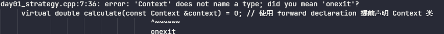

## 即时知识点

### 类的声明

`报错样式`



```c++
#include <iostream>

class Context;	// 在这里声明，让编译器知道它是一个类

// 首先定义 TaxStrategy 类，因为 Context 类需要引用它
class TaxStrategy
{
public:
    // 或者在参数里面声明是一个类 class Context &context
    virtual double calculate(const class Context &context) = 0; // 使用 forward declaration 提前声明 Context 类
    virtual ~TaxStrategy() {}
};

// 定义上下文类，包含金额和税收策略
class Context
{
public:
    double amount;
    TaxStrategy *strategy;
    Context(double amount, TaxStrategy *strategy) : amount(amount), strategy(strategy) {}
};

// 定义中国的税收策略类，继承自 TaxStrategy，实现具体的计算方法
class CNTaxStrategy : public TaxStrategy
{
public:
    virtual double calculate(const Context &context) override
    {
        return context.amount * 0.20;
    }
};

// 定义一个抽象的策略工厂类，包含创建税收策略的纯虚函数
class StrategyFactory
{
public:
    virtual TaxStrategy *createTaxStrategy() = 0;
    virtual ~StrategyFactory() {}
};

// 定义中国的策略工厂类，继承自 StrategyFactory，实现具体的策略创建方法
class CNFactory : public StrategyFactory
{
public:
    virtual TaxStrategy *createTaxStrategy() override
    {
        return new CNTaxStrategy();
    }
};

// 定义一个销售订单类，使用税收策略进行税收计算
class SalesOrder
{
private:
    TaxStrategy *strategy;

public:
    // 构造函数，通过传入的策略工厂创建税收策略
    SalesOrder(StrategyFactory *factory)
    {
        this->strategy = factory->createTaxStrategy();
    }

    // 析构函数，删除税收策略对象
    ~SalesOrder()
    {
        delete strategy;
    }

    // 计算税收的方法
    double calculateTax()
    {
        Context context(1000, this->strategy);
        return this->strategy->calculate(context);
    }
};

// 主函数，演示如何使用策略模式进行税收计算
int main(int argc, char const *argv[])
{
    // 实例化具体的 StrategyFactory 子类
    StrategyFactory *factory = new CNFactory(); // 你可以根据需要选择不同的工厂
    SalesOrder *order = new SalesOrder(factory);
    double tax = order->calculateTax();
    std::cout << "Tax: " << tax << std::endl;

    delete order;
    delete factory;

    return 0;
}c
```


## 面试

### enum类型

#### enum是什么

- ​	`enum常量`是int类型
- ​	因此只要能使用int类型的地方，就可以使用enum类型

#### 为什么要使用enum

- 目的是为了提高程序的可读性

#### 声明，默认值，赋值

`注意`：第一个枚举成员的默认值为整型的 0，后续枚举成员的值在前一个成员上加 1。我们在这个实例中把第一个枚举成员的值定义为 1，第二个就为 2，以此类推。

```c++
enum DAY
{
      MON=1, 
      TUE, 
      WED, 
      THU, 
      FRI, 
      SAT, 
      SUN
};
enum season 
{
    spring, 
    summer=3, 
    autumn, 
    winter
};
```

#### 定义

三种方式：

- **定义枚举类型，再定义枚举变量**

```c++
enum DAY
{
      MON=1, TUE, WED, THU, FRI, SAT, SUN
};
enum DAY day;
```

- **定义枚举类型的同时定义枚举变量**

```c++
enum DAY
{
      MON=1, TUE, WED, THU, FRI, SAT, SUN
} day;
```

- **省略枚举名称，直接定义枚举变量**

```c++
enum
{
      MON=1, TUE, WED, THU, FRI, SAT, SUN
} day;
```

