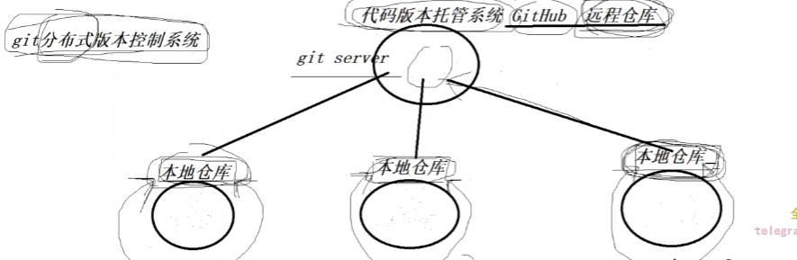

## SVN集中式版本控制系统

## git分布式版本控制系统

## 命令

### git clone

> > 克隆代码到本地

### git branch查看当前分支

### git log查看当前操作

### git remote列出当前仓库中已配置的远程仓库。

### git add添加文件到暂存区

### git status查看状态

### git commit 提交代码

### git push 推送代码到远端

