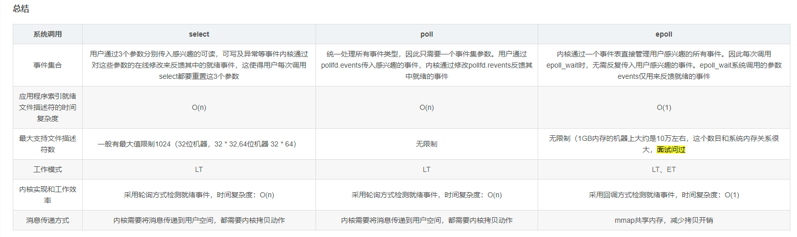
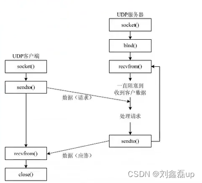
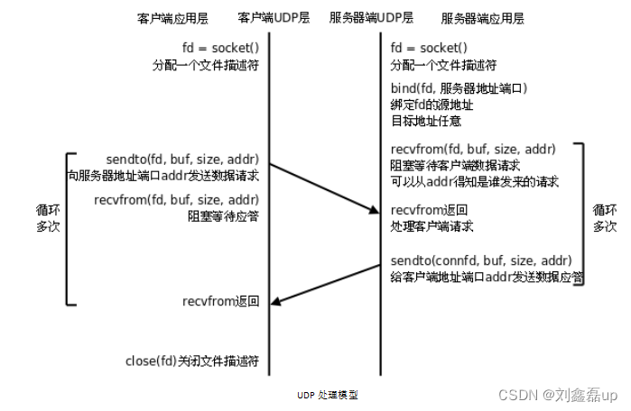
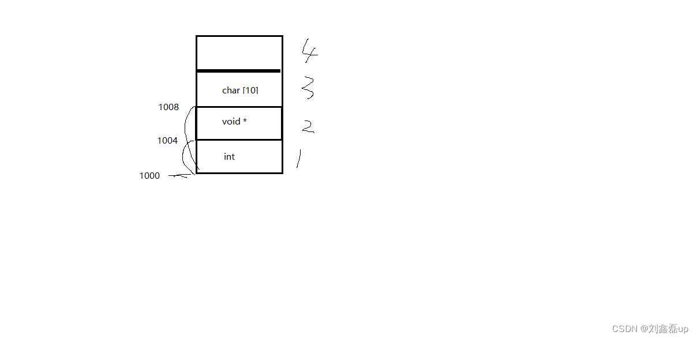

# Linux网络编程

## 4.多路I/O转接服务器（select poll epoll）

>select、poll以及epoll都是系统内核来对网络通信中的通信套接字(文件描述符)来进行监视
>能够在与服务器连接的大量客户端中识别出与服务器请求了数据交换的客户端，并把它们所对应的套接字通过函数返回，交给服务器
>此时服务器只需要和请求了数据交换的客户端进行通信即可，而其它的套接字则不做任何处理
>
>因此，比起服务器自身每次去轮询查询并处理每个套接字的效率要高很多





### 4.1select

```c
原理：  借助内核， select 来监听， 客户端连接、数据通信事件

//将给定的套接字fd从位图set中清除出去
    void FD_CLR(int fd,fd_set* set);			
        FD_CLR（4， &rset）;                    将一个文件描述符从监听集合中 移除
 
//检查给定的套接字fd是否在位图里面,返回值 在1 不在0
    int FD_ISSET(int fd,fd_set* set);	
        FD_ISSET（4，&rset）;                   判断一个文件描述符是否在监听集合中
 
//将给定的套接字fd设置到位图set中		
    void FD_SET(int fd,fd_set* set);            将待监听的文件描述符，添加到监听集合中	
        FD_SET(3, &rset);	
        FD_SET(5, &rset);	
        FD_SET(6, &rset);
 
//将整个位图set置零		
    void FD_ZERO(fd_set* set);					
        fd_set rset;                            清空一个文件描述符集
		FD_ZERO(&rset);
 
 
//select 是一个系统调用，用于监控多个文件描述符（sockets, files等）的 I/O 活动
//它等待某个文件描述符集变为可读、可写或出现异常，然后返回	
    int select(int nfds, 
               fd_set *readfds, 
               fd_set *writefds,
               fd_set *exceptfds, 
               struct timeval *timeout);
 
		nfds     ：监听 所有文件描述符中，最大文件描述符+1
		readfds  ：读   文件描述符监听集合。	传入、传出参数
		writefds ：写   文件描述符监听集合。	传入、传出参数		NULL
		exceptfds：异常 文件描述符监听集合	传入、传出参数		NULL
 
		timeout： 	
                > 0 : 设置监听超时时长
				NULL：阻塞监听
				0   ：非阻塞监听，轮询
 
		返回值：
			> 0：所有监听集合（3个）中， 满足对应事件的总数
			  0：没有满足监听条件的文件描述符
			 -1：errno
```

>缺点：监听上限受文件描述符限制。 最大1024
>检测满足条件的fd，自己添加业务逻辑提高小，提高了编码难度
>如果监听的文件描述符比较散乱、而且数量不多，效率会变低
>
>优点：	跨平台win、linux、macOS、Unix、类Unix、mips

### 4.2poll

```c
int poll(struct pollfd *fds, nfds_t nfds, int timeout);
		fds：监听的文件描述符，传入传出【数组】
			struct pollfd {			
				  int fd      ：待监听的文件描述符				
				  short events：待监听的文件描述符对应的监听事件
						  取值：POLLIN、POLLOUT、POLLERR
				 short revnets：
                            传入时，给0
                            如果满足对应事件的话， 返回 非0 --> POLLIN、POLLOUT、POLLERR
			}
 
		nfds: 监听数组的，实际有效监听个数
 
		timeout:  
             > 0：超时时长。单位：毫秒
			  -1：阻塞等待
			   0：不阻塞
 
		返回值：返回满足对应监听事件的文件描述符 总个数
```

>优点：
>		自带数组结构。 可以将 监听事件集合 和 返回事件集合 分离
>		拓展 监听上限。 超出 1024限制
>
>缺点：
>		不能跨平台。 Linux
>		无法直接定位满足监听事件的文件描述符， 编码难度较大

### 4.3epoll

**epoll是Linux下多路复用IO接口select/poll的增强版本，它能显著提高程序在大量并发连接中只有少量活跃的情况下的系统CPU利用率：都连接但不发送数据** 

```c
int epoll_create(int size);						                                    创建一棵监听红黑树
		size：创建的红黑树的监听节点数量（仅供内核参考）
		返回值：
            成功：指向新创建的红黑树的根节点的 fd
			失败： -1 errno
 
 
int epoll_ctl(int epfd, int op, int fd, struct epoll_event *event);	                 操作控制监听红黑树
		epfd：epoll_create 函数的返回值 epfd
 
		op  ：对该监听红黑数所做的操作
			EPOLL_CTL_ADD 添加fd到 监听红黑树
			EPOLL_CTL_MOD 修改fd在 监听红黑树上的监听事件
			EPOLL_CTL_DEL 将一个fd 从监听红黑树上摘下（取消监听）
 
		fd：待监听的fd			
 
		event：本质struct epoll_event 结构体 地址
			成员 events：EPOLLIN / EPOLLOUT / EPOLLERR				
                EPOLLIN ：	表示对应的文件描述符可以读（包括对端SOCKET正常关闭）
		        EPOLLOUT：	表示对应的文件描述符可以写
		        EPOLLPRI：	表示对应的文件描述符有紧急的数据可读（这里应该表示有带外数据到来）
		        EPOLLERR：	表示对应的文件描述符发生错误
		        EPOLLHUP：	表示对应的文件描述符被挂断；
		        EPOLLET： 	将EPOLL设为边缘触发(Edge Triggered)模式，这是相对于水平触发(Level Triggered)而言的
		        EPOLLONESHOT：只监听一次事件，当监听完这次事件之后，如果还需要继续监听这个socket的话，需要再次把这个socket加入到EPOLL队列里
                
			成员 typedef union epoll_data： 联合体（共用体）
				int fd;	      对应监听事件的 fd
				void *ptr； 
				uint32_t u32;
				uint64_t u64;		
 
		返回值：成功 0； 失败： -1 errno
 
 
int epoll_wait(int epfd, struct epoll_event *events, int maxevents, int timeout); 	   阻塞监听
		epfd：epoll_create 函数的返回值 epfd
		events：传出参数，【数组】， 满足监听条件的 哪些 fd 结构体
		maxevents：数组 元素的总个数 1024（不是字节数）				
			       struct epoll_event evnets[1024]
		timeout：
			-1: 阻塞————通过等待某些特定条件出现来实现的，而在等待的过程中，程序的其他部分都会被暂停执行
			 0：不阻塞
			>0: 超时时间 （毫秒）
 
		read返回值：
			> 0: 满足监听的 总个数，可以用作循环上限
			  0：没有fd满足监听事件
			 -1：失败，errno
```

>优点：
>		高效。突破1024文件描述符
>缺点：
>		不能跨平台。 Linux

### 4.4select代码实现

```c
#include <stdio.h>
#include <stdlib.h>
#include <unistd.h>
#include <string.h>
#include <arpa/inet.h>
#include <ctype.h>
 
#include "wrap.h"
 
#define SERV_PORT 6666
 
 
void FD_CLR(int fd,fd_set* set);			//将给定的套接字fd从位图set中清除出去
int FD_ISSET(int fd,fd_set* set);			//检查给定的套接字fd是否在位图里面,返回0或1
void FD_SET(int fd,fd_set* set);			//将给定的套接字fd设置到位图set中
void FD_ZERO(fd_set* set);					//将整个位图set置零
 
 
int main(int argc, char *argv[]){
	int i, j, n, maxi;
	
		/*数组：将需要轮询的客户端套接字放入数组client[FD_SETSIZE]，防止遍历1024个文件描述符  FD_SETSIZE默认为1024*/
		int nready, client[FD_SETSIZE];		
		
		int listenFd, connectFd, maxFd, socketFd;
		
		char buf[BUFSIZ], str[INET_ADDRSTRLEN];					//#define INET_ADDRSTRLEN 16
 
		struct sockaddr_in serverAddr, clientAddr;
		
		socklen_t clientAddrLen;
		
		fd_set rset, allset;                            		//rset读事件文件描述符集合,allset用来暂存
	
	
	/*得到监听套接字*/
		listenFd = Socket(AF_INET, SOCK_STREAM, 0);
			/*定义两个集合,将listenFd放入allset集合当中*/
		fd_set rset, allset;
		FD_ZERO(&allset);										//将整个位图set置零
		//将给定的套接字fd设置到位图set中
		FD_SET(listenFd, &allset);								//将connectFd加入集合:构造select监控文件描述符集
	
	
	/*设置地址端口复用*/
		int opt = 1;
		setsockopt(listenFd, SOL_SOCKET, SO_REUSEADDR, (void *)&opt, sizeof(opt));
	
	
	/*填写服务器地址结构*/
		bzero(&serverAddr, sizeof(serverAddr));
		
		serverAddr.sin_family = AF_INET;
		serverAddr.sin_addr.s_addr = htonl(INADDR_ANY);
		serverAddr.sin_port = htons(SERVER_PORT);
	
	
	/*绑定服务器地址结构*/
		Bind(listenFd, (struct sockaddr *)&serverAddr, sizeof(serverAddr));
		Listen(listenFd, 128);
	
	
	/*将listenFd设置为数组中最大的Fd*/
		maxFd = listenFd;										//起初 listenfd 即为最大文件描述符
		maxi = -1;												//将来用作client[]的下标, 初始值指向0个元素之前下标位置
		
	
	/*数组：初始化自己的数组为-1*/
		for (i = 0; i < FD_SETSIZE; ++i)
			client[i] = -1;
 
	while (1){
		/*把allset给rest,让他去用*/
		rset = allset;											//备份：每次循环时都从新设置select监控信号集
		nready = select(maxFd + 1, &rset, NULL, NULL, NULL);	//使用select监听文件描述符集合对应事件
 
		if (nready == -1)										//出错返回
			perr_exit("select error");
 
		/*listen满足监听的事件:如果有了新的连接请求,得到connectFd,并将其放入自定义数组中*/
			if (FD_ISSET(listenFd, &rset)){						//检查给定的套接字fd是否在位图里面,返回0或1
				clientAddrLen = sizeof(clientAddr);
				
				//建立链接,不会阻塞
				connectFd = Accept(listenFd, (struct sockaddr *)&clientAddr, &clientAddrLen);
				
				printf(
					"Recived from %s at PORT %d\n", 
					inet_ntop(AF_INET, 
					&(clientAddr.sin_addr.s_addr), 
					str, 
					sizeof(str)), 
					ntohs(clientAddr.sin_port));
 
				for (i = 0; i < FD_SETSIZE; ++i)
					if (client[i] < 0){							//找client[]中没有使用的位置
						client[i] = connectFd;					//保存accept返回的文件描述符到client[]里	
						break;
					}
					
				/*自定义数组满了:达到select能监控的文件个数上限 1024 */
					if(i==FD_SETSIZE){
						fputs("Too many clients\n",stderr);
						exit(1);
					}
				
				/*connectFd加入监听集合:向监控文件描述符集合allset添加新的文件描述符connectFd*/
					FD_SET(connectFd, &allset);					//将给定的套接字fd设置到位图set中
 
				/*更新最大的Fd*/
					if (maxFd < connectFd)
						maxFd = connectFd;
					
				/*更新循环上限*/
					if(i>maxi)
						maxi=i;									//保证maxi存的总是client[]最后一个元素下标
					
				/*select返回1,说明只有建立连接请求,没有数据传送请求,跳出while循环剩余部分(下面的for循环轮询过程)*/
				//如果只有listen事件,只需建立连接即可,无需数据传输,跳出循环剩余部分
					if (--nready == 0)
						continue;
			}
		/*检测哪个clients 有数据就绪:select返回不是1,说明有connectFd有数据传输请求,遍历自定义数组*/
		//否则,说明有数据传输需求
			for (i = 0; i <= maxi; ++i){
				if((socketFd=client[i])<0)
					continue;
					
				/*遍历检查*/
				if (FD_ISSET(socketFd, &rset)){					//检查给定的套接字fd是否在位图里面,返回0或1
					/*read返回0说明传输结束,关闭连接:当client关闭链接时,服务器端也关闭对应链接*/
					if ((n=read(socketFd,buf,sizeof(buf)))==0){
						close(socketFd);
						//将给定的套接字fd从位图set中清除出去
						FD_CLR(socketFd, &allset);				//解除select对此文件描述符的监控
						client[i]=-1;
					}else if(n>0){
						for (j = 0; j < n; ++j)
							buf[j] = toupper(buf[j]);
						write(socketFd, buf, n);
						write(STDOUT_FILENO, buf, n);
					}
					
					/*不懂:需要处理的个数减1?*/
					if(--nready==0)
						break;									//跳出for, 但还在while中
				}
			}
	}
	close(listenFd);
	return 0;
}
```


### 4.5poll代码实现

```c
#include <stdio.h>
#include <stdlib.h>
#include <string.h>
#include <netinet/in.h>
#include <arpa/inet.h>
#include <poll.h>
#include <errno.h>
#include "wrap.h"
 
#define MAXLINE 80
#define SERV_PORT 6666
#define OPEN_MAX 1024
 
int main(int argc,char* argv[]){
	int ret=0;
	/*poll函数返回值*/
	int nready=0;
	int i,j,maxi;
	int connectFd,listenFd,socketFd;
	ssize_t n;
	char buf[MAXLINE];
	char str[INET_ADDRSTRLEN];
	socklen_t clientLen;
	
	/*创建结构体数组*/	
		struct pollfd client[OPEN_MAX];
	
	/*创建客户端地址结构和服务器地址结构*/
		struct sockaddr_in clientAddr,serverAddr;
	
	/*得到监听套接字listenFd*/
		listenFd=Socket(AF_INET,SOCK_STREAM,0);
	
	/*设置地址可复用*/
		int opt=0;
		ret=setsockopt(listenFd,SOL_SOCKET,SO_REUSEADDR,(void*)&opt,sizeof(opt));
		if(ret==-1)
			perr_exit("setsockopt error");
		
	/*向服务器地址结构填入内容*/
		bzero(&serverAddr,sizeof(serverAddr));
		serverAddr.sin_family=AF_INET;
		serverAddr.sin_addr.s_addr=htonl(INADDR_ANY);
		serverAddr.sin_port=htons(SERVER_PORT);
	
	/*绑定服务器地址结构到监听套接字,并设置监听上限*/
		Bind(listenFd,(const struct sockaddr*)&serverAddr,sizeof(serverAddr));
		Listen(listenFd,128);
	
	/*初始化第一个pollfd为监听套接字*/
		client[0].fd=listenFd;					//listenfd监听普通读事件 
		client[0].events=POLLIN;				//事件已经准备好被读取或处理
	
	/*将pollfd数组的余下内容的fd文件描述符属性置为-1*/
		for(i=1;i<OPEN_MAX;++i)
			client[i].fd=-1;					//用-1初始化client[]里剩下元素
			
		maxi=0;									//client[]数组有效元素中最大元素下标
	
		while(1){
		/*nready是有多少套接字有POLLIN请求*/
			nready=poll(client,maxi+1,-1);		//阻塞
			if(nready==-1)
				perr_exit("poll error");
				
		/*如果listenFd的revents有POLLIN请求,则调用Accept函数得到connectFd*/
			if(client[0].revents&POLLIN){		//有客户端链接请求
				clientLen=sizeof(clientAddr);
				connectFd=Accept(listenFd,(struct sockaddr*)&clientAddr,&clientLen);
				
				/*打印客户端地址结构信息*/
					printf("Received from %s at PORT %d\n",
							inet_ntop(AF_INET,&(clientAddr.sin_addr.s_addr),str,sizeof(str)),
							ntohs(clientAddr.sin_port));
					
				/*将创建出来的connectFd加入到pollfd数组中*/
					for(i=1;i<OPEN_MAX;++i)
						if(client[i].fd<0){
							//找到client[]中空闲的位置，存放accept返回的connfd 
							client[i].fd=connectFd;			
							break;
						}
 
					if(i==OPEN_MAX)
						perr_exit("Too many clients,I'm going to die...");
						
				/*当没有错误时,将对应的events设置为POLLIN*/
					client[i].events=POLLIN;	//设置刚刚返回的connfd，监控读事件
 
					if(i>maxi)						
						maxi=i;					//更新client[]中最大元素下标
					if(--nready<=0)
						continue;				//没有更多就绪事件时,继续回到poll阻塞
			}
		
		
		/*开始从1遍历pollfd数组*/
			for(i=1;i<=maxi;++i){				//检测client[] 
				/*到结尾了或者有异常*/
					if((socketFd=client[i].fd)<0)
						continue;
						
				/*第i个客户端有连接请求,进行处理	read*/
				if(client[i].revents&POLLIN){
					if((n=read(socketFd,buf,sizeof(buf)))<0){
						/*出错时进一步判断errno*/
							if(errno=ECONNRESET){
								printf("client[%d] aborted connection\n",i);
								close(socketFd);
								client[i].fd=-1;
							}else
								perr_exit("read error");
					}else if(n==0){
						/*read返回0,说明读到了结尾,关闭连接*/
							printf("client[%d] closed connection\n",i);
							close(socketFd);
							client[i].fd=-1;
					}else{
						/*数据处理*/
							for(j=0;j<n;++j)
								buf[j]=toupper(buf[j]);
							Writen(STDOUT_FILENO,buf,n);
							Writen(socketFd,buf,n);
					}
					if(--nready==0)
						break;
				}
			}
	}
	return 0;
}
```

### 4.6epoll代码实现

```c
#include "033-035_wrap.h"
 
#define SERVER_PORT 9527
#define MAXLINE     80
#define OPEN_MAX    1024
 
int main(int argc,char* argv[]){
    int i=0,n=0,num=0;
    int clientAddrLen=0;
    int listenFd=0,connectFd=0,socketFd=0;
    ssize_t nready,efd,res;
    char buf[MAXLINE],str[INET_ADDRSTRLEN];
 
    struct sockaddr_in serverAddr,clientAddr;
	
    /*创建一个临时节点temp和一个数组ep*/
		struct epoll_event temp;
		struct epoll_event ep[OPEN_MAX];
 
    /*创建监听套接字*/
		listenFd=Socket(AF_INET,SOCK_STREAM,0);
	
    /*设置地址可复用*/
		int opt=1;
		setsockopt(listenFd,SOL_SOCKET,SO_REUSEADDR,(void*)&opt,sizeof(opt));
 
    /*初始化服务器地址结构*/
		bzero(&serverAddr,sizeof(serverAddr));
		serverAddr.sin_family=AF_INET;
		serverAddr.sin_addr.s_addr=htonl(INADDR_ANY);
		serverAddr.sin_port=htons(SERVER_PORT);
 
    /*绑定服务器地址结构*/
		Bind(listenFd,(const struct sockaddr*)&serverAddr,sizeof(serverAddr));
		
    /*设置监听上限*/
		Listen(listenFd,128);
 
    /*创建监听红黑树树根*/
		efd=epoll_create(OPEN_MAX);
		if(efd==-1)
			perr_exit("epoll_create error");
 
    /*将listenFd加入监听红黑树中*/
		temp.events=EPOLLIN;
		temp.data.fd=listenFd;
		res=epoll_ctl(efd,EPOLL_CTL_ADD,listenFd,&temp);
		if(res==-1)
			perr_exit("epoll_ctl error");
 
    while(1){
        /*阻塞监听写事件*/
			nready=epoll_wait(efd,ep,OPEN_MAX,-1);
			if(nready==-1)
				perr_exit("epoll_wait error");
 
        /*轮询整个数组(红黑树)*/
			for(i=0;i<nready;++i){
				if(!(ep[i].events&EPOLLIN))
					continue;
 
            /*如果是建立连接请求*/
				// lfd 满足读事件，有新的客户端发起连接请求
				if(ep[i].data.fd==listenFd){
					clientAddrLen=sizeof(clientAddr);
					connectFd=Accept(listenFd,(struct sockaddr*)&clientAddr,&clientAddrLen);
					
					printf("Received from %s at PORT %d\n",
							inet_ntop(AF_INET,
							&clientAddr.sin_addr.s_addr,
							str,
							sizeof(str)),
							ntohs(clientAddr.sin_port));
					printf("connectFd=%d,client[%d]\n",connectFd,++num);
 
					/*将新创建的连接套接字加入红黑树*/
						//初始化  cfd的监听属性_文件描述符可以读
							temp.events=EPOLLIN;
							temp.data.fd=connectFd;
							
							res=epoll_ctl(efd,EPOLL_CTL_ADD,connectFd,&temp);
						
						if(res==-1)
							perr_exit("epoll_ctl errror");
				}else{
					/*不是建立连接请求,是数据处理请求*/
						socketFd=ep[i].data.fd;
						//cfd 们 满足读事件， 有客户端写数据来
						n=read(socketFd,buf,sizeof(buf));
				
						/*读到0说明客户端关闭*/
							//已经读到结尾
							if(n==0){
								res=epoll_ctl(efd,EPOLL_CTL_DEL,socketFd,NULL);
								if(res==-1)
									perr_exit("epoll_ctl error");
								close(socketFd);
								printf("client[%d] closed connection\n",socketFd);
							//报错
							}else if(n<0){	
								/*n<0报错*/
									perr_exit("read n<0 error");
									
									// 将关闭的cfd，从监听树上摘下
										res=epoll_ctl(efd,EPOLL_CTL_DEL,socketFd,NULL);
										close(socketFd);
							//   > 0实际读到的字节数
							}else{
								/*数据处理*/
									for(i=0;i<n;++i)
										buf[i]=toupper(buf[i]);
									write(STDOUT_FILENO,buf,n);
									Writen(socketFd,buf,n);
							}
				}
        }
    }
 
    close(listenFd);
    close(efd);
    return 0;
}
```

### 4.7通用client实现

```c
/* client.c */
#include <stdio.h>
#include <string.h>
#include <unistd.h>
#include <netinet/in.h>
#include "wrap.h"
 
#define MAXLINE 80
#define SERV_PORT 6666
 
int main(int argc, char *argv[])
{
	struct sockaddr_in servaddr;
	char buf[MAXLINE];
	int sockfd, n;
 
	sockfd = Socket(AF_INET, SOCK_STREAM, 0);
 
	bzero(&servaddr, sizeof(servaddr));
	servaddr.sin_family = AF_INET;
	inet_pton(AF_INET, "127.0.0.1", &servaddr.sin_addr);
	servaddr.sin_port = htons(SERV_PORT);
 
	Connect(sockfd, (struct sockaddr *)&servaddr, sizeof(servaddr));
 
	while (fgets(buf, MAXLINE, stdin) != NULL) {
		Write(sockfd, buf, strlen(buf));
		n = Read(sockfd, buf, MAXLINE);
		if (n == 0)
			printf("the other side has been closed.\n");
		else
			Write(STDOUT_FILENO, buf, n);
	}
 
	Close(sockfd);
	return 0;
}
```

### 4.8ET和LT事件触发模式

>1. **ET工作模式：边沿触发(Edge triggered)————只有数据到来才触发**，不管缓存区中是否还有数据，缓冲区剩余未读尽的数据不会导致
>2. ​    作用：当文件描述符从未就绪变为就绪时，内核会通过epoll告诉你一次喊你就绪，直到你做操作导致那个文件描述符不再为就绪状态
>3. ​		     缓冲区未读尽的数据不会导致epoll_wait返回, 新的数据写入才会触发（等文件描述符不再为就绪状态）		
>4. ​			    struct epoll_event event
>5. ​			    event.events = EPOLLIN | EPOLLET
>6.  
>7. **LT工作模式：水平触发(Level triggered)————只要有数据都会触发**（默认采用模式）
>8. ​    作用：内核告诉你一个文件描述符是否就绪，然后可以对这个就绪的fd进行io操作，如果你不做任何操作，内核还会继续通知你
>9. ​	        缓冲区未读尽的数据会导致epoll_wait返回（继续通知你）
>10. ​	
>11. 结论：**epoll 的 ET模式， 高效模式，但是只支持 非阻塞模式**
>12. ​             --- 忙轮询：用于在计算机系统中处理硬件中断
>13. ​                     忙轮询是一种不进入内核的方式，它在用户空间中轮询检测硬件状态
>14. ​                     及时响应硬件的中断请求，避免CPU在中断服务程序中处理完所有的中断请求后，又再次触发中断
>15.  
>16. ​		struct epoll_event event;
>17. ​		event.events = EPOLLIN | EPOLLET;
>18.  
>19. ​		epoll_ctl(epfd, EPOLL_CTL_ADD, cfd， &event);	
>20.  
>21. ​		int flg = fcntl(cfd, F_GETFL);	 非阻塞
>22. ​		flg |= O_NONBLOCK;
>23. ​        fcntl(cfd,F_SETFL,flg);

### 4.9代码实现

#### 4.9.1 使用进程

```c
#include <stdio.h>
#include <stdlib.h>
#include <sys/epoll.h>
#include <errno.h>
#include <unistd.h>
 
#define MAXLINE 10
 
int main(int argc, char *argv[])
{
    int efd, i;
    int pfd[2];
    pid_t pid;
    char buf[MAXLINE], ch = 'a';
 
    pipe(pfd);
    pid = fork();
 
    if (pid == 0) {             //子 写
        close(pfd[0]);
        while (1) {
            //aaaa\n
            for (i = 0; i < MAXLINE/2; i++)
                buf[i] = ch;
            buf[i-1] = '\n';
            ch++;
            //bbbb\n
            for (; i < MAXLINE; i++)
                buf[i] = ch;
            buf[i-1] = '\n';
            ch++;
            //aaaa\nbbbb\n
            write(pfd[1], buf, sizeof(buf));
            sleep(5);
        }
        close(pfd[1]);
 
    } else if (pid > 0) {       //父 读
        struct epoll_event event;
        struct epoll_event resevent[10];          //epoll_wait就绪返回event
        int res, len;
 
        close(pfd[1]);
        efd = epoll_create(10);
 
        event.events = EPOLLIN | EPOLLET;         // ET 边沿触发
       // event.events = EPOLLIN;                 // LT 水平触发 (默认)
        event.data.fd = pfd[0];
        epoll_ctl(efd, EPOLL_CTL_ADD, pfd[0], &event);
 
        while (1) {
            res = epoll_wait(efd, resevent, 10, -1);
            printf("res %d\n", res);
            if (resevent[0].data.fd == pfd[0]) {
                len = read(pfd[0], buf, MAXLINE/2);
                write(STDOUT_FILENO, buf, len);
            }
        }
 
        close(pfd[0]);
        close(efd);
 
    } else {
        perror("fork");
        exit(-1);
    }
 
    return 0;
}
```

#### 4.9.1server.c

```c
#include <stdio.h>
#include <stdlib.h>
#include <string.h>
#include <poll.h>
#include <sys/poll.h>
#include <sys/epoll.h>
#include <unistd.h>
#include <errno.h>
#include <arpa/inet.h>
#include <sys/types.h>
#include <sys/socket.h>
#include <netinet/in.h>
#include <ctype.h>
#include <fcntl.h>
#include "wrap.h"
#define SERV_PORT 8000
#define OPEN_MAX 1024
#define MAXLINE 10
int main()
{
    int listenfd, conectfd;
    int efd;
    int len;
    int res;
    int flag;
    char buf[BUFSIZ], str[INET_ADDRSTRLEN];

    struct sockaddr_in ser_addr, clit_addr;
    socklen_t clit_addr_len;

    // 创建套接字
    listenfd = Socket(AF_INET, SOCK_STREAM, 0);

    int opt = 1;
    setsockopt(listenfd, SOL_SOCKET, SO_REUSEADDR, &opt, sizeof(opt));

    bzero(&ser_addr, sizeof(ser_addr));
    ser_addr.sin_family = AF_INET;
    ser_addr.sin_port = htons(SERV_PORT);
    ser_addr.sin_addr.s_addr = htonl(INADDR_ANY);

    // 绑定
    Bind(listenfd, (struct sockaddr *)&ser_addr, sizeof(ser_addr));

    // 监听
    Listen(listenfd, 128);

    struct epoll_event event;
    struct epoll_event resevent[10];

    efd = epoll_create(10);
    if (efd == -1)
    {
        perror("epoll_create");
        exit(EXIT_FAILURE);
    }
    // event.events = EPOLLIN; // level triggered
    event.events = EPOLLIN | EPOLLET; // Edge triggered

    printf("Accepting connections ...\n");
    clit_addr_len = sizeof(clit_addr);
    conectfd = Accept(listenfd, (struct sockaddr *)&clit_addr, &clit_addr_len);
    printf("received from %s at PORT %d\n",
           inet_ntop(AF_INET, &clit_addr.sin_addr, str, sizeof(str)),
           ntohs(clit_addr.sin_port));

    ///////////////////////////////////////////////////////////////
    flag = fcntl(conectfd, F_GETFL);
    flag |= O_NONBLOCK;
    fcntl(conectfd, F_SETFL, flag);
    //////////////////////////////////////////////////////////////

    event.data.fd = conectfd;
    if (epoll_ctl(efd, EPOLL_CTL_ADD, conectfd, &event) == -1)
    {
        perror("epoll_ctl");
        exit(EXIT_FAILURE);
    }

    while (1)
    {
        res = epoll_wait(efd, resevent, 10, -1);
        printf("res %d\n", res);
        if (resevent[0].data.fd == conectfd)
        {
            while ((len = read(conectfd, buf, MAXLINE / 2)) > 0) // 非阻塞读, 轮询
                write(STDOUT_FILENO, buf, len);
        }
    }
    close(listenfd);
    close(efd);

    return 0;
}
```

#### 4.9.3client

```c
#include <stdio.h>
#include <string.h>
#include <unistd.h>
#include <arpa/inet.h>
#include <netinet/in.h>

#define MAXLINE 10
#define SERV_PORT 8000

int main(int argc, char *argv[])
{
    struct sockaddr_in servaddr;
    char buf[MAXLINE];
    int sockfd, i;
    char ch = 'a';

    sockfd = socket(AF_INET, SOCK_STREAM, 0);

    bzero(&servaddr, sizeof(servaddr));
    servaddr.sin_family = AF_INET;
    inet_pton(AF_INET, "127.0.0.1", &servaddr.sin_addr);
    servaddr.sin_port = htons(SERV_PORT);

    connect(sockfd, (struct sockaddr *)&servaddr, sizeof(servaddr));

    while (1)
    {
        // aaaa\n
        for (i = 0; i < MAXLINE / 2; i++)
            buf[i] = ch;
        buf[i - 1] = '\n';
        ch++;
        // bbbb\n
        for (; i < MAXLINE; i++)
            buf[i] = ch;
        buf[i - 1] = '\n';
        ch++;
        // aaaa\nbbbb\n
        write(sockfd, buf, sizeof(buf));
        sleep(10);
    }

    close(sockfd);

    return 0;
}
```

### 4.10epoll反应堆模型

#### 4.10.1概念

**作用：提高网络IO处理的效率**

epoll ET模式 + 非阻塞、轮询 + void *ptr
    void *ptr：指向结构体，该结构体包含socket、地址、端口等信息

**原来：epoll实现多路IO转接思路**
		socket、bind、listen -- epoll_create 创建监听 红黑树 --  返回 epfd -- epoll_ctl() 向树上添加一个监听fd -- while（1）--

```c
	-- epoll_wait 监听 -- 对应监听fd有事件产生 -- 返回 监听满足数组。 -- 判断返回数组元素 -- lfd满足 -- Accept -- cfd 满足 
 
	-- read() --- 小->大 -- write回去
```

**反应堆：不但要监听 cfd 的读事件、还要监听cfd的写事件**

```c
	socket、bind、listen -- epoll_create 创建监听 红黑树 --  返回 epfd -- epoll_ctl() 向树上添加一个监听fd -- while（1）--
 
	-- epoll_wait 监听 -- 对应监听fd有事件产生 -- 返回 监听满足数组。 -- 判断返回数组元素 -- lfd满足 -- Accept -- cfd 满足 
 
	-- read() --- 小->大 
	
	-- cfd从监听红黑树上摘下 -- EPOLLOUT -- 回调函数 -- epoll_ctl() -- EPOLL_CTL_ADD 重新放到红黑上监听“写”事件-- 等待 epoll_wait 返回 -- 说明 cfd 可写 -- write回去 
	
	-- cfd从监听红黑树上摘下 -- EPOLLIN -- epoll_ctl() -- EPOLL_CTL_ADD 重新放到红黑上监听“读”事件 -- epoll_wait 监听
```

eventset函数：设置回调函数
				lfd --> acceptconn()
				cfd --> recvdata();
				cfd --> senddata();
				
eventadd函数：将一个fd， 添加到 监听红黑树
              设置监听读事件，还是监听写事件


网络编程中： read --- recv()            write --- send();

#### 4.10.2epoll基于非阻塞I/O事件驱动

```c
/*
 *epoll基于非阻塞I/O事件驱动
 */
#include <stdio.h>
#include <sys/socket.h>
#include <sys/epoll.h>
#include <arpa/inet.h>
#include <fcntl.h>
#include <unistd.h>
#include <errno.h>
#include <string.h>
#include <stdlib.h>
#include <time.h>
 
#define MAX_EVENTS  1024                                    						//监听上限数
#define BUFLEN 4096
#define SERV_PORT   8080															//默认端口号
 
void recvdata(int fd, int events, void *arg);
void senddata(int fd, int events, void *arg);
 
/* 描述就绪文件描述符相关信息 */
struct myevent_s {
    int fd;                                                 						//要监听的文件描述符
    int events;                                             						//对应的监听事件
    void *arg;                                              						//泛型参数
    void (*call_back)(int fd, int events, void *arg);       						//回调函数
    int status;                                             						//是否在监听:1->在红黑树上(监听), 0->不在(不监听)
    char buf[BUFLEN];
    int len;
    long last_active;                                       						//记录每次加入红黑树 g_efd 的时间值
};
 
int g_efd;                                                  						//全局变量, 保存epoll_create返回的文件描述符
struct myevent_s g_events[MAX_EVENTS+1];                    						//自定义结构体类型数组. +1-->listen fd
 
 
	/*将结构体 myevent_s 成员变量 初始化赋值*/
	void eventset(struct myevent_s *ev, int fd, void (*call_back)(int, int, void *), void *arg)
	{
		ev->fd = fd;
		ev->call_back = call_back;													//设置回调函数
		ev->events = 0;
		ev->arg = arg;
		ev->status = 0;
		memset(ev->buf, 0, sizeof(ev->buf));
		ev->len = 0;
		ev->last_active = time(NULL);                       						//调用eventset函数的时间
 
		return;
	}
 
	/* 向 epoll监听的红黑树 添加一个 文件描述符 */
	//eventadd函数: 将一个fd添加到监听红黑树, 设置监听读事件还是写事件
	//eventadd(efd, EPOLLIN, &g_events[MAX_EVENTS]);
	void eventadd(int efd, int events, struct myevent_s *ev)
	{
		struct epoll_event epv = {0, {0}};
		int op;
		epv.data.ptr = ev;
		epv.events = ev->events = events;      									    //EPOLLIN 或 EPOLLOUT
 
		if (ev->status == 0) {                                          			//已经在红黑树 g_efd 里
			op = EPOLL_CTL_ADD;                 									//将其加入红黑树 g_efd, 并将status置1
			ev->status = 1;
		}
 
		if (epoll_ctl(efd, op, ev->fd, &epv) < 0)                       			//实际添加/修改
			printf("event add failed [fd=%d], events[%d]\n", ev->fd, events);
		else
			printf("event add OK [fd=%d], op=%d, events[%0X]\n", ev->fd, op, events);
 
		return ;
	}
 
	/* 从epoll 监听的 红黑树中删除一个 文件描述符*/
	void eventdel(int efd, struct myevent_s *ev)
	{
		struct epoll_event epv = {0, {0}};
 
		if (ev->status != 1)                                        				//不在红黑树上
			return ;
 
		//epv.data.ptr = ev;
		epv.data.ptr = NULL;
		ev->status = 0;                                             				//修改状态
		epoll_ctl(efd, EPOLL_CTL_DEL, ev->fd, &epv);                				//从红黑树 efd 上将 ev->fd 摘除
 
		return ;
	}
 
			/*  当有文件描述符就绪, epoll返回, 调用该函数 与客户端建立链接 */
			void acceptconn(int lfd, int events, void *arg)
			{
				struct sockaddr_in cin;
				socklen_t len = sizeof(cin);
				int cfd, i;
 
				if ((cfd = accept(lfd, (struct sockaddr *)&cin, &len)) == -1) {
					if (errno != EAGAIN && errno != EINTR) {
						/* 暂时不做出错处理 */
					}
					printf("%s: accept, %s\n", __func__, strerror(errno));
					return ;
				}
 
				do {
					for (i = 0; i < MAX_EVENTS; i++)                               			//从全局数组g_events中找一个空闲元素
						if (g_events[i].status == 0)                                		//类似于select中找值为-1的元素
							break;                                                  		//跳出 for
 
					if (i == MAX_EVENTS) {
						printf("%s: max connect limit[%d]\n", __func__, MAX_EVENTS);
						break;                                                      		//跳出do while(0) 不执行后续代码
					}
 
					int flag = 0;
					if ((flag = fcntl(cfd, F_SETFL, O_NONBLOCK)) < 0) {             		//将cfd也设置为非阻塞
						printf("%s: fcntl nonblocking failed, %s\n", __func__, strerror(errno));
						break;
					}
 
					/* 给cfd设置一个 myevent_s 结构体, 回调函数 设置为 recvdata */
					eventset(&g_events[i], cfd, recvdata, &g_events[i]);   
					eventadd(g_efd, EPOLLIN, &g_events[i]);                         		//将cfd添加到红黑树g_efd中,监听读事件
 
				} while(0);
 
				printf("new connect [%s:%d][time:%ld], pos[%d]\n", 
						inet_ntoa(cin.sin_addr), ntohs(cin.sin_port), g_events[i].last_active, i);
				return ;
			}
 
			//epoll反应堆-wait被触发后read和write回调及监听	
				void recvdata(int fd, int events, void *arg)
				{
					struct myevent_s *ev = (struct myevent_s *)arg;
					int len;
 
					len = recv(fd, ev->buf, sizeof(ev->buf), 0);            				//读文件描述符, 数据存入myevent_s成员buf中
 
					eventdel(g_efd, ev);        //将该节点从红黑树上摘除
 
					if (len > 0) {
 
						ev->len = len;
						ev->buf[len] = '\0';                                				//手动添加字符串结束标记
						printf("C[%d]:%s\n", fd, ev->buf);
 
						eventset(ev, fd, senddata, ev);                     				//设置该 fd 对应的回调函数为 senddata
						eventadd(g_efd, EPOLLOUT, ev);                      				//将fd加入红黑树g_efd中,监听其写事件
 
					} else if (len == 0) {
						close(ev->fd);
						/* ev-g_events 地址相减得到偏移元素位置 */
						printf("[fd=%d] pos[%ld], closed\n", fd, ev-g_events);
					} else {
						close(ev->fd);
						printf("recv[fd=%d] error[%d]:%s\n", fd, errno, strerror(errno));
					}
 
					return;
				}
 
				void senddata(int fd, int events, void *arg)
				{
					struct myevent_s *ev = (struct myevent_s *)arg;
					int len;
 
					len = send(fd, ev->buf, ev->len, 0);                    				//直接将数据 回写给客户端。未作处理
 
					eventdel(g_efd, ev);                                					//从红黑树g_efd中移除
 
					if (len > 0) {
 
						printf("send[fd=%d], [%d]%s\n", fd, len, ev->buf);
						eventset(ev, fd, recvdata, ev);                     				//将该fd的 回调函数改为 recvdata
						eventadd(g_efd, EPOLLIN, ev);                       				//从新添加到红黑树上， 设为监听读事件
 
					} else {
						close(ev->fd);                                      				//关闭链接
						printf("send[fd=%d] error %s\n", fd, strerror(errno));
					}
 
					return ;
				}
 
 
	/*创建 socket, 初始化lfd */
	void initlistensocket(int efd, short port)
	{
		struct sockaddr_in sin;
 
		//将socket设为lfd非阻塞
		int lfd = socket(AF_INET, SOCK_STREAM, 0);
		fcntl(lfd, F_SETFL, O_NONBLOCK);                                            
 
		//设置地址结构
		memset(&sin, 0, sizeof(sin));                                               //bzero(&sin, sizeof(sin))
		sin.sin_family = AF_INET;
		sin.sin_addr.s_addr = INADDR_ANY;
		sin.sin_port = htons(port);
 
		bind(lfd, (struct sockaddr *)&sin, sizeof(sin));
 
		listen(lfd, 20);
 
		/* void eventset(struct myevent_s *ev, int fd, void (*call_back)(int, int, void *), void *arg);  */
		 /*把g_events数组的最后一个元素设置为lfd,回调函数设置为acceptconn*/
			eventset(&g_events[MAX_EVENTS], lfd, acceptconn, &g_events[MAX_EVENTS]);
 
		/* void eventadd(int efd, int events, struct myevent_s *ev) */
		/*挂上树*/
			eventadd(efd, EPOLLIN, &g_events[MAX_EVENTS]);
 
		return ;
	}
 
int main(int argc, char *argv[])
{
	/*选择默认端口号或指定端口号*/
    unsigned short port = SERV_PORT;
 
    if (argc == 2)
		//使用用户指定端口.如未指定,用默认端口
        port = atoi(argv[1]);                           								
 
	//创建红黑树,返回给全局 g_efd
    g_efd = epoll_create(MAX_EVENTS+1);                 								 
    if (g_efd <= 0)
        printf("create efd in %s err %s\n", __func__, strerror(errno));
 
	//初始化监听socket
    initlistensocket(g_efd, port);                      								
 
	//创建一个系统的epoll_event的数组,与my_events的规模相同
		struct epoll_event events[MAX_EVENTS+1];           								//保存已经满足就绪事件的文件描述符数组 
		printf("server running:port[%d]\n", port);
 
    int checkpos = 0, i;
    while (1) {
        /* 超时验证，每次测试100个链接，不测试listenfd 当客户端60秒内没有和服务器通信，则关闭此客户端链接 */	
			long now = time(NULL);                          							//当前时间
			for (i = 0; i < 100; i++, checkpos++) {         							//一次循环检测100个。 使用checkpos控制检测对象
				if (checkpos == MAX_EVENTS)
					checkpos = 0;
				if (g_events[checkpos].status != 1)        								//不在红黑树 g_efd 上
					continue;
 
				long duration = now - g_events[checkpos].last_active;       			//时间间隔,客户端不活跃的世间
 
				if (duration >= 60) {
					close(g_events[checkpos].fd);                           			//关闭与该客户端链接
					printf("[fd=%d] timeout\n", g_events[checkpos].fd);
					eventdel(g_efd, &g_events[checkpos]);                   			//将该客户端 从红黑树 g_efd移除
				}
			}
 
        /*监听红黑树g_efd, 将满足的事件的文件描述符加至events数组中, 1秒没有事件满足, 返回 0*/
			int nfd = epoll_wait(g_efd, events, MAX_EVENTS+1, 1000);
			if (nfd < 0) {
				printf("epoll_wait error, exit\n");
				break;
			}
 
			for (i = 0; i < nfd; i++) {
				/*使用自定义结构体myevent_s类型指针, 接收 联合体data的void *ptr成员*/
				struct myevent_s *ev = (struct myevent_s *)events[i].data.ptr;  
 
				//cfd从监听红黑树上摘下  
				if ((events[i].events & EPOLLIN) && (ev->events & EPOLLIN)) {          	//读就绪事件
					ev->call_back(ev->fd, events[i].events, ev->arg);
					//lfd  EPOLLIN  
				}
				if ((events[i].events & EPOLLOUT) && (ev->events & EPOLLOUT)) {         //写就绪事件
					ev->call_back(ev->fd, events[i].events, ev->arg);
				}
			}
    }
 
    /* 退出前释放所有资源 */
    return 0;
}
```

## 5.线程池并发服务器 _UDP客户端和服务器_本地和网络套接字

### 5.1threadpool.c

```c
#include <stdlib.h>
#include <pthread.h>
#include <unistd.h>
#include <assert.h>
#include <stdio.h>
#include <string.h>
#include <signal.h>
#include <errno.h>
#include "threadpool.h"

#define DEFAULT_TIME 10        /*10s检测一次*/
#define MIN_WAIT_TASK_NUM 10   /*如果queue_size > MIN_WAIT_TASK_NUM 添加新的线程到线程池*/
#define DEFAULT_THREAD_VARY 10 /*每次创建和销毁线程的个数*/
#define true 1
#define false 0

typedef struct
{
    /*
    返回值是 void *
    参数是   void *
    是一个指向函数 的 指针
    */
    void *(*function)(void *); /* 函数指针 回调函数 */
    void *arg;                 /* 上面函数的参数 */
} threadpool_task_t;           /* 各子线程任务结构体 */

/* 描述线程池相关信息 */
struct threadpool_t
{
    pthread_mutex_t lock;           /* 用于锁住本结构体 */
    pthread_mutex_t thread_counter; /* 记录忙状态线程个数de琐 -- busy_thr_num */

    pthread_cond_t queue_not_full;  /* 当任务队列满时，添加任务的线程阻塞，等待此条件变量 */
    pthread_cond_t queue_not_empty; /* 任务队列里不为空时，通知等待任务的线程 */

    pthread_t *threads;            /* 存放线程池中每个线程的tid。数组 */
    pthread_t adjust_tid;          /* 存管理线程tid */
    threadpool_task_t *task_queue; /* 任务队列(数组首地址) */

    int min_thr_num;       /* 线程池最小线程数 */
    int max_thr_num;       /* 线程池最大线程数 */
    int live_thr_num;      /* 当前存活线程个数 */
    int busy_thr_num;      /* 忙状态线程个数 */
    int wait_exit_thr_num; /* 要销毁的线程个数 */

    int queue_front;    /* task_queue队头下标 */
    int queue_rear;     /* task_queue队尾下标 */
    int queue_size;     /* task_queue队中实际任务数 */
    int queue_max_size; /* task_queue队列可容纳任务数上限 */

    int shutdown; /* 标志位，线程池使用状态，true或false */
};

void *threadpool_thread(void *threadpool);
void *adjust_thread(void *threadpool);

int is_thread_alive(pthread_t tid);
int threadpool_free(threadpool_t *pool);

// threadpool_create(3,100,100);
threadpool_t *threadpool_create(int min_thr_num, int max_thr_num, int queue_max_size)
{
    int i;
    threadpool_t *pool = NULL; // 线程池结构体
    do
    {
        if ((pool = (threadpool_t *)malloc(sizeof(threadpool_t))) == NULL) // 给结构体开辟内存空间
        {
            printf("threadpool malloc failed...\n");
            break;
        }

        pool->min_thr_num = min_thr_num;
        pool->max_thr_num = max_thr_num;
        pool->live_thr_num = min_thr_num;
        pool->busy_thr_num = 0;
        pool->wait_exit_thr_num = 0;
        pool->queue_front = 0;
        pool->queue_rear = 0;
        pool->queue_size = 0;
        pool->queue_max_size = queue_max_size;
        pool->shutdown = false;

        pool->threads = (pthread_t *)malloc(sizeof(pthread_t) * max_thr_num); // 给线程id数组分配内存空间
        if (pool->threads == NULL)
        {
            printf("pool->threads malloc failed...\n");
            break;
        }
        memset(pool->threads, 0, sizeof(pool->threads) * max_thr_num);

        pool->task_queue = (threadpool_task_t *)malloc(sizeof(threadpool_task_t) * queue_max_size); // 给任务队列分配内存空间
        if (pool->task_queue == NULL)
        {
            printf("pool->task_queue malloc failed...\n");
            break;
        }

        if (pthread_mutex_init(&(pool->lock), NULL) != 0 || // 初始化互斥锁和条件变量
            pthread_mutex_init(&(pool->thread_counter), NULL) != 0 ||
            pthread_cond_init(&(pool->queue_not_empty), NULL) != 0 ||
            pthread_cond_init(&(pool->queue_not_full), NULL) != 0)
        {
            printf("init the lock or cond fail");
            break;
        }

        for (i = 0; i < min_thr_num; i++)
        {
            pthread_create(&(pool->threads[i]), NULL, threadpool_thread, (void *)pool); /*pool指向当前线程池*/
            printf("start thread ox%x...\n", (unsigned int)pool->threads[i]);
        }

        pthread_create(&(pool->adjust_tid), NULL, adjust_thread, (void *)pool); // 创建管理者进程

        return pool;

    } while (0);

    threadpool_free(pool); /* 前面代码调用失败时，释放poll存储空间 */

    return NULL;
}

// 添加
int threadpool_add(threadpool_t *pool, void *(*function)(void *), void *arg)
{
    pthread_mutex_lock(&(pool->lock)); // 锁住结构体

    while ((pool->queue_size == pool->queue_max_size) && (!(pool->shutdown))) // 判断任务队列是否满了，满了就阻塞
    {
        pthread_cond_wait(&(pool->queue_not_full), &(pool->lock));
    }

    if (pool->shutdown) // 如果线程池关闭
    {
        pthread_cond_broadcast(&(pool->queue_not_empty));
        pthread_mutex_unlock(&(pool->lock));
        return 0;
    }

    if (pool->task_queue[pool->queue_rear].arg != NULL) /* 清空 工作线程 调用的回调函数 的参数arg */
    {
        pool->task_queue[pool->queue_rear].arg = NULL;
    }

    /* 添加任务到任务队列 */
    pool->task_queue[pool->queue_rear].function = function;
    pool->task_queue[pool->queue_rear].arg = arg;
    pool->queue_rear = (pool->queue_rear + 1) % pool->queue_max_size; /* 队尾指针移动, 模拟环形 */
    pool->queue_size++;

    /* 添加完任务后，队列不为空，唤醒线程池中 等待处理任务的线程 */
    pthread_cond_signal(&(pool->queue_not_empty));
    pthread_mutex_unlock(&(pool->lock));

    return 0;
}

// 线程池中各个工作线程
void *threadpool_thread(void *threadpool)
{
    threadpool_t *pool = (threadpool_t *)threadpool;
    threadpool_task_t task;

    while (1)
    {
        /* Lock must be taken to wait on conditional variable */
        /* 刚创建出线程，等待任务队列里有任务，否则阻塞等待任务队列里有任务后再唤醒接收任务 */
        pthread_mutex_lock(&(pool->lock));

        while ((pool->queue_size == 0) && (!pool->shutdown))
        {
            printf("thread 0x%x is waiting...\n", (unsigned int)pthread_self());
            pthread_cond_wait(&(pool->queue_not_empty), &(pool->lock));

            if (pool->wait_exit_thr_num > 0) /* 清除指定数目的空闲线程，如果要结束的线程个数大于0，结束线程 */
            {
                pool->wait_exit_thr_num--;

                if (pool->live_thr_num > pool->min_thr_num) /* 如果线程池里线程个数大于最小值时可以结束当前线程 */
                {
                    printf("thread 0x%x is existing...\n", (unsigned int)pthread_self());
                    pool->live_thr_num--;
                    pthread_mutex_unlock(&(pool->lock));
                    pthread_exit(NULL);
                }
            }
        }

        if (pool->shutdown) /* 如果指定了true，要关闭线程池里的每个线程，自行退出处理---销毁线程池 */
        {
            pthread_mutex_unlock(&(pool->lock));
            printf("thread 0x%x is existing...\n", (unsigned int)pthread_self());
            pthread_detach(pthread_self());
            pthread_exit(NULL);
        }

        /*从任务队列里获取任务, 是一个出队操作*/
        task.function = pool->task_queue[pool->queue_front].function;
        task.arg = pool->task_queue[pool->queue_front].arg;
        pool->queue_front = (pool->queue_front + 1) % pool->queue_max_size;
        pool->queue_size--;

        pthread_cond_broadcast(&(pool->queue_not_full)); /* 通知可以有新的任务添加进来 */

        pthread_mutex_unlock(&(pool->lock)); /* 任务取出后，立即将 线程池琐 释放 */

        /* 执行任务 */
        printf("thread 0x%x start working\n", (unsigned int)pthread_self());
        pthread_mutex_lock(&(pool->thread_counter));
        pool->busy_thr_num++;
        pthread_mutex_unlock(&(pool->thread_counter));

        (*(task.function))(task.arg); /* 执行回调函数任务 */
                                      // task.function(task.arg);

        printf("thread 0x%x end working\n", (unsigned int)pthread_self());
        pthread_mutex_lock(&(pool->thread_counter));
        pool->busy_thr_num--;
        pthread_mutex_unlock(&(pool->thread_counter));
    }
    pthread_exit(NULL);
}
// 管理线程
void *adjust_thread(void *threadpool)
{
    int i;
    threadpool_t *pool = (threadpool_t *)threadpool;

    while (!pool->shutdown)
    {
        sleep(DEFAULT_TIME); /* 定时 对线程池管理 */

        pthread_mutex_lock(&pool->lock); /* 关注 任务数 */
        int queue_size = pool->queue_size;
        int live_thr_num = pool->live_thr_num; /* 存活 线程数 */
        pthread_mutex_unlock(&pool->lock);

        pthread_mutex_lock(&pool->thread_counter);
        int busy_thr_num = pool->busy_thr_num; /* 忙着的线程数 */
        pthread_mutex_unlock(&pool->thread_counter);

        /* 创建新线程 算法： 任务数大于最小线程池个数, 且存活的线程数少于最大线程个数时 如：30>=10 && 40<100*/
        if (queue_size >= MIN_WAIT_TASK_NUM && live_thr_num < pool->max_thr_num)
        {
            pthread_mutex_lock(&(pool->lock));
            int add = 0;

            /*一次增加 DEFAULT_THREAD 个线程*/
            for (i = 0; i < pool->max_thr_num && add < DEFAULT_THREAD_VARY && pool->live_thr_num < pool->max_thr_num; i++)
            {
                if (pool->threads[i] == 0 || !is_thread_alive(pool->threads[i]))
                {
                    pthread_create(&(pool->threads[i]), NULL, threadpool_thread, (void *)pool);
                    add++;
                    pool->live_thr_num++;
                }
            }
            pthread_mutex_unlock(&(pool->lock));
        }

        /* 销毁多余的空闲线程 算法：忙线程X2 小于 存活的线程数 且 存活的线程数 大于 最小线程数时*/
        if ((busy_thr_num * 2) < live_thr_num && live_thr_num > pool->min_thr_num)
        {

            /* 一次销毁DEFAULT_THREAD个线程, 隨機10個即可 */
            pthread_mutex_lock(&(pool->lock));
            pool->wait_exit_thr_num = DEFAULT_THREAD_VARY; /* 要销毁的线程数 设置为10 */
            pthread_mutex_unlock(&(pool->lock));

            for (i = 0; i < DEFAULT_THREAD_VARY; i++)
            {
                /* 通知处在空闲状态的线程, 他们会自行终止*/
                pthread_cond_signal(&(pool->queue_not_empty));
            }
        }
    }

    return NULL;
}

int threadpool_destroy(threadpool_t *pool)
{
    int i;
    if (pool == NULL)
        return -1;

    pool->shutdown = true;

    pthread_join(pool->adjust_tid, NULL); /*先销毁管理线程*/

    for (i = 0; i < pool->live_thr_num; i++)
        pthread_cond_broadcast(&(pool->queue_not_empty)); /*通知所有的空闲线程*/

    for (i = 0; i < pool->live_thr_num; i++)
        pthread_join(pool->threads[i], NULL);

    threadpool_free(pool);

    return 0;
}

int threadpool_free(threadpool_t *pool)
{
    if (pool == NULL)
        return -1;

    if (pool->task_queue)
        free(pool->task_queue);

    if (pool->threads)
    {
        free(pool->threads);
        pthread_mutex_lock(&(pool->lock));
        pthread_mutex_destroy(&(pool->lock));
        pthread_mutex_lock(&(pool->thread_counter));
        pthread_mutex_destroy(&(pool->thread_counter));
        pthread_cond_destroy(&(pool->queue_not_empty));
        pthread_cond_destroy(&(pool->queue_not_full));
    }
    pool = NULL;
    return 0;
}

int threadpool_all_threadnum(threadpool_t *pool)
{
    int all_threadnum = -1; // 总线程数

    pthread_mutex_lock(&(pool->lock));
    all_threadnum = pool->live_thr_num; // 存活线程数
    pthread_mutex_unlock(&(pool->lock));

    return all_threadnum;
}

int threadpool_busy_threadnum(threadpool_t *pool)
{
    int busy_threadnum = -1; // 忙线程数

    pthread_mutex_lock(&(pool->thread_counter));
    busy_threadnum = pool->busy_thr_num;
    pthread_mutex_unlock(&(pool->thread_counter));

    return busy_threadnum;
}

int is_thread_alive(pthread_t tid)
{
    int kill_rc = pthread_kill(tid, 0); // 发0号信号，测试线程是否存活
    if (kill_rc == ESRCH)
    {
        return false;
    }
    return true;
}

#if 1

void *process(void *arg)
{
    printf("thread 0x%x working on task %ld\n ", (unsigned int)pthread_self(), (long)arg);
    sleep(1); // 模拟 小---大写
    printf("task %ld is end\n", (long)arg);

    return NULL;
}

int main(void)
{
    // threadpool_t *threadpool_create(int min_thr_num, int max_thr_num, int queue_max_size)
    threadpool_t *thp = threadpool_create(3, 100, 100);
    printf("pool inited\n");

    // int *num = (int *)malloc(sizeof(int)*20);
    int num[20], i;
    for (i = 0; i < 20; i++)
    {
        num[i] = i;
        printf("add task %d\n", i);

        /*int threadpool_add(threadpool_t *pool, void*(*function)(void *arg), void *arg) */

        threadpool_add(thp, process, (void *)&num[i]); /* 向线程池中添加任务 */
    }

    sleep(10); /* 等子线程完成任务 */
    threadpool_destroy(thp);

    return 0;
}
#endif
```

### 5.2UDP通信

#### 5.2.1TCP通信和UDP通信各自的优缺点

>
>	TCP：	面向连接的，可靠数据包传输。对于不稳定的网络层，采取完全弥补的通信方式。 丢包重传
>		优点：
>			稳定	
>				数据流量稳定、速度稳定、顺序
>		缺点：
>			传输速度慢。相率低。开销大
>		使用场景：数据的完整型要求较高，不追求效率
>			  大数据传输、文件传输
>	 	
>	UDP：	无连接的，不可靠的数据报传递。对于不稳定的网络层，采取完全不弥补的通信方式。 默认还原网络状况
>		优点：
>			传输速度块。相率高。开销小
>		缺点：
>			不稳定。
>				数据流量。速度。顺序
>	 	
>		使用场景：对时效性要求较高场合。稳定性其次
>			  游戏、视频会议、视频电话。		腾讯、华为、阿里  ---  应用层数据校验协议，弥补udp的不足
>
>

#### 5.2.2.UDP实现的C/S模型




#### 5.2.3代码实现

server.c

```c
#include <string.h>
#include <stdio.h>
#include <unistd.h>
#include <arpa/inet.h>
#include <ctype.h>
 
#define SERV_PORT 8000
 
int main(void)
{
    struct sockaddr_in serv_addr, clie_addr;
    socklen_t clie_addr_len;
    int sockfd;
    char buf[BUFSIZ];
    char str[INET_ADDRSTRLEN];
    int i, n;
 
    sockfd = socket(AF_INET, SOCK_DGRAM, 0);
 
    bzero(&serv_addr, sizeof(serv_addr));
    serv_addr.sin_family = AF_INET;
    serv_addr.sin_addr.s_addr = htonl(INADDR_ANY);
    serv_addr.sin_port = htons(SERV_PORT);
 
    bind(sockfd, (struct sockaddr *)&serv_addr, sizeof(serv_addr));
 
    printf("Accepting connections ...\n");
    while (1) {
        clie_addr_len = sizeof(clie_addr);
        n = recvfrom(sockfd, buf, BUFSIZ,0, (struct sockaddr *)&clie_addr, &clie_addr_len);
        if (n == -1)
            perror("recvfrom error");
 
        printf("received from %s at PORT %d\n",
                inet_ntop(AF_INET, &clie_addr.sin_addr, str, sizeof(str)),
                ntohs(clie_addr.sin_port));
 
        for (i = 0; i < n; i++)
            buf[i] = toupper(buf[i]);
 
        n = sendto(sockfd, buf, n, 0, (struct sockaddr *)&clie_addr, sizeof(clie_addr));
        if (n == -1)
            perror("sendto error");
    }
 
    close(sockfd);
 
    return 0;
}
```

client.c

```c
#include <stdio.h>
#include <string.h>
#include <unistd.h>
#include <arpa/inet.h>
#include <ctype.h>
 
#define SERV_PORT 8000
 
int main(int argc, char *argv[])
{
    struct sockaddr_in servaddr;
    int sockfd, n;
    char buf[BUFSIZ];
 
    sockfd = socket(AF_INET, SOCK_DGRAM, 0);
 
    bzero(&servaddr, sizeof(servaddr));
    servaddr.sin_family = AF_INET;
    inet_pton(AF_INET, "127.0.0.1", &servaddr.sin_addr);
    servaddr.sin_port = htons(SERV_PORT);
 
    //bind(sockfd, (struct sockaddr *)&servaddr, sizeof(servaddr));        //无效
 
    while (fgets(buf, BUFSIZ, stdin) != NULL) {
        n = sendto(sockfd, buf, strlen(buf), 0, (struct sockaddr *)&servaddr, sizeof(servaddr));
        if (n == -1)
            perror("sendto error");
 
        n = recvfrom(sockfd, buf, BUFSIZ, 0, NULL, 0);         //NULL:不关心对端信息
        if (n == -1)
            perror("recvfrom error");
 
        write(STDOUT_FILENO, buf, n);
    }
 
    close(sockfd);
 
    return 0;
}
```

### 5.3套接字

#### 5.3.1本地套接字



本地套接字：

	IPC： pipe、fifo、mmap、信号、本地套（domain）--- CS模型

对比网络编程 TCP C/S模型， 注意以下几点：

	1. int socket(int domain, int type, int protocol); 
	        domain：AF_INET 											--> AF_UNIX/AF_LOCAL 
	        type: SOCK_STREAM/SOCK_DGRAM  都可以
	2. 地址结构：  sockaddr_in 											--> sockaddr_un
		struct sockaddr_in srv_addr; 									--> struct sockaddr_un srv_adrr;
		srv_addr.sin_family = AF_INET;  								--> srv_addr.sun_family = AF_UNIX;
	 
		srv_addr.sin_port = htons(8888);   						    	strcpy(srv_addr.sun_path, "srv.socket")
		srv_addr.sin_addr.s_addr = htonl(INADDR_ANY);					len = offsetof(struct sockaddr_un, sun_path) + strlen("srv.socket");
	
		bind(fd, (struct sockaddr *)&srv_addr, sizeof(srv_addr));  		--> bind(fd, (struct sockaddr *)&srv_addr, len); 
	
	3. bind()函数调用成功，会创建一个 socket。因此为保证bind成功，通常我们在 bind之前使用 unlink("srv.socket");
	
	4. 客户端不能依赖 “隐式绑定”。并且应该在通信建立过程中，创建且初始化2个地址结构
		client_addr --> bind()
	    server_addr --> connect()

#### 5.3.2本地套接字和网络套接字对比

							网络套接字						                    									本地套接字
	server：
				lfd = socket(AF_INET, SOCK_STREAM, 0);												lfd = socket(AF_UNIX, SOCK_STREAM, 0);
		
				bzero() ---- struct sockaddr_in serv_addr;											bzero() ---- struct sockaddr_un serv_addr, clie_addr;
	 
				serv_addr.sin_family = AF_INET;														serv_addr.sun_family = AF_UNIX;						
				serv_addr.sin_addr.s_addr = htonl(INADDR_ANY);										strcpy（serv_addr.sun_path, "套接字文件名"）
				serv_addr.sin_port = htons(8888);													
																									len = offsetof(sockaddr_un, sun_path) + strlen();
																									
																									unlink("套接字文件名");								
				bind(lfd, (struct sockaddr *)&serv_addr, sizeof());									bind(lfd, (struct sockaddr *)&serv_addr, len);  创建新文件
	 
				Listen(lfd, 128);																	Listen(lfd, 128);
	 
				cfd = Accept(lfd, ()&clie_addr, &len);												cfd = Accept(lfd, ()&clie_addr, &len);  

 


	client：		
				lfd = socket(AF_INET, SOCK_STREAM, 0);												lfd = socket(AF_UNIX, SOCK_STREAM, 0);
	 
				"隐式绑定 IP+port"																	bzero() ---- struct sockaddr_un clie_addr;
																										clie_addr.sun_family = AF_UNIX;
																										strcpy（clie_addr.sun_path, "client套接字文件名"）
																										len = offsetof(sockaddr_un, sun_path) + strlen();
																									unlink( "client套接字文件名");
																									bind(lfd, (struct sockaddr *)&clie_addr, len);
	 
				bzero() ---- struct sockaddr_in serv_addr;											bzero() ---- struct sockaddr_un serv_addr;
	 
				serv_addr.sin_family = AF_INET;														serv_addr.sun_family = AF_UNIX;
																	
				inet_pton(AF_INT, "服务器IP", &sin_addr.s_addr)										
																									strcpy（serv_addr.sun_path, "server套接字文件名"）	
				
				serv_addr.sin_port = htons("服务器端口");											
																									len = offsetof(sockaddr_un, sun_path) + strlen();				
	 
				connect(lfd, &serv_addr, sizeof());													connect(lfd, &serv_addr, len);

#### 5.3.3代码实现

server.c

```c
#include <stdio.h>
#include <unistd.h>
#include <sys/socket.h>
#include <strings.h>
#include <string.h>
#include <ctype.h>
#include <arpa/inet.h>
#include <sys/un.h>
#include <stddef.h>
 
#include "wrap.h"
 
#define SERV_ADDR  "serv.socket"
 
int main(void)
{
    int lfd, cfd, len, size, i;
    struct sockaddr_un servaddr, cliaddr;
    char buf[4096];
 
    lfd = Socket(AF_UNIX, SOCK_STREAM, 0);
 
    bzero(&servaddr, sizeof(servaddr));
    servaddr.sun_family = AF_UNIX;
    strcpy(servaddr.sun_path, SERV_ADDR);
 
    len = offsetof(struct sockaddr_un, sun_path) + strlen(servaddr.sun_path);     /* servaddr total len */
 
    unlink(SERV_ADDR);                                                            /* 确保bind之前serv.sock文件不存在,bind会创建该文件 */
    Bind(lfd, (struct sockaddr *)&servaddr, len);                                 /* 参3不能是sizeof(servaddr) */
 
    Listen(lfd, 20);
 
    printf("Accept ...\n");
    while (1) {
        len = sizeof(cliaddr);  //AF_UNIX大小+108B
 
        cfd = Accept(lfd, (struct sockaddr *)&cliaddr, (socklen_t *)&len);
 
        len -= offsetof(struct sockaddr_un, sun_path);                           /* 得到文件名的长度 */
        cliaddr.sun_path[len] = '\0';                                            /* 确保打印时,没有乱码出现 */
 
        printf("client bind filename %s\n", cliaddr.sun_path);
 
        while ((size = read(cfd, buf, sizeof(buf))) > 0) {
            for (i = 0; i < size; i++)
                buf[i] = toupper(buf[i]);
            write(cfd, buf, size);
        }
        close(cfd);
    }
    close(lfd);
 
    return 0;
}
```

client.c

```c
#include <stdio.h>
#include <unistd.h>
#include <sys/types.h>         
#include <sys/socket.h>
#include <strings.h>
#include <string.h>
#include <ctype.h>
#include <arpa/inet.h>
#include <sys/un.h>
#include <stddef.h>
 
#include "wrap.h"
 
#define SERV_ADDR "serv.socket"
#define CLIE_ADDR "clie.socket"
 
int main(void)
{
    int  cfd, len;
    struct sockaddr_un servaddr, cliaddr;
    char buf[4096];
 
    cfd = Socket(AF_UNIX, SOCK_STREAM, 0);
 
    bzero(&cliaddr, sizeof(cliaddr));
    cliaddr.sun_family = AF_UNIX;
    strcpy(cliaddr.sun_path,CLIE_ADDR);
 
    len = offsetof(struct sockaddr_un, sun_path) + strlen(cliaddr.sun_path);     /* 计算客户端地址结构有效长度 */
 
    unlink(CLIE_ADDR);
    Bind(cfd, (struct sockaddr *)&cliaddr, len);                                 /* 客户端也需要bind, 不能依赖自动绑定*/
 
    
    bzero(&servaddr, sizeof(servaddr));                                          /* 构造server 地址 */
    servaddr.sun_family = AF_UNIX;
    strcpy(servaddr.sun_path, SERV_ADDR);
 
    len = offsetof(struct sockaddr_un, sun_path) + strlen(servaddr.sun_path);   /* 计算服务器端地址结构有效长度 */
 
    Connect(cfd, (struct sockaddr *)&servaddr, len);
 
    while (fgets(buf, sizeof(buf), stdin) != NULL) {
        write(cfd, buf, strlen(buf));
        len = read(cfd, buf, sizeof(buf));
        write(STDOUT_FILENO, buf, len);
    }
 
    close(cfd);
 
    return 0;
}
```

