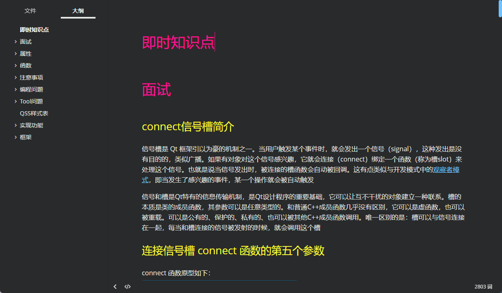

## 即时知识点



## 面试

### connect信号槽简介

信号槽是 Qt 框架引以为豪的机制之一。当用户触发某个事件时，就会发出一个信号（signal），这种发出是没有目的的，类似广播。如果有对象对这个信号感兴趣，它就会连接（connect）绑定一个函数（称为槽slot）来处理这个信号。也就是说当信号发出时，被连接的槽函数会自动被回调。这有点类似与开发模式中的[观察者模式](https://so.csdn.net/so/search?q=观察者模式&spm=1001.2101.3001.7020)，即当发生了感兴趣的事件，某一个操作就会被自动触发

信号和槽是Qt特有的信息传输机制，是Qt设计程序的重要基础，它可以让互不干扰的对象建立一种联系。槽的本质是类的成员函数，其参数可以是任意类型的。和普通C++成员函数几乎没有区别，它可以是虚函数，也可以被重载。可以是公有的、保护的、私有的、也可以被其他C++成员函数调用。唯一区别的是：槽可以与信号连接在一起，每当和槽连接的信号被发射的时候，就会调用这个槽

### 连接信号槽 connect 函数的第五个参数

connect 函数原型如下：
`[static] QMetaObject::Connection QObject::`

`connect(const QObject *sender, const char *signal, `

​			  `const QObject *receiver, `

​			  `const char *method, `

​             `Qt::ConnectionType type = Qt::AutoConnection)`

ConnectionType 是一个定义在 Qt namespace 中的一个枚举，具体内容如下：

```c
enum ConnectionType {
	AutoConnection,
	DirectConnection,
	QueuedConnection,
	BlockingQueuedConnection,
	UniqueConnection =  0x80
};
```

1. **Qt::AutoConnection**：默认值。根据 sender 和 receiver 所处线程在信号发出时作出判断。如果在同一线程则使用 Qt::DirectConnection 连接，否则使用 Qt :: QueuedConnection 连接。需要注意的是，这个判断和 sender 对象所处线程无关，真正判断的是发出信号这个动作所在的线程
2. **Qt::DirectConnection**：槽函数会在信号发送的时候直接被调用，槽函数运行于信号发送者所在线程。效果看上去就像是直接在信号发送位置调用了槽函数。需要注意的是，在多线程环境下比较危险，可能会造成奔溃
3. **Qt::QueuedConnection**：槽函数在控制回到接收者所在线程的事件循环时被调用，槽函数运行于信号接收者所在线程。发送信号之后，槽函数不会立刻被调用，等到接收者的当前函数执行完，进入事件循环之后，槽函数才会被调用。多线程环境下一般用这个
4. **Qt::BlockingQueuedConnection**：槽函数的调用时机与 Qt::QueuedConnection 一致，不过发送完信号后发送者所在线程会阻塞，直到槽函数运行完，在多线程间需要同步的场合可能需要这个。需要注意的是，接收者和发送者绝对不能在一个线程，否则程序会死锁
5. **Qt::UniqueConnection**：这个 flag 可以通过按位或（|）与以上四个结合在一起使用。当这个flag设置时，当某个信号和槽已经连接时，再进行重复的连接就会失败，也就是避免了重复连接

### 信号与槽的连接方式

1. **C++ 连接信号槽 - Qt4 语法**
   `connect(ui->pushButton, SIGNAL(clicked()), this, SLOT(close()));`
2. **C++ 连接信号槽 - Qt5 语法**
   `connect(ui->pushButton, &QPushButton::clicked, this, &MainWindow::close)`
3. **C++ 连接信号槽 - 函数指针**
   `void(MainWindow:: *buttonClickSlot)() = &MainWindow::onButtonPushed;`
   `connect(ui->pushButton, &QPushButton::clicked, this, buttonClickSlot);`
4. **C++ 连接信号槽 - Lambda 表达式**
   `connect(ui->pushButton, &QPushButton::clicked, this, [=](){ this->close(); });`
5. **C++ 信号连接 QML 的槽**

```c
class Test {
signals:
	void sendData(QString str);    
}
```

1）如果注册的是全局对象，则需要使用 Connections 连接：

```c
Connections {
    target: test
    onSendData: {
        console.log(str)
    }
}
```

2）如果注册的是类，则需要先实例化对象，之后直接使用 on 接收：

```
Test {
	onSendData: {
        console.log(str)
    }
}
```

1. **QML 信号连接 C++ 的槽**

```c++
#include <QQuickItem>
QObject *quitButton = root->findChild<QObject*>("quitButton");
if (quitButton) {
    QObject::connect(quitButton, SIGNAL(clicked()), &app, SLOT(quit()));
}
```

1. **C++ 调用 QML 函数**

```c++
QObject *changeBtn = root->findChild<QObject*>("objectName");
if (changeBtn)
{
    QMetaObject::invokeMethod(changeBtn, "changeColor");
}
```

1. **QML 调用 C++ 函数**

```c++
onClicked:
{
    className.test();
}
```

1. **QML 信号连接 QML 的槽**

```c
// A.qml
Rectangle {
	signal sendData(var data)
}
1234
// B.qml
Rectangle {
	onSendData: console.log(data)
}
```

### Qt的内存管理机制


>**"c++是爹先生，儿后生"**
>
>**儿先死，爹后死**


## 属性

### Qt::WA_DeleteOnClose

```c
this->setAttribute(Qt::WA_DeleteOnClose); // 如果没有设置这个属性 那么close() 将和 hide() 的作用一样
```

### Qt::WA_Hover

>`setAttribute(Qt::WA_Hover)` 是一个用于启用鼠标悬停事件的属性设置，它属于 Qt 的 `QWidget` 类。具体解释如下：
>
>- **`Qt::WA_Hover` 是一个标志位，它启用鼠标悬停事件处理。当这个属性被设置时，QWidget 可以接收到鼠标悬停在其区域内的事件，而不必先按下鼠标按钮。**
>- 一旦启用了 `WA_Hover`，你可以在重写的事件处理函数中（比如 `QWidget::event()`）处理 `QEvent::HoverEnter`、`QEvent::HoverMove` 和 `QEvent::HoverLeave` 等悬停事件。这使得你能够根据鼠标悬停状态来更新 UI 元素，如改变控件的外观、显示提示信息等。
>
>举个例子，如果你在自定义的 `QWidget` 或 `QPushButton` 上使用 `setAttribute(Qt::WA_Hover)`，那么你可以在控件上悬停时触发特定的响应，例如改变背景色或显示工具提示。


## 函数

### T qobject_cast ( QObject * object )

本方法返回object向下的转型T，如果转型不成功则返回0，如果传入的object本身就是0则返回0。

在使用时有两个限制：

  1# T类型必须继承自QObject。

  2# 在声明时必须有Q_OBJECT宏。


**使用场景1：**

当某一个Object emit一个signal的时候，它就是一个sender, 系统会记录下当前是谁emit出这个signal的，

**所以你在对应的slot里就可以通过 sender()得到当前是谁invoke了你的slot。**

有可能多个 Object的signal会连接到同一个signal(例如多个Button可能会connect到一个slot函数onClick()),

因此这是就 需要判断**到底是哪个Object emit了这个signal，根据sender的不同来进行不同的处理.**

在槽函数中：

```c++
QObject * obj = sender(); //返回发出信号的对象，用QObject类型接收

QPushButton *button_tmp = qobject_cast<QPushButton *>(obj);  //向下转型为按钮类型

...对此按钮的其他操作
```

**使用场景2：**

**通过QWidget \* QApplication::focusWidget()可以获得当前拥有焦点的widget，然后和你的那几个可能有焦点的widget逐一比对**即可执行对应操作

```c++
  QWidget * fWidget = qApp->focusWidget();
  if (lineEdit1 == qobject_cast<QLineEdit *>(fWidget ))
  {
      //lineEdit1
  }
  else if(lineEdit2 == qobject_cast<QLineEdit *>(fWidget ))
  { 
      //lineEdit2
  }
  else if(lineEdit3 == qobject_cast<QLineEdit *>(fWidget ))
  {
      //lineEdit3
  }
  else if(textEdit == qobject_cast<QTextEdit *>(fWidget ))
  {
      //textEdit
  }
```

## 注意事项

### Qt6无边框窗口GlobalPosition() 和 GlobalPos()

```c++
#include "MainLessWidget.h"
#include <QMouseEvent>

// 主要设置无边框窗口  和  怎么去移动它

/*
*  mouse_pos = event->globalPos();
C4996 错误是由于您使用了过时的方法 QMouseEvent::globalPos，
而在 Qt 6 及以上版本中建议改用 globalPosition() 方法。这是因为 Qt 6 对事件处理进行了现代化调整，支持更精准的浮点数坐标。

修复方法如下：

使用 globalPosition() 替代 globalPos()。
globalPosition() 返回的是 QPointF 类型，因此需要显式转换为 QPoint。
*/
QPoint mouse_pos;
QPoint window_pos;
QPoint diff_pos;
MainLessWidget::MainLessWidget(QWidget *parent)
    : QWidget(parent)
{
    this->setWindowFlags(Qt::FramelessWindowHint | Qt::WindowMinMaxButtonsHint); // 隐藏
}

void MainLessWidget::mousePressEvent(QMouseEvent * event)
{
    mouse_pos = event->globalPosition().toPoint();
    window_pos = this->pos();
    diff_pos = mouse_pos - window_pos;
}

void MainLessWidget::mouseMoveEvent(QMouseEvent* event)
{
    QPoint pos = event->globalPosition().toPoint();
    //this->move(pos);
    this->move(pos - diff_pos);
}
```

### 槽函数声明之后要实现


'槽函数声明之后需要在cpp文件里面去实现'


## 编程问题

### 	QWidget::isTopLevel': Use isWindow()	

```c++
void CTitleBar::on_Clicked() 
{
	QPushButton* pBtn = qobject_cast<QPushButton*>(sender());

	QWidget* pWindow = this->window();

	if (pWindow->isTopLevel()) // isTopLevel() 方法曾用于检查窗口是否是顶层窗口，但从 Qt 5.15 开始，它被标记为弃用，并推荐使用 isWindow()，因为 isWindow() 更准确地表示一个窗口是否是窗口级别（即不被其他窗口包含）的窗口。
        
    if (pWindow->isWindow())
	{
		if (pBtn == m_pMaxBtn)
		{
			if (pWindow->isMaximized())
			{
				pWindow->showNormal();
				m_pMaxBtn->setStyleSheet("QPushButton{background-image:url(:/titlebar/resource/titlebar/normal.svg);border:none;  \
					background-position:center; \
					background-repeat:no-repeat;}  \
					QPushButton:hover{ \
					background-color:rgb(99, 99, 99); \
					background-image:url(:/titlebar/resource/titlebar/normal_hover.svg);border:none;}");
				emit sig_max(false);
			}
			else
			{
				pWindow->showMaximized();
				m_pMaxBtn->setStyleSheet("QPushButton{background-image:url(:/titlebar/resource/titlebar/max.svg);border:none;  \
					background-position:center; \
					background-repeat:no-repeat;}  \
					QPushButton:hover{ \
					background-color:rgb(99, 99, 99);  \
					background-image:url(:/titlebar/resource/titlebar/max_hover.svg);border:none;}");
				emit sig_max(true);
			}
		}
		else if (pBtn == m_pMinBtn)
		{
			pWindow->showMinimized();
		}
		else if (pBtn == m_pCloseBtn)
		{
			emit sig_close();
		}
	}
}
```

### nativeEvent


```c++
#pragma once
#include <Qwidget>
#include <QByteArray>

class CFrameLessWidgetBase :public QWidget
{
	Q_OBJECT

public:
	CFrameLessWidgetBase(QWidget* parent = Q_NULLPTR);
	~CFrameLessWidgetBase();

protected:
    // 将override删除
	bool nativeEvent(const QByteArray* eventType, void* message, qintptr* result);

private:
	int mouse_margin = 5;
};


```

## Tool问题

### svg文件不显示问题

>**新建 bat 文件     ren *.svg *.png**

### Vs项目和Qt项目转换后，控件不显示

> 问题描述：
>
> ​			1.Vs项目和Qt项目转换后，在Qt creator里面运行之后，界面控件不显示，只能在Vs里面运行之后，Qt creator才会显示控件

解决方法：

​	1.将工程目录下ui界面对应的ui_.h文件备份后删除。

​	2.在项目上右键点击执行qmake。

​	3.重新构建一下。


### 怎么删除qrc资源文件

1.进入项目的pro文件


2.修改pro文件里面的，RESOURCES 语句


3.重新构建项目

4.进入项目文件夹

5.删除对应的qrc文件


## QSS样式表


## 实现功能

### 无边框窗口移动 重写  mousePressEvent()

```c++
void CTitleBar::mousePressEvent(QMouseEvent* event)
{
	// 如果捕获成功，允许窗口移动
	if (ReleaseCapture())  // 释放当前的鼠标捕获（允许鼠标事件继续传递给父窗口）
	{
		// 获取当前窗口对象
		QWidget* pWindow = this->window();

		// 检查窗口是否是顶层窗口（即独立的窗口，不是嵌套在其他窗口中的）
		if (pWindow->isWindow())
		{
			// 发送 Windows 消息，使窗口开始拖动
			// HTCAPTION 表示鼠标点击的是标题栏
			// WM_SYSCOMMAND 是一个系统命令消息，SC_MOVE 用于通知窗口开始移动
			// 该消息将由系统处理，并启动窗口的拖动功能

			SendMessage(HWND(pWindow->winId()), WM_SYSCOMMAND, SC_MOVE + HTCAPTION, 0);
		}
	}

	// 忽略当前的鼠标事件，确保事件不会进一步传递给其他控件
	event->ignore();
}
```


## 框架

### VLC media player

vlc是一款自由，开源的跨平台多媒体播放器及框架，可播放大多数多媒体文件，以及DVD,音频CD，VCD及各类流媒体协议

### VLC框架配置

>**右击项目属性->C/C++->常规->附加包含目录->.\vlc-3.0.8\sdk\include,  .\vlc-3.0.8\sdk\lib**


> **右击项目属性->链接器->常规->附加库目录->.\vlc-3.0.8\sdk\lib**


> **右击项目属性->链接器->输入->附加依赖项->libvlc.lib,libvlccore.lib**


### 报错

#### libvlc_media_read_cb为生命的标识符


```c++
// 头文件加入
#ifdef _WIN32
#include <basetsd.h>
typedef SSIZE_T ssize_t;
#endif

#include "vlc/vlc.h"
```

#### 模块对于SAFSEH映像是不安全的


#### 找不到libvlc.dll


#### 实例化错误


