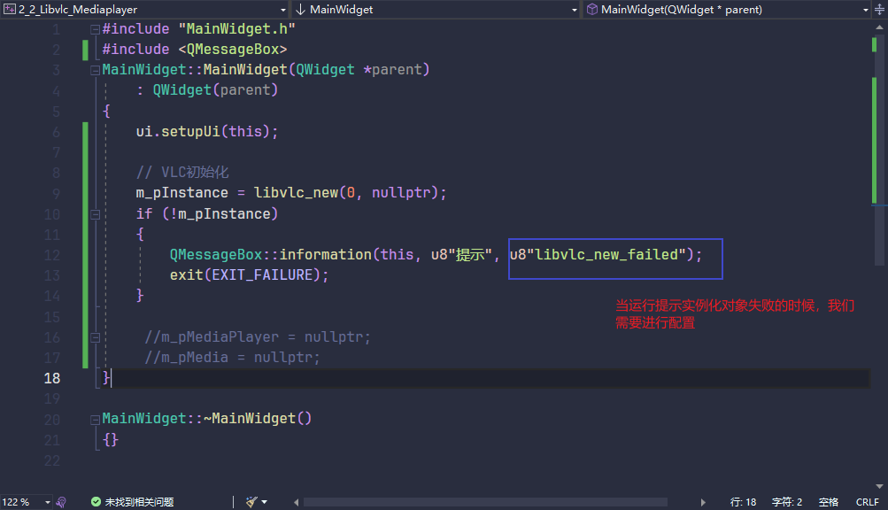

## 面试

### connect信号槽简介

信号槽是 Qt 框架引以为豪的机制之一。当用户触发某个事件时，就会发出一个信号（signal），这种发出是没有目的的，类似广播。如果有对象对这个信号感兴趣，它就会连接（connect）绑定一个函数（称为槽slot）来处理这个信号。也就是说当信号发出时，被连接的槽函数会自动被回调。这有点类似与开发模式中的[观察者模式](https://so.csdn.net/so/search?q=观察者模式&spm=1001.2101.3001.7020)，即当发生了感兴趣的事件，某一个操作就会被自动触发

信号和槽是Qt特有的信息传输机制，是Qt设计程序的重要基础，它可以让互不干扰的对象建立一种联系。槽的本质是类的成员函数，其参数可以是任意类型的。和普通C++成员函数几乎没有区别，它可以是虚函数，也可以被重载。可以是公有的、保护的、私有的、也可以被其他C++成员函数调用。唯一区别的是：槽可以与信号连接在一起，每当和槽连接的信号被发射的时候，就会调用这个槽

### 连接信号槽 connect 函数的第五个参数

connect 函数原型如下：
`[static] QMetaObject::Connection QObject::`

`connect(const QObject *sender, const char *signal, `

​			  `const QObject *receiver, `

​			  `const char *method, `

​             `Qt::ConnectionType type = Qt::AutoConnection)`

ConnectionType 是一个定义在 Qt namespace 中的一个枚举，具体内容如下：

```c
enum ConnectionType {
	AutoConnection,
	DirectConnection,
	QueuedConnection,
	BlockingQueuedConnection,
	UniqueConnection =  0x80
};
```

1. **Qt::AutoConnection**：默认值。根据 sender 和 receiver 所处线程在信号发出时作出判断。如果在同一线程则使用 Qt::DirectConnection 连接，否则使用 Qt :: QueuedConnection 连接。需要注意的是，这个判断和 sender 对象所处线程无关，真正判断的是发出信号这个动作所在的线程
2. **Qt::DirectConnection**：槽函数会在信号发送的时候直接被调用，槽函数运行于信号发送者所在线程。效果看上去就像是直接在信号发送位置调用了槽函数。需要注意的是，在多线程环境下比较危险，可能会造成奔溃
3. **Qt::QueuedConnection**：槽函数在控制回到接收者所在线程的事件循环时被调用，槽函数运行于信号接收者所在线程。发送信号之后，槽函数不会立刻被调用，等到接收者的当前函数执行完，进入事件循环之后，槽函数才会被调用。多线程环境下一般用这个
4. **Qt::BlockingQueuedConnection**：槽函数的调用时机与 Qt::QueuedConnection 一致，不过发送完信号后发送者所在线程会阻塞，直到槽函数运行完，在多线程间需要同步的场合可能需要这个。需要注意的是，接收者和发送者绝对不能在一个线程，否则程序会死锁
5. **Qt::UniqueConnection**：这个 flag 可以通过按位或（|）与以上四个结合在一起使用。当这个flag设置时，当某个信号和槽已经连接时，再进行重复的连接就会失败，也就是避免了重复连接

### 信号与槽的连接方式

1. **C++ 连接信号槽 - Qt4 语法**
   `connect(ui->pushButton, SIGNAL(clicked()), this, SLOT(close()));`
2. **C++ 连接信号槽 - Qt5 语法**
   `connect(ui->pushButton, &QPushButton::clicked, this, &MainWindow::close)`
3. **C++ 连接信号槽 - 函数指针**
   `void(MainWindow:: *buttonClickSlot)() = &MainWindow::onButtonPushed;`
   `connect(ui->pushButton, &QPushButton::clicked, this, buttonClickSlot);`
4. **C++ 连接信号槽 - Lambda 表达式**
   `connect(ui->pushButton, &QPushButton::clicked, this, [=](){ this->close(); });`
5. **C++ 信号连接 QML 的槽**

```c
class Test {
signals:
	void sendData(QString str);    
}
```

1）如果注册的是全局对象，则需要使用 Connections 连接：

```c
Connections {
    target: test
    onSendData: {
        console.log(str)
    }
}
```

2）如果注册的是类，则需要先实例化对象，之后直接使用 on 接收：

```
Test {
	onSendData: {
        console.log(str)
    }
}
```

1. **QML 信号连接 C++ 的槽**

```c++
#include <QQuickItem>
QObject *quitButton = root->findChild<QObject*>("quitButton");
if (quitButton) {
    QObject::connect(quitButton, SIGNAL(clicked()), &app, SLOT(quit()));
}
```

1. **C++ 调用 QML 函数**

```c++
QObject *changeBtn = root->findChild<QObject*>("objectName");
if (changeBtn)
{
    QMetaObject::invokeMethod(changeBtn, "changeColor");
}
```

1. **QML 调用 C++ 函数**

```c++
onClicked:
{
    className.test();
}
```

1. **QML 信号连接 QML 的槽**

```c
// A.qml
Rectangle {
	signal sendData(var data)
}
1234
// B.qml
Rectangle {
	onSendData: console.log(data)
}
```

### Qt的内存管理机制


>**"c++是爹先生，儿后生"**
>
>**儿先死，爹后死**


## 属性

### Qt::WA_DeleteOnClose

```c
this->setAttribute(Qt::WA_DeleteOnClose); // 如果没有设置这个属性 那么close() 将和 hide() 的作用一样
```

### Qt::WA_Hover

>`setAttribute(Qt::WA_Hover)` 是一个用于启用鼠标悬停事件的属性设置，它属于 Qt 的 `QWidget` 类。具体解释如下：
>
>- **`Qt::WA_Hover` 是一个标志位，它启用鼠标悬停事件处理。当这个属性被设置时，QWidget 可以接收到鼠标悬停在其区域内的事件，而不必先按下鼠标按钮。**
>- 一旦启用了 `WA_Hover`，你可以在重写的事件处理函数中（比如 `QWidget::event()`）处理 `QEvent::HoverEnter`、`QEvent::HoverMove` 和 `QEvent::HoverLeave` 等悬停事件。这使得你能够根据鼠标悬停状态来更新 UI 元素，如改变控件的外观、显示提示信息等。
>
>举个例子，如果你在自定义的 `QWidget` 或 `QPushButton` 上使用 `setAttribute(Qt::WA_Hover)`，那么你可以在控件上悬停时触发特定的响应，例如改变背景色或显示工具提示。

### Qt::WA_OpaquePaintEvent

`WA_OpaquePaintEvent` 是 Qt 中的一个标志，它用于优化小部件的绘制。当这个标志被设置时，Qt 会假设小部件的背景已经完全不透明，因此不需要清除背景再进行绘制，这可以提高渲染性能。

### qApp

`qApp` 是 Qt 中一个非常有用的宏，它返回一个指向当前应用程序的 `QApplication` 或 `QGuiApplication` 实例的指针。这个宏通常用于访问全局应用程序实例，以便执行全局操作或访问应用程序的相关信息。

例如，你可以使用 `qApp` 来访问应用程序的主窗口或改变应用程序的设置：

```cpp
#include <QApplication>
#include <QMainWindow>

int main(int argc, char *argv[]) {
    QApplication app(argc, argv);

    QMainWindow mainWindow;
    mainWindow.show();

    // 使用 qApp 来访问应用程序实例
    qApp->setStyle("Fusion");

    return app.exec();
}
```

在这个示例中，`qApp->setStyle("Fusion")` 设置了应用程序的样式为 "Fusion"。

注意：`qApp` 只能在有 `QApplication` 或 `QGuiApplication` 实例化之后使用，通常在 `main` 函数中创建应用程序实例时使用。

## 函数

### T qobject_cast ( QObject * object )

本方法返回object向下的转型T，如果转型不成功则返回0，如果传入的object本身就是0则返回0。

在使用时有两个限制：

  1# T类型必须继承自QObject。

  2# 在声明时必须有Q_OBJECT宏。


**使用场景1：**

当某一个Object emit一个signal的时候，它就是一个sender, 系统会记录下当前是谁emit出这个signal的，

**所以你在对应的slot里就可以通过 sender()得到当前是谁invoke了你的slot。**

有可能多个 Object的signal会连接到同一个signal(例如多个Button可能会connect到一个slot函数onClick()),

因此这是就 需要判断**到底是哪个Object emit了这个signal，根据sender的不同来进行不同的处理.**

在槽函数中：

```c++
QObject * obj = sender(); //返回发出信号的对象，用QObject类型接收

QPushButton *button_tmp = qobject_cast<QPushButton *>(obj);  //向下转型为按钮类型

...对此按钮的其他操作
```

**使用场景2：**

**通过QWidget \* QApplication::focusWidget()可以获得当前拥有焦点的widget，然后和你的那几个可能有焦点的widget逐一比对**即可执行对应操作

```c++
  QWidget * fWidget = qApp->focusWidget();
  if (lineEdit1 == qobject_cast<QLineEdit *>(fWidget ))
  {
      //lineEdit1
  }
  else if(lineEdit2 == qobject_cast<QLineEdit *>(fWidget ))
  { 
      //lineEdit2
  }
  else if(lineEdit3 == qobject_cast<QLineEdit *>(fWidget ))
  {
      //lineEdit3
  }
  else if(textEdit == qobject_cast<QTextEdit *>(fWidget ))
  {
      //textEdit
  }
```

### static_cast

`static_cast` 是 C++ 中的一种类型转换操作符，它用于在具有明确转换关系的类型之间进行转换。与 C 语言中的类型转换（如 `(type)value`）相比，`static_cast` 提供了更好的类型安全性，并且能够在编译时检查转换的有效性。

#### 使用场景

`static_cast` 可以用于以下几种情况：

1. **基础数据类型之间的转换**：例如，将 `int` 转换为 `float`，或者将 `double` 转换为 `int`（注意，这种转换可能会导致数据丢失或精度下降）。
2. **派生类与基类之间的转换**（在明确知道对象实际类型的情况下）：可以将指向派生类对象的指针或引用转换为指向基类对象的指针或引用，反之亦然（但这通常不是好的做法，因为向下转换（从基类到派生类）在运行时是不安全的，除非使用了 `dynamic_cast` 并进行了类型检查）。
3. **void* 与其他类型指针之间的转换**：可以将 `void*` 转换为具体类型的指针，或者将具体类型的指针转换为 `void*`。
4. **有转换构造函数或转换操作符的类之间的转换**：如果类 A 有一个接受类 B 类型参数的构造函数，或者类 B 有一个返回类 A 类型值的转换操作符，那么可以使用 `static_cast` 在 A 和 B 之间进行转换。

#### 语法

```cpp
static_cast<type>(expression);
```

- `type`：目标类型。
- `expression`：要转换的表达式。

#### 示例

```cpp
#include <iostream>
 
class Base {
public:
    virtual ~Base() {} // 为了多态性，基类通常需要一个虚析构函数
};
 
class Derived : public Base {
public:
    void sayHello() {
        std::cout << "Hello from Derived!" << std::endl;
    }
};
 
int main() {
    Base* basePtr = new Derived(); // 基类指针指向派生类对象
 
    // 使用 static_cast 将基类指针转换为派生类指针（这里假设我们知道实际对象是 Derived 类型的）
    Derived* derivedPtr = static_cast<Derived*>(basePtr);
 
    derivedPtr->sayHello(); // 调用派生类的成员函数
 
    delete basePtr; // 注意：应该通过基类指针删除对象，但这里我们已知实际类型是 Derived
 
    return 0;
}
```

**警告**：在上面的示例中，虽然 `static_cast` 被用于将基类指针转换为派生类指针，但这种转换在运行时是不安全的。如果 `basePtr` 实际上并没有指向一个 `Derived` 对象，那么转换后的 `derivedPtr` 将指向一个无效的对象，这可能导致未定义行为。在实际编程中，通常应该使用 `dynamic_cast` 并检查转换是否成功来进行这种转换。

对于基础数据类型之间的转换，`static_cast` 是安全的，因为它只是改变了数据的解释方式，而不会改变数据本身（尽管可能会导致数据丢失或精度下降）。

### childAt()

在Qt框架中，QWidget类提供了`childAt`方法，该方法用于获取指定位置的子控件（子视图）。

- **功能**：通过传入一个坐标点（通常是相对于父控件的坐标），`childAt`方法会返回位于该坐标点处的子控件指针。
- **返回值**：如果指定位置存在子控件，则返回该子控件的指针；如果不存在，则返回nullptr。
- **应用场景**：该方法常用于动态操作容器中的子控件，例如获取特定位置的子控件进行操作，或者判断子控件是否存在。

### geometry()

`QWidget` 类及其子类（如 `QPushButton`, `QLabel` 等）提供了 `geometry()` 成员函数，用于获取控件的几何形状。

- **功能**：返回控件的矩形区域，该区域以屏幕坐标表示控件的位置和大小。
- **返回值**：一个 `QRect` 对象，包含了控件的 x 和 y 坐标（位置）以及宽度和高度（大小）。
- **应用场景**：常用于获取控件的当前位置和大小，以便进行布局调整或动画效果等。

### setMouseTracking()

`setMouseTracking` 是 Qt 中 `QWidget` 类的一个方法，用于启用或禁用鼠标追踪功能。当启用鼠标追踪时，鼠标移动事件（如 `mouseMoveEvent`）会在鼠标光标移动到小部件上时触发，即使没有按下鼠标按钮。

#### 语法：

```cpp
void setMouseTracking(bool enable);
```

- `enable` 参数为 `true` 时，启用鼠标追踪；为 `false` 时，禁用鼠标追踪。

#### 默认行为：

默认情况下，只有在按下鼠标按钮时，才会触发 `mouseMoveEvent`。如果你希望在没有按下鼠标按钮时也能捕获鼠标移动事件，就需要启用鼠标追踪。

#### 使用示例：

```cpp
#include <QWidget>
#include <QMouseEvent>
#include <QDebug>

class MyWidget : public QWidget {
public:
    MyWidget() {
        // 启用鼠标追踪
        setMouseTracking(true);
    }

protected:
    void mouseMoveEvent(QMouseEvent *event) override {
        // 捕获鼠标移动事件
        qDebug() << "Mouse moved to:" << event->pos();
    }
};

int main(int argc, char *argv[]) {
    QApplication app(argc, argv);
    MyWidget widget;
    widget.show();
    return app.exec();
}
```

#### 解释：

- 在 `MyWidget` 类的构造函数中，我们调用了 `setMouseTracking(true)` 来启用鼠标追踪。
- `mouseMoveEvent` 会在鼠标光标在小部件内移动时触发，即使没有按下鼠标按钮，都会输出鼠标当前位置。

#### 注意：

- 启用鼠标追踪后，`mouseMoveEvent` 会频繁触发，特别是鼠标在小部件上快速移动时，可能会导致性能问题。因此，建议只在需要的情况下启用鼠标追踪。
- 如果只需要在鼠标按下时跟踪鼠标移动，保持默认行为即可，无需调用 `setMouseTracking`。

### this->pos()

`this->pos()`：`pos()` 是 `QWidget` 类中的一个方法，返回小部件相对于其父小部件的坐标位置，返回一个 `QPoint` 对象。

### mapToGlobal()

`mapToGlobal` 是 `QWidget` 类中的一个方法，用于将一个小部件内部的坐标转换为全局坐标（即相对于屏幕的坐标）。

### eventFilter()

`eventFilter` 是 `QObject` 类的一个虚函数，用于捕获和处理事件。它允许你拦截和处理特定对象（`watched`）上的事件（`event`），即使这个事件并没有直接被目标对象的事件处理函数处理。

在 Qt 中，`eventFilter` 主要用于以下几个场景：

1. **拦截事件**：你可以用 `eventFilter` 来拦截特定对象的事件，处理或修改事件，然后决定是否将事件传递给该对象的默认事件处理函数。
2. **自定义事件处理**：在某些情况下，你希望通过中间层对某些事件（例如鼠标事件、键盘事件等）进行更细粒度的控制，而不直接修改原始对象的代码。

#### 语法

```cpp
bool eventFilter(QObject *watched, QEvent *event) override;
```

- **watched**：触发事件的对象（即你注册了事件过滤器的对象）。
- **event**：传递给 `watched` 对象的事件。

如果 `eventFilter` 返回 `true`，表示事件已经被处理，事件不会继续传播给 `watched` 对象的默认事件处理函数。如果返回 `false`，则事件继续传播。

#### 示例

假设你有一个 `QPushButton`，并想在按钮点击时拦截并处理事件：

```cpp
#include <QApplication>
#include <QPushButton>
#include <QEvent>
#include <QDebug>

class MyWidget : public QWidget
{
    Q_OBJECT

public:
    MyWidget(QWidget *parent = nullptr) : QWidget(parent)
    {
        QPushButton *button = new QPushButton("Click me", this);
        button->setGeometry(50, 50, 100, 30);

        // 安装事件过滤器
        button->installEventFilter(this);
    }

protected:
    bool eventFilter(QObject *watched, QEvent *event) override
    {
        if (watched->isWidgetType()) {
            // 判断是否是按钮事件
            if (event->type() == QEvent::MouseButtonPress) {
                qDebug() << "Button pressed!";
                // 处理事件
                return true;  // 阻止事件继续传播
            }
        }

        // 如果没有处理，调用父类的 eventFilter
        return QWidget::eventFilter(watched, event);
    }
};

int main(int argc, char *argv[])
{
    QApplication a(argc, argv);
    MyWidget w;
    w.show();
    return a.exec();
}
```

#### 解释

- `eventFilter` 被重载，用于捕获所有安装过滤器的事件（例如按钮点击）。
- 如果按钮的 `MouseButtonPress` 事件被触发，`eventFilter` 会处理这个事件，并返回 `true`，表示事件已经被处理，不会继续传递给按钮。
- 如果事件没有被处理，调用父类 `QWidget::eventFilter(watched, event)` 让事件继续传播。

#### 其他常见事件类型

- **QEvent::MouseButtonPress**、**QEvent::MouseButtonRelease**：鼠标按下或松开事件。
- **QEvent::KeyPress**、**QEvent::KeyRelease**：键盘按下或松开事件。
- **QEvent::FocusIn**、**QEvent::FocusOut**：获得或失去焦点事件。
- **QEvent::Resize**：窗口大小调整事件。

#### 使用场景

- **全局事件过滤器**：通过在应用程序或窗口级别安装事件过滤器，你可以捕获所有的事件，例如键盘事件、鼠标事件、窗口事件等。
- **定制行为**：例如拦截控件的鼠标点击、键盘输入，或自定义控件的特定行为。
- **调试工具**：你可以用事件过滤器来查看或调试某些事件流。

#### 总结

`eventFilter` 是 Qt 提供的强大事件机制，可以帮助你拦截、修改或取消事件的传播。它适用于需要在不修改原始控件或对象代码的情况下，自定义事件处理行为的场景。

## 注意事项

### Qt6无边框窗口GlobalPosition() 和 GlobalPos()

```c++
#include "MainLessWidget.h"
#include <QMouseEvent>

// 主要设置无边框窗口  和  怎么去移动它

/*
*  mouse_pos = event->globalPos();
C4996 错误是由于您使用了过时的方法 QMouseEvent::globalPos，
而在 Qt 6 及以上版本中建议改用 globalPosition() 方法。这是因为 Qt 6 对事件处理进行了现代化调整，支持更精准的浮点数坐标。

修复方法如下：

使用 globalPosition() 替代 globalPos()。
globalPosition() 返回的是 QPointF 类型，因此需要显式转换为 QPoint。
*/
QPoint mouse_pos;
QPoint window_pos;
QPoint diff_pos;
MainLessWidget::MainLessWidget(QWidget *parent)
    : QWidget(parent)
{
    this->setWindowFlags(Qt::FramelessWindowHint | Qt::WindowMinMaxButtonsHint); // 隐藏
}

void MainLessWidget::mousePressEvent(QMouseEvent * event)
{
    mouse_pos = event->globalPosition().toPoint();
    window_pos = this->pos();
    diff_pos = mouse_pos - window_pos;
}

void MainLessWidget::mouseMoveEvent(QMouseEvent* event)
{
    QPoint pos = event->globalPosition().toPoint();
    //this->move(pos);
    this->move(pos - diff_pos);
}
```

### 槽函数声明之后要实现


'槽函数声明之后需要在cpp文件里面去实现'


## 编程问题

### 	QWidget::isTopLevel': Use isWindow()	

```c++
void CTitleBar::on_Clicked() 
{
	QPushButton* pBtn = qobject_cast<QPushButton*>(sender());

	QWidget* pWindow = this->window();

	if (pWindow->isTopLevel()) // isTopLevel() 方法曾用于检查窗口是否是顶层窗口，但从 Qt 5.15 开始，它被标记为弃用，并推荐使用 isWindow()，因为 isWindow() 更准确地表示一个窗口是否是窗口级别（即不被其他窗口包含）的窗口。
        
    if (pWindow->isWindow())
	{
		if (pBtn == m_pMaxBtn)
		{
			if (pWindow->isMaximized())
			{
				pWindow->showNormal();
				m_pMaxBtn->setStyleSheet("QPushButton{background-image:url(:/titlebar/resource/titlebar/normal.svg);border:none;  \
					background-position:center; \
					background-repeat:no-repeat;}  \
					QPushButton:hover{ \
					background-color:rgb(99, 99, 99); \
					background-image:url(:/titlebar/resource/titlebar/normal_hover.svg);border:none;}");
				emit sig_max(false);
			}
			else
			{
				pWindow->showMaximized();
				m_pMaxBtn->setStyleSheet("QPushButton{background-image:url(:/titlebar/resource/titlebar/max.svg);border:none;  \
					background-position:center; \
					background-repeat:no-repeat;}  \
					QPushButton:hover{ \
					background-color:rgb(99, 99, 99);  \
					background-image:url(:/titlebar/resource/titlebar/max_hover.svg);border:none;}");
				emit sig_max(true);
			}
		}
		else if (pBtn == m_pMinBtn)
		{
			pWindow->showMinimized();
		}
		else if (pBtn == m_pCloseBtn)
		{
			emit sig_close();
		}
	}
}
```

### nativeEvent


```c++
#pragma once
#include <Qwidget>
#include <QByteArray>

class CFrameLessWidgetBase :public QWidget
{
	Q_OBJECT

public:
	CFrameLessWidgetBase(QWidget* parent = Q_NULLPTR);
	~CFrameLessWidgetBase();

protected:
    // 将override删除
	bool nativeEvent(const QByteArray* eventType, void* message, qintptr* result);

private:
	int mouse_margin = 5;
};


```

### c++ 错误提示：不能使用抽象类对象

```c++
/*
当前类继承了 一个抽象类
    1.派生类 要实现 抽象类 的所有纯虚函数
    2.QAbstractNativeEventFilter的纯虚函数： 
    virtual bool nativeEventFilter(const QByteArray& eventType, void* message, long* result)  = 0;
*/
class VideoWidget : public QWidget, public QAbstractNativeEventFilter
{
    Q_OBJECT

public:
    VideoWidget(QWidget* p = NULL);
    ~VideoWidget();

    void showTopWidget(bool show);
    void setPlayStatus(bool play);

protected:
    //  bool nativeEventFilter(const QByteArray& eventType, void* message, long* result) override;
    // 如果是上面的函数原型 加上 override nativeEventFilter会报错 ，不加override不会报错，但是 编译器会识别不出来你实现了nativeEventFilter
    bool nativeEventFilter(const QByteArray& eventType, void* message, qintptr* result) override;
    void resizeEvent(QResizeEvent* event) override;
}

cpp:
// 必须要实现 nativeEventFilter
    bool nativeEventFilter(const QByteArray& eventType, void* message, qintptr* result
{
    Q_UNUSED(eventType);
	Q_UNUSED(message);
	Q_UNUSED(result);
    return false;
}
                           
main.cpp 
              // 完成上述操作 VideoWidget实例化 不会报错
              VideoWidget *m_pVideoWidget = nullptr;
```


## Tool问题

### svg文件不显示问题

>**新建 bat 文件     ren *.svg *.png**

### Vs项目和Qt项目转换后，控件不显示

> 问题描述：
>
> ​			1.Vs项目和Qt项目转换后，在Qt creator里面运行之后，界面控件不显示，只能在Vs里面运行之后，Qt creator才会显示控件

解决方法：

​	1.将工程目录下ui界面对应的ui_.h文件备份后删除。

​	2.在项目上右键点击执行qmake。

​	3.重新构建一下。


### 怎么删除qrc资源文件

1.进入项目的pro文件


2.修改pro文件里面的，RESOURCES 语句


3.重新构建项目

4.进入项目文件夹

5.删除对应的qrc文件


## QSS样式表


## 实现功能

### 实现无边框窗口移动

```c++
void MainWidget::mousePressEvent(QMouseEvent* event)
{
    if (event->button() == Qt::LeftButton)
    {
        m_dragPosition = event->globalPosition().toPoint() - this->frameGeometry().topLeft();
        m_dragging = true;
        event->accept();
    }
}

void MainWidget::mouseMoveEvent(QMouseEvent* event)
{
    if (m_dragging && event->buttons() & Qt::LeftButton)
    {
        this->move(event->globalPosition().toPoint() - m_dragPosition);
        event->accept();  // ✅ 重要
    }
}

void MainWidget::mouseReleaseEvent(QMouseEvent* event)
{
    if (event->button() == Qt::LeftButton)
    {
        m_dragging = false;
        event->accept();  // ✅ 重要
    }
}

void MainWidget::mouseDoubleClickEvent(QMouseEvent* event)
{
    if (this->isFullScreen())
    {
        this->showNormal();
    }
    else
    {
        this->showFullScreen();
    }
}
```

### 重写nativeEvent()实现窗口拖拽

这段代码是一个Qt框架中自定义无边框窗口（frameless window）的一部分，特别是处理Windows消息（通过`nativeEvent`函数）以实现自定义的边框和标题栏行为。下面是对这段代码的详细注释：

```cpp
bool CFrameLessWidget::nativeEvent(const QByteArray& eventType, void* message, long* result)
{
    MSG* param = static_cast<MSG*>(message);

    if (param->message == WM_NCHITTEST)
    {
        QPoint localPos = mapFromGlobal(QPoint(GET_X_LPARAM(param->lParam), GET_Y_LPARAM(param->lParam)));
        int nX = localPos.x();
        int nY = localPos.y();

        // 确保边框宽度有效
        if (m_nBorDerWidth <= 0)
            m_nBorDerWidth = 8;

        // 判断是否是内容区域
        if (nX > m_nBorDerWidth && nX < this->width() - m_nBorDerWidth &&
            nY > m_nBorDerWidth && nY < this->height() - m_nBorDerWidth)
        {
            if (childAt(nX, nY) != nullptr)
                return QWidget::nativeEvent(eventType, message, (qintptr*)result);

            *result = HTCLIENT; // 让 Windows 处理
            return true;
        }

        // 判断边框区域
        if (nX <= m_nBorDerWidth)
            *result = HTLEFT;
        else if (nX >= this->width() - m_nBorDerWidth)
            *result = HTRIGHT;

        if (nY <= m_nBorDerWidth)
            *result = HTTOP;
        else if (nY >= this->height() - m_nBorDerWidth)
            *result = HTBOTTOM;

        // 判断四个角
        if (nX <= m_nBorDerWidth && nY <= m_nBorDerWidth)
            *result = HTTOPLEFT;
        else if (nX >= this->width() - m_nBorDerWidth && nY <= m_nBorDerWidth)
            *result = HTTOPRIGHT;
        else if (nX <= m_nBorDerWidth && nY >= this->height() - m_nBorDerWidth)
            *result = HTBOTTOMLEFT;
        else if (nX >= this->width() - m_nBorDerWidth && nY >= this->height() - m_nBorDerWidth)
            *result = HTBOTTOMRIGHT;

        return true;
    }

    return false;
}
```

这段代码的主要目的是通过处理`WM_NCHITTEST`消息来自定义无边框窗口的拖动行为。通过检查鼠标点击的位置，并设置相应的返回值，可以改变窗口的拖动区域，从而实现自定义的边框和标题栏效果。

## 框架

### VLC media player

vlc是一款自由，开源的跨平台多媒体播放器及框架，可播放大多数多媒体文件，以及DVD,音频CD，VCD及各类流媒体协议

### VLC框架配置

>**右击项目属性->C/C++->常规->附加包含目录->.\vlc-3.0.8\sdk\include,  .\vlc-3.0.8\sdk\lib**


> **右击项目属性->链接器->常规->附加库目录->.\vlc-3.0.8\sdk\lib**


> **右击项目属性->链接器->输入->附加依赖项->libvlc.lib,libvlccore.lib**


### 报错

#### libvlc_media_read_cb为生命的标识符


```c++
// 头文件加入
#ifdef _WIN32
#include <basetsd.h>
typedef SSIZE_T ssize_t;
#endif

#include "vlc/vlc.h"
```

#### 模块对于SAFSEH映像是不安全的


#### 找不到libvlc.dll


#### 实例化错误




