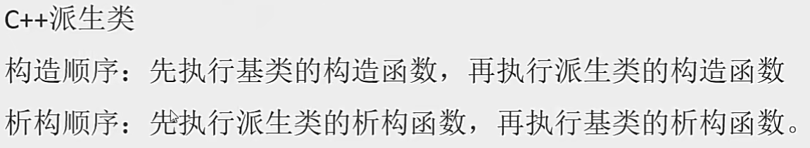
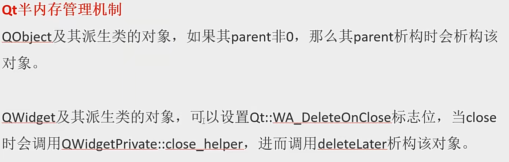

## C++

### 变量作用域

在C++中，变量作用域（Scope）指的是程序中变量可以被访问的代码区域。作用域决定了变量的生命周期和可见性。

我可以解释几种常见的变量作用域类型：

1. **全局作用域**：在函数外部声明的变量具有全局作用域。它们可以在程序的任何地方被访问，但通常建议在需要时才使用全局变量，因为它们可能导致代码难以理解和维护。
2. **局部作用域**：在函数内部、代码块（如`if`语句、`for`循环等）内部声明的变量具有局部作用域。它们只能在声明它们的代码块内被访问。一旦离开该代码块，这些变量就不再可见。
3. **命名空间作用域**：在命名空间中声明的变量（实际上是实体，如变量、函数等）具有命名空间作用域。它们只能在相应的命名空间内被直接访问，但可以通过使用命名空间的名称作为前缀来从外部访问。
4. **类作用域**：在类内部声明的成员变量和成员函数具有类作用域。成员变量和成员函数可以通过类的对象来访问，或者在某些情况下（如静态成员）可以通过类名直接访问。
5. **块作用域**：这是局部作用域的一个特例，指的是由大括号`{}`包围的代码块内部声明的变量。这些变量只能在该代码块内被访问。

### 存储区域

在C++中，内存存储通常可以大致分为几个区域，这些区域根据存储的数据类型、生命周期和作用域来划分。这些区域主要包括：

1. 代码区（Code Segment/Text Segment）

   ：

   - 存储程序执行代码（即机器指令）的内存区域。这部分内存是共享的，只读的，且在程序执行期间不会改变。
   - 举例说明：当你编译一个C++程序时，所有的函数定义、控制结构等都会被转换成机器指令，并存储在代码区。

2. 全局/静态存储区（Global/Static Storage Area）

   ：

   - 存储全局变量和静态变量的内存区域。这些变量在程序的整个运行期间都存在，但它们的可见性和生命周期取决于声明它们的作用域。
   - 举例说明：全局变量（在函数外部声明的变量）和静态变量（使用`static`关键字声明的变量，无论是在函数内部还是外部）都会存储在这个区域。

3. 栈区（Stack Segment）

   ：

   - 存储局部变量、函数参数、返回地址等的内存区域。栈是一种后进先出（LIFO）的数据结构，用于存储函数调用和自动变量。
   - 举例说明：在函数内部声明的变量（不包括静态变量）通常存储在栈上。当函数被调用时，其参数和局部变量会被推入栈中；当函数返回时，这些变量会从栈中弹出，其占用的内存也随之释放。

4. 堆区（Heap Segment）

   ：

   - 由程序员通过动态内存分配函数（如`new`和`malloc`）分配的内存区域。堆区的内存分配和释放是手动的，因此程序员需要负责管理内存，以避免内存泄漏或野指针等问题。
   - 举例说明：当你使用`new`操作符在C++中动态分配一个对象或数组时，分配的内存就来自堆区。同样，使用`delete`操作符可以释放堆区中的内存。

5. 常量区（Constant Area）

   ：

   - 存储常量（如字符串常量、const修饰的全局变量等）的内存区域。这部分内存也是只读的，且通常在程序执行期间不会改变。
   - 举例说明：在C++中，使用双引号括起来的字符串字面量通常存储在常量区。此外，使用`const`关键字声明的全局变量，如果其值在编译时就已确定，也可能存储在常量区。

### enum类型

#### enum是什么

- ​	`enum常量`是int类型
- ​	因此只要能使用int类型的地方，就可以使用enum类型

#### 为什么要使用enum

- 目的是为了提高程序的可读性

#### 声明，默认值，赋值

`注意`：第一个枚举成员的默认值为整型的 0，后续枚举成员的值在前一个成员上加 1。我们在这个实例中把第一个枚举成员的值定义为 1，第二个就为 2，以此类推。

```c++
enum DAY
{
      MON=1, 
      TUE, 
      WED, 
      THU, 
      FRI, 
      SAT, 
      SUN
};
enum season 
{
    spring, 
    summer=3, 
    autumn, 
    winter
};
```

#### 定义

三种方式：

- **定义枚举类型，再定义枚举变量**

```c++
enum DAY
{
      MON=1, TUE, WED, THU, FRI, SAT, SUN
};
enum DAY day;
```

- **定义枚举类型的同时定义枚举变量**

```c++
enum DAY
{
      MON=1, TUE, WED, THU, FRI, SAT, SUN
} day;
```

- **省略枚举名称，直接定义枚举变量**

```c++
enum
{
      MON=1, TUE, WED, THU, FRI, SAT, SUN
} day;
```


###  inline函数

#### **`inline` 函数的作用**

- **最初目的**：向编译器建议将函数代码直接插入调用处（避免函数调用的开销），以提高效率（例如短小的工具函数）。
- **现代编译器**：会自主决定是否内联（如循环、递归通常不会内联），`inline` 关键字不再强制要求编译器内联，**更多用于满足编程规范**。

####  **关键用途：ODR（单一定义规则）**

- **头文件中的函数定义**：若在头文件中直接定义函数（非声明），多个源文件包含该头文件时，会导致**重复定义错误**。
- **使用 `inline`**：在头文件的函数定义前加 `inline`，告知编译器“允许重复定义，但需保证所有定义相同”，从而解决 ODR 问题。

####  **注意事项**

- **编译器决定权**：`inline` 只是建议，编译器可能忽略（如复杂函数）。
- **ODR 一致性**：所有源文件中的 `inline` 函数定义必须**完全相同**，否则引发未定义行为。
- **过度内联**：可能导致代码膨胀，降低缓存利用率，反而影响性能。

#### 总结：何时使用 `inline`？

1. **头文件中定义函数** → 必须用 `inline`（解决 ODR）。
2. **短小频繁调用的函数** → 可尝试用 `inline`（但编译器可能自行优化）。
3. **避免滥用** → 性能关键处由性能分析工具指导。

### **explicit **

#### **`explicit` 的作用**
`explicit` 用于修饰类的 **构造函数** 或 **类型转换运算符**（C++11 起），禁止编译器进行隐式的类型转换，要求代码中必须显式调用。

---

##### **1. 用于构造函数**
###### **问题背景：隐式转换的风险**
如果一个类的构造函数只有一个参数（或多个参数但具有默认值），编译器可能自动进行隐式转换，导致意外的行为。

**示例：未使用 `explicit`**

```cpp
class MyString {
public:
    MyString(const char* str) {  // 允许隐式转换：const char* → MyString
        // 构造逻辑...
    }
};

void printString(const MyString& s) {
    // 打印字符串...
}

int main() {
    printString("Hello");  // 隐式转换：const char* → MyString
    return 0;
}
```
这里 `printString("Hello")` 会隐式调用 `MyString` 的构造函数，但可能并非程序员本意。

---

###### **使用 `explicit` 禁止隐式转换**
```cpp
class MyString {
public:
    explicit MyString(const char* str) {  // 必须显式构造
        // 构造逻辑...
    }
};

void printString(const MyString& s) {
    // 打印字符串...
}

int main() {
    // printString("Hello");          // 错误：无法隐式转换
    printString(MyString("Hello"));  // 正确：显式构造
    return 0;
}
```

---

#### **2. 用于转换运算符（C++11 起）**
防止类型转换运算符被隐式调用。

**示例：未使用 `explicit`**
```cpp
class BooleanWrapper {
public:
    operator bool() const {  // 隐式转换为 bool
        return true;
    }
};

int main() {
    BooleanWrapper bw;
    if (bw) {         // 合法：隐式转换为 bool
        // ...
    }
    int x = bw;       // 可能意外的行为：隐式转换为 bool，再转为 int
    return 0;
}
```

**使用 `explicit` 禁止隐式转换：**
```cpp
class BooleanWrapper {
public:
    explicit operator bool() const {  // 必须显式转换
        return true;
    }
};

int main() {
    BooleanWrapper bw;
    if (bw) {               // 错误：无法隐式转换
    if (static_cast<bool>(bw)) {  // 正确：显式转换
        // ...
    }
    // int x = bw;          // 错误：无法隐式转换
    return 0;
}
```

---

#### **3. 使用场景**
- **明确语义**：避免构造函数或类型转换的隐式行为导致歧义。
  ```cpp
  class Timer {
  public:
      explicit Timer(int seconds) {}  // 明确要求显式的时间单位
  };
  
  Timer t1(5);     // 正确：显式构造
  // Timer t2 = 5; // 错误：必须显式调用
  ```
- **防止意外重载解析**：
  ```cpp
  void process(int x);
  void process(const MyString& s);
  
  process(10);     // 调用 process(int)
  // process("Hi"); // 若未用 explicit，可能隐式调用 MyString 构造函数，再调用 process(const MyString&)
  ```

---

#### **4. 注意事项**
- **多参数构造函数**：C++11 起，即使构造函数有多个参数，也可用 `explicit`。
  ```cpp
  class Vec3 {
  public:
      explicit Vec3(int x, int y, int z) {}
  };
  
  Vec3 v = {1, 2, 3};  // 错误：无法隐式转换（需显式构造）
  ```
- **拷贝构造函数**：极少需要 `explicit`，通常拷贝操作是安全的。
- **STL 中的例子**：`std::vector` 的构造函数 `explicit vector(size_type count)`，避免 `vector<int> v = 10;` 这种歧义代码。

---

#### **总结**
- **用 `explicit`**：当隐式转换可能导致歧义或安全隐患时。
- **不用 `explicit`**：当隐式转换是合理且符合设计意图时（如 `std::string` 允许从 `const char*` 隐式构造）。


### volatile

#### `volatile` 关键字详解

---

#### **一、`volatile` 是什么？**
`volatile` 是 C/C++ 中的关键字，用于修饰变量，告诉编译器：
1. **禁止优化**：每次访问变量必须从内存中读取或写入，**不可使用寄存器缓存的值**。
2. **防止指令重排**：编译器不会对 `volatile` 变量的操作进行重排序优化（但 CPU 仍可能重排，需结合内存屏障）。

---

#### **二、为什么需要 `volatile`？**
1. **硬件访问**：  
   嵌入式或驱动开发中，硬件寄存器（如状态寄存器）的值可能被外部设备修改，需确保每次访问都直接读写内存。
   ```cpp
   volatile uint32_t* status_reg = (volatile uint32_t*)0x8000;
   while (*status_reg & 0x01) { // 必须每次都读取实际地址的值
       // 等待硬件就绪
   }
   ```

2. **信号处理与中断**：  
   信号处理函数或中断服务例程（ISR）修改的变量，需用 `volatile` 防止编译器优化导致主程序读取旧值。
   ```cpp
   volatile bool signal_received = false;
   void signal_handler(int) {
       signal_received = true; // 主循环必须看到此修改
   }
   ```

3. **多线程中的误用**：  
   **注意**：`volatile` **不保证原子性或线程安全**！它仅强制内存访问，但多线程数据竞争仍需 `std::atomic` 或锁。

---

#### **三、`volatile` 的实现原理**
- **编译器行为**：
  - 禁止将 `volatile` 变量缓存在寄存器中。
  - 禁止对 `volatile` 变量的操作进行优化（如删除“冗余”读取或写入）。
- **生成的代码**：
  ```cpp
  volatile int x = 0;
  x = 1;       // 直接生成内存写入指令，不会被优化掉
  int y = x;   // 直接生成内存读取指令
  ```

---

#### **四、`volatile` 的常见误区**
##### 1. **`volatile` 与多线程**
- **错误认知**：认为 `volatile` 可以解决多线程竞争问题。
- **现实**：
  - `volatile` 不保证操作的原子性（如 `x++` 是非原子的）。
  - `volatile` 不提供内存屏障（Memory Barrier），CPU 可能重排指令。
  - **正确做法**：使用 `std::atomic` 或互斥锁。

##### 2. **`volatile` 与 `const`**
- 可以组合使用：表示变量既不可被编译器优化，又不可被程序修改。
  ```cpp
  volatile const uint32_t* const hw_reg = (volatile uint32_t*)0xFFFF0000;
  // 硬件只读寄存器：程序不能写，但值可能被外部修改
  ```

---

#### **五、`volatile` vs `std::atomic`**
| 特性             | `volatile`           | `std::atomic`                                 |
| ---------------- | -------------------- | --------------------------------------------- |
| **内存访问优化** | 禁止编译器优化       | 允许编译器优化                                |
| **原子性**       | 不保证               | 保证（针对特定操作）                          |
| **内存顺序**     | 无内存屏障           | 提供内存顺序约束（如 `memory_order_seq_cst`） |
| **适用场景**     | 硬件寄存器、信号处理 | 多线程数据共享                                |

---

1. 

---

#### **七、代码示例分析**
##### 示例 1：未使用 `volatile` 导致优化问题
```cpp
bool flag = false;
void wait_for_flag() {
    while (!flag) { // 编译器可能优化为 if (!flag) while(true);
        // 空循环
    }
}
```
- **问题**：编译器可能将 `flag` 缓存在寄存器中，导致死循环。
- **修复**：将 `flag` 声明为 `volatile bool flag = false;`。

##### 示例 2：`volatile` 与信号处理
```cpp
#include <signal.h>
volatile sig_atomic_t quit = 0;
void handler(int) {
    quit = 1; // 主循环必须看到此修改
}
int main() {
    signal(SIGINT, handler);
    while (!quit) {} // 正确：每次循环都从内存读取 quit
    return 0;
}
```

---

#### **八、总结**
- **核心作用**：确保内存可见性，防止编译器优化。
- **适用场景**：
  - 硬件寄存器访问。
  - 信号处理、中断服务例程。
  - 与 `setjmp/longjmp` 配合使用。
- **避免误用**：
  - 不要用 `volatile` 替代多线程同步机制。
  - 优先使用 `std::atomic` 处理多线程共享数据。


### assert()

---

#### **一、assert() 是什么？**
`assert()` 是 C/C++ 标准库中的一个调试辅助工具，用于在程序运行时检查某个条件是否满足。如果条件为假（`false`），则终止程序并输出错误信息（文件名、行号、条件表达式）。

---

#### **二、核心原理**
- **预处理宏**：`assert()` 是一个宏（定义在 `<cassert>` 或 `<assert.h>` 中），在编译时根据 `NDEBUG` 宏的定义决定是否生效。
- **条件检查**：  
  若未定义 `NDEBUG`，则 `assert(condition)` 展开为：  
  ```cpp
  if (!(condition)) {
      // 输出错误信息（文件、行号、条件表达式）
      // 调用 abort() 终止程序
  }
  ```
  若定义了 `NDEBUG`，则 `assert()` 会被定义为空，不生成任何代码。

---

#### **三、为什么需要 `assert()`？**
1. **调试辅助**：快速定位代码中的逻辑错误（如非法参数、不变量被破坏）。
2. **文档作用**：明确代码执行的前提条件。
3. **轻量级检查**：仅在调试阶段生效，不影响发布版本的性能。

---

#### **四、基本用法**
##### 示例 1：检查函数参数合法性
```cpp
#include <cassert>

void divide(int a, int b) {
    assert(b != 0); // 确保除数非零
    int result = a / b;
}
```

##### 示例 2：检查不变量（Invariant）
```cpp
class Stack {
public:
    int pop() {
        assert(!isEmpty()); // 栈不能为空
        // 弹出元素
    }
};
```

---

#### **五、关键细节**
##### 1. **禁用 `assert()`**
   - 在编译时定义 `NDEBUG` 宏，所有 `assert()` 会被忽略。
   - 方法：
     - 编译器选项：`g++ -DNDEBUG main.cpp`
     - 代码中定义：
       ```cpp
       #define NDEBUG
       #include <cassert>
       ```

##### 2. **错误信息格式**
   - 触发 `assert()` 时，输出格式示例：
     ```
     Assertion failed: b != 0, file example.cpp, line 5
     ```
   - 程序随后调用 `abort()` 终止。

##### 3. **`assert()` 的副作用**
   - **不要**在 `assert()` 中写有副作用的表达式（如修改变量）：
     ```cpp
     assert(++x > 0); // 错误！发布版本中 x 不会自增
     ```

---

#### **六、`assert()` vs 异常处理**
| 特性         | `assert()`                         | 异常处理（`try/catch`）                |
| ------------ | ---------------------------------- | -------------------------------------- |
| **目的**     | 捕捉程序逻辑错误（不应发生的错误） | 处理预期内的运行时错误（如文件不存在） |
| **适用阶段** | 调试阶段                           | 调试和发布阶段均可用                   |
| **性能开销** | 无（发布版本禁用）                 | 有开销                                 |
| **可恢复性** | 直接终止程序                       | 可捕获并恢复                           |

---

---

#### **八、代码示例分析**
##### 示例 1：错误使用 `assert()`
```cpp
int* createArray(int size) {
    assert(size > 0); // 调试阶段检查
    return new int[size];
}

int main() {
    int n = 0;
    std::cin >> n;
    int* arr = createArray(n); // 用户输入 0 时，发布版本会崩溃！
}
```
- **问题**：`assert()` 仅在调试阶段生效，发布版本中 `size <= 0` 会导致 `new` 抛出异常或未定义行为。
- **修复**：改用异常或运行时检查：
  ```cpp
  int* createArray(int size) {
      if (size <= 0) throw std::invalid_argument("size must be positive");
      return new int[size];
  }
  ```

##### 示例 2：合理使用 `assert()`
```cpp
void mergeSortedArrays(const int* a, int a_len, const int* b, int b_len) {
    // 检查输入数组是否已排序（仅在调试阶段验证）
    for (int i = 0; i < a_len-1; i++) assert(a[i] <= a[i+1]);
    for (int i = 0; i < b_len-1; i++) assert(b[i] <= b[i+1]);
    // 合并逻辑...
}
```

---

#### **九、总结**
- **核心作用**：调试阶段验证程序逻辑的正确性。
- **适用场景**：
  - 检查函数的前置条件（如参数合法性）。
  - 验证代码中的不变量（如循环不变式、类状态）。
- **禁用原则**：发布版本中通过 `NDEBUG` 禁用断言，避免性能损失。
- **避免误用**：
  - 不要用 `assert()` 处理用户输入或外部错误。
  - 确保 `assert()` 中的表达式无副作用。


### sizeof()

---

#### **一、`sizeof()` 是什么？**

`sizeof()` 是 C/C++ 中的 **编译时运算符**，用于计算 **类型或对象在内存中所占的字节数**。  

- **关键特性**：
  - **编译时求值**：结果在编译阶段确定，无运行时开销。
  - **返回类型为 `size_t`**：定义在 `<cstddef>` 或 `<stddef.h>` 中。
  - **可作用于类型或表达式**：`sizeof(int)` 或 `sizeof(42)`。

---

#### **二、核心用途**

1. **内存分配**：动态计算数组长度或结构体大小。
2. **跨平台兼容性**：处理不同系统中数据类型大小的差异（如 `int` 在 32/64 位系统中的大小）。
3. **泛型编程**：在模板或宏中动态获取类型信息（如 `malloc(sizeof(T) * n)`）。

---

#### **三、基本用法**

##### 1. 作用于类型

```cpp
sizeof(int);        // 4（常见 32/64 位系统）
sizeof(double);     // 8
```

##### 2. 作用于变量或表达式

```cpp
int x = 10;
sizeof(x);          // 4（等价于 sizeof(int)）
sizeof(x + 3.14);   // 8（等价于 sizeof(double)，表达式类型提升）
```

##### 3. 作用于数组

```cpp
int arr[10];
sizeof(arr);        // 40（10 个 int 元素，每个占 4 字节）

// 计算数组元素个数
int len = sizeof(arr) / sizeof(arr[0]); // len = 10
```

---

#### **四、关键行为**

##### 1. **数组 vs 指针**

```cpp
int arr[5];
int* p = arr;

sizeof(arr);    // 20（整个数组大小）
sizeof(p);      // 4 或 8（指针大小，取决于系统）
```

##### 2. **结构体内存对齐**

```cpp
struct Example {
    char a;      // 1 字节
    int b;       // 4 字节（对齐到 4 的倍数）
    short c;     // 2 字节
};
// sizeof(Example) = 1 + 3（填充） + 4 + 2 + 2（填充） = 12 字节
```

##### 3. **空类或结构体（C++）**

```cpp
class Empty {};
sizeof(Empty);  // 1（C++ 要求对象必须有唯一地址）
```

##### 4. **带虚函数的类（C++）**

```cpp
class Base {
    virtual void foo() {}
};
sizeof(Base);   // 4 或 8（虚表指针大小，取决于系统）
```


---

#### **六、代码示例**

##### 示例 1：结构体内存对齐

```cpp
struct A {
    char a;      // 1 字节
    int b;       // 4 字节（对齐到偏移量 4）
    short c;     // 2 字节（对齐到偏移量 8）
};
// 总大小 = 1 + 3（填充） + 4 + 2 + 2（填充） = 12
```

##### 示例 2：数组退化指针

```cpp
void func(int arr[]) {
    sizeof(arr); // 4 或 8（等价于 sizeof(int*)）
}

int main() {
    int arr[5];
    func(arr);   // 数组退化为指针
}
```

---

#### **七、总结**

- **核心作用**：静态计算类型或对象的内存大小。
- **注意事项**：
  - 数组名在函数参数中退化为指针。
  - 结构体大小受内存对齐影响。
  - 动态分配内存的大小无法用 `sizeof` 获取。
- **适用场景**：
  - 静态数组长度计算。
  - 内存分配（如 `malloc(sizeof(struct A))`）。
  - 调试类型大小差异。

### #pragma pack(n)

---

#### **一、是什么？**
`#pragma pack(n)` 是 C/C++ 中的 **编译器指令**，用于 **显式控制结构体（或类）的内存对齐方式**。  
- **核心作用**：指定结构体成员的内存对齐边界（按 `n` 字节对齐），覆盖编译器的默认对齐规则。
- **适用场景**：
  - 节省内存空间（减少填充字节）。
  - 兼容特定硬件/协议（如网络传输、文件格式需严格对齐）。
  - 跨平台开发时统一内存布局。

---

#### **二、语法与用法**
##### 1. 基本语法
```cpp
#pragma pack(n)  // 设置对齐为 n 字节（n 通常为 1, 2, 4, 8, 16）
/* 结构体定义 */
#pragma pack()   // 恢复编译器默认对齐
```

##### 2. 临时作用域（使用 `push/pop`）
```cpp
#pragma pack(push, 1)  // 保存当前对齐方式，并设置对齐为 1 字节
struct TightLayout {
    char a;
    int b;
    short c;
};
#pragma pack(pop)      // 恢复之前保存的对齐方式
```

---

#### **三、对齐规则**
##### 1. 成员对齐原则
- 结构体成员的 **偏移地址** 必须是 `min(n, 成员自身大小)` 的整数倍。
- 结构体 **总大小** 必须是 `min(n, 最大成员大小)` 的整数倍。

##### 2. 示例分析
###### 默认对齐（假设默认 4 字节对齐）
```cpp
struct DefaultAlign {
    char a;      // 1 字节，偏移 0
    // 填充 3 字节（使 int 对齐到 4）
    int b;       // 4 字节，偏移 4
    short c;     // 2 字节，偏移 8
    // 填充 2 字节（总大小需为 4 的倍数）
};
// sizeof(DefaultAlign) = 12
```

###### 使用 `#pragma pack(1)`
```cpp
#pragma pack(1)
struct PackedAlign {
    char a;      // 1 字节，偏移 0
    int b;       // 4 字节，偏移 1（无需填充）
    short c;     // 2 字节，偏移 5
};
#pragma pack()
// sizeof(PackedAlign) = 1 + 4 + 2 = 7
```

---

#### **四、关键注意事项**
1. **性能权衡**：
   - **对齐过小**（如 `n=1`）：减少填充，节省内存，但可能导致 CPU 访问未对齐数据时性能下降（某些架构如 ARM 会崩溃）。
   - **对齐过大**：增加填充，浪费内存，但可能提升访问速度。

2. **跨平台兼容性**：
   - 不同编译器可能对 `#pragma pack` 的实现有差异（如 GCC 支持 `__attribute__((packed))`）。
   - 某些硬件平台（如嵌入式系统）严格要求对齐，需谨慎使用 `n < 默认对齐`。

3. **作用域控制**：
   - 使用 `#pragma pack(push, n)` 和 `#pragma pack(pop)` 避免影响其他代码。


---

#### **六、代码示例**
##### 示例 1：网络协议数据包
```cpp
#pragma pack(push, 1)
struct NetworkPacket {
    uint8_t type;     // 1 字节
    uint32_t seq;     // 4 字节（偏移 1）
    uint16_t length;  // 2 字节（偏移 5）
    char data[100];   // 100 字节（偏移 7）
};  // 总大小 = 1 + 4 + 2 + 100 = 107
#pragma pack(pop)
```

##### 示例 2：跨平台兼容性
```cpp
// 在 Windows（默认 8 字节对齐）和嵌入式设备（需 1 字节对齐）间兼容
#pragma pack(push, 1)
struct SensorData {
    uint8_t id;       // 1 字节
    double value;     // 8 字节（偏移 1）
    uint16_t status;  // 2 字节（偏移 9）
};  // 总大小 = 1 + 8 + 2 = 11
#pragma pack(pop)
```

---

#### **七、替代方案（C++11 起）**
使用 `alignas` 和 `alignof` 控制对齐：
```cpp
#include <cstddef>

struct AlignExample {
    alignas(4) char a;  // 强制按 4 字节对齐
    int b;
};
static_assert(alignof(AlignExample) == 4, "Alignment error");
```

---

#### **八、总结**
- **核心作用**：显式控制结构体内存对齐，优化空间或兼容性。
- **慎用场景**：
  - 频繁访问的成员：优先考虑性能而非空间。
  - 跨平台数据传输：需测试目标平台是否支持非对齐访问。
- **最佳实践**：
  - 使用 `push/pop` 限定作用域。
  - 优先使用 `alignas`（C++11+）提升可移植性。


### **联合Union**

---

#### **一、联合（Union）的原理**
- **定义**：联合是一种特殊的数据类型，允许在**同一块内存空间**中存储**不同类型**的数据，所有成员共享内存地址。
- **内存分配**：联合的大小等于其**最大成员**的大小（例如：`union { int i; char str[20]; }` 的大小为20字节）。
- **特性**：
  - 任何时刻只能使用**一个成员**，修改一个成员会覆盖其他成员的值。
  - 成员的起始地址相同，但类型可以不同。

---

#### **二、联合的用途**
1. **节省内存**  
   - 在内存受限的场景（如嵌入式系统）中，通过共享内存减少空间占用。
   - 示例：同一块内存可交替存储整型、浮点型或字符串。

2. **灵活数据转换**  
   - 实现不同类型数据的快速转换（如网络数据包解析、传感器数据处理）。
   - 示例：将字节数组 `char[4]` 转换为 `int` 或 `short` 类型。

3. **处理硬件寄存器**  
   - 在嵌入式开发中，通过联合访问同一寄存器的不同位段。

---

#### **三、联合的实现**
##### **1. 基本语法**
```c
union Data {
    int i;
    float f;
    char str[20];
};
union Data data;  // 声明联合变量
```

##### **2. 数据覆盖示例**
```c
data.i = 10;       // 写入整型
printf("%d", data.i);
data.f = 220.5;    // 覆盖为浮点型
printf("%f", data.f);
```

##### **3. 数据打包应用**
```c
union SensorData {
    unsigned char bytes[6];
    struct {
        unsigned short x, y, z;  // 16位传感器数据
    } axis;
};
// 通过字节数组赋值后，直接读取结构体成员
sensor.bytes[0] = 0x21;
sensor.bytes[1] = 0x43;
printf("X轴值：0x%x", sensor.axis.x);  // 输出：0x4321（小端模式）
```

#### **五、相关知识点**
1. **大小端（Endianness）**  
   - **小端模式**：低位字节存储在低地址（如x86架构）。  
   - **大端模式**：高位字节存储在低地址（如网络传输协议）。  
   - 影响联合数据解析，需显式处理字节序（如移位操作）。

2. **类型安全与风险**  
   - **风险**：直接通过联合转换类型可能导致未定义行为（如浮点型转整型）。  
   - **解决方案**：使用 `memcpy` 或手动字节操作实现安全转换。

3. **与结构体的嵌套**  
   - 示例：  
     ```c
     struct Packet {
         int type;
         union {
             int number;
             char *str;
         } payload;  // 根据type字段选择解析方式
     }; 
     ```

---

#### **六、总结**
- **适用场景**：内存优化、数据格式转换、硬件寄存器访问。  
- **注意事项**：  
  - 避免未经验证的类型转换。  
  - 需显式处理字节序问题（尤其在跨平台开发中）。  
- **面试重点**：内存布局、大小端影响、联合与结构体的对比。


### using

在编程中，`using` 关键字（或语句）在不同语言和上下文中具有多种用途，但它的核心思想通常与**资源管理**和**代码组织**相关。以下从**软件设计耦合角度**解析其应用场景和如何帮助降低代码耦合：

---

#### **一、`using` 的常见用途**
##### **1. 资源管理（如C#、Python）**
- **作用**：确保资源（如文件、数据库连接）在使用后自动释放，避免资源泄漏。  
- **代码示例**（C#）：  
  ```csharp
  // 自动释放文件资源，无需手动调用Close()
  using (var file = File.Open("data.txt", FileMode.Open)) 
  {
      // 操作文件
  } // 此处自动调用file.Dispose()
  ```
- **耦合影响**：  
  资源管理与业务逻辑解耦，代码不依赖具体资源释放的实现细节。

##### **2. 命名空间/模块引入（如C#、C++）**
- **作用**：引入其他命名空间或模块，简化代码调用。  
- **代码示例**（C#）：  
  ```csharp
  using System.Collections.Generic; // 引入泛型集合
  
  List<string> names = new List<string>(); // 无需写完整命名空间
  ```
- **耦合影响**：  
  显式声明依赖的模块，避免全局污染，但需注意避免过度依赖外部模块。

##### **3. 依赖注入中的作用域管理（如C# ASP.NET Core）**
- **作用**：限制服务生命周期（如作用域服务）。  
- **代码示例**（C#）：  
  ```csharp
  using (var scope = serviceProvider.CreateScope()) 
  {
      var service = scope.ServiceProvider.GetService<IMyService>();
      service.DoSomething();
  } // 作用域结束时自动释放作用域内服务
  ```
- **耦合影响**：  
  通过作用域隔离依赖，避免服务实例的隐式跨模块耦合。

---

#### **二、`using` 如何帮助降低耦合？**
##### **1. 隐式资源释放解耦业务逻辑**
- **问题**：手动管理资源（如文件关闭、数据库连接释放）会导致业务逻辑与资源管理代码紧耦合。  
- **解决**：`using` 将资源管理交给语言运行时，业务代码只需关注核心逻辑。  
  ```csharp
  // 低耦合示例：业务逻辑不关心文件如何关闭
  public void ProcessData(string path) 
  {
      using (var file = File.Open(path, FileMode.Open)) 
      {
          // 仅关注数据处理
      }
  }
  ```

##### **2. 依赖声明显式化**
- **问题**：隐式依赖全局模块或隐藏的资源依赖会增加耦合。  
- **解决**：通过 `using` 显式声明依赖的命名空间或资源，使依赖关系更清晰。  
  ```csharp
  // 显式声明依赖外部模块
  using Microsoft.EntityFrameworkCore;
  using Newtonsoft.Json;
  
  public class MyService 
  {
      // 明确依赖EF Core和JSON库
  }
  ```

##### **3. 服务生命周期隔离**
- **在依赖注入框架中**：`using` 作用域限制服务的生命周期，防止服务实例被意外共享。  
  ```csharp
  // 通过作用域隔离数据库上下文，避免跨请求耦合
  using (var scope = app.Services.CreateScope()) 
  {
      var dbContext = scope.ServiceProvider.GetService<AppDbContext>();
      var data = dbContext.Users.ToList(); // 作用域内独立实例
  }
  ```

---

#### **三、与耦合相关的注意事项**
1. **避免滥用 `using` 引入过多依赖**  
   - 过度使用 `using` 引入命名空间可能导致模块依赖复杂化，破坏高内聚性。  
   - **建议**：仅在需要时引入必要模块（如IDE工具的自动引用优化）。

2. **资源管理与接口抽象结合**  
   - 资源操作应通过接口抽象（如 `IDisposable`），而非依赖具体实现。  
   - **示例**：  
     ```csharp
     interface IDataStorage : IDisposable 
     {
         void Save(string data);
     }
     
     // 使用接口而非具体类
     using (IDataStorage storage = new FileStorage()) 
     {
         storage.Save("data");
     }
     ```


#### **五、总结**
- **核心价值**：`using` 通过自动化资源管理和显式依赖声明，帮助开发者减少代码中的**隐式耦合**。  
- **最佳实践**：  
  - 资源操作始终使用 `using`（或类似机制）。  
  - 依赖注入中合理使用作用域隔离服务。  
  - 避免过度引入外部模块导致依赖扩散。


###  范围解析运算符

分类:

1. 全局作用域符（`::name`）：用于类型名称（类、类成员、成员函数、变量等）前，表示作用域为全局命名空间
2. 类作用域符（`class::name`）：用于表示指定类型的作用域范围是具体某个类的
3. 命名空间作用域符（`namespace::name`）:用于表示指定类型的作用域范围是具体某个命名空间的


### decltype

在C++中，`decltype` 是一个**编译时类型推导工具**，用于获取表达式或变量的类型。它不仅能推导基本类型，还能保留引用、`const`、`volatile` 等修饰符。`decltype` 的核心价值在于**增强代码的泛型性和类型安全性**，尤其在模板编程和元编程中，它帮助开发者减少硬编码类型依赖，从而降低代码耦合。

---

#### **一、`decltype` 的基本用法**
##### **1. 推导变量或表达式的类型**
- **语法**：`decltype(expression)`  
- **示例**：
  ```cpp
  int x = 10;
  decltype(x) y = x;  // y的类型是int
  
  const int& rx = x;
  decltype(rx) ry = x; // ry的类型是const int&
  ```

##### **2. 推导函数返回类型（C++11后置返回类型）**
- **示例**：
  ```cpp
  template<typename T, typename U>
  auto add(T a, U b) -> decltype(a + b) {
      return a + b;
  }
  // 自动推导a + b的类型（如int+double→double）
  ```

---

#### **二、`decltype` 如何降低代码耦合？**
##### **1. 泛型编程中的类型抽象**
- **问题**：硬编码类型会导致模板代码与具体类型耦合。  
- **解决**：用`decltype` 推导类型，避免显式指定。  
  ```cpp
  template<typename Container>
  auto getFirstElement(Container& c) -> decltype(c[0]) {
      return c[0]; // 推导容器元素的类型（可能为T&或const T&）
  }
  ```
  - **优点**：代码适配任意支持`operator[]`的容器（如`vector`、`array`），无需提前知道元素类型。

##### **2. 避免重复类型声明**
- **场景**：在复杂表达式中，类型可能由其他变量决定。  
  ```cpp
  std::vector<int> vec = {1, 2, 3};
  // 避免重复写std::vector<int>::iterator
  decltype(vec.begin()) it = vec.begin();
  ```

##### **3. 元编程中的类型操作**
- **结合`std::declval`**：推导类成员类型，无需构造对象。  
  ```cpp
  template<typename T>
  class MyClass {
  public:
      using ValueType = decltype(std::declval<T>().getValue());
      // 推导T::getValue()的返回类型
  };
  ```
  - **解耦效果**：代码不依赖具体的`T`实现，只需`T`有`getValue()`方法。

---

#### **三、`decltype` 的特殊规则**
##### **1. 值类别（Value Category）保留**
- **规则**：  
  - 如果表达式是变量名（如`x`），`decltype` 推导其声明类型（包括引用和修饰符）。  
  - 如果表达式是复杂表达式（如`x + 0`），则推导结果为其计算后的类型（可能为非引用）。  
- **示例**：
  ```cpp
  int x = 0;
  int& rx = x;
  decltype(rx)   y = x;  // int&
  decltype(rx + 0) z = x; // int（表达式结果为右值）
  ```

##### **2. 括号的陷阱**
- **表达式`(var)`会改变推导结果**：
  ```cpp
  int x = 0;
  decltype(x)   a = x;  // int
  decltype((x)) b = x;  // int&（括号使表达式成为左值）
  ```

---

#### **四、`decltype` vs `auto`**
| **特性**     | `decltype`                       | `auto`                           |
| ------------ | -------------------------------- | -------------------------------- |
| **推导依据** | 表达式或变量的声明类型（含引用） | 初始化表达式的值类型（忽略引用） |
| **引用保留** | 是                               | 否（除非用`auto&`）              |
| **适用场景** | 模板编程、复杂类型推导           | 局部变量简化、返回值推导         |
| **示例**     | `decltype(func())` → 可能为引用  | `auto x = func()` → 非引用       |

---

#### **五、实战：用 `decltype` 解耦的案例**
##### **案例1：通用函数返回值适配**
```cpp
template<typename Callable, typename... Args>
auto invokeAndLog(Callable func, Args... args) 
    -> decltype(func(args...)) 
{
    // 日志记录逻辑
    std::cout << "Calling function..." << std::endl;
    return func(args...);
}
```
- **解耦点**：适配任何可调用对象，无需提前知道返回类型。

##### **案例2：推导Lambda类型（C++20前）**
```cpp
auto lambda = [](int x) { return x * 2; };
decltype(lambda) copy = lambda; // 正确复制Lambda对象
```
- **优势**：Lambda类型是匿名且不可直接指定，`decltype` 是唯一复制方式。

---

#### **六、注意事项**
1. **编译时开销**：复杂表达式推导可能增加编译时间。  
2. **可读性**：过度使用会降低代码可读性（尤其是在嵌套场景中）。  
3. **C++版本兼容性**：`decltype` 的完整功能需C++11及以上。

#### **总结**
- **核心价值**：`decltype` 通过编译时类型推导，减少代码对具体类型的依赖，提升泛型代码的灵活性和复用性。  
- **最佳实践**：  
  - 在模板中优先使用`decltype`代替硬编码类型。  
  - 结合`auto`和返回类型后置语法编写泛型函数。  
  - 避免在简单场景中过度使用以保持可读性。


### **友元Friend**

---

#### **一、友元的原理**
1. **定义**：  
   - **友元函数（Friend Function）**：允许**非成员函数**访问类的**私有（private）**和**保护（protected）**成员。  
   - **友元类（Friend Class）**：允许另一个类的**所有成员函数**访问当前类的私有和保护成员。  

2. **核心特性**：  
   - **突破封装性**：友元机制是C++对面向对象封装特性的**有限破坏**，用于解决特定场景的访问权限问题。  
   - **单向性**：友元关系**不可传递**（A是B的友元，B是C的友元，不意味着A是C的友元）。  
   - **声明位置**：友元声明必须在类的**内部**，但友元函数/类的定义可以在类外部。

---

#### **二、友元的用途**
1. **运算符重载**：  
   - 重载`<<`或`>>`运算符时，需将重载函数声明为友元以直接访问类的私有数据。  
   ```cpp
   class Vector {
   private:
       int x, y;
   public:
       friend ostream& operator<<(ostream& os, const Vector& v);
   };
   ostream& operator<<(ostream& os, const Vector& v) {
       os << "(" << v.x << ", " << v.y << ")";  // 访问私有成员x和y
       return os;
   }
   ```

2. **跨类协作**：  
   - 当两个类需要紧密协作时（如迭代器与容器），通过友元简化访问逻辑。  
   ```cpp
   class Node {
   private:
       int data;
       friend class LinkedList;  // LinkedList可访问Node的私有成员
   };
   ```

3. **单元测试**：  
   - 测试类声明为被测类的友元，以便直接访问私有成员进行验证。  
   ```cpp
   class MyClass {
   private:
       int internalState;
       friend class MyClassTest;  // 测试类
   };
   ```

---

#### **三、友元的实现**
##### **1. 友元函数**
- **声明语法**：在类内部使用`friend`关键字声明函数。  
  ```cpp
  class MyClass {
  private:
      int secret;
  public:
      friend void friendFunction(MyClass& obj);  // 友元函数声明
  };
  void friendFunction(MyClass& obj) {
      obj.secret = 42;  // 直接访问私有成员
  }
  ```

##### **2. 友元类**
- **声明语法**：在类内部声明另一个类为友元。  
  ```cpp
  class Storage {
  private:
      int data;
      friend class Backup;  // Backup类可访问Storage的私有成员
  };
  class Backup {
  public:
      void save(const Storage& s) {
          cout << s.data;  // 直接访问Storage的私有成员data
      }
  };
  ```

##### **3. 注意事项**
- **前向声明**：若友元类/函数定义在类之后，需提前声明。  
  ```cpp
  class Storage;  // 前向声明
  class Backup {
  public:
      void save(const Storage& s);
  };
  class Storage {
      friend class Backup;  // 友元类声明
      int data;
  };
  void Backup::save(const Storage& s) {
      cout << s.data;  // 合法访问
  }
  ```

---

#### **五、相关知识点**
1. **封装性与友元的权衡**  
   - **优点**：提供必要的灵活性，简化复杂交互逻辑。  
   - **缺点**：增加类间耦合，降低代码可维护性。  
   - **替代方案**：优先使用公有接口（如`getter/setter`），仅在必要时使用友元。

2. **运算符重载与友元**  
   - 示例：重载`+`运算符实现两个对象的加法。  
   ```cpp
   class Complex {
   private:
       double real, imag;
       friend Complex operator+(const Complex& a, const Complex& b);
   };
   Complex operator+(const Complex& a, const Complex& b) {
       return Complex(a.real + b.real, a.imag + b.imag);
   }
   ```

3. **模板类中的友元**  
   - 模板类的友元声明需额外处理：  
   ```cpp
   template<typename T>
   class Box {
       T content;
       friend void peek(const Box<T>& box) {  // 友元函数模板
           cout << box.content;
       }
   };
   ```

---

#### **六、总结**
- **适用场景**：运算符重载、跨类协作、单元测试。  
- **注意事项**：  
  - 友元声明不可继承或传递。  
  - 过度使用会破坏封装性，需谨慎评估必要性。  
- **面试重点**：友元的作用、声明语法、与封装性的关系。


### **类对象的内存分布**


### **成员初始化列表**

#### **原理**
- **核心机制**：  
  成员初始化列表在对象构造的**初始化阶段**直接调用成员变量的构造函数，而非在构造函数体内执行**先默认构造再赋值**的操作。  
  - 对象构造分为两个阶段：  
    1. **初始化阶段**：按照成员声明顺序依次初始化所有成员变量（包括基类）。  
    2. **构造函数体执行阶段**：执行构造函数体内的代码。  
  - **直接初始化**：在初始化阶段完成成员构造，避免默认构造 + 赋值的额外开销。  

- **底层实现**：  
  编译器将初始化列表的代码插入到构造函数开头，确保成员变量在进入构造函数体前已正确初始化。  

#### **用途**
1. **强制初始化场景**：  
   - `const`成员：必须在初始化时赋值，无法在构造函数体内修改。  
   - 引用成员：必须在初始化时绑定对象。  
   - 无默认构造函数的类成员：必须显式调用其有参构造函数。  
   - 基类成员：若基类无默认构造函数，需显式调用其构造函数。  

2. **效率优化**：  
   避免对类类型成员先调用默认构造函数，再在构造函数体内赋值的冗余操作。  

3. **避免未定义行为**：  
   成员初始化顺序由声明顺序决定，错误依赖可能导致读取未初始化的值。  

#### **实现方式**

##### 正确示例
```cpp
class Example {
public:
    Example(int a, int &ref) 
        : m_const(a), m_ref(ref), m_obj(a) {  // 初始化列表
        // 构造函数体
    }
private:
    const int m_const;    // const成员
    int &m_ref;           // 引用成员
    NoDefault m_obj;      // 无默认构造的类成员
};

class NoDefault {
public:
    NoDefault(int x) {}   // 只有有参构造函数
};
```

##### 错误示例
```cpp
class Example {
public:
    Example(int a, int &ref) {
        m_const = a;       // 错误：const成员不能在构造函数体内赋值
        m_ref = ref;       // 错误：引用未初始化
        m_obj = NoDefault(a); // 错误：NoDefault无默认构造函数
    }
private:
    const int m_const;
    int &m_ref;
    NoDefault m_obj;
};
```

##### 初始化顺序陷阱
```cpp
class Dependency {
    int x;          // 声明顺序在y之前
    int y;
public:
    Dependency(int a) : y(a), x(y + 1) {} 
    // 实际初始化顺序：x先于y，此时y未初始化，x的值未定义！
};
```

#### **相关知识点**
1. **类内初始化（C++11）**：  
   成员变量声明时可直接初始化，若未在初始化列表中指定，则使用类内初始值。  
   ```cpp
   class C {
       int x = 10;       // 类内初始化
       std::string s{"Hello"};
   public:
       C() {}            // x=10, s="Hello"
       C(int a) : x(a) {} // x=a, s="Hello"
   };
   ```

2. **基类构造函数调用**：  
   派生类必须通过初始化列表显式调用基类的有参构造函数（若基类无默认构造函数）。 
   
    
   
   ```cpp
   class Base {
   public:
       Base(int x) {}
   };
   
   class Derived : public Base {
   public:
       Derived(int a) : Base(a) {}  // 必须显式调用基类构造函数
   };
   ```
   
3. **RAII（资源获取即初始化）**：  
   成员初始化列表是RAII的核心实现方式之一，确保资源（如内存、文件句柄）在构造时即被正确获取。

---

#### **总结**
- **必须使用初始化列表**：`const`、引用、无默认构造的成员、基类初始化。  
- **效率优势**：直接构造取代默认构造 + 赋值。  
- **顺序规则**：初始化顺序由成员声明顺序决定，与初始化列表顺序无关。  
- **最佳实践**：始终使用初始化列表，避免潜在性能损失和未定义行为。


### **`initializer_list` 与列表初始化**

---

##### **原理**

1. **`std::initializer_list`**  
   - **核心机制**：  
     - `initializer_list` 是 C++11 引入的轻量级模板类（定义在 `<initializer_list>` 头文件中），用于表示一个不可变的常量值列表。  
     - 底层实现为对数组的引用：编译器将 `{a, b, c}` 隐式转换为 `const T[]` 数组，并生成一个 `initializer_list` 对象，包含指向该数组的指针和长度。  
     - **只读性**：其元素是 `const` 的，不可修改。  
     - **生命周期**：`initializer_list` 对象本身是轻量级的，但其底层数组的生命周期与 `initializer_list` 对象相同。  

2. **列表初始化（Uniform Initialization）**  
   - **语法**：使用花括号 `{}` 初始化对象（例如 `int x{5};` 或 `std::vector<int> v{1, 2, 3};`）。  
   - **设计目标**：统一所有初始化语法，避免旧式初始化的歧义（如 `()` 与 `=` 的混淆）。  
   - **优先级规则**：  
     - 若类有接受 `initializer_list` 的构造函数，编译器优先调用它。  
     - 若无匹配的 `initializer_list` 构造函数，则尝试其他构造函数。  

---

##### **用途**

1. **`initializer_list` 的主要用途**：  
   - 允许容器类（如 `std::vector`、`std::map`）通过 `{}` 初始化多个元素。  
   - 自定义类的初始化支持（例如矩阵类 `Matrix m{{1, 2}, {3, 4}};`）。  
   - 函数参数传递值列表（例如 `void func(std::initializer_list<int> list)`）。  

2. **列表初始化的优势**：  
   - 防止窄化转换（例如 `int x{3.14};` 会编译报错，而 `int x(3.14);` 不会）。  
   - 统一初始化语法，适用于所有类型（基础类型、类类型、容器等）。  

---

##### **实现方式**

##### 1. 使用 `initializer_list` 的构造函数

```cpp
#include <initializer_list>
#include <vector>

class MyContainer {
public:
    MyContainer(std::initializer_list<int> list) {
        for (auto val : list) {
            data.push_back(val);
        }
    }
private:
    std::vector<int> data;
};

// 调用
MyContainer c{1, 2, 3};  // 调用 initializer_list 构造函数
```

##### 2. 列表初始化的优先级问题

```cpp
class Ambiguous {
public:
    Ambiguous(int a, int b);                   // 构造函数1
    Ambiguous(std::initializer_list<int> list); // 构造函数2
};

Ambiguous a1(1, 2);  // 调用构造函数1
Ambiguous a2{1, 2};  // 调用构造函数2（优先匹配 initializer_list）
Ambiguous a3{1};     // 调用构造函数2（即使只有一个元素）
```

##### 3. 禁止窄化转换

```cpp
int x{5};      // 正确
int y{3.14};   // 错误：double 到 int 是窄化转换
char z{999};   // 错误：999 超出 char 范围（若 char 是 8 位）
```

##### **相关知识点**

1. **聚合类初始化**（C++11/17/20）  

   - 聚合类（无用户定义构造函数、无私有多态基类等）可直接用 `{}` 初始化成员：  

   ```cpp
   struct Point {
       int x;
       int y;
   };
   Point p{1, 2};  // 聚合初始化
   ```

2. **`auto` 的类型推导**  

   - `auto` 与 `{}` 结合时，推导规则特殊：  

   ```cpp
   auto a{1};      // a 的类型是 std::initializer_list<int>（C++11/14）  
   auto b = {2};   // b 同上  
   auto c{3, 4};   // C++17 前错误，C++17 起禁止多元素 auto 推导。
   ```

3. **构造函数重载优先级**  

   - 若类同时定义了 `initializer_list` 构造函数和其他构造函数，`{}` 初始化会优先匹配 `initializer_list`。  

---

##### **总结**

- **`initializer_list`**：用于传递值列表，优先被 `{}` 初始化调用。  
- **列表初始化**：统一语法、防止窄化转换，但需注意构造函数优先级。  
- **关键陷阱**：  
  - 误用 `{}` 导致调用意外的构造函数。  
  - `initializer_list` 的元素是只读的。  
  - 聚合类与非聚合类的初始化行为差异。  

**最佳实践**：  

- 明确设计构造函数，避免 `initializer_list` 与其他构造函数冲突。  
- 优先使用 `{}` 初始化，除非需要明确调用非 `initializer_list` 构造函数（例如 `vector<int>(3, 5)`）。

### **struct 与 typedef struct**

---

#### **一、核心区别**
- **`struct`**：定义结构体类型，声明变量时需显式使用 `struct` 关键字（C 语言中）。
- **`typedef struct`**：为结构体类型创建别名，声明变量时可直接使用别名（C 语言中更简洁）。

---

#### **二、C 语言中的用法**
##### 1. 使用 `struct` 定义结构体
```c
// 定义结构体类型
struct Point {
    int x;
    int y;
};

// 声明变量时必须带 `struct`
struct Point p1;  // C 语言中必须写 `struct Point`
```

##### 2. 使用 `typedef struct` 定义结构体
```c
// 方式 1：先定义结构体，再 typedef
struct Point {
    int x;
    int y;
};
typedef struct Point Point;  // 创建别名 `Point`

// 方式 2：直接合并定义
typedef struct {
    int x;
    int y;
} Point;  // 匿名结构体 + typedef

// 声明变量可直接用别名
Point p2;  // 无需 `struct` 关键字
```

---

#### **三、C++ 中的行为**
- **C++ 自动处理类型名**：`struct` 定义的结构体名称可直接作为类型名使用。
- **`typedef struct` 在 C++ 中冗余**（但仍合法）：
  ```cpp
  struct Point {
      int x;
      int y;
  };
  Point p3;  // C++ 中无需 `typedef`
  ```

---

#### **四、跨 C/C++ 兼容性**
##### 1. 头文件中的通用写法
```cpp
#ifdef __cplusplus
extern "C" {
#endif

// 兼容 C 的写法
typedef struct {
    int x;
    int y;
} Point;

#ifdef __cplusplus
}
#endif
```

##### 2. 混合编程示例
- **C 头文件 `point.h`**：
  ```c
  typedef struct {
      int x;
      int y;
  } Point;
  ```
- **C++ 调用代码**：
  ```cpp
  extern "C" {
      #include "point.h"
  }
  int main() {
      Point p;  // 直接使用别名
      return 0;
  }
  ```

---

#### **五、关键对比表**
| **特性**               | **`struct`** (C 语言)    | **`typedef struct`** (C 语言) | **C++ 中的 `struct`**        |
| ---------------------- | ------------------------ | ----------------------------- | ---------------------------- |
| 变量声明语法           | `struct StructName var;` | `AliasName var;`              | `StructName var;`            |
| 是否需要 `struct` 前缀 | 是                       | 否                            | 否                           |
| 类型名作用域           | 结构体名独立存在         | 别名全局有效                  | 结构体名直接作为类型名       |
| 匿名结构体支持         | 否                       | 是（通过 `typedef`）          | 是（C++11 起支持匿名结构体） |

---

---

#### **七、代码示例**
##### 示例 1：C 语言中的链表节点
```c
// 不使用 typedef
struct Node {
    int data;
    struct Node* next;  // 必须写 `struct Node`
};

// 使用 typedef
typedef struct Node {
    int data;
    struct Node* next;  // 内部仍需 `struct Node`
} Node;

Node* head;  // 外部可直接用 `Node`
```

##### 示例 2：C++ 中的结构体
```cpp
struct Rect {
    int width;
    int height;
    Rect(int w, int h) : width(w), height(h) {}  // 构造函数
};

Rect r(10, 20);  // 直接使用类型名
```

---

#### **八、总结**
- **C 语言**：
  - 优先使用 `typedef struct` 简化代码。
  - 匿名结构体需依赖 `typedef`。
- **C++ 语言**：
  - `struct` 名称可直接作为类型名。
  - `typedef struct` 通常冗余，但可用于兼容 C 代码。
- **跨语言开发**：
  - 使用 `extern "C"` 包裹 C 头文件。
  - 确保结构体内存布局一致（对齐方式、字段顺序）。


### **struct 和 class **

---

#### **一、核心区别**
在 C++ 中，`struct` 和 `class` 均可用于定义类（对象类型），但有以下关键差异：

| **特性**             | **`struct`**         | **`class`**                    |
| -------------------- | -------------------- | ------------------------------ |
| **默认成员访问权限** | `public`             | `private`                      |
| **默认继承权限**     | `public`             | `private`                      |
| **常见使用场景**     | 数据聚合（POD 类型） | 封装复杂逻辑（OOP 设计）       |
| **模板参数声明**     | 不可用于模板参数声明 | 可以（如 `template<class T>`） |

---

#### **二、语法细节对比**
##### 1. 默认访问权限
- **`struct`**：成员默认 `public`。
  ```cpp
  struct Point {
      int x;  // public
      int y;  // public
  };
  ```
- **`class`**：成员默认 `private`。
  ```cpp
  class Circle {
      double radius;  // private
  public:
      double getArea() { return 3.14 * radius * radius; }
  };
  ```

##### 2. 继承权限
- **`struct`** 默认 `public` 继承：
  ```cpp
  struct Base {};
  struct Derived : Base {};  // 等价于 `public` 继承
  ```
- **`class`** 默认 `private` 继承：
  ```cpp
  class Base {};
  class Derived : Base {};  // 等价于 `private` 继承
  ```

##### 3. 模板参数声明
- **`class`** 可用于模板参数声明，`struct` 不能：
  ```cpp
  template <class T>  // 正确
  class MyTemplate {};
  
  template <struct T> // 编译错误
  class InvalidTemplate {};
  ```

---

#### **三、使用场景**
##### 1. **`struct` 的典型场景**
- **纯数据聚合**（Plain Old Data, POD）：
  ```cpp
  struct SensorData {
      int id;
      double value;
      std::string timestamp;
  };
  ```
- **兼容 C 代码**：
  ```cpp
  extern "C" {
      struct CCompatStruct {  // 确保与 C 结构体布局一致
          int a;
          float b;
      };
  }
  ```

##### 2. **`class` 的典型场景**
- **封装复杂逻辑**：
  ```cpp
  class BankAccount {
  private:
      double balance;
  public:
      void deposit(double amount) { balance += amount; }
      double getBalance() const { return balance; }
  };
  ```
- **继承与多态**：
  ```cpp
  class Shape {
  public:
      virtual double area() const = 0;
  };
  
  class Circle : public Shape {
      double radius;
  public:
      Circle(double r) : radius(r) {}
      double area() const override { return 3.14 * radius * radius; }
  };
  ```

---

#### **四、代码示例**
##### 示例 1：`struct` 与 `class` 的等价性
```cpp
// 以下两种定义完全等价（显式指定访问权限）
struct S {
private:
    int x;
};

class C {
    int x;  // 默认 private
};
```

##### 示例 2：继承权限差异
```cpp
struct Base { int a; };
class Derived1 : Base {};      // 默认 private 继承（Base 的成员变为 private）
struct Derived2 : Base {};     // 默认 public 继承

Derived1 d1;
// d1.a = 10;  // 错误：private 继承导致 Base::a 不可访问

Derived2 d2;
d2.a = 20;     // 正确：public 继承
```

---

#### **五、注意事项**
1. **编码规范建议**：
   - 使用 `struct` 仅当类型仅有公有数据成员且无复杂行为。
   - 使用 `class` 表示需要封装、继承或多态的抽象数据类型。

2. **C++11 后的扩展**：
   - `struct` 支持成员函数、构造函数、析构函数等：
     ```cpp
     struct Point {
         int x, y;
         Point(int x, int y) : x(x), y(y) {}
         void print() const { std::cout << x << ", " << y; }
     };
     ```

3. **聚合初始化**：
   - `struct` 默认支持聚合初始化（若无非静态成员初始化和用户定义构造函数）：
     ```cpp
     struct Data { int a; double b; };
     Data d = {1, 3.14};  // 合法
     ```
   - `class` 需所有成员为 `public` 才支持聚合初始化：
     ```cpp
     class PublicData { public: int a; double b; };
     PublicData pd = {2, 6.28};  // 合法
     ```

---

#### **七、总结**
- **核心区别**：默认访问权限和继承权限。
- **设计哲学**：
  - `struct`：轻量级数据容器，强调开放访问。
  - `class`：复杂对象抽象，强调封装和模块化。
- **最佳实践**：
  - 根据语义选择：数据聚合用 `struct`，封装逻辑用 `class`。
  - 显式声明访问权限和继承方式，避免依赖默认行为。

### **野指针和裸指针**

#### **1. 裸指针（Raw Pointer）**

##### **定义**

裸指针是直接通过 `T*` 声明的原生指针，**不依赖任何智能指针管理内存生命周期**。

```cpp
int* p = new int(10);  // 裸指针
```

##### **风险**

- **内存泄漏**：需手动调用 `delete`，否则内存无法释放。
- **所有权不明确**：无法从代码中直接判断指针是否有效或由谁释放。
- **线程安全问题**：多线程操作裸指针可能导致竞争条件。

##### **适用场景**

- 与 C 语言接口交互（如操作系统 API）。
- 性能敏感的底层代码（需谨慎使用）。

------

#### **2. 野指针（Wild Pointer/Dangling Pointer）**

##### **定义**

野指针是指 **指向无效内存地址的指针**，通常由以下原因导致：

1. **未初始化指针**：

   

   ```cpp
   int* p;  // 未初始化，指向随机地址
   *p = 10; // 未定义行为！
   ```

2. **释放后未置空**：

   

   ```cpp
   int* p = new int(10);
   delete p;  // 内存释放
   *p = 20;   // p 成为野指针，写入已释放内存（危险！）
   ```

3. **返回局部变量地址**：

   

   ```cpp
   int* get_local_ptr() {
       int num = 5;
       return &num;  // 返回局部变量地址（函数栈帧销毁后地址失效）
   }
   int* p = get_local_ptr(); // p 是野指针
   ```

##### **危害**

- **程序崩溃**：访问野指针可能触发段错误（Segmentation Fault）。
- **数据损坏**：错误写入可能破坏其他数据。
- **难以调试**：野指针问题可能间歇性出现，难以复现。


### **虚析构函数**

---

#### **原理**

- **核心机制**：  
  虚析构函数通过**动态绑定**确保在通过基类指针删除派生类对象时，正确调用派生类的析构函数，从而避免资源泄漏。  
  - 当基类析构函数声明为虚函数（`virtual ~Base()`），派生类析构函数会自动成为虚函数（即使不显式写`virtual`）。  
  - 对象销毁时，析构调用链：**派生类析构 → 基类析构**（与构造顺序相反）。  

- **虚函数表（vtable）**：  
  虚析构函数通过虚函数表实现动态绑定。每个对象包含指向虚函数表的指针（vptr），析构函数的调用通过 vptr 找到正确的函数地址。  

---

#### **用途**

1. **多态场景下的资源释放**  
   当通过基类指针删除派生类对象时，若基类析构函数非虚，则只会调用基类析构函数，导致派生类资源泄漏。 

    

   ```cpp
   Base *p = new Derived();
   delete p;  // 若基类析构非虚，仅调用~Base()
   ```

2. **强制派生类实现析构逻辑**  
   若基类析构函数为纯虚函数（`virtual ~Base() = 0;`），则派生类必须实现析构函数（否则无法实例化）。  

---

#### **实现方式**

##### 正确示例（虚析构函数）

```cpp
class Base {
public:
    virtual ~Base() { 
        std::cout << "~Base()" << std::endl; 
    }
};

class Derived : public Base {
public:
    ~Derived() override {  // 自动成为虚函数
        std::cout << "~Derived()" << std::endl; 
    }
};

// 使用
Base *p = new Derived();
delete p;  // 输出：~Derived() → ~Base()
```

##### 错误示例（非虚析构函数）

```cpp
class Base {
public:
    ~Base() { std::cout << "~Base()" << std::endl; }
};

class Derived : public Base {
public:
    ~Derived() { std::cout << "~Derived()" << std::endl; }
};

// 使用
Base *p = new Derived();
delete p;  // 仅输出：~Base() → Derived的资源泄漏！
```

##### 纯虚析构函数（需提供定义）

```cpp
class AbstractBase {
public:
    virtual ~AbstractBase() = 0;  // 纯虚析构
};
AbstractBase::~AbstractBase() {}  // 必须提供定义

class Concrete : public AbstractBase {
public:
    ~Concrete() override {}  // 必须实现
};
```

---

#### **相关知识点**

1. **多态与虚函数表**  

   - 虚析构函数是多态的必要组成部分，通过虚函数表实现动态绑定。  
   - 虚函数表在对象构造时初始化（由构造函数隐式处理）。  

2. **RAII（资源获取即初始化）**  

   - 虚析构函数确保 RAII 资源在多态场景下正确释放（如文件句柄、锁）。  

3. **移动语义与析构函数**  

   - 移动操作后，原对象的析构函数仍需保证可安全调用（通常置空资源）。  

4. **`final` 类优化**  

   - 若类标记为 `final`（不可被继承），析构函数无需为虚函数（无多态需求）。  

   ```cpp
   class FinalClass final {
   public:
       ~FinalClass() {}  // 非虚，无继承场景
   };
   ```

---

#### **总结**

- **必须使用虚析构函数**：当类作为多态基类时（通过基类指针操作派生类对象）。  
- **纯虚析构函数**：强制派生类实现析构逻辑，但需提供定义。  
- **性能权衡**：虚析构函数引入 vptr 开销，但对资源安全至关重要。  
- **设计原则**：  
  - 若类可能被继承，且会被多态使用，析构函数必须为虚函数。  
  - 若类作为接口基类（无实例化需求），可使用纯虚析构函数。


### **纯虚函数**

C++中 纯虚函数的语法格式为：

> virtual 返回值类型 函数名 (函数参数) = 0;

`包含纯虚函数的类称为抽象类`

抽象类通常是作为基类，让派生类去实现纯虚函数。派生类必须实现纯虚函数才能被实例化。

**注意**

- 类A中只要有一个纯虚函数，那么这个类就是抽象类，但是类A中可以有普通函数和成员
- 继承抽象类时，只有实现其父类的所有纯虚函数，子类才能是普通类，否则还是抽象类，不能实例化
- 只有虚函数才能被声明为纯虚函数，普通的成员函数不能被声明为纯虚函数


### **虚函数与纯虚函数**

---

#### **原理**

1. **虚函数（Virtual Function）**  
   - **核心机制**：  
     - 通过**虚函数表（vtable）**实现动态多态。  
     - 每个包含虚函数的类都有一个虚函数表，其中存储了该类所有虚函数的地址。  
     - 对象内部包含一个指向虚函数表的指针（**vptr**），在构造函数中初始化。  
     - 调用虚函数时，通过 vptr 找到虚函数表，再根据函数在表中的偏移量调用实际函数。  

   - **动态绑定**：在运行时根据对象实际类型决定调用哪个函数。  

2. **纯虚函数（Pure Virtual Function）**  
   - **定义**：虚函数在基类中未实现（声明为 `= 0`）。  
   - **抽象类**：包含纯虚函数的类称为抽象类，不能实例化。  
   - **强制派生类实现**：派生类必须实现所有纯虚函数才能被实例化（除非派生类也声明为抽象类）。  

---

#### **用途**

1. **虚函数**  
   - 实现运行时多态：允许通过基类指针或引用调用派生类的函数。  
   - 扩展性：基类定义接口，派生类提供具体实现。  

2. **纯虚函数**  
   - 定义接口规范：强制派生类遵循统一的接口设计。  
   - 设计模式基础：如工厂模式、策略模式等依赖抽象接口。  

---

#### **实现方式**

##### 1. 虚函数示例

```cpp
class Shape {
public:
    virtual void draw() const {  // 虚函数
        std::cout << "Drawing a shape" << std::endl;
    }
};

class Circle : public Shape {
public:
    void draw() const override {  // 重写虚函数
        std::cout << "Drawing a circle" << std::endl;
    }
};

// 使用多态
Shape *shape = new Circle();
shape->draw();  // 输出："Drawing a circle"
delete shape;
```

##### 2. 纯虚函数示例

```cpp
class Animal {
public:
    virtual void speak() const = 0;  // 纯虚函数
};

class Dog : public Animal {
public:
    void speak() const override {    // 必须实现
        std::cout << "Woof!" << std::endl;
    }
};

// Animal animal;  // 错误：抽象类无法实例化
Dog dog;
dog.speak();      // 输出："Woof!"
```

##### 3. 虚函数表（vtable）内存布局

- **基类虚函数表**：包含 `Animal::speak()` 的地址（若未实现则为纯虚函数占位符）。  
- **派生类虚函数表**：包含 `Dog::speak()` 的实际地址。  

#### **相关知识点**

1. **`override` 和 `final` 关键字**  

   - **`override`**：显式标记派生类重写基类虚函数，避免拼写错误或签名不匹配。  
   - **`final`**：阻止派生类重写虚函数，或禁止类被继承。  

   ```cpp
   class Base {
   public:
       virtual void func() final {}  // 此函数不可被重写
   };
   
   class Derived final : public Base {  // 此类不可被继承
       // void func() override {}  // 错误：func 是 final 的
   };
   ```

2. **虚析构函数**  

   - 若类可能被多态使用，基类析构函数必须为虚函数（见[虚析构函数](#虚析构函数)）。  

3. **模板与多态的对比**  

   - **多态**：运行时动态绑定，基于继承和虚函数。  
   - **模板**：编译时静态绑定，基于泛型编程。  

---

#### **总结**

- **虚函数**：  

  - 用于实现多态，允许派生类重写基类方法。  
  - 需要运行时开销（vptr 和虚函数表）。  

- **纯虚函数**：  

  - 定义接口规范，强制派生类实现。  
  - 使类成为抽象类，无法实例化。  

- **关键区别**：  

  | 特性           | 虚函数             | 纯虚函数               |
  | -------------- | ------------------ | ---------------------- |
  | 实现           | 基类可提供默认实现 | 基类不提供实现（`=0`） |
  | 类类型         | 可以是具体类       | 使类成为抽象类         |
  | 派生类必须实现 | 否                 | 是（除非派生类也抽象） |

**最佳实践**：  

- 若基类需要提供默认行为，使用虚函数。  
- 若基类仅定义接口，使用纯虚函数。  
- 多态基类的析构函数必须为虚函数。


好的，用户现在问的是虚函数指针和虚函数表，之前已经讨论过虚函数和纯虚函数了。我需要先回顾之前的对话，确保这次回答不会重复，同时补充新的知识点。

用户可能是想深入理解虚函数的底层机制，比如内存布局和实现原理。他们可能正在准备面试，或者在学习C++面向对象的高级特性。需要详细解释vptr和vtable的结构，以及它们如何实现动态多态。

首先，我应该从原理入手，解释每个类（尤其是含有虚函数的类）如何拥有自己的虚函数表，而每个对象如何通过vptr指向该表。需要说明vtable的存储位置，比如只读数据段，以及vptr在对象内存中的位置，通常是开头部分。

然后，举例说明单继承和多继承情况下的vtable结构差异。单继承相对简单，派生类的vtable会替换基类的虚函数地址；而多继承时，每个基类都有自己的vptr，派生类可能需要多个vtable，并处理函数覆盖的情况。

内存布局的示例图可能会有帮助，但文本形式下需要用代码或描述来模拟。比如用地址偏移的方式展示vtable中的函数指针排列。

还要考虑虚析构函数的处理，以及type_info的信息存储位置，比如RTTI相关的内容。这部分可能用户不太清楚，但和vtable相关，需要提及。

另外，用户可能对性能影响感兴趣，比如vptr带来的内存开销，每次虚函数调用的间接寻址成本。这部分在之前的回答中已经提到过，但这里可以更详细，比如缓存未命中的可能性。

最后，面试题示例可以帮助用户巩固理解，比如通过代码分析输出结果，或者指出设计中的问题。需要确保例子覆盖不同情况，比如覆盖、隐藏、多继承等。

需要注意的是，避免使用过于复杂的术语，保持解释清晰易懂。同时，结合代码示例和内存布局的说明，让抽象的概念具体化。可能用户之前已经了解基本概念，现在需要更底层的细节，所以这部分需要深入但不过于晦涩。

总结回答结构：先原理，再内存布局，接着单继承和多继承的情况，然后是虚析构函数和RTTI，最后性能影响和面试题。确保每个部分逻辑连贯，覆盖用户可能的疑问点。


---

### **虚函数指针（vptr）与虚函数表（vtable）**

---

#### **1. 核心原理**
- **虚函数表（vtable）**：  
  - 每个**包含虚函数的类**在编译时会生成一个虚函数表（存储在只读数据段）。  
  - 虚函数表是一个函数指针数组，保存了该类所有虚函数的具体实现地址。  
  - 若类继承自基类，虚函数表会包含基类的虚函数（除非被派生类覆盖）。  

- **虚函数指针（vptr）**：  
  - 每个**对象**在内存中会包含一个隐藏的指针成员 `vptr`（通常位于对象内存起始位置）。  
  - `vptr` 指向该对象所属类的虚函数表。  
  - `vptr` 在对象构造时由编译器自动初始化（通过构造函数代码插入）。  

---

#### **2. 内存布局示例**
##### **单继承场景**
```cpp
class Base {
public:
    virtual void func1() {}
    virtual void func2() {}
};

class Derived : public Base {
public:
    void func1() override {}  // 覆盖 Base::func1
    virtual void func3() {}   // 新增虚函数
};
```

- **Base 类的虚函数表**：  
  
  
  
  ```
  vtable for Base:
      [0] Base::func1() 地址
      [1] Base::func2() 地址
  ```
  
- **Derived 类的虚函数表**： 
  
  
  
  ```
  vtable for Derived:
      [0] Derived::func1() 地址  // 覆盖 Base::func1
      [1] Base::func2() 地址     // 继承 Base::func2
      [2] Derived::func3() 地址  // 新增虚函数
  ```
  
- **对象内存布局**： 
  
   
  
  ```text
  Derived对象：
      +-----------------+
      | vptr (指向Derived的vtable) |
      | 其他成员变量...           |
      +-----------------+
  ```

##### **调用过程**
```cpp
Base *obj = new Derived();
obj->func1();  // 运行时通过 vptr 找到 Derived 的 vtable，调用 [0] 位置的 Derived::func1()
```

---

#### **3. 多继承场景**
```cpp
class Base1 {
public:
    virtual void func1() {}
};

class Base2 {
public:
    virtual void func2() {}
};

class Derived : public Base1, public Base2 {
public:
    void func1() override {}  // 覆盖 Base1::func1
    virtual void func3() {}   // 新增虚函数
};
```

- **Derived 对象内存布局**：  
  
  
  
  ```text
  Derived对象：
      +------------------+
      | vptr1 (指向Base1的vtable) | --> 包含覆盖后的 func1 和新增 func3
      | Base1的成员变量...        |
      +------------------+
      | vptr2 (指向Base2的vtable) | --> 包含 Base2::func2()
      | Base2的成员变量...        |
      +------------------+
      | Derived的成员变量...      |
      +------------------+
  ```
  
- **虚函数表合并规则**：  
  - 每个基类的虚函数表独立存在。  
  - 派生类新增的虚函数会附加到第一个基类的虚函数表中。  

---

#### **4. 虚析构函数与 RTTI**
- **虚析构函数**：  
  - 若类有虚析构函数，其地址也会存储在虚函数表中。  
  - 保证通过基类指针删除派生类对象时，能正确调用派生类析构函数。  

- **RTTI（运行时类型信息）**：  
  - 虚函数表中通常包含一个指向 `type_info` 的指针，用于 `typeid` 和 `dynamic_cast`。  

---

#### **5. 性能影响**
1. **内存开销**：  
   
   - 每个对象增加一个 `vptr`（通常 4/8 字节）。  
   - 每个类多一个虚函数表（大小与虚函数数量成正比）。  
   
2. **调用开销**：  
   - 虚函数调用需两次间接寻址：  
     
     
     
     ```text
     1. 通过对象 vptr 找到虚函数表。  
     2. 通过虚函数表偏移量找到函数地址。  
     ```
     
   - 比非虚函数调用多一次指针解引用（通常可忽略，但高频调用时需注意缓存未命中）。  

#### **总结**
- **vptr 和 vtable 是多态的基石**：  
  - 虚函数表是类的全局数据，虚函数指针是对象的私有数据。  
- **多继承场景复杂**：  
  - 多个基类对应多个虚函数表，派生类需处理多 vptr 的初始化。  
- **性能与灵活性权衡**：  
  - 虚函数提供了运行时多态的灵活性，但需承担间接调用和内存开销。

### **虚继承（Virtual Inheritance）**

---

#### **1. 核心概念**
- **目的**：解决**菱形继承（Diamond Inheritance）**导致的**数据冗余**和**二义性**问题。  

- **语法**：在继承时使用 `virtual` 关键字。  
  
  
  
  ```cpp
  class B : virtual public A {};  // 虚继承基类A
  class C : virtual public A {};  // 虚继承基类A
  class D : public B, public C {}; // D中仅含一个A的实例
  ```

---

#### **2. 菱形继承问题**
##### **无虚继承时的内存冗余**
```cpp
class A { int data; };  
class B : public A {};  
class C : public A {};  
class D : public B, public C {};  

D d;  
d.B::data = 1;  // 通过B路径访问A::data
d.C::data = 2;  // 通过C路径访问另一个A::data
```
- **内存布局**：  
  
  
  
  ```text
  D对象：
      +------------+
      | B::A::data |  // 冗余副本1
      +------------+
      | C::A::data |  // 冗余副本2
      +------------+
  ```
  
- **问题**：  
  - 数据冗余：`A` 的成员在 `D` 中存在两个副本。  
  - 二义性：直接访问 `d.data` 会编译报错（需显式指定路径）。  

---

##### **虚继承的解决方案**
```cpp
class B : virtual public A {};  
class C : virtual public A {};  
class D : public B, public C {};  

D d;  
d.data = 42;  // 直接访问唯一副本（无二义性）
```
- **内存布局**：  
  
  
  
  ```text
  D对象：
      +----------------+
      | B的成员（不含A） |  
      +----------------+
      | C的成员（不含A） |  
      +----------------+
      | A::data        |  // 唯一共享副本（由D直接管理）
      +----------------+
  ```
  
- **关键特性**：  
  - 虚基类 `A` 的实例由**最派生类（如D）**直接构造和初始化。  
  - `B` 和 `C` 中仅存储指向共享 `A` 的指针或偏移量。  

---

#### **3. 内存布局与虚基类表（vbtbl）**
- **虚基类指针（vbptr）**：  
  - 每个虚继承的类在对象中插入一个隐藏指针 `vbptr`，指向**虚基类表（vbtbl）**。  
  - `vbtbl` 存储虚基类子对象相对于当前对象的偏移量。  

##### **示例：虚继承的内存结构**
```cpp
class A { int a; };
class B : virtual public A { int b; };
class C : virtual public A { int c; };
class D : public B, public C { int d; };
```
- **D对象的内存布局**（假设4字节对齐）：  
  
  
  
  ```text
  D对象：
      +----------------+
      | B::vbptr       | --> 指向B的虚基类表（存储A的偏移量）
      | B::b           |
      +----------------+
      | C::vbptr       | --> 指向C的虚基类表（存储A的偏移量）
      | C::c           |
      +----------------+
      | D::d           |
      +----------------+
      | A::a           |  // 唯一共享的A实例
      +----------------+
  ```
  
- **虚基类表内容**（B的vbtbl示例）：  
  
  
  
  ```text
  B的vbtbl:
      [0] 偏移量（B到A的偏移） = sizeof(B) + sizeof(C) + sizeof(D的成员)
  ```

---

#### **4. 构造与析构顺序**
- **构造顺序规则**：  
  1. 虚基类的构造函数由**最派生类（如D）**直接调用。  
  2. 非虚基类的构造函数按继承顺序调用（如先B后C）。  
  3. 成员变量的构造函数按声明顺序调用。  
  4. 派生类自身的构造函数执行。  

- **示例**：  
  
  
  
  ```cpp
  D d;  // 构造顺序：A() → B() → C() → D()
  ```
  
- **析构顺序**：与构造顺序相反。  

---

#### **5. 性能与开销**
- **内存开销**：  
  - 每个虚继承的类增加一个 `vbptr`（通常4/8字节）。  
  - 虚基类表占用额外空间（与虚基类数量相关）。  

- **访问开销**：  
  - 访问虚基类成员需通过 `vbptr` 查找偏移量，导致**多一次指针解引用**。  
  - 高频访问虚基类成员可能引发缓存未命中。  

---

#### **6. 应用场景**
- **必须使用虚继承的场景**：  
  - 菱形继承结构，且需要共享基类数据。  
  - 示例：UI框架中的控件继承体系（如 `Window` 作为虚基类）。  

- **避免滥用的情况**：  
  - 单继承或无数据冗余风险的场景。  
  - 对内存和性能敏感的代码（如嵌入式系统）。  

#### **总结**
- **虚继承解决菱形继承问题**：确保共享基类仅有一个实例。  
- **内存与性能代价**：`vbptr` 和间接访问开销。  
- **慎用场景**：仅在必要时使用，优先考虑组合或接口类设计。


### **模板类、成员模板与虚函数**

#### **1. 核心概念**

- **模板类**：允许定义通用类，支持多种数据类型。
  
    
  
  ```cpp
  template<typename T>
  class MyClass { /*...*/ };
  ```
  
- **成员模板**：类内部定义的模板函数或类。
  
    
  
  ```cpp
  template<typename U>
  void myFunc(U param) { /*...*/ }
  ```
  
- **虚函数**：实现运行时多态，通过虚函数表（vtable）动态绑定。  

---

#### **2. 关键规则与限制**

1. **虚函数不能是模板函数**：  
   - C++标准禁止虚函数模板，因虚函数表需在编译时确定，而模板实例化可能生成多个版本。  
   ```cpp
   template<typename T>
   class Base {
   public:
       template<typename U>
       virtual void func(U u) {} // 错误：虚函数不能是模板函数
   };
   ```

2. **模板类可以包含虚函数**：  
   - 虚函数签名中的类型参数需在类模板实例化后确定。  
   ```cpp
   template<typename T>
   class Base {
   public:
       virtual void process(T data) {} // 合法：实例化后签名明确
   };
   ```

3. **成员模板函数不能为虚函数**：  
   - 成员模板函数可以是普通函数，但不能与虚函数结合。  
   ```cpp
   template<typename T>
   class MyClass {
   public:
       template<typename U>
       void helper(U u) {} // 合法：非虚成员模板函数
   };
   ```

---

#### **3. 模板类中的虚函数**

##### **示例：基类与派生类的覆盖**
```cpp
template<typename T>
class Animal {
public:
    virtual void eat(const T& food) = 0;
};

class Cat : public Animal<std::string> {
public:
    void eat(const std::string& food) override { // 正确覆盖
        std::cout << "Cat eats " << food << std::endl;
    }
};
```

- **关键点**：  
  - `Animal<std::string>` 实例化后，虚函数 `eat` 的签名为 `void eat(const string&)`。  
  - 派生类 `Cat` 必须严格匹配此签名。

---

#### **4. 成员模板与虚函数的协作**

##### **示例：虚函数调用成员模板函数**
```cpp
template<typename T>
class Processor {
public:
    virtual void process(const T& data) {
        helper(data); // 调用成员模板函数
    }

    template<typename U>
    void helper(const U& u) { // 成员模板函数
        std::cout << "Processing: " << u << std::endl;
    }
};

class IntProcessor : public Processor<int> {
public:
    void process(const int& data) override {
        helper<double>(data); // 实例化helper<double>
    }
};
```

- **关键点**：  
  - 虚函数 `process` 调用成员模板 `helper`，允许在派生类中使用不同实例化类型。  
  - 成员模板函数在编译时生成具体代码，不影响虚函数的多态性。

---

#### **5. 多继承与模板类**

##### **示例：模板基类与多态**
```cpp
template<typename T>
class Base {
public:
    virtual void log(T value) { /* 默认实现 */ }
};

template<typename T, typename U>
class Derived : public Base<T> {
public:
    void log(T value) override { // 覆盖基类虚函数
        std::cout << "Derived: " << value << std::endl;
    }

    template<typename V>
    void handle(V value) { // 成员模板函数
        std::cout << "Handling: " << value << std::endl;
    }
};
```

- **关键点**：  
  - 派生类 `Derived` 继承自模板基类 `Base<T>`，并覆盖虚函数 `log`。  
  - 成员模板函数 `handle` 独立于虚函数，支持灵活类型处理。

---

#### **6. 性能与设计考虑**

1. **内存开销**：  
   - 模板类的每个实例化版本独立生成代码，可能导致代码膨胀。  
   - 虚函数通过虚表增加间接调用开销。

2. **设计建议**：  
   - **避免虚函数模板**：遵循C++标准限制。  
   - **优先组合而非多重继承**：减少模板与虚函数结合的复杂度。  
   - **显式实例化常用类型**：控制代码生成规模。  

#### **总结**

- **模板类与虚函数**：虚函数签名需在实例化后确定，允许多态。  
- **成员模板函数**：可为非虚函数，灵活处理类型，但不能为虚。  
- **设计核心**：区分编译时多态（模板）与运行时多态（虚函数），避免语法冲突。

### **抽象类、接口类与聚合类**

---

#### **1. 抽象类 (Abstract Class)**

- **定义**：  
  包含至少一个**纯虚函数** (`pure virtual function`) 的类，无法直接实例化。其核心目的是为派生类提供统一的接口规范。

- **语法**： 

  

  ```cpp
  class Shape { // 抽象类
  public:
      virtual double area() const = 0; // 纯虚函数
      virtual ~Shape() = default;     // 虚析构函数
  };
  ```

- **核心规则**：  

  - 若派生类未实现所有纯虚函数，则仍为抽象类。  
  - 可以包含非虚成员函数和数据成员。  
  - 支持多态，通过基类指针或引用操作派生类对象。

- **应用场景**：  
  定义通用行为框架，强制派生类实现特定功能（如计算面积、绘制图形等）。

---

#### **2. 接口类 (Interface Class)**

- **定义**：  
  一种特殊的抽象类，仅包含**纯虚函数**和**虚析构函数**，无任何数据成员或非虚函数，用于定义严格的行为契约。

- **语法**：  

  

  ```cpp
  class Drawable { // 接口类
  public:
      virtual void draw() const = 0;
      virtual ~Drawable() = default;
  };
  ```

- **核心规则**：  

  - 所有方法均为纯虚函数（C++无`interface`关键字，需手动实现）。  
  - 不包含成员变量，避免与实现耦合。  
  - 派生类必须实现所有接口方法。

- **应用场景**：  
  实现多继承中的行为分离（如`Serializable`、`Cloneable`等）。

---

#### **3. 聚合类 (Aggregate Class)**

- **定义**：  
  一种允许通过**初始化列表**直接初始化的简单类，其成员均为公有且无用户定义的构造函数、基类或虚函数。

- **语法**： 

  

  ```cpp
  struct Point { // 聚合类
      int x;
      int y;
      std::string label;
  };
  ```

- **核心规则**：  

  - **无用户声明构造函数**（可包含默认构造函数）。  

  - **无非静态私有/受保护成员**。  

  - **无基类或虚函数**。  

  - **支持聚合初始化**：

     

    ```cpp
    Point p1 = {10, 20, "Origin"}; // C++11起支持顺序初始化
    Point p2{.x=5, .y=15};        // C++20起支持指定成员初始化
    ```

- **应用场景**：  
  封装简单数据结构（如配置参数、坐标点等），简化初始化过程。

---

#### **4. 对比与辨析**

| **特性**       | **抽象类**          | **接口类**           | **聚合类**                   |
| -------------- | ------------------- | -------------------- | ---------------------------- |
| **实例化**     | ❌ 不可直接实例化    | ❌ 不可直接实例化     | ✅ 可直接实例化               |
| **纯虚函数**   | ≥1个纯虚函数        | 所有方法均为纯虚函数 | ❌ 不允许虚函数               |
| **数据成员**   | ✅ 可包含            | ❌ 禁止包含           | ✅ 可包含，但必须为公有       |
| **构造函数**   | ✅ 可自定义          | ✅ 可定义虚析构函数   | ❌ 禁止用户声明构造函数       |
| **多态支持**   | ✅ 通过基类指针/引用 | ✅ 通过接口指针/引用  | ❌ 无虚函数，不支持多态       |
| **初始化方式** | 依赖派生类构造函数  | 依赖派生类构造函数   | 聚合初始化（`{}`或指定成员） |

---

#### **5. 典型代码示例**

##### **抽象类与派生类**

```cpp
class Animal { // 抽象类
public:
    virtual void speak() const = 0;
    virtual ~Animal() = default;
};

class Dog : public Animal {
public:
    void speak() const override {
        std::cout << "Woof!" << std::endl;
    }
};
```

##### **接口类与实现类**

```cpp
class Logger { // 接口类
public:
    virtual void log(const std::string& message) = 0;
    virtual ~Logger() = default;
};

class ConsoleLogger : public Logger {
public:
    void log(const std::string& msg) override {
        std::cout << "[LOG] " << msg << std::endl;
    }
};
```

##### **聚合类初始化**

```cpp
struct Config { // 聚合类
    int timeout;
    std::string server;
    bool enableLogging;
};

Config config = {30, "api.example.com", true};
```

---

#### **6. 设计原则与误区**

- **抽象类设计**：  
  - 优先使用纯虚函数定义核心行为，非虚函数提供通用实现。  
  - 始终声明虚析构函数，避免派生类对象析构时内存泄漏。

- **接口类设计**：  
  - 保持接口精简，避免包含与核心职责无关的方法。  
  - 通过多重继承实现多接口组合（如 `class File : public Readable, public Writable`）。

- **聚合类设计**：  
  - 避免添加复杂逻辑，仅用于数据封装。  
  - 若需数据校验或复杂初始化，改用普通类并自定义构造函数。

#### **总结**

- **抽象类**：定义部分实现，强制派生类完善逻辑。  
- **接口类**：制定行为规范，实现多态解耦。  
- **聚合类**：简化数据封装，支持高效初始化。  
- **核心差异**：功能定位、成员约束及多态支持。


### std::ref

在 C++ 中，`std::ref` 是标准库中的一个**函数模板**，用于生成一个引用包装器（`std::reference_wrapper<T>`）。它的核心作用是**将对象按引用传递**，而不是默认的按值传递。以下是详细解释：

---

#### 1. **为什么需要 `std::ref`？**
在 C++ 中，某些场景（如 `std::bind`、`std::thread` 构造函数、`std::function` 等）会默认对参数进行**值拷贝**（即按值传递）。如果希望传递引用以避免拷贝或修改原对象，就需要用 `std::ref` 显式包装对象。

#### 示例：线程中修改原对象
```cpp
#include <iostream>
#include <thread>

void increment(int& x) {
    x++;
}

int main() {
    int num = 0;
    
    // 错误：线程默认按值传递参数，无法直接传递引用
    // std::thread t(increment, num); 

    // 正确：用 std::ref 传递引用
    std::thread t(increment, std::ref(num)); 
    t.join();

    std::cout << num;  // 输出 1（原对象被修改）
    return 0;
}
```

---

#### 2. **`std::ref` 的底层原理**
`std::ref` 返回一个 `std::reference_wrapper<T>` 对象，它是对原对象的引用包装器。这个包装器可以隐式转换为 `T&`（即原类型的引用）。

#### 示例：引用包装器的行为
```cpp
#include <functional>
#include <iostream>

int main() {
    int a = 42;
    auto ref_a = std::ref(a);  // ref_a 是 std::reference_wrapper<int>

    ref_a.get() = 100;         // 通过 get() 获取原引用
    std::cout << a;            // 输出 100（原对象被修改）

    // 隐式转换为 int&
    int& b = ref_a;
    b = 200;
    std::cout << a;            // 输出 200
    return 0;
}
```

---

#### 3. **常见使用场景**
#### (1) 与 `std::bind` 结合
`std::bind` 默认按值绑定参数，用 `std::ref` 可绑定引用：
```cpp
#include <functional>
#include <iostream>

void print(int& x) {
    std::cout << x;
}

int main() {
    int num = 42;
    auto func = std::bind(print, std::ref(num));
    func();  // 输出 42
    return 0;
}
```

#### (2) 在算法中传递可修改的引用
某些算法（如 `std::for_each`）需要函数对象修改外部变量：
```cpp
#include <algorithm>
#include <vector>
#include <functional>
#include <iostream>

int main() {
    std::vector<int> vec = {1, 2, 3};
    int sum = 0;

    // 按引用捕获 sum（避免拷贝）
    std::for_each(vec.begin(), vec.end(), 
        [&sum](int x) { sum += x; });

    // 如果用 std::bind，需要 std::ref
    // （示例略，逻辑类似）
    
    std::cout << sum;  // 输出 6
    return 0;
}
```

---

#### 4. **`std::cref`：常量引用包装器**
类似 `std::ref`，但用于生成常量引用（`const T&`）：
```cpp
#include <functional>
#include <iostream>

void print(const int& x) {
    std::cout << x;
}

int main() {
    int num = 42;
    auto func = std::bind(print, std::cref(num));
    func();  // 输出 42
    return 0;
}
```

---

#### 5. **注意事项**
• **生命周期问题**：被 `std::ref` 包装的对象必须比引用包装器存在更久，否则会导致悬垂引用。
• **不可用于临时对象**：临时对象会被销毁，引用会失效。
  ```cpp
  // 错误：临时对象会被销毁！
  auto bad_ref = std::ref(std::string("Hello"));
  ```

---

#### 总结
| 场景               | 作用                           | 示例                              |
| ------------------ | ------------------------------ | --------------------------------- |
| 按引用传递参数     | 避免拷贝，允许修改原对象       | `std::thread t(f, std::ref(obj))` |
| 绑定引用到函数对象 | 在 `std::bind` 中保持引用语义  | `std::bind(f, std::ref(x))`       |
| 算法中修改外部变量 | 在 Lambda 或函数对象中捕获引用 | `std::for_each(..., [&sum](...))` |

`std::ref` 是 C++ 中处理引用传递的重要工具，尤其在函数式编程和多线程场景中广泛使用。


### **内存分配与管理详解**

---

#### **1. 内存分配的基本方式**

1. **静态分配**  
   - **定义**：在编译时确定内存大小和生命周期（如全局变量、静态变量）。  
   
   - **特点**：内存存在于程序的整个运行周期，无需手动释放。  
   
   - **示例**：  
     
     
     
     ```cpp
     int global_var;         // 全局变量
     static int static_var;  // 静态变量
     ```
   
2. **栈分配**  
   - **定义**：由编译器自动管理的函数局部变量，内存随函数调用栈自动分配和释放。  
   
   - **特点**：高效但容量有限，超出栈大小会导致栈溢出。  
   
   - **示例**：  
     
     
     
     ```cpp
     void func() {
         int local_var = 10;  // 栈上分配
     }  // 函数结束自动释放
     ```
   
3. **堆分配**  
   - **定义**：通过 `malloc`/`new` 手动申请内存，需显式释放（`free`/`delete`）。  
   
   - **特点**：容量大但管理复杂，易出现内存泄漏或碎片。  
   
   - **示例**：  
     
     
     
     ```cpp
     int* ptr = new int(10);  // C++堆分配
     delete ptr;              // 显式释放
     ```

---

#### **2. 内存管理的关键问题**

1. **内存泄漏**  
   - **原因**：分配内存后未释放，导致程序占用内存持续增长。  
   
   - **解决方案**：  
     - **智能指针**（C++）：
       
         
       
       ```cpp
       std::unique_ptr<int> uptr = std::make_unique<int>(10);  // 独占所有权
       std::shared_ptr<int> sptr = std::make_shared<int>(20);  // 共享所有权
       ```
       
     - **RAII（资源获取即初始化）**：将资源绑定到对象生命周期。  
       
       
       
       ```cpp
       class FileHandler {
       public:
           FileHandler(const char* path) { file = fopen(path, "r"); }
           ~FileHandler() { if (file) fclose(file); }
       private:
           FILE* file;
       };
       ```
   
2. **内存碎片**  
   - **类型**：外部碎片（空闲内存分散）和内部碎片（分配块内部浪费）。  
   - **解决方案**：  
     - **内存池**：预分配大块内存，内部管理小块分配。  
     - **高效分配算法**：如伙伴系统（用于Linux内核）或 slab 分配器。

---

#### **3. 操作系统与内存管理**

1. **虚拟内存**  
   - **作用**：为进程提供连续的虚拟地址空间，隔离物理内存细节。  
   - **机制**：  
     - **分页**：将内存划分为固定大小的页（如4KB），通过页表映射到物理内存。  
     - **页面置换**：当物理内存不足时，将部分页换出到磁盘（如LRU算法）。

2. **系统调用**  
   - **底层接口**：  
     
     - `brk`/`sbrk`：调整堆顶指针，扩展堆空间（传统方式）。  
     - `mmap`：映射文件或匿名内存到进程地址空间（更灵活）。  
     
   - **示例**：  
     
     
     
     ```c
     void* memory = mmap(NULL, size, PROT_READ | PROT_WRITE, MAP_PRIVATE | MAP_ANONYMOUS, -1, 0);
     munmap(memory, size);  // 释放
     ```

---

#### **4. 高效内存分配策略**

1. **智能指针（C++）**  
   - `unique_ptr`：独占所有权，不可复制，移动语义传递。  
   
   - `shared_ptr`：引用计数，共享所有权，注意循环引用（用`weak_ptr`解决）。  
   
   - **示例**：  
     
     
     
     ```cpp
     std::shared_ptr<Node> node1 = std::make_shared<Node>();
     std::shared_ptr<Node> node2 = node1;  // 引用计数+1
     ```
   
2. **自定义内存分配器**  
   - **用途**：优化特定场景（如游戏、高频交易）的内存分配效率。  
   
   - **实现**：  
     
     
     
     ```cpp
     class MemoryPool {
     public:
         void* allocate(size_t size) { /* 从预分配块中分配 */ }
         void deallocate(void* ptr) { /* 回收到池中 */ }
     };
     ```
   
3. **对齐内存分配**  
   - **场景**：SIMD指令（如SSE/AVX）需要数据对齐。  
   
   - **方法**：  
     
     
     
     ```cpp
     alignas(16) float data[4];               // C++11对齐声明
     void* aligned_mem = aligned_alloc(16, 64);  // C11对齐分配
     ```

---

#### **5. 调试与检测工具**

1. **Valgrind**  
   - **功能**：检测内存泄漏、越界访问、未初始化内存等。  
   - **命令**：  
     ```bash
     valgrind --leak-check=full ./your_program
     ```

2. **AddressSanitizer (ASan)**  
   - **功能**：实时检测内存错误（如缓冲区溢出、释放后使用）。  
   - **启用**（GCC/Clang）：  
     ```bash
     g++ -fsanitize=address -g your_code.cpp
     ```

3. **CRT调试（Windows）**  
   - **方法**：使用 `_CrtDumpMemoryLeaks()` 输出内存泄漏信息。  
   - **示例**：  
     ```cpp
     #define _CRTDBG_MAP_ALLOC
     #include <crtdbg.h>
     int main() {
         _CrtSetDbgFlag(_CRTDBG_ALLOC_MEM_DF | _CRTDBG_LEAK_CHECK_DF);
         int* leak = new int(10);  // 未释放，报告泄漏
         return 0;
     }
     ```

---

#### **6. 高级语言的内存管理**

1. **Java垃圾回收（GC）**  
   - **分代收集**：年轻代（Minor GC）和老年代（Major GC）。  
   - **算法**：标记-清除、复制、标记-整理、G1等。  
   - **优化**：避免强引用循环，使用 `WeakReference`。

2. **Python引用计数**  
   - **机制**：对象引用计数为0时自动释放。  
   - **问题**：循环引用需靠GC模块处理（`gc.collect()`）。

---

#### **7. 设计模式与内存优化**

1. **对象池模式**  
   - **用途**：复用对象减少分配/释放开销（如网络连接、游戏实体）。  
   
   - **实现**：  
     
     
     
     ```cpp
     class ObjectPool {
     private:
         std::queue<GameObject*> pool;
     public:
         GameObject* acquire() {
             if (pool.empty()) return new GameObject();
             auto obj = pool.front();
             pool.pop();
             return obj;
         }
         void release(GameObject* obj) { pool.push(obj); }
     };
     ```
   
2. **享元模式**  
   - **用途**：共享相同状态的对象（如字符、图标）。  
   - **示例**：  
     ```cpp
     class FontFlyweight {
     private:
         std::string font_data;
     public:
         void render(char c) { /* 使用共享字体数据渲染字符 */ }
     };
     ```

---

#### **8. 常见问题与解决方案**

| **问题**     | **原因**             | **解决方案**                     |
| ------------ | -------------------- | -------------------------------- |
| **内存泄漏** | 未释放堆内存         | 使用智能指针或RAII封装           |
| **野指针**   | 访问已释放内存       | 释放后置空指针，使用智能指针     |
| **双重释放** | 多次释放同一内存     | 确保所有权唯一（如`unique_ptr`） |
| **内存碎片** | 频繁分配不同大小内存 | 使用内存池或固定大小分配器       |
| **性能瓶颈** | 高频次小内存分配     | 预分配内存或使用对象池           |

---

#### **9. 总结**

- **核心原则**：  
  - **谁分配，谁释放**：确保每块内存有明确的归属。  
  - **最小化作用域**：缩短对象的生命周期，减少泄漏风险。  
  - **工具辅助**：利用检测工具（Valgrind、ASan）及早发现问题。  

- **技术选型**：  
  - **C/C++**：优先使用智能指针和RAII，避免裸指针操作。  
  - **Java/Python**：理解GC机制，避免隐式内存泄漏。  


### C++中`delete this`

#### **1. 原理与工作机制**
`delete this`是C++中一种允许对象在成员函数内部自我销毁的机制。其核心原理如下：
- **析构函数调用**：执行`delete this`时，会首先调用当前对象的析构函数，清理对象占用的资源（如堆内存、文件句柄等）。
- **内存释放**：析构完成后，释放对象占用的堆内存，并将`this`指针指向的内存标记为“未使用”。
- **指针处理**：释放后，`this`指针变为**悬挂指针**（Dangling Pointer），继续访问会导致未定义行为（如程序崩溃或数据损坏）。

#### **2. 用途与适用场景**
尽管风险较高，`delete this`在特定场景下可能合理：
- **状态模式**：状态机切换时，当前状态对象完成使命后自我销毁。
- **资源管理类**：如对象需在资源释放后立即销毁（需确保线程安全）。
- **回调机制**：例如GUI事件处理中，窗口关闭后自我销毁。

#### **3. 实现条件与注意事项**
**必须满足的条件**：
1. **堆内存分配**：对象必须通过`new`分配（非栈、全局或成员变量）。
2. **禁止后续操作**：`delete this`后，不可访问任何成员变量或调用虚函数。
3. **单次删除保证**：确保对象不会被多次删除（如多线程场景需同步）。

**典型错误示例**：
- **析构函数中调用**：导致析构函数递归调用，引发堆栈溢出。
  
  
  
  ```cpp
  class A {
  public:
      ~A() { delete this; } // 错误！死循环调用析构函数
  };
  ```
  
- **非堆对象调用**：对栈对象使用`delete this`会导致未定义行为。

#### **5. 关联知识点**
- **动态内存管理**：
  - `new`/`delete`与`malloc`/`free`的区别：前者调用构造/析构函数，后者仅分配/释放内存。
  - `delete[]`与`delete`的区别：前者释放数组并调用每个元素的析构函数。

- **智能指针**：
  - 使用`std::unique_ptr`或`std::shared_ptr`自动管理生命周期，避免手动`delete`。

- **虚析构函数**：
  - 若类可能被继承，基类需声明虚析构函数，确保派生类资源正确释放。

- **RAII（资源获取即初始化）**：
  - 通过构造函数获取资源，析构函数释放资源，避免内存泄漏。

#### **6. 代码示例与调试技巧**
**正确用法示例**：
```cpp
class SelfDestruct {
public:
    void destroy() {
        // 确保无后续操作
        delete this;
    }
private:
    ~SelfDestruct() {} // 防止栈对象误用
};

int main() {
    SelfDestruct* obj = new SelfDestruct();
    obj->destroy(); // 合法
    // obj->destroy(); // 错误！重复删除
    return 0;
}
```

**调试建议**：
- 使用内存检测工具（如Valgrind）检查悬挂指针和重复释放。
- 在Debug模式下，编译器可能将释放的内存填充特定模式（如`0xfeeefeee`），辅助定位问题。

#### **总结**
`delete this`是C++中一项高风险操作，需严格遵循使用条件。现代C++更推荐通过智能指针和RAII管理对象生命周期，减少手动内存操作的风险。在面试中，理解其原理、陷阱及替代方案是考察重点。

### **C++ 线程**

---

#### **一、线程基础**
##### 1. 线程概念
- **线程**：程序执行的最小单元，共享进程的内存空间。
- **多线程优势**：
  - 提升 CPU 利用率（并行计算）。
  - 响应式 UI（主线程处理交互，后台线程处理耗时任务）。
- **C++ 线程支持**：C++11 起通过 `<thread>` 头文件提供标准线程库。

##### 2. 创建线程
```cpp
#include <iostream>
#include <thread>

void task() {
    std::cout << "子线程执行" << std::endl;
}

int main() {
    std::thread t(task);  // 创建线程并启动
    t.join();             // 等待线程结束
    std::cout << "主线程结束" << std::endl;
    return 0;
}
```

---

#### **二、线程管理**
##### 1. `join()` 与 `detach()`
- **`join()`**：阻塞主线程，直到子线程完成。
- **`detach()`**：分离线程，允许子线程独立运行（主线程无需等待）。
  ```cpp
  std::thread t(task);
  t.detach();  // 分离线程
  // 注意：分离后无法再 join()
  ```

##### 2. 线程标识与硬件并发
- **获取线程 ID**：
  ```cpp
  std::thread::id tid = t.get_id();
  ```
- **查询硬件支持的并发线程数**：
  ```cpp
  unsigned int n = std::thread::hardware_concurrency();
  ```

---

#### **三、线程同步**
##### 1. 互斥锁（Mutex）
- **作用**：防止多个线程同时访问共享资源。
- **类型**：
  - `std::mutex`：基本互斥锁。
  - `std::recursive_mutex`：可重入锁（同一线程可多次加锁）。
  - `std::timed_mutex`：支持超时加锁。

###### 示例：使用 `std::mutex`
```cpp
#include <mutex>

std::mutex mtx;
int shared_data = 0;

void increment() {
    mtx.lock();
    ++shared_data;
    mtx.unlock();
}
```

##### 2. 锁管理器（RAII 风格）
- **`std::lock_guard`**：自动管理锁的生命周期。
  ```cpp
  void safe_increment() {
      std::lock_guard<std::mutex> lock(mtx);
      ++shared_data;
  }
  ```
- **`std::unique_lock`**：更灵活的锁（支持延迟锁定、手动解锁）。
  ```cpp
  void flexible_increment() {
      std::unique_lock<std::mutex> lock(mtx, std::defer_lock);
      lock.lock();
      ++shared_data;
      lock.unlock();  // 可手动释放
  }
  ```

##### 3. 条件变量（Condition Variable）
- **作用**：线程间通知机制，用于等待特定条件成立。
  ```cpp
  #include <condition_variable>
  
  std::mutex mtx;
  std::condition_variable cv;
  bool ready = false;
  
  void wait_for_signal() {
      std::unique_lock<std::mutex> lock(mtx);
      cv.wait(lock, []{ return ready; });  // 等待 ready 为 true
      // 执行后续操作
  }
  
  void send_signal() {
      {
          std::lock_guard<std::mutex> lock(mtx);
          ready = true;
      }
      cv.notify_one();  // 通知一个等待线程
  }
  ```

---

#### **四、线程安全与数据竞争**
##### 1. 数据竞争（Data Race）
- **定义**：多个线程同时访问同一内存位置，且至少有一个是写操作。
- **后果**：未定义行为（程序崩溃、数据损坏）。

##### 2. 原子操作（Atomic）
- **作用**：无需锁的线程安全操作。
  ```cpp
  #include <atomic>
  
  std::atomic<int> counter(0);
  
  void atomic_increment() {
      counter.fetch_add(1, std::memory_order_relaxed);
  }
  ```

##### 3. 内存顺序（Memory Order）
- **控制原子操作的内存可见性**：
  - `memory_order_relaxed`：无顺序保证。
  - `memory_order_acquire`/`release`：同步特定内存访问。
  - `memory_order_seq_cst`（默认）：全局顺序一致。

---

#### **五、高级线程工具**
##### 1. 异步任务（`std::async`）
- **启动异步任务并返回 `std::future`**：
  ```cpp
  #include <future>
  
  int compute() { return 42; }
  
  int main() {
      std::future<int> result = std::async(std::launch::async, compute);
      std::cout << result.get() << std::endl;  // 阻塞等待结果
      return 0;
  }
  ```

##### 2. 线程池（C++17 无标准实现，需第三方库或自定义）
```cpp
// 自定义简单线程池示例
#include <vector>
#include <queue>
#include <functional>

class ThreadPool {
public:
    ThreadPool(size_t threads) {
        for (size_t i = 0; i < threads; ++i) {
            workers.emplace_back([this] {
                while (true) {
                    std::function<void()> task;
                    {
                        std::unique_lock<std::mutex> lock(queue_mtx);
                        cv.wait(lock, [this]{ return !tasks.empty() || stop; });
                        if (stop && tasks.empty()) return;
                        task = std::move(tasks.front());
                        tasks.pop();
                    }
                    task();
                }
            });
        }
    }

    template<class F>
    void enqueue(F&& f) {
        {
            std::lock_guard<std::mutex> lock(queue_mtx);
            tasks.emplace(std::forward<F>(f));
        }
        cv.notify_one();
    }

    ~ThreadPool() {
        {
            std::lock_guard<std::mutex> lock(queue_mtx);
            stop = true;
        }
        cv.notify_all();
        for (auto& worker : workers)
            worker.join();
    }

private:
    std::vector<std::thread> workers;
    std::queue<std::function<void()>> tasks;
    std::mutex queue_mtx;
    std::condition_variable cv;
    bool stop = false;
};
```

---

#### **六、最佳实践**
1. **优先使用 RAII 锁**（如 `lock_guard`）避免忘记解锁。
2. **避免全局变量**：尽量通过参数传递数据，减少共享状态。
3. **最小化锁的持有时间**：减少锁竞争。
4. **使用原子操作替代锁**：适用于简单计数器等场景。
5. **谨慎使用 `detach()`**：分离线程的生命周期需明确管理。

#### **八、总结**
- **核心工具**：`std::thread`, `std::mutex`, `std::condition_variable`, `std::atomic`。
- **核心原则**：
  - 避免数据竞争（使用锁或原子操作）。
  - 优先使用高级抽象（如 `std::async`）。
- **扩展学习**：
  - C++17 的 `std::scoped_lock`（多锁 RAII 包装）。
  - C++20 的 `std::jthread`（自动 join 的线程类）。


### std::lock_guard 与 std::unique_lock 

---

#### **一、核心原理**
##### 1. **RAII 机制**
- **核心思想**：资源获取即初始化（Resource Acquisition Is Initialization），通过对象的生命周期管理资源（如互斥锁）。
- **作用**：确保在作用域结束时自动释放资源，避免资源泄漏（如忘记解锁导致的死锁）。

##### 2. **`std::lock_guard`**
- **实现原理**：
  - 构造函数中锁定互斥量（调用 `mutex.lock()`）。
  - 析构函数中解锁互斥量（调用 `mutex.unlock()`）。
  - **不可复制或移动**：确保锁的所有权唯一。
- **代码示例**：
  ```cpp
  template <typename Mutex>
  class lock_guard {
  public:
      explicit lock_guard(Mutex& mtx) : mutex(mtx) { mutex.lock(); }
      ~lock_guard() { mutex.unlock(); }
      // 删除拷贝和移动操作
      lock_guard(const lock_guard&) = delete;
      lock_guard& operator=(const lock_guard&) = delete;
  private:
      Mutex& mutex;
  };
  ```

##### 3. **`std::unique_lock`**
- **实现原理**：
  - 包含一个互斥量指针和一个布尔值，表示是否拥有锁。
  - 支持多种锁定策略（如延迟锁定、尝试锁定）。
  - 允许手动锁定/解锁，并可通过移动语义转移所有权。
- **代码示例**：
  ```cpp
  template <typename Mutex>
  class unique_lock {
  public:
      // 立即锁定
      explicit unique_lock(Mutex& mtx) : mutex(&mtx), owns(true) { mutex->lock(); }
      // 延迟锁定（defer_lock）、尝试锁定（try_to_lock）、接管已锁定（adopt_lock）
      unique_lock(Mutex& mtx, std::defer_lock_t) : mutex(&mtx), owns(false) {}
      unique_lock(Mutex& mtx, std::try_to_lock_t) : mutex(&mtx), owns(mutex.try_lock()) {}
      ~unique_lock() { if (owns) mutex->unlock(); }
      // 支持移动语义
      unique_lock(unique_lock&& other) : mutex(other.mutex), owns(other.owns) { other.mutex = nullptr; }
      void lock() { mutex->lock(); owns = true; }
      void unlock() { mutex->unlock(); owns = false; }
  private:
      Mutex* mutex;
      bool owns;
  };
  ```

---

#### **二、核心用途**
##### 1. **`std::lock_guard`**
- **场景**：简单的临界区保护，无需手动控制锁。
- **示例**：
  ```cpp
  std::mutex mtx;
  void safe_write() {
      std::lock_guard<std::mutex> lock(mtx); // 自动锁定
      // 操作共享资源...
  } // 自动解锁
  ```

##### 2. **`std::unique_lock`**
- **场景**：
  - 需要延迟锁定、手动解锁或转移锁所有权。
  - 配合条件变量（`std::condition_variable`）。
- **示例**：
  ```cpp
  std::mutex mtx;
  std::condition_variable cv;
  bool data_ready = false;
  
  void consumer() {
      std::unique_lock<std::mutex> lock(mtx);
      cv.wait(lock, []{ return data_ready; }); // 自动解锁并等待
      // 处理数据...
  }
  
  void producer() {
      {
          std::lock_guard<std::mutex> lock(mtx);
          data_ready = true;
      }
      cv.notify_one(); // 通知消费者
  }
  ```

---

---

#### **四、相关知识点**
##### 1. **RAII 与异常安全**
- **核心**：RAII 确保在异常发生时资源自动释放。
- **示例**：
  ```cpp
  void risky_operation() {
      std::lock_guard<std::mutex> lock(mtx);
      throw std::runtime_error("error"); // 仍会解锁
  }
  ```

##### 2. **互斥量类型**
- **`std::mutex`**：基本互斥锁。
- **`std::recursive_mutex`**：允许同一线程多次锁定。
- **`std::timed_mutex`**：支持超时锁定（`try_lock_for`/`try_lock_until`）。

##### 3. **条件变量（`std::condition_variable`）**
- **作用**：线程间通知机制，需配合 `std::unique_lock` 使用。
- **核心方法**：
  - `wait()`：释放锁并等待通知。
  - `notify_one()`/`notify_all()`：唤醒等待线程。

##### 4. **死锁避免**
- **策略**：
  - 固定锁定顺序（如按地址排序）。
  - 使用 `std::lock` 同时锁定多个互斥量。
  - 避免嵌套锁。

---

#### **五、总结**
- **`std::lock_guard`**：轻量级自动锁，适用于简单临界区。
- **`std::unique_lock`**：灵活控制锁，适用于条件变量和复杂场景。
- **面试要点**：理解RAII、锁管理策略、条件变量配合及性能权衡。
- **最佳实践**：优先用 `lock_guard`，需要灵活性时用 `unique_lock`。


### 智能指针

#### std::unique_ptr

##### 定义与用法

`std::unique_ptr` 是一种独占所有权的智能指针，任何时刻只能有一个 `unique_ptr` 实例拥有对某个对象的所有权。不能被拷贝，只能被移动。

**主要特性**：

- **独占所有权**：确保资源在一个所有者下。
- **轻量级**：没有引用计数，开销小。
- **自动释放**：在指针销毁时自动释放资源。

#####  构造函数与赋值

`unique_ptr` 提供多种构造函数和赋值操作，以支持不同的使用场景。

- **默认构造函数**：创建一个空的 `unique_ptr`。
- **指针构造函数**：接受一个裸指针，拥有其所有权。
- **移动构造函数**：将一个 `unique_ptr` 的所有权转移到另一个 `unique_ptr`。
- **移动赋值操作符**：将一个 `unique_ptr` 的所有权转移到另一个 `unique_ptr`。

##### 移动语义

由于 `unique_ptr` 不能被拷贝，必须通过移动语义转移所有权。这保证了资源的独占性。

##### 代码示例

```c++
#include <iostream>
#include <memory>

class Test {
public:
    Test(int val) : value(val) {
        std::cout << "Test Constructor: " << value << std::endl;
    }
    ~Test() {
        std::cout << "Test Destructor: " << value << std::endl;
    }
    void show() const {
        std::cout << "Value: " << value << std::endl;
    }

private:
    int value;
};

int main() {
    // 创建一个 unique_ptr
    std::unique_ptr<Test> ptr1(new Test(100));
    ptr1->show();

    // 使用 make_unique（C++14 引入）
    auto ptr2 = std::make_unique<Test>(200);
    ptr2->show();

    // 移动 unique_ptr
    std::unique_ptr<Test> ptr3 = std::move(ptr1);
    if (!ptr1) {
        std::cout << "ptr1 is now nullptr after move." << std::endl;
    }
    ptr3->show();

    // 重置 unique_ptr
    ptr2.reset(new Test(300));
    ptr2->show();

    // unique_ptr 自动释放资源
    return 0;
}
```

```c++
Test Constructor: 100
Value: 100
Test Constructor: 200
Value: 200
ptr1 is now nullptr after move.
Value: 100
Test Destructor: 100
Test Constructor: 300
Value: 300
Test Destructor: 300
Test Destructor: 200
```

#### std::shared_ptr

##### 定义与用法

`std::shared_ptr` 是一种共享所有权的智能指针，允许多个 `shared_ptr` 实例共享对同一个对象的所有权。通过引用计数机制，管理资源的生命周期。

**主要特性**：

- **共享所有权**：多个 `shared_ptr` 可以指向同一个对象。
- **引用计数**：跟踪有多少 `shared_ptr` 实例指向同一对象。
- **自动释放**：当引用计数为0时，自动释放资源。

##### 引用计数与控制块

`shared_ptr` 背后依赖一个控制块（Control Block），用于存储引用计数和指向实际对象的指针。控制块的主要内容包括：

- **强引用计数（`use_count`）**：表示有多少个 `shared_ptr` 指向对象。
- **弱引用计数（`weak_count`）**：表示有多少个 `weak_ptr` 指向对象（不增加强引用计数）。

##### 构造函数与赋值

`shared_ptr` 提供多种构造函数和赋值操作，以支持不同的使用场景。

- **默认构造函数**：创建一个空的 `shared_ptr`。
- **指针构造函数**：接受一个裸指针，拥有其所有权。
- **拷贝构造函数**：增加引用计数，共享对象所有权。
- **移动构造函数**：转移所有权，源 `shared_ptr` 变为空。
- **拷贝赋值操作符**：释放当前资源，增加引用计数，指向新对象。
- **移动赋值操作符**：释放当前资源，转移所有权，源 `shared_ptr` 变为空。

##### 代码案例

```cpp
#include <iostream>
#include <memory>

class Test {
public:
    Test(int val) : value(val) {
        std::cout << "Test Constructor: " << value << std::endl;
    }
    ~Test() {
        std::cout << "Test Destructor: " << value << std::endl;
    }
    void show() const {
        std::cout << "Value: " << value << std::endl;
    }

private:
    int value;
};

int main() {
    // 创建一个 shared_ptr
    std::shared_ptr<Test> sp1(new Test(100));
    std::cout << "sp1 use_count: " << sp1.use_count() << std::endl;
    sp1->show();

    // 通过拷贝构造共享所有权
    std::shared_ptr<Test> sp2 = sp1;
    std::cout << "After sp2 = sp1:" << std::endl;
    std::cout << "sp1 use_count: " << sp1.use_count() << std::endl;
    std::cout << "sp2 use_count: " << sp2.use_count() << std::endl;

    // 通过拷贝赋值共享所有权
    std::shared_ptr<Test> sp3;
    sp3 = sp2;
    std::cout << "After sp3 = sp2:" << std::endl;
    std::cout << "sp1 use_count: " << sp1.use_count() << std::endl;
    std::cout << "sp2 use_count: " << sp2.use_count() << std::endl;
    std::cout << "sp3 use_count: " << sp3.use_count() << std::endl;

    // 重置 shared_ptr
    sp2.reset(new Test(200));
    std::cout << "After sp2.reset(new Test(200)):" << std::endl;
    std::cout << "sp1 use_count: " << sp1.use_count() << std::endl;
    std::cout << "sp2 use_count: " << sp2.use_count() << std::endl;
    std::cout << "sp3 use_count: " << sp3.use_count() << std::endl;
    sp2->show();

    // 自动释放资源
    std::cout << "Exiting main..." << std::endl;
    return 0;
}
```

**输出**：

```yaml
Test Constructor: 100
sp1 use_count: 1
Value: 100
After sp2 = sp1:
sp1 use_count: 2
sp2 use_count: 2
After sp3 = sp2:
sp1 use_count: 3
sp2 use_count: 3
sp3 use_count: 3
Test Constructor: 200
After sp2.reset(new Test(200)):
sp1 use_count: 2
sp2 use_count: 1
sp3 use_count: 2
Value: 200
Exiting main...
Test Destructor: 200
Test Destructor: 100
```

**解析**：

- 创建 `sp1`，引用计数为1。

- 拷贝构造 `sp2`，引用计数增加到2。

- 拷贝赋值 `sp3`，引用计数增加到3。

- ```
  sp2.reset(new Test(200))
  ```

  ：

  - 原 `Test(100)` 的引用计数减少到2。
  - 分配新的 `Test(200)`，`sp2` 拥有它，引用计数为1。

- 程序结束时：

  - `sp1` 和 `sp3` 释放 `Test(100)`，引用计数降到0，资源被销毁。
  - `sp2` 释放 `Test(200)`，引用计数为0，资源被销毁。


##### 简单实现一个shared_ptr

下面对这四种构造和赋值方式做一个详细解释：

------

##### 1. 拷贝构造函数（Copy Constructor）

- **作用：** 当用一个已存在的 `SimpleSharedPtr` 对象来初始化另一个新的 `SimpleSharedPtr` 时，就会调用拷贝构造函数。

- 实现逻辑：

  - 将内部裸指针（`ptr`）和控制块指针（`control`）直接拷贝到新对象中。
  - 如果控制块存在，则将引用计数增加 1，因为现在有两个对象共享同一资源。

- 特点：

  - 保持共享资源的所有权，原对象依然有效。

  - 示例调用：

    

    ```cpp
    SimpleSharedPtr<Test> ptr2 = ptr1; // ptr2通过拷贝构造与ptr1共享同一资源
    ```

------

##### 2. 拷贝赋值运算符（Copy Assignment Operator）

- **作用：** 当一个已存在的 `SimpleSharedPtr` 对象通过赋值运算符被另一个 `SimpleSharedPtr` 对象赋值时，会调用拷贝赋值运算符。

- 实现逻辑：

  - 首先检查自赋值（即判断是否对同一个对象进行赋值），如果不是，则：
    - 调用当前对象的 `release()` 方法，减少当前资源的引用计数并在必要时释放资源。
    - 将源对象的裸指针和控制块指针复制到当前对象中。
    - 如果控制块存在，则将引用计数增加 1，表示多了一个共享者。

- 特点：

  - 适用于已存在对象之间的资源共享和管理。

  - 示例调用：

    

    ```cpp
    ptr1 = ptr2;  // ptr1释放原有资源后，与ptr2共享新资源
    ```

------

##### 3. 移动构造函数（Move Constructor）

- **作用：** 当用一个右值（临时对象或即将销毁的对象）来构造新的 `SimpleSharedPtr` 时，就会调用移动构造函数。

- 实现逻辑：

  - 将源对象中的裸指针和控制块指针“窃取”过来，赋值给新对象。
  - 然后将源对象的裸指针和控制块指针设置为 `nullptr`，避免重复释放资源。

- 特点：

  - 资源所有权从源对象转移给新对象，不增加引用计数。

  - 适用于不再需要保留源对象数据的场景，可以提高效率。

  - 示例调用

  - 

    ```cpp
    SimpleSharedPtr<Test> ptr3 = std::move(ptr1); // ptr1被置空，资源转移给ptr3
    ```

------

##### 4. 移动赋值运算符（Move Assignment Operator）

- **作用：** 当一个右值赋值给一个已存在的 `SimpleSharedPtr` 对象时，会调用移动赋值运算符。

- 实现逻辑：

  - 首先对当前对象调用 `release()` 方法，释放原有资源（如果有的话）。
  - 然后将源对象的裸指针和控制块指针直接“窃取”过来。
  - 最后将源对象的裸指针和控制块指针置为 `nullptr`，以确保资源不会被多次释放。

- 特点：

  - 同样实现所有权的转移，不需要增加引用计数，效率较高。

  - 示例调用：

    

    ```cpp
    ptr3 = std::move(ptr1); // ptr1的资源转移到ptr3，ptr1被置空
    ```

------

##### 总结

- **拷贝构造与拷贝赋值** 都是共享同一个资源，需要增加引用计数，确保多个对象能正确管理同一资源的生命周期。
- **移动构造与移动赋值** 则是所有权的转移操作，不增加引用计数，同时避免不必要的资源复制，源对象会被置空，确保资源只被一个对象管理。

这种设计既保证了资源管理的安全性，也兼顾了效率和灵活性。

.h文件

```cpp
#ifndef SIMPLESHAREDPTR_H
#define SIMPLESHAREDPTR_H

struct ControlBlock {
    int use_count;

    ControlBlock(): use_count(1) {
    }
};

template<class T>
class SimpleSharedPtr {
private:
    T *ptr;
    ControlBlock *control;

public:
    SimpleSharedPtr();

    explicit SimpleSharedPtr(T *p);

    ~SimpleSharedPtr();

    SimpleSharedPtr(const SimpleSharedPtr<T> &);

    SimpleSharedPtr<T> &operator=(const SimpleSharedPtr<T> &);

    // 移动构造
    SimpleSharedPtr(const SimpleSharedPtr &&) noexcept;

    // 移动赋值
    SimpleSharedPtr &operator=(SimpleSharedPtr &&) noexcept;

    // 重载->
    T *operator->() const;

    T &operator*() const;

    T* get() const;

    int use_count() const;

    void reset(T* p = nullptr);

    explicit operator bool() const;

    void release();
};


#endif //SIMPLESHAREDPTR_H
#include "SimpleSharedPtr.h"


template<class T>
SimpleSharedPtr<T>::SimpleSharedPtr(): ptr(nullptr), control(nullptr) {
}

template<class T>
SimpleSharedPtr<T>::SimpleSharedPtr(T *p): ptr(p), control(nullptr) {
    if (p) {
        control = new ControlBlock();
    }
}

template<class T>
SimpleSharedPtr<T>::~SimpleSharedPtr() {
    release();
}

template<class T>
SimpleSharedPtr<T>::SimpleSharedPtr(const SimpleSharedPtr<T> &sp): ptr(sp.ptr), control(sp.control) {
    if (control) {
        ++control->use_count;
    }
}

template<class T>
SimpleSharedPtr<T> &SimpleSharedPtr<T>::operator=(const SimpleSharedPtr<T> &sp) {
    if (this != &sp) {
        release();
        ptr = sp.ptr;
        control = sp.control;
        if (control) {
            ++control->use_count;
        }
    }
    return *this;
}

template<class T>
SimpleSharedPtr<T>::SimpleSharedPtr(const SimpleSharedPtr &&sp) noexcept : ptr(sp.ptr), control(sp.control) {
    sp.ptr = nullptr;
    sp.control = nullptr;
}

template<class T>
SimpleSharedPtr<T> &SimpleSharedPtr<T>::operator=(SimpleSharedPtr &&sp) noexcept {
    if (this != &sp) {
        release();
        ptr = sp.ptr;
        control = sp.control;
        sp.ptr = nullptr;
        sp.control = nullptr;
    }
    return *this;
}

template<class T>
T *SimpleSharedPtr<T>::operator->() const {
    return ptr;
}

template<class T>
T &SimpleSharedPtr<T>::operator*() const {
    return *ptr;
}

template<class T>
T *SimpleSharedPtr<T>::get() const {
    return ptr;
}

template<class T>
int SimpleSharedPtr<T>::use_count() const {
    return control->use_count;
}

template<class T>
void SimpleSharedPtr<T>::reset(T *p) {
    release();
    if (p) {
        ptr = p;
        control = new ControlBlock();
    }
}

template<class T>
SimpleSharedPtr<T>::operator bool() const {
    return ptr != nullptr;
}

template<class T>
void SimpleSharedPtr<T>::release() {
    if (control) {
        --control->use_count;
        if (control->use_count == 0) {
            delete control;
            control = nullptr;
            delete ptr;
            ptr = nullptr;
        }
    }
}
#include <iostream>
#include <thread>
#include "global.h"
#include "SimpleSharedPtr.h"
#include "SimpleSharedPtr.cpp"

struct Test {
    int value;

    Test(int v) : value(v) {
        std::cout << "Test(" << value << ") constructed.\n";
    }

    ~Test() {
        std::cout << "Test(" << value << ") destroyed.\n";
    }
};


int main() {
    SimpleSharedPtr<Test> ptr1(new Test(42));
    std::cout << "ptr1 use_count: " << ptr1.use_count() << "\n"; {
        // 拷贝构造：ptr2与ptr1共享同一资源
        SimpleSharedPtr<Test> ptr2 = ptr1;
        std::cout << "After copy, ptr1 use_count: " << ptr1.use_count() << "\n";
        std::cout << "ptr2 use_count: " << ptr2.use_count() << "\n";

        // 移动赋值：ptr3转移所有权
        SimpleSharedPtr<Test> ptr3(new Test(100));
        ptr3 = std::move(ptr1);
        std::cout << "After move, ptr3 use_count: " << ptr3.use_count() << "\n";
        std::cout << "ptr1 is " << (ptr1 ? "not null" : "null") << "\n";
    } // 作用域结束，ptr2 与 ptr3 销毁，引用计数减少

    // 重置资源
    SimpleSharedPtr<Test> ptr4(new Test(200));
    std::cout << "Before reset, ptr4 value: " << ptr4->value
            << ", use_count: " << ptr4.use_count() << "\n";
    ptr4.reset(new Test(300));
    std::cout << "After reset, ptr4 value: " << ptr4->value
            << ", use_count: " << ptr4.use_count() << "\n";
    return 0;
}

```


#### std::weak_ptr

`std::weak_ptr` 是 C++ 标准库中与 `std::shared_ptr` 配套使用的智能指针，用于解决 `shared_ptr` 的循环引用问题和实现非拥有（non-owning）的观察者模式。

>主要特性：
>
>​	1.不占用引用计数
>
>​	2.可以从std::shared_ptr生成，可以通过std::weak_ptr访问std::shared_ptr所管理的对象
>
>​	3.避免循环引用：双向关联和实现非拥有（non-owning）的观察者模式


### **C语言模拟C++类**

在C语言中模拟C++类的核心思想是通过**结构体封装数据**、**函数指针模拟方法**、**结构体嵌套实现继承**以及**虚函数表（VTable）实现多态**。以下是具体实现方法及关键技术点：

---

#### **一、结构体模拟类**

**原理**：C语言中结构体（`struct`）可封装数据成员，结合函数指针模拟成员函数，形成类似C++类的结构。  
**实现示例**：  

```c
// 定义"类"结构体
typedef struct Shape {
    int x, y;                       // 数据成员
    void (*draw)(struct Shape*);    // 函数指针模拟方法
} Shape;

// 方法实现
void drawShape(Shape* shape) {
    printf("Drawing at (%d, %d)\n", shape->x, shape->y);
}

// 构造函数
Shape* newShape(int x, int y) {
    Shape* obj = (Shape*)malloc(sizeof(Shape));
    obj->x = x;
    obj->y = y;
    obj->draw = drawShape;          // 绑定方法
    return obj;
}
```

**关键点**：  

- 结构体成员包含数据和方法指针。  
- 构造函数负责分配内存并初始化函数指针。

---

#### **二、继承的实现**

**原理**：通过结构体嵌套模拟继承，派生类结构体包含基类结构体作为第一个成员。  
**实现示例**：  

```c
// 派生类Circle继承Shape
typedef struct Circle {
    Shape base;     // 基类实例
    int radius;     // 派生类特有成员
} Circle;

// 派生类方法重写
void drawCircle(Shape* shape) {
    Circle* circle = (Circle*)shape;    // 向下转型
    printf("Circle at (%d, %d), radius=%d\n", 
           circle->base.x, circle->base.y, circle->radius);
}

// 构造函数
Circle* newCircle(int x, int y, int radius) {
    Circle* obj = (Circle*)malloc(sizeof(Circle));
    obj->base = *newShape(x, y);        // 初始化基类部分
    obj->base.draw = drawCircle;        // 重写方法
    obj->radius = radius;
    return obj;
}
```

**关键点**：  

- 派生类结构体首成员为基类实例，确保内存对齐。  
- 通过类型转换（`(Circle*)shape`）实现基类指针访问派生类成员。

---

#### **三、多态与虚函数表（VTable）**

**原理**：通过虚函数表存储函数指针，实现动态绑定。  
**实现示例**：  

```c
// 定义虚函数表
struct VTable {
    void (*draw)(void*);   // 虚函数指针
    void (*destroy)(void*);
};

// 基类包含VTable指针
typedef struct Shape {
    struct VTable* vtable;
    int x, y;
} Shape;

// 派生类实现虚函数
void Circle_draw(void* obj) {
    Circle* circle = (Circle*)obj;
    printf("Drawing Circle\n");
}

// 初始化VTable
static struct VTable Circle_vtable = { Circle_draw, free };

// 创建对象时绑定VTable
Circle* newCircle(int x, int y) {
    Circle* obj = malloc(sizeof(Circle));
    obj->base.vtable = &Circle_vtable;
    obj->base.x = x;
    obj->base.y = y;
    return obj;
}
```

**关键点**：  

- 虚函数表存储所有虚函数指针，对象通过`vtable`字段访问。  
- 调用方法时通过`obj->vtable->draw(obj)`实现多态。

---

#### **四、封装与访问控制**

**原理**：通过头文件隐藏实现细节，仅暴露公共接口。  
**实现示例**：  

```c
// shape.h（公共接口）
typedef struct Shape Shape;
Shape* newShape(int x, int y);
void draw(Shape* shape);

// shape.c（私有实现）
struct Shape {
    int x, y;
    void (*internalDraw)(struct Shape*);
};
```

**关键点**：  

- 头文件仅声明不完整结构体类型，隐藏成员细节。  
- 用户只能通过公共函数操作对象，模拟封装。

---

#### **五、内存管理与析构**

**原理**：手动管理内存分配与释放，模拟构造函数和析构函数。  
**实现示例**：  

```c
// 构造函数
Shape* newShape(int x, int y) {
    Shape* obj = malloc(sizeof(Shape));
    obj->x = x;
    obj->y = y;
    return obj;
}

// 析构函数
void destroyShape(Shape* shape) {
    free(shape);
}
```

**关键点**：  

- 必须显式调用`free`释放内存，避免泄漏。  
- 析构函数可扩展为释放嵌套资源（如动态数组）。

---

#### **对比C++与C实现的差异**

| **特性**     | **C++实现**                     | **C模拟实现**        |
| ------------ | ------------------------------- | -------------------- |
| **封装**     | 通过`private`/`public`关键字    | 头文件隐藏结构体成员 |
| **继承**     | 直接语法支持                    | 结构体嵌套+类型转换  |
| **多态**     | 虚函数表自动生成                | 手动定义VTable       |
| **内存管理** | `new`/`delete`自动调用构造/析构 | 手动`malloc`/`free`  |

---

#### **应用场景与注意事项**

1. **嵌入式系统**：C模拟类在资源受限环境中更高效，避免C++运行时开销。  
2. **跨平台兼容性**：避免依赖C++编译器特性，适合需要兼容旧系统的项目。  
3. **风险提示**：  
   - 类型安全需手动保证（如向下转型可能引发未定义行为）。  
   - 代码复杂度高，需严格管理函数指针和内存。


### 强制类型转换

#### static_cast

> `static_cast` 是 C++ 中的一个类型转换运算符，用于在编译时执行类型转换。它比 C 风格的强制转换 (`(type)value`) 更安全，并且能够在一定程度上防止错误的类型转换。
>
> ------
>
> ## **`static_cast` 的用法**
>
> ```
> static_cast<T>(expression)
> ```
>
> 它主要用于以下几种情况：
>
> ### **1. 基本数据类型之间的转换**
>
> `static_cast` 可以用于将 `int`、`double`、`char` 等基本数据类型相互转换。
>
> ```cpp
> #include <iostream>
> 
> int main() {
>     double d = 3.14;
>     int i = static_cast<int>(d);  // 转换为整数，去掉小数部分
>     std::cout << "i = " << i << std::endl;
> 
>     char c = static_cast<char>(65);  // 转换为 ASCII 字符
>     std::cout << "c = " << c << std::endl;
> 
>     return 0;
> }
> ```
>
> **输出：**
>
> ```
> i = 3
> c = A
> ```
>
> ------
>
> ### **2. 指针类型的转换（父子类之间的转换）**
>
> 在类继承关系中，`static_cast` 可用于 **安全地** 在**父类和子类之间转换指针或引用**（只能用于从子类转换到父类，或显式地从父类转换回子类）。
>
> ```cpp
> #include <iostream>
> 
> class Base {
> public:
>     virtual void show() { std::cout << "Base class" << std::endl; }
> };
> 
> class Derived : public Base {
> public:
>     void show() override { std::cout << "Derived class" << std::endl; }
> };
> 
> int main() {
>     Derived d;
>     Base* basePtr = static_cast<Base*>(&d);  // 子类 -> 父类（安全）
>     basePtr->show();
> 
>     Derived* derivedPtr = static_cast<Derived*>(basePtr);  // 父类 -> 子类（需确保 basePtr 实际指向 Derived）
>     derivedPtr->show();
> 
>     return 0;
> }
> ```
>
> **输出：**
>
> ```
> Derived class
> Derived class
> ```
>
> **注意**：
>
> - **子类 → 父类** 是安全的（向上转换）。
> - **父类 → 子类** 需要确保 `Base*` 实际上指向的是 `Derived` 对象，否则行为未定义（UB）。
>
> ------
>
> ### **3. `void\*` 转换回原来的类型**
>
> C++ 允许 `void*` 指针存储任意类型的指针，`static_cast` 可以用于将其转换回原来的类型。
>
> ```cpp
> #include <iostream>
> 
> int main() {
>     int a = 10;
>     void* ptr = &a;  // void* 可以存储任何类型的指针
> 
>     // 需要转换回 int*
>     int* intPtr = static_cast<int*>(ptr);
>     std::cout << "Value: " << *intPtr << std::endl;  // 输出 10
> 
>     return 0;
> }
> ```
>
> **输出：**
>
> ```
> Value: 10
> ```
>
> ------
>
> ### **4. 枚举类型与整数之间的转换**
>
> `static_cast` 允许枚举类型和整数之间进行转换。
>
> ```cpp
> #include <iostream>
> 
> enum Color { RED = 1, GREEN, BLUE };
> 
> int main() {
>     Color c = GREEN;
>     int num = static_cast<int>(c);  // 枚举转换为 int
>     std::cout << "Enum as int: " << num << std::endl;
> 
>     Color c2 = static_cast<Color>(2);  // int 转换回枚举
>     std::cout << "Converted Enum: " << c2 << std::endl;
> 
>     return 0;
> }
> ```
>
> **输出：**
>
> ```
> Enum as int: 2
> Converted Enum: 2
> ```
>
> ------
>
> ## **`static_cast` VS 其他转换方式**
>
> | 转换方式           | 适用场景                                   | 是否检查       | 是否安全                         |
> | ------------------ | ------------------------------------------ | -------------- | -------------------------------- |
> | `static_cast`      | 基本类型转换、类继承指针转换               | 编译时检查     | 安全（前提是逻辑正确）           |
> | `reinterpret_cast` | 任意类型指针转换（例如 `int*` 转 `char*`） | 无检查         | **极不安全，可能导致未定义行为** |
> | `dynamic_cast`     | 用于**多态**类型的**安全向下转换**         | 运行时类型检查 | 安全（若转换失败返回 `nullptr`） |
> | `const_cast`       | 移除 `const` 或 `volatile` 修饰符          | 编译时检查     | 需谨慎使用，可能导致未定义行为   |
>
> ------
>
> ## **总结**
>
> - `static_cast` 适用于**编译时可确定**的转换，如**基本类型转换、父子类转换（非多态）**、`void*` 转换等。
> - `static_cast` **不进行运行时检查**，因此如果用于 `Base*` 转换回 `Derived*`，需要确保对象实际是 `Derived` 类型，否则会有**未定义行为（UB）**。
> - **避免使用 `static_cast` 进行不安全的指针转换**（例如 `int*` 转 `char*`，应使用 `reinterpret_cast`）。
>
> 如果你的转换涉及多态类，并且需要**运行时类型检查**，应使用 `dynamic_cast`。


### 解决互引用

```c++
class A;

class B
{
    
}
```


### 同步和异步

**同步** 同步操作是指程序按照顺序执行任务，一个任务必须等待前一个任务完成后才能开始。比如，你去餐厅点餐，服务员拿菜单给你，你点完餐后服务员去厨房下单，厨师开始做菜，做完一道菜后才开始做下一道，最后再一起上桌。在这个过程中，每个步骤都必须按顺序完成，前一个步骤不完成，后面的步骤无法进行。

**异步** 异步操作是指程序在执行任务时，不会一直等待该任务完成，而是继续执行其他任务，当该任务完成后，会通知程序。比如，你去银行取钱，找到一台 ATM 机，放入银行卡，输入密码，然后按取款键，ATM 机开始处理你的请求。在这个过程中，你不需要一直等着 ATM 机吐钱，你可以先去旁边的咖啡店买杯咖啡，等钱出来了再去取。这样，你就可以同时做两件事，提高了效率。

### **RAII**

**原理**  
RAII（Resource Acquisition Is Initialization）的核心思想是**将资源的生命周期与对象的生命周期绑定**。通过对象的构造函数获取资源（如内存、文件句柄、锁等），在析构函数中自动释放资源。它依赖C++的栈对象特性：当对象离开作用域时，析构函数会被自动调用，从而保证资源释放的确定性，避免泄漏。  

**用途**  

- **解决资源泄漏问题**：例如动态内存、文件句柄、数据库连接等需要手动释放的资源。  
- **简化异常安全代码**：即使程序抛出异常，析构函数仍会释放资源。  
- **管理复杂资源**：如线程锁（确保锁一定被释放）、网络连接等。  

**实现方式**  

```cpp
class FileHandler {
public:
    FileHandler(const std::string& filename) {
        file_ = fopen(filename.c_str(), "r");
        if (!file_) throw std::runtime_error("Failed to open file");
    }
    ~FileHandler() {
        if (file_) fclose(file_);
    }
    // 禁用拷贝（避免重复释放资源）
    FileHandler(const FileHandler&) = delete;
    FileHandler& operator=(const FileHandler&) = delete;
private:
    FILE* file_;
};

// 使用示例
void readFile() {
    FileHandler file("data.txt");  // 构造函数打开文件
    // 操作文件...
} // 离开作用域时，析构函数自动关闭文件
```

**相关知识点**  
- **智能指针**（`std::unique_ptr`, `std::shared_ptr`）：RAII的典型应用，自动管理动态内存。  
- **作用域锁**（`std::lock_guard`）：在构造函数中加锁，析构函数中解锁，避免死锁。  
- **异常安全**：RAII是实现“强异常安全保证”的基础，确保资源在任何代码路径下都能释放。  
- **对比其他语言**：Java的`try-with-resources`、Python的`with`语句，本质上是对RAII思想的模仿。  

### **句柄 vs 指针**

|     **特性**     |               **句柄**               |           **指针**           |
| :--------------: | :----------------------------------: | :--------------------------: |
| **直接访问资源** |         否（需通过系统/库）          |    是（直接操作内存地址）    |
|   **类型安全**   | 高（如 `HWND` 和 `HANDLE` 类型不同） |    低（`void*` 易被误用）    |
|   **资源管理**   |            由系统/库控制             | 需手动管理（易导致内存泄漏） |
| **跨进程/模块**  |  支持（句柄可能在全局命名空间唯一）  |   仅在当前进程地址空间有效   |

## 面试题

#### **volatile**

1. **`volatile` 的作用是什么？**  
   答：强制编译器每次访问变量时都从内存读写，防止优化导致读取旧值或忽略写入操作。

2. **`volatile` 能用于多线程同步吗？为什么？**  
   答：不能。`volatile` 不保证原子性，也不提供内存屏障，无法解决数据竞争问题。应用 `std::atomic` 或锁。

3. **举例说明 `volatile` 的正确使用场景。**  
   答：  

   - 读取硬件状态寄存器。
   - 在信号处理函数中修改全局标志变量。

4. **以下代码是否有问题？**

   

   ```cpp
   volatile int x = 0;
   void thread1() { x++; }
   void thread2() { x++; }
   ```

   答：有问题。`x++` 是非原子操作，即使 `volatile` 修饰，多线程同时执行仍会导致数据竞争。

5. **`volatile` 和 `const` 可以一起用吗？**  
   
   答：可以。例如只读的硬件寄存器：`volatile const int* reg = ...`。

#### **assert()**

1. **`assert()` 的作用是什么？**  
   答：用于调试阶段检查程序中的逻辑错误，条件不满足时终止程序并输出错误信息。

2. **如何禁用所有 `assert()`？**  
   答：在包含 `<cassert>` 前定义 `NDEBUG` 宏（通过代码或编译器选项）。

3. **`assert()` 和异常处理的区别？**  
   答：`assert()` 用于捕捉不应出现的错误（如代码逻辑错误），异常处理用于处理预期内的运行时错误（如用户输入无效）。

4. **以下代码有什么问题？**  

   

   ```cpp
   assert(openFile()); // 假设 openFile() 返回是否成功
   ```

   答：`assert()` 在发布版本中会被禁用，导致 `openFile()` 不被调用。应用异常或错误码处理。

5. **如何自定义断言行为？**  
   答：可重写 `assert()` 的宏，或使用自定义断言宏：

   
   
   ```cpp
   #ifdef NDEBUG
   #define MY_ASSERT(cond) ((void)0)
   #else
   #define MY_ASSERT(cond) \
       if (!(cond)) { \
           my_log_error("Assertion failed: " #cond); \
           std::abort(); \
       }
   #endif
   ```

---


#### **sizeof()**

##### 1. **`sizeof` 和 `strlen` 的区别？**

- `sizeof` 计算内存大小（包括 `\0`），`strlen` 返回字符串长度（不含 `\0`）。

  
  
  ```cpp
  char str[] = "hello";
  sizeof(str);  // 6（5 字符 + 1 个 '\0'）
  strlen(str);  // 5
  ```

##### 2. **以下代码的输出是什么？**

```cpp
int* p = new int[10];
sizeof(p);      // 4 或 8（指针大小，与数组长度无关）
```

##### 3. **结构体对齐规则是什么？**

- 成员对齐到其类型大小的整数倍地址。
- 结构体总大小为最大成员大小的整数倍。

##### 4. **`sizeof(++x)` 会改变 x 的值吗？**

```cpp
int x = 5;
sizeof(++x);    // 表达式不执行，x 仍为 5
```

##### 5. **如何计算动态数组的大小？**

- **无法用 `sizeof`**！动态数组需手动记录长度，或使用容器（如 `std::vector`）。


#### #pragma pack(n)****

##### 1. 如何计算 `#pragma pack(n)` 下的结构体大小？

- 按成员顺序依次计算偏移，确保每个成员的偏移是 `min(n, 成员大小)` 的倍数。
- 总大小需为 `min(n, 最大成员大小)` 的倍数。

##### 2. `#pragma pack(1)` 和 `__attribute__((packed))` 的区别？

- `#pragma pack(1)` 是标准预处理指令（但具体行为依赖编译器）。

- `__attribute__((packed))` 是 GCC 扩展语法，直接作用于结构体：

  ```cpp
  struct Example {
      char a;
      int b;
  } __attribute__((packed));  // 强制紧凑布局
  ```

##### 3. 是否所有类型都受 `#pragma pack(n)` 影响？

- 是，但部分编译器可能对位域（bit-field）有特殊处理。


#### **union**

##### **1. 经典面试题**

- **题目**：  

  ```c
  union Number {
      int value;
      char str[2];
  } test;
  test.value = 0;
  test.str[0] = 10;
  test.str[1] = 1;
  printf("%d", test.value);  // 输出结果是什么？
  ```

- **答案**：  

  - **小端模式**：低位字节在前，结果为 `0x0000010A` → **266**。  
  - **大端模式**：高位字节在前，结果为 `0x0A010000` → **168427520**。  
  - **关键点**：联合成员共享内存，需结合字节序分析。

##### **2. 其他常见问题**

- **Q1**：联合与结构体的区别？  
  **A**：联合成员共享内存，结构体成员独立分配内存；联合节省空间，结构体支持同时存储所有成员。
- **Q2**：如何避免联合数据覆盖？  
  **A**：通过逻辑控制确保同一时间只使用一个成员，或结合枚举类型标记当前有效成员。

---


#### **struct，typedef struct**

##### 1. 为什么 C 语言中需要 `typedef struct`？

- **简化代码**：避免重复写 `struct` 关键字。
- **匿名结构体支持**：允许直接为未命名的结构体创建别名。

##### 2. `typedef struct` 是否影响性能？

- **无影响**：`typedef` 仅为类型创建别名，不改变内存布局或编译结果。

##### 3. 如何避免头文件重复包含？

- 始终使用 **头文件保护宏**：

  ```c
  #ifndef POINT_H
  #define POINT_H
  typedef struct { ... } Point;
  #endif
  ```

---


#### struct  class

##### 1. 为什么 C++ 保留 `struct` 关键字？

- **兼容 C**：确保 C 代码可直接在 C++ 中编译。
- **语义区分**：通过 `struct` 和 `class` 表达设计意图（数据聚合 vs 封装）。

##### 2. 模板参数中 `typename` 和 `class` 的区别？

- **无区别**：`template <class T>` 和 `template <typename T>` 完全等价。
- **`struct` 不能用于模板参数声明**。

##### 3. 可以混合使用 `struct` 和 `class` 继承吗？

- **可以**，但需显式指定权限：

  ```cpp
  struct Base {};
  class Derived : public Base {};  // 必须显式写 `public`
  ```

---


#### **decltype**

##### **Q1：`decltype` 和 `std::result_of` 有何区别？**

- **答**：`std::result_of` 用于推导函数调用表达式的类型（C++17前），而`decltype`更直接且灵活。C++17后推荐用`invoke_result`替代`result_of`。

##### **Q2：如何用 `decltype` 实现类型萃取（Type Trait）？**

- **示例**：检查类型是否有`size`成员：

  
  
  ```cpp
  template<typename T>
  struct HasSize {
      template<typename U>
      static auto test(U* p) -> decltype(p->size(), std::true_type{});
      static std::false_type test(...);
      static constexpr bool value = decltype(test((T*)0))::value;
  };
  ```


#### **using**

##### **Q1：C# 的 `using` 语句和 Java 的 `try-with-resources` 有何异同？**

- **相同点**：均用于自动资源管理，确保资源释放。  
- **不同点**：  
  - C# 要求资源实现 `IDisposable` 接口。  
  - Java 要求资源实现 `AutoCloseable` 接口。  

##### **Q2：如何通过 `using` 减少模块间的控制耦合？**

- **答**：通过作用域管理限制模块对共享资源的访问权限（如数据库连接池），避免模块通过全局状态隐式控制彼此行为。


#### **friend**

##### **1. 经典面试题**

- **题目**：以下代码能否编译通过？  

  
  
  ```cpp
  class A {
      int value;
      friend void printValue(A a);
  };
  void printValue(A a) {
      cout << a.value;  // 是否正确？
  }
  ```
  
  **答案**：可以编译。`printValue`是`A`的友元函数，允许访问私有成员`value`。

##### **2. 其他常见问题**

- **Q1**：友元关系是否继承？  
  **A**：**不继承**。基类的友元不是派生类的友元，反之亦然。  

- **Q2**：友元函数能否是另一个类的成员函数？  
  **A**：可以。例如：  

  
  
  ```cpp
  class B {
  public:
      void accessA();
  };
  class A {
      friend void B::accessA();  // 声明B的成员函数为友元
      int secret;
  };
  void B::accessA() {
      A a;
      a.secret = 10;  // 合法访问
  }
  ```


#### **成员初始化列表**

**问题1**：以下代码的输出是什么？为什么？  

```cpp
class Base {
public:
    Base() { std::cout << "Base "; }
};

class Member {
public:
    Member() { std::cout << "Member "; }
};

class Derived : public Base {
    Member m;
public:
    Derived() { std::cout << "Derived"; }
};

int main() {
    Derived d;  // 输出？
}
```

**答案**：`Base Member Derived`  
**解析**：初始化顺序：  

1. 基类`Base`先初始化。  
2. 成员变量`m`按声明顺序初始化。  
3. 最后执行`Derived`构造函数体。  

---

**问题2**：以下代码是否能编译？为什么？  

```cpp
class A {
    const int x;
public:
    A(int val) { x = val; }
};
```

**答案**：编译失败。  
**解析**：`const`成员`x`必须在初始化列表中赋值，不能在构造函数体内修改。

---

**问题3**：如何修复以下代码？  

```cpp
class B {
    int &ref;
public:
    B(int a) { ref = a; }
};
```

**修复方法**：  

```cpp
B(int a) : ref(a) {}  // 通过初始化列表绑定引用
```


#### **std::initializer_list**

**问题1**：以下代码的输出是什么？为什么？  

```cpp
#include <iostream>
#include <vector>

int main() {
    std::vector<int> v1(3, 5);   // 3个元素，每个都是5
    std::vector<int> v2{3, 5};   // 2个元素：3和5
    std::cout << v1.size() << " " << v2.size();
}
```

**答案**：输出 `3 2`。  
**解析**：  

- `v1(3, 5)` 调用 `vector(size_type count, const T& value)` 构造函数。  
- `v2{3, 5}` 调用 `vector(initializer_list<int>)` 构造函数。  

---

**问题2**：以下代码是否能编译？  

```cpp
class Test {
public:
    Test(int a, double b) {}
    Test(std::initializer_list<std::string> list) {}
};

Test t1{1, 2.0};  // 能否编译？
```

**答案**：不能编译。  
**解析**：  

- `{1, 2.0}` 尝试匹配 `initializer_list<std::string>`，但 `1` 和 `2.0` 无法隐式转换为 `std::string`。  
- 其他构造函数 `Test(int, double)` 未被调用，因为 `{}` 优先匹配 `initializer_list`。  

---

**问题3**：如何修复以下代码？  

```cpp
class MyClass {
public:
    MyClass(int a, int b) { /* ... */ }
};

MyClass obj{1, 2};  // 正确：列表初始化调用构造函数
// 若添加以下构造函数会怎样？
MyClass(std::initializer_list<int>) { /* ... */ }
```

**答案**：  
添加 `initializer_list` 构造函数后，`obj{1, 2}` 会优先调用 `initializer_list` 版本，而非原来的 `MyClass(int, int)`。  
若需保留两种构造函数，需显式区分参数类型。  


#### **什么是悬垂指针/野指针**

悬垂指针（Dangling Pointer）是 C/C++ 中一种典型的内存管理错误，指向的内存可能已被释放或失效，但指针仍保留原地址值，导致后续访问时引发 **未定义行为**（如程序崩溃、数据损坏）。


#### **什么是野指针和裸指针**

##### **1. 裸指针**

裸指针是直接通过 `T*` 声明的原生指针，**不依赖任何智能指针管理内存生命周期**。

```cpp
int* p = new int(10);  // 裸指
```

##### **2. 野指针**

野指针是指 **指向无效内存地址的指针**，通常由以下原因导致：

1. **未初始化指针**：

   

   ```cpp
   int* p;  // 未初始化，指向随机地址
   *p = 10; // 未定义行为！
   ```

2. **释放后未置空**：

   

   ```cpp
   int* p = new int(10);
   delete p;  // 内存释放
   *p = 20;   // p 成为野指针，写入已释放内存（危险！）
   ```

3. **返回局部变量地址**：

   

   ```cpp
   int* get_local_ptr() {
       int num = 5;
       return &num;  // 返回局部变量地址（函数栈帧销毁后地址失效）
   }
   int* p = get_local_ptr(); // p 是野指针
   ```

#### c++的`可调用对象`有哪几种？


#### **虚析构函数**

**问题1**：以下代码有什么问题？  

```cpp
class Base { /* ... */ };  // 非虚析构函数
class Derived : public Base { 
    int *data;  // 动态分配的资源
public:
    Derived() : data(new int[100]) {}
    ~Derived() { delete[] data; }
};

Base *p = new Derived();
delete p;  // 问题？
```

**答案**：`~Derived()` 不会被调用，导致 `data` 内存泄漏。  
**修复**：将基类析构函数声明为虚函数。  

---

**问题2**：为什么纯虚析构函数需要提供定义？  
**答案**：  

- 当派生类对象析构时，会隐式调用基类析构函数。若基类纯虚析构函数未定义，链接阶段会报错。  

- 示例：  

  

  ```cpp
  // 若未定义 AbstractBase::~AbstractBase()，链接错误：
  // "undefined reference to AbstractBase::~AbstractBase()"
  ```

---

**问题3**：虚析构函数如何影响类的大小？  
**答案**：  

- 虚析构函数会导致类包含虚函数表指针（vptr），增加类的大小（通常为 8 字节，64 位系统）。  

- 示例： 

   

  ```cpp
  class A { int x; };          // sizeof(A) = 4（无虚函数）
  class B { virtual ~B(); };  // sizeof(B) = 16（vptr + 内存对齐）
  ```

#### **虚函数**

**问题1**：以下代码的输出是什么？  

```cpp
class Base {
public:
    virtual void print() { std::cout << "Base" << std::endl; }
};

class Derived : public Base {
public:
    void print() override { std::cout << "Derived" << std::endl; }
};

int main() {
    Base *b = new Derived();
    b->print();  // 输出？
    delete b;
}
```

**答案**：`Derived`。  
**解析**：虚函数实现动态绑定，根据对象实际类型调用 `Derived::print()`。  

---

**问题2**：以下代码有什么问题？  

```cpp
class Abstract {
public:
    virtual void func() = 0;
};

class Concrete : public Abstract {
    // 未实现 func()
};

int main() {
    Concrete c;  // 能否编译？
}
```

**答案**：编译失败。  
**解析**：`Concrete` 未实现纯虚函数 `func()`，仍是抽象类，无法实例化。  

---

**问题3**：虚函数对性能的影响是什么？  
**答案**：  

- **内存开销**：每个对象增加一个 vptr（通常 8 字节，64 位系统）。  
- **调用开销**：虚函数调用需要间接寻址（查虚函数表），比非虚函数稍慢（通常可忽略）。  

#### **虚函数和虚函数表**

**问题1**：以下代码的虚函数表结构是什么？  

```cpp
class A {
public:
    virtual void f() {}
    virtual void g() {}
};

class B : public A {
public:
    void f() override {}
};
```

**答案**：  

- `B` 的虚函数表：

    

  ```
  [0] B::f() 地址  
  [1] A::g() 地址  
  ```

---

**问题2**：以下代码输出什么？  

```cpp
class Base {
public:
    virtual void print() { std::cout << "Base"; }
};

class Derived : public Base {
public:
    void print() override { std::cout << "Derived"; }
};

int main() {
    Derived d;
    Base *b = &d;
    std::cout << sizeof(d);  // 输出？（假设 int 为 4 字节，vptr 为 8 字节）
}
```

**答案**：  

- 若 `Derived` 无成员变量：输出 `8`（仅 vptr 占用）。  
- 若有成员变量（如 `int x`）：输出 `16`（vptr 8字节 + int 4字节 + 内存对齐）。  

---

**问题3**：如何手动模拟虚函数表？  
**示例**：  

```cpp
// 基类函数指针类型
using FuncPtr = void(*)();

// 基类虚函数表
struct BaseVTable {
    FuncPtr func1;
    FuncPtr func2;
};

// 派生类虚函数表（扩展基类）
struct DerivedVTable : BaseVTable {
    FuncPtr func3;
};

// 对象结构
struct Derived {
    DerivedVTable* vptr;  // 手动模拟 vptr
    int data;
};

// 使用示例
void derived_func1() { /* ... */ }
void derived_func3() { /* ... */ }

Derived d;
d.vptr = new DerivedVTable{ {derived_func1, base_func2}, derived_func3 };
```

---

#### **虚继承**

**问题1**：以下代码输出什么？  

```cpp
class A { public: A() { cout << "A"; } };
class B : virtual public A { public: B() { cout << "B"; } };
class C : virtual public A { public: C() { cout << "C"; } };
class D : public B, public C { public: D() { cout << "D"; } };

int main() {
    D d;  // 输出？
}
```

**答案**：`ABCD`（A由D直接构造，随后B、C、D）。  

---

**问题2**：以下代码中 `sizeof(D)` 是多少？  

```cpp
class A { int a; };
class B : virtual public A { int b; };
class C : virtual public A { int c; };
class D : public B, public C { int d; };
```

**假设**：`int` 4字节，指针8字节，无内存对齐优化。  
**答案**：  

- `B`：`vbptr(8) + b(4) + 对齐填充(4) = 16字节`  
- `C`：`vbptr(8) + c(4) + 对齐填充(4) = 16字节`  
- `D`：`d(4) + 对齐填充(4) = 8字节`  
- `A`：`a(4) + 对齐填充(4) = 8字节`  
- **总计**：`16 + 16 + 8 + 8 = 48字节`  

---

**问题3**：如何避免虚继承的开销？  
**答案**：  

1. **使用组合代替继承**：将共享基类作为成员变量。  
2. **重新设计类层次**：消除菱形继承结构。  
3. **使用接口类（纯虚类）**：仅定义方法，不包含数据成员。  


#### **模板类、成员模板与虚函数**

**问题1**：以下代码是否合法？  

```cpp
template<typename T>
class Base {
public:
    template<typename U>
    virtual void func(U u) {} 
};
```

**答案**：不合法。虚函数不能是模板函数。

---

**问题2**：如何实现模板类中的多态？  
**答案**：  

- 定义虚函数时使用类模板参数，实例化后派生类覆盖具体类型。  

  

  ```cpp
  template<typename T>
  class Base { virtual void process(T data); };
  class Derived : public Base<int> { void process(int data) override; };
  ```

---

**问题3**：成员模板函数能否访问虚函数？  
**答案**：可以。成员模板函数与虚函数在同一个类作用域内。  

```cpp
template<typename T>
class MyClass {
public:
    virtual void vfunc() {}
    template<typename U>
    void tfunc(U u) { vfunc(); } // 合法：调用虚函数
};
```


#### **抽象类、接口类与聚合类**

**问题1**：抽象类与接口类的核心区别是什么？  
**答案**：  

- 抽象类可包含非虚函数和数据成员，接口类仅含纯虚函数。  
- 抽象类侧重部分实现共享，接口类侧重行为契约定义。

---

**问题2**：如何判断一个类是否为聚合类？  
**答案**：  
验证以下条件：  

1. 无用户声明的构造函数（允许`= default`）。  
2. 无非静态私有/受保护数据成员。  
3. 无基类或虚函数。  
4. 所有非静态数据成员均为公有。

---

**问题3**：以下代码是否合法？  

```cpp
struct Data { // 是否聚合类？
private:
    int id;
public:
    std::string name;
};
```

**答案**：❌ 不合法。聚合类禁止私有非静态成员，`id`为私有成员导致无法使用聚合初始化。

#### **为什么需要 `weak_ptr`？**

- **问题 1：循环引用**
  当两个 `shared_ptr` 互相引用时，引用计数无法归零，导致内存泄漏。
  ​**示例**：

  

  ```cpp
  class A {
    std::shared_ptr<B> b_ptr;
  };
  class B {
    std::shared_ptr<A> a_ptr; // 循环引用！
    // 改成 std::weak_ptr<A>;
  };
  ```

  `weak_ptr` 可以打破循环引用。

- **问题 2：观察者模式**
  需要观察一个对象的存在，但不希望影响其生命周期（例如缓存、事件监听）。


#### **实现回调系统时，选择函数指针还是std::function？为什么？**

- 参考答案：需要兼容C接口或极致性能时用函数指针；需要灵活性（支持lambda/成员函数）时用std::function

#### **std::bind与lambda的对比，何时优先使用？**

- 参考答案：bind适合简单参数绑定，lambda在需要复杂捕获或逻辑时更灵活

#### **如何理解"lambda是语法糖"？**

- 参考答案：lambda本质是编译器生成匿名类（含operator()和捕获变量）

#### **std::function内部如何实现类型擦除？**

- 参考答案：通过模板特化+继承体系，利用虚函数统一调用接口


#### **delete this**

**常见问题**：

1. **`delete this`是否合法？需满足哪些条件？**
   - 合法，但必须确保对象由`new`分配，且后续不再访问成员或指针。

2. **析构函数中调用`delete this`的问题是什么？**
   - 导致析构函数递归调用，最终堆栈溢出。

3. **如何避免`delete this`后的悬挂指针？**
   - 在`delete this`后立即将指针置为`nullptr`（但需确保所有引用该指针的代码已不再使用）。

#### **线程**

##### 1. 如何传递参数给线程函数？

- **直接传递**（参数会被拷贝到线程的存储空间）：

- 

  ```cpp
  void print(int a, const std::string& s) {
      std::cout << a << ", " << s << std::endl;
  }
  
  std::thread t(print, 42, "hello");
  ```

##### 2. 如何捕获异常？

- **在子线程内部捕获**：

  
  
  ```cpp
  void safe_task() {
      try {
          // 可能抛出异常的代码
      } catch (const std::exception& e) {
          std::cerr << e.what() << std::endl;
      }
  }
  ```

##### 3. 如何终止线程？

- **不推荐强制终止**：C++ 标准未提供安全终止线程的机制。

- **推荐协作式终止**：通过标志变量通知线程退出。

  
  
  ```cpp
  std::atomic<bool> exit_flag(false);
  
  void worker() {
      while (!exit_flag) {
          // 执行任务
      }
  }
  ```

---

##### 线程安全

当你多线程不管运行多少次，运行的结果都和单线程运行的结果一样，那么线程就是安全的

#### **深拷贝和浅拷贝**

- **浅拷贝**：简单复制对象的值，指针成员共享内存，可能导致双重释放或意外修改。
- **深拷贝**：完整复制对象的所有数据，包括动态分配的内存，对象之间彼此独立。
- 避免内存管理问题的最佳实践是使用智能指针（如 `std::unique_ptr`、`std::shared_ptr`）代替原始指针，这些智能指针会自动处理内存释放问题，避免手动深拷贝的繁琐。


#### **emplace_back 和 push_back**

emplace_back  直接调用  成员的构造函数 构造一个新的变量

push_back 调用的是拷贝构造

emplace_back  比 push_back 更节省资源


#### **多态**

1. **Q**：如何在C语言中实现多态？  
   **A**：通过虚函数表（VTable）存储函数指针，对象持有VTable指针，调用时动态绑定。

2. **Q**：C模拟继承时如何避免内存对齐问题？  
   **A**：派生类结构体首成员为基类实例，确保基类数据位于内存起始位置。

3. **Q**：C语言模拟类与C++类的主要性能差异？  
   **A**：C实现无虚函数查找开销，但手动管理内存可能引入错误；C++依赖编译器优化，但虚函数调用有间接跳转成本。


#### **同步和异步**

**1. 什么是同步和异步？请举例说明。**

答：同步是指按顺序依次执行任务，一个任务完成后下一个任务才能开始。例如，你去餐厅点餐，服务员依次为你服务，前一个步骤完成后下一个步骤才能进行。异步是指任务可以同时进行，一个任务开始后不需要等待完成就可以执行其他任务。例如，你去银行取钱，放入银行卡后，ATM 机开始处理请求，你不需等待，可以去旁边喝杯咖啡，等钱出来后再去取。

**2. 同步和异步的主要区别是什么？**

答：同步按顺序执行任务，异步可同时处理多个任务。同步任务需要等待完成，异步可继续执行其他任务。资源利用上，异步更高效，可并行处理多个任务。应用程序响应上，异步可及时响应，保持良好用户体验。

**3. 什么时候使用同步，什么时候使用异步？**

答：同步适合需要简单直观程序的情况，例如读文件并按顺序处理数据。异步适合高并发和响应要求，如 Web 服务器处理多个用户请求。

**4. 同步和异步的优缺点有哪些？**

答：同步的优点是简单直观，易于理解和编程，但资源利用率低，程序响应性差。异步的优点是资源利用率高，程序响应性好，但编程复杂，调试困难。

**5. 如何在程序中实现异步操作？**

答：可以通过多线程、回调函数、事件循环、异步编程模型实现。使用线程库或多线程框架创建线程，每个线程负责一个异步任务。使用回调函数指定任务完成后执行的代码。使用事件循环监听事件，当事件发生时触发相应处理函数。编程语言中支持异步编程模型，例如 Python 的 async/await，可以编写异步代码。

**6. 什么是异步编程模型中的回调地狱？如何避免？**

答：回调地狱是异步编程中多层嵌套回调函数，代码难以阅读和维护。避免方法包括使用承诺（Promise）、异步/等待（async/await）和框架（如 async.js）。承诺封装回调函数，提供链式调用。异步/等待简化异步代码，像同步代码一样书写。框架提供工具，如函数序列化、并行执行等，便于管理异步任务。

**7. 在网络编程中，同步和异步如何影响服务器性能？**

答：同步服务器处理每个请求时，一个线程处理一个请求，处理完后才处理下一个请求。如果请求处理时间长，线程会被阻塞，无法处理其他请求，导致服务器性能下降。异步服务器使用事件驱动方式，一个线程可以同时处理多个请求。当一个请求等待时，线程可以处理其他请求，提高服务器性能和并发量。

**8. 同步和异步在多线程环境中的应用有何不同？**

答：同步多线程中，线程按顺序执行任务。异步多线程中，线程可以同时处理多个任务。同步多线程适用于需要顺序执行的任务，如复杂的计算任务，异步多线程适用于需要高效利用资源的任务，如 I/O 操作。

**9. 在 Web 开发中，如何选择同步和异步？**

答：在 Web 开发中，对于简单的应用程序和小规模用户，同步更适合，因为代码简单，易于维护。但对于高并发和高响应要求的应用程序，如大型电商网站和社交平台，异步更适合，能够处理大量用户请求，保持良好用户体验。

**10. 如何调试同步和异步代码？**

答：调试同步代码时，可按顺序设置断点，逐步调试。调试异步代码时，使用调试工具跟踪异步任务的执行，如 Chrome 开发者工具跟踪异步函数的执行；使用日志记录关键信息，便于跟踪异步任务的执行过程；使用调试框架或库，提供异步调试支持。


#### **lock_guard unique_lock**

##### 1. **`lock_guard` 和 `unique_lock` 的区别是什么？**

- **答案**：
  - `lock_guard` 是轻量级的RAII锁，构造时立即锁定，析构时解锁，不支持手动操作。
  - `unique_lock` 更灵活，支持延迟锁定、手动解锁、移动语义，且必须用于条件变量。

##### 2. **为什么条件变量必须配合 `unique_lock` 使用？**

- **答案**：
  - `condition_variable::wait()` 需要临时解锁并重新锁定，`unique_lock` 允许手动控制锁状态。
  - `lock_guard` 无法在等待期间释放锁。

##### 3. **什么情况下应该优先使用 `lock_guard`？**

- **答案**：
  - 简单的临界区保护，无需复杂操作。
  - 需要最小化性能开销时（`lock_guard` 无额外状态存储）。

##### 4. **如何实现多个互斥量的同时锁定？**

- **答案**：

  - 使用 `std::lock(mtx1, mtx2)` 避免死锁，再配合 `lock_guard` 或 `unique_lock` 管理。

  ```cpp
  std::mutex mtx1, mtx2;
  void safe_operation() {
      std::lock(mtx1, mtx2); // 同时锁定，避免死锁
      std::lock_guard<std::mutex> lock1(mtx1, std::adopt_lock);
      std::lock_guard<std::mutex> lock2(mtx2, std::adopt_lock);
      // 操作共享资源...
  }
  ```

##### 5. **`unique_lock` 的所有权转移是如何实现的？**

- **答案**：

  - 通过移动构造函数和移动赋值操作符转移锁的所有权。

  - 示例：

    ```cpp
    std::unique_lock<std::mutex> get_lock(std::mutex& mtx) {
        std::unique_lock<std::mutex> lock(mtx);
        return lock; // 转移所有权
    }
    ```

---


#### **RAII**  

**题目**：解释RAII并说明其优势。如果不用RAII，可能会遇到什么问题？  
**解析思路**：  

- RAII通过对象生命周期管理资源，确保资源自动释放。  
- 优势：避免泄漏、简化代码、保证异常安全。  
- 不用RAII的问题：需手动释放资源，易因忘记释放或代码中途返回/抛出异常导致泄漏。  

**题目**：如何用RAII实现一个线程安全的互斥锁？  
**解析思路**：  

- 使用`std::lock_guard`：在构造函数中锁定互斥量，析构函数中自动解锁。  

- 示例：  

  ```cpp
  std::mutex mtx;
  void safeFunction() {
      std::lock_guard<std::mutex> lock(mtx); // 加锁
      // 临界区操作...
  } // 自动解锁
  ```


1. ### 


### 不可定义为虚函数的函数

> 类的静态函数和构造函数


## Qt

### connect信号槽简介

信号槽是 Qt 框架引以为豪的机制之一。当用户触发某个事件时，就会发出一个信号（signal），这种发出是没有目的的，类似广播。如果有对象对这个信号感兴趣，它就会连接（connect）绑定一个函数（称为槽slot）来处理这个信号。也就是说当信号发出时，被连接的槽函数会自动被回调。这有点类似与开发模式中的[观察者模式](https://so.csdn.net/so/search?q=观察者模式&spm=1001.2101.3001.7020)，即当发生了感兴趣的事件，某一个操作就会被自动触发

信号和槽是Qt特有的信息传输机制，是Qt设计程序的重要基础，它可以让互不干扰的对象建立一种联系。槽的本质是类的成员函数，其参数可以是任意类型的。和普通C++成员函数几乎没有区别，它可以是虚函数，也可以被重载。可以是公有的、保护的、私有的、也可以被其他C++成员函数调用。唯一区别的是：槽可以与信号连接在一起，每当和槽连接的信号被发射的时候，就会调用这个槽

### 连接信号槽 connect 函数的第五个参数

connect 函数原型如下：
`[static] QMetaObject::Connection QObject::`

`connect(const QObject *sender, const char *signal, `

​			  `const QObject *receiver, `

​			  `const char *method, `

​             `Qt::ConnectionType type = Qt::AutoConnection)`

ConnectionType 是一个定义在 Qt namespace 中的一个枚举，具体内容如下：

```c
enum ConnectionType {
	AutoConnection,
	DirectConnection,
	QueuedConnection,
	BlockingQueuedConnection,
	UniqueConnection =  0x80
};
```

1. **Qt::AutoConnection**：默认值。根据 sender 和 receiver 所处线程在信号发出时作出判断。如果在同一线程则使用 Qt::DirectConnection 连接，否则使用 Qt :: QueuedConnection 连接。需要注意的是，这个判断和 sender 对象所处线程无关，真正判断的是发出信号这个动作所在的线程
2. **Qt::DirectConnection**：槽函数会在信号发送的时候直接被调用，槽函数运行于信号发送者所在线程。效果看上去就像是直接在信号发送位置调用了槽函数。需要注意的是，在多线程环境下比较危险，可能会造成奔溃
3. **Qt::QueuedConnection**：槽函数在控制回到接收者所在线程的事件循环时被调用，槽函数运行于信号接收者所在线程。发送信号之后，槽函数不会立刻被调用，等到接收者的当前函数执行完，进入事件循环之后，槽函数才会被调用。多线程环境下一般用这个
4. **Qt::BlockingQueuedConnection**：槽函数的调用时机与 Qt::QueuedConnection 一致，不过发送完信号后发送者所在线程会阻塞，直到槽函数运行完，在多线程间需要同步的场合可能需要这个。需要注意的是，接收者和发送者绝对不能在一个线程，否则程序会死锁
5. **Qt::UniqueConnection**：这个 flag 可以通过按位或（|）与以上四个结合在一起使用。当这个flag设置时，当某个信号和槽已经连接时，再进行重复的连接就会失败，也就是避免了重复连接

### 信号与槽的连接方式

1. **C++ 连接信号槽 - Qt4 语法**
   `connect(ui->pushButton, SIGNAL(clicked()), this, SLOT(close()));`
2. **C++ 连接信号槽 - Qt5 语法**
   `connect(ui->pushButton, &QPushButton::clicked, this, &MainWindow::close)`
3. **C++ 连接信号槽 - 函数指针**
   `void(MainWindow:: *buttonClickSlot)() = &MainWindow::onButtonPushed;`
   `connect(ui->pushButton, &QPushButton::clicked, this, buttonClickSlot);`
4. **C++ 连接信号槽 - Lambda 表达式**
   `connect(ui->pushButton, &QPushButton::clicked, this, [=](){ this->close(); });`
5. **C++ 信号连接 QML 的槽**

```c
class Test {
signals:
	void sendData(QString str);    
}
```

1）如果注册的是全局对象，则需要使用 Connections 连接：

```c
Connections {
    target: test
    onSendData: {
        console.log(str)
    }
}
```

2）如果注册的是类，则需要先实例化对象，之后直接使用 on 接收：

```
Test {
	onSendData: {
        console.log(str)
    }
}
```

1. **QML 信号连接 C++ 的槽**

```c++
#include <QQuickItem>
QObject *quitButton = root->findChild<QObject*>("quitButton");
if (quitButton) {
    QObject::connect(quitButton, SIGNAL(clicked()), &app, SLOT(quit()));
}
```

1. **C++ 调用 QML 函数**

```c++
QObject *changeBtn = root->findChild<QObject*>("objectName");
if (changeBtn)
{
    QMetaObject::invokeMethod(changeBtn, "changeColor");
}
```

1. **QML 调用 C++ 函数**

```c++
onClicked:
{
    className.test();
}
```

1. **QML 信号连接 QML 的槽**

```c
// A.qml
Rectangle {
	signal sendData(var data)
}
1234
// B.qml
Rectangle {
	onSendData: console.log(data)
}
```

### Qt的内存管理机制



>**"c++是爹先生，儿后生"**
>
>**儿先死，爹后死**



### 信号参数和槽函数的参数

>信号>=槽函数

## Linux

### 静态库和动态库

静态库和动态库是两种常见的库文件形式，用于代码复用和模块化开发。

#### 1. 静态库（Static Library）
- **文件扩展名**：`.a`（Unix/Linux）或 `.lib`（Windows）
- **特点**：
  - 在编译时，静态库的代码会被完整地复制到最终的可执行文件中。
  - 可执行文件不依赖外部库文件，便于分发。
  - 可执行文件体积较大，因为包含了库代码。
  - 库更新时，需重新编译整个程序。

- **使用场景**：
  - 需要独立分发的程序。
  - 对性能要求高，避免运行时加载库的开销。

#### 2. 动态库（Dynamic Library）
- **文件扩展名**：`.so`（Unix/Linux）或 `.dll`（Windows）
- **特点**：
  - 在运行时加载，可执行文件只包含对库的引用。
  - 多个程序可共享同一个动态库，节省内存和磁盘空间。
  - 可执行文件体积较小。
  - 库更新时，只需替换库文件，无需重新编译程序。

- **使用场景**：
  - 需要共享代码的多个程序。
  - 需要频繁更新库的场景。

#### 3. 对比
| 特性           | 静态库           | 动态库         |
| -------------- | ---------------- | -------------- |
| 编译时链接     | 是               | 否             |
| 运行时链接     | 否               | 是             |
| 可执行文件大小 | 较大             | 较小           |
| 内存占用       | 每个程序独立占用 | 多个程序共享   |
| 更新库         | 需重新编译       | 只需替换库文件 |
| 分发           | 独立分发         | 需附带库文件   |

#### 4. 示例
- **静态库**：
  - 编译：`gcc -c mylib.c -o mylib.o`
    - ​	`ar rcs libmylib.a mylib.o`
  - 链接：`gcc main.c -L. -lmylib -o main`
- **动态库**：
  - 编译：`gcc -shared -fPIC mylib.c -o libmylib.so`
  - 链接：`gcc main.c -L. -lmylib -o main`
  - 运行时需确保系统能找到库文件，可通过 `LD_LIBRARY_PATH` 或 `rpath` 指定路径

#### 总结
- **静态库**：适合独立分发和对性能要求高的场景。
- **动态库**：适合代码共享和频繁更新的场景。


### **线程和进程**


### IO多路复用

#### **阻塞、非阻塞、同步、异步 I/O 的概念**


####  **epoll**

#####  LT ET

- 水平触发模式，一个事件只要有，就会一直触发
- 边缘触发模式，只有一个事件从无到有才会触发

#### **select**

### **什么时候选择epoll和select,poll**

- select和poll都只能工作在相对低效的LT模式下，而epoll同时支持LT和ET模式。
- 综上，当监测的fd数量较小，且各个fd都很活跃的情况下，建议使用select和poll；当监听的fd数量较多，且单位时间仅部分fd活跃的情况下，使用epoll会明显提升性能。

#### 文件描述符

- 用来`监听`的 只有 1 个
- 用来`通信`的 有 N 个	

select参数是`传入传出参数`

```c
struct timeval{
  time_t tv_sec;
  suseconds_t tv_usec;
};

select(int nfds, fd_set * readfds,fd_set * writefds,fd_set * execptionfds,struct timeval* timeout);
```

ndfs 是三个集合中`最大的文件描述符加 1`

### **并发**，**并行**，**串行**

`并发(concurrency)：`指在同一时刻只能有一条指令执行，但多个进程指令被快速的轮换执行，使得在宏观上具有多个进程同时执行的效果，但在微观上并不是同时执行的，只是把时间分成若干段，使多个进程快速交替的执行。这就好像两个人用同一把铁锨，轮流挖坑，一小时后，两个人各挖一个小一点的坑，要想挖两个大一点得坑，一定会用两个小时。


`并行(parallel)：`指在同一时刻，有多条指令在多个处理器上同时执行。就好像两个人各拿一把铁锨在挖坑，一小时后，每人一个大坑。所以无论从微观还是从宏观来看，二者都是一起执行的。


`串行`：有一个任务执行单元，从物理上就只能一个任务、一个任务地执行

### **wait函数和waitpid函数的区别？**

wait函数`不能设置非阻塞`，waitpid可以设置非阻塞，waitpid() 还可以指定等待哪个子进程结束。


### **什么是僵尸进程，孤儿进程，守护进程**

在类 Unix 系统中，**僵尸进程**、**孤儿进程**和**守护进程**是三种特殊的进程状态或类型，下面分别介绍它们的概念和特点：

------

#### 僵尸进程（Zombie Process）

- **定义**：
   僵尸进程指的是那些已经完成执行（退出）的进程，但其父进程尚未调用 `wait()` 或 `waitpid()` 系列函数回收它们的退出状态，从而使得内核仍保留了它们的进程表项。
- **特点**：
  - 占用少量系统资源（主要是进程表项）。
  - 一般不会对系统性能造成严重影响，但如果僵尸进程过多，可能会耗尽进程表资源，影响新进程的创建。
- **如何产生和清理**：
  - 当子进程退出时，如果父进程没有及时收集退出状态，子进程就会变成僵尸。
  - 父进程可以通过调用 `wait()` 或 `waitpid()` 来清理僵尸进程；如果父进程也退出，init 进程（或 systemd）会自动接管并清理这些僵尸。

------

#### 孤儿进程（Orphan Process）

- **定义**：
   孤儿进程指的是那些其父进程已经结束，但是它们本身仍在运行的进程。
- **特点**：
  - 一旦进程成为孤儿，它们的父进程会被系统的 init（或 systemd）进程接管。
  - 由 init 接管的孤儿进程会在退出时被正确清理，不会遗留僵尸状态。
- **产生原因**：
  - 父进程在子进程还没结束前退出，导致子进程失去了原有的父进程，从而变成孤儿。

------

#### 守护进程（Daemon Process）

- **定义**：
   守护进程是一种在后台运行、通常不与任何终端直接交互的特殊进程，用于执行长期运行的服务或任务。
- **特点**：
  - 在系统启动时或按需启动后常驻内存。
  - 一般没有控制终端。
  - 通过特定的启动脚本或系统服务管理程序（如 systemd）启动和管理。
  - 常见的守护进程有 `httpd`（Web 服务器）、`sshd`（SSH 服务）等。
- **如何创建**：
  - 通常使用 `fork()` 创建一个子进程，然后让父进程退出，子进程调用 `setsid()` 创建新的会话，从而脱离控制终端。
  - 修改工作目录和文件权限，重定向标准文件描述符，以确保守护进程在后台稳定运行。

------

#### 小结

- **僵尸进程**：是已终止但未被父进程回收的进程，其主要问题在于进程表资源被占用。
- **孤儿进程**：是失去父进程但仍在运行的进程，由 init 进程接管，通常不会产生问题。
- **守护进程**：是运行在后台、提供系统服务的进程，它们设计上就是长时间运行且不与用户直接交互。


### **进程间通信有哪几种**

进程间通信（IPC）是指不同进程之间交换数据和信息的方式，常见的方式包括：

- **管道（Pipe）**：
   用于具有亲缘关系的进程（如父子进程），数据以字节流形式单向传输。
- **有名管道（FIFO）**：
   允许无亲缘关系的进程间通信，通过文件系统中的特殊文件进行读写。
- **消息队列（Message Queue）**：
   进程以消息的形式交换数据，可按消息类型选择性接收。
- **共享内存（Shared Memory）**：
   多个进程映射同一块内存区域，速度快，但需要同步机制（如信号量）避免竞争。
- **信号量（Semaphore）**：
   用于控制共享资源的访问，实现进程间同步与互斥。
- **信号（Signal）**：
   异步通知进程某个事件发生，数据量有限，主要用于控制。
- **套接字（Socket）**：
   支持网络及同机内通信，适合跨平台数据传输。
- **内存映射文件（Memory-Mapped File）**：
   将文件映射到内存，供多个进程共享，常配合同步机制使用。


## 设计模式


**设计模式（Design Patterns）** 主要分为以下三大类：

### **📌 1️⃣ 创建型模式（Creational Patterns）**

🔹 **作用**：用于**创建对象**，封装实例化过程，使对象创建更加灵活和可扩展。
 🔹 **模式列表**：

| **模式名称**                         | **作用**                                     |
| ------------------------------------ | -------------------------------------------- |
| **单例模式（Singleton）**            | 确保一个类**只有一个实例**，并提供全局访问点 |
| **工厂方法模式（Factory Method）**   | 定义一个接口，让子类**决定实例化哪种对象**   |
| **抽象工厂模式（Abstract Factory）** | 提供一组相关或相互依赖对象的创建方法         |
| **建造者模式（Builder）**            | 逐步**构建复杂对象**，分离对象创建和表示     |
| **原型模式（Prototype）**            | 通过**克隆**现有对象创建新对象               |

✅ **适用场景**：

- 需要封装**复杂的对象创建**过程（如数据库连接池、日志系统）。
- 需要**避免使用 `new` 关键字**，使代码更加解耦和灵活。
- 需要**提高对象创建的效率**（如使用原型模式减少对象初始化开销）。

------

### **📌 2️⃣ 结构型模式（Structural Patterns）**

🔹 **作用**：用于**组织类和对象的结构**，帮助构建更大的系统，简化类之间的关系。
 🔹 **模式列表**：

| **模式名称**              | **作用**                                                     |
| ------------------------- | ------------------------------------------------------------ |
| **适配器模式（Adapter）** | 让**不兼容的接口**可以一起工作（如 Type-C 转 USB）           |
| **桥接模式（Bridge）**    | 将**抽象和实现**分离，允许独立变化（如数据库驱动）           |
| **组合模式（Composite）** | 组合多个对象形成树状结构（如文件夹、菜单结构）               |
| **装饰模式（Decorator）** | 动态为对象**添加功能**，而不改变其结构（如 Qt `QStyledItemDelegate`） |
| **外观模式（Facade）**    | 提供一个**统一接口**，简化复杂系统的使用（如 `QApplication`） |
| **享元模式（Flyweight）** | 共享对象，减少内存开销（如 Qt `QFont` 共享实例）             |
| **代理模式（Proxy）**     | 控制对象访问（如智能指针、网络代理）                         |

✅ **适用场景**：

- 需要**封装复杂子系统**，提供简化的接口（如 `Facade` 模式）。
- 需要**扩展类的功能**，但不想修改原代码（如 `Decorator` 模式）。
- 需要**优化资源使用**，减少对象创建（如 `Flyweight` 模式）。

------

### **📌 3️⃣ 行为型模式（Behavioral Patterns）**

🔹 **作用**：关注**对象之间的交互和职责分配**，提高代码的灵活性和可维护性。
 🔹 **模式列表**：

| **模式名称**                              | **作用**                                                     |
| ----------------------------------------- | ------------------------------------------------------------ |
| **观察者模式（Observer）**                | 一对多依赖关系，**状态变化时自动通知**（如 Qt 信号槽）       |
| **策略模式（Strategy）**                  | 允许**动态切换算法**（如排序算法选择）                       |
| **责任链模式（Chain of Responsibility）** | 多个对象**依次处理请求**，支持链式调用（如 Qt 事件传递）     |
| **命令模式（Command）**                   | 将请求封装成对象，支持**撤销/重做**（如 Qt `QUndoStack`）    |
| **状态模式（State）**                     | 允许对象**根据状态改变行为**（如 TCP 连接状态机）            |
| **备忘录模式（Memento）**                 | 记录和恢复对象状态（如游戏存档、撤销操作）                   |
| **中介者模式（Mediator）**                | 通过**中介对象**管理多个对象的通信（如 Qt `QWidget` 之间的交互） |
| **迭代器模式（Iterator）**                | 提供统一接口遍历集合（如 Qt `QList::iterator`）              |
| **访问者模式（Visitor）**                 | 分离数据结构和操作，提高可扩展性                             |
| **解释器模式（Interpreter）**             | 解析语言或表达式（如 SQL 解析器）                            |
| **模板方法模式（Template Method）**       | 定义算法骨架，子类实现部分步骤                               |

✅ **适用场景**：

- 需要**降低对象之间的耦合度**（如 `Mediator` 模式）。
- 需要**动态扩展行为**（如 `Strategy` 模式）。
- 需要**支持事件驱动**（如 `Observer` 模式）。

------

### **📌 设计模式三大类总结**

| **类型**       | **作用**                       | **模式示例**             |
| -------------- | ------------------------------ | ------------------------ |
| **创建型模式** | 负责**创建对象**               | 单例、工厂、原型、建造者 |
| **结构型模式** | 负责**组织类和对象**           | 适配器、代理、装饰、外观 |
| **行为型模式** | 负责**对象交互**和**职责划分** | 观察者、策略、命令、状态 |

**📌 重点：**

- **创建型模式** 解决 **“如何创建对象”** 的问题。
- **结构型模式** 解决 **“如何组织对象”** 的问题。
- **行为型模式** 解决 **“对象如何交互”** 的问题。

🚀 **在 C++/Qt 开发中，最常用的模式**

1. **单例模式（Singleton）**（管理全局对象，如 `QApplication`）。
2. **工厂模式（Factory）**（动态创建 UI 组件或数据库连接）。
3. **观察者模式（Observer）**（Qt 信号槽 `QObject::connect()`）。
4. **装饰模式（Decorator）**（自定义 `QStyledItemDelegate`）。
5. **命令模式（Command）**（Qt `QUndoStack` 实现撤销/重做）。

🔹 **理解三大类模式的核心思想，有助于写出高质量、可维护的代码！** 🚀

### **单例模式**


以下是 **C++** 中单例模式的几种常见实现方式，包含线程安全和延迟加载的优化：

---

#### 1. **饿汉式（Eager Initialization）**
• **线程安全**：类加载时即创建实例，线程安全但可能浪费资源。
• **代码**：
  ```cpp
  class Singleton {
  public:
      static Singleton& getInstance() {
          static Singleton instance; // C++11 保证静态局部变量线程安全
          return instance;
      }

      // 禁用拷贝和赋值
      Singleton(const Singleton&) = delete;
      Singleton& operator=(const Singleton&) = delete;

  private:
      Singleton() {} // 私有构造函数
  };
  ```

---

#### 2. **懒汉式（Lazy Initialization）**
##### 2.1 同步方法（简单但低效）
```cpp
#include <mutex>

class Singleton {
public:
    static Singleton* getInstance() {
        std::lock_guard<std::mutex> lock(mutex_);
        if (instance_ == nullptr) {
            instance_ = new Singleton();
        }
        return instance_;
    }

    Singleton(const Singleton&) = delete;
    Singleton& operator=(const Singleton&) = delete;

private:
    Singleton() {}
    static Singleton* instance_;
    static std::mutex mutex_;
};

// 初始化静态成员
Singleton* Singleton::instance_ = nullptr;
std::mutex Singleton::mutex_;
```

#### 2.2 **双重检查锁定（DCLP，C++11 线程安全）**
```cpp
class Singleton {
public:
    static Singleton* getInstance() {
        Singleton* tmp = instance_.load(std::memory_order_acquire);
        if (tmp == nullptr) {
            std::lock_guard<std::mutex> lock(mutex_);
            tmp = instance_.load(std::memory_order_relaxed);
            if (tmp == nullptr) {
                tmp = new Singleton();
                instance_.store(tmp, std::memory_order_release);
            }
        }
        return tmp;
    }

    Singleton(const Singleton&) = delete;
    Singleton& operator=(const Singleton&) = delete;

private:
    Singleton() {}
    static std::atomic<Singleton*> instance_;
    static std::mutex mutex_;
};

// 初始化静态成员
std::atomic<Singleton*> Singleton::instance_{nullptr};
std::mutex Singleton::mutex_;
```

---

#### 3. **Meyer's Singleton（C++11 推荐方式）**
• **最优实现**：利用 C++11 的静态局部变量线程安全特性，简洁高效。
```cpp
class Singleton {
public:
    static Singleton& getInstance() {
        static Singleton instance; // C++11 保证线程安全
        return instance;
    }

    Singleton(const Singleton&) = delete;
    Singleton& operator=(const Singleton&) = delete;

private:
    Singleton() {}
};
```

---

#### 4. **带智能指针的单例（自动释放内存）**
```cpp
#include <memory>
#include <mutex>

class Singleton {
public:
    static std::shared_ptr<Singleton> getInstance() {
        std::call_once(flag_, []() {
            instance_ = std::shared_ptr<Singleton>(new Singleton);
        });
        return instance_;
    }

    Singleton(const Singleton&) = delete;
    Singleton& operator=(const Singleton&) = delete;

private:
    Singleton() {}
    static std::shared_ptr<Singleton> instance_;
    static std::once_flag flag_;
};

// 初始化静态成员
std::shared_ptr<Singleton> Singleton::instance_ = nullptr;
std::once_flag Singleton::flag_;
```

---

#### **总结**
| 实现方式          | 线程安全 | 延迟加载 | 代码复杂度 | 适用场景             |
| ----------------- | -------- | -------- | ---------- | -------------------- |
| 饿汉式（C++11）   | ✅        | ❌        | 低         | 简单场景，资源占用小 |
| Meyer's Singleton | ✅        | ✅        | 最低       | 推荐默认使用         |
| 双重检查锁定      | ✅        | ✅        | 高         | C++11 前兼容旧代码   |
| 智能指针版        | ✅        | ✅        | 中         | 需要自动释放内存     |

选择 **Meyer's Singleton**（第3种）作为首选，代码简洁且线程安全。


#### **面试题**

##### **🌟 1. 你如何实现一个线程安全的单例模式？**

单例模式的实现有多种方式，以下是 **线程安全** 的几种方式：

###### **✅ 方式 1：懒汉模式 + `std::mutex`（双重检查锁）**

```cpp
#include <memory>
#include <mutex>

class Singleton
{
public:
    static Singleton *getInstance()
    {
        if (instance_ == nullptr) // 第一次检查（减少锁的开销）
        {
            std::lock_guard<std::mutex> lock(mutex_);
            if (instance_ == nullptr) // 第二次检查（防止多个线程创建多个实例）
            {
                instance_ = new Singleton();
            }
        }
        return instance_;
    }

    Singleton(const Singleton &) = delete;
    Singleton &operator=(const Singleton &) = delete;

private:
    Singleton() {}
    static Singleton *instance_;
    static std::mutex mutex_;
};

// 初始化静态成员
Singleton *Singleton::instance_ = nullptr;
std::mutex Singleton::mutex_;
```

**✅ 采用双重检查锁（DCLP）保证线程安全，并减少不必要的加锁开销。**

------

###### **✅ 方式 2：使用 `std::call_once`**

```cpp
#include <memory>
#include <mutex>

class Singleton
{
public:
    static Singleton *getInstance()
    {
        std::call_once(initFlag_, []()
                       { instance_ = new Singleton(); });
        return instance_;
    }

private:
    Singleton() {}
    static Singleton *instance_;
    static std::once_flag initFlag_;
};

// 初始化静态成员
Singleton *Singleton::instance_ = nullptr;
std::once_flag Singleton::initFlag_;
```

**✅ `std::call_once` 保证 `Singleton` 只初始化一次，避免竞争条件。**

------

###### **✅ 方式 3：使用 `std::shared_ptr`**

```cpp
#include <memory>
#include <mutex>

class Singleton
{
public:
    static std::shared_ptr<Singleton> getInstance()
    {
        std::call_once(flag_, []()
                       { instance_.reset(new Singleton); });
        return instance_;
    }

private:
    Singleton() {}
    static std::shared_ptr<Singleton> instance_;
    static std::once_flag flag_;
};

// 初始化静态成员
std::shared_ptr<Singleton> Singleton::instance_ = nullptr;
std::once_flag Singleton::flag_;
```

**✅ `std::shared_ptr` 自动管理内存，避免手动释放单例对象的问题。**

------

##### **🌟 2. 懒汉模式和饿汉模式的区别？**

| **模式**     | **初始化时机**                  | **线程安全**                                 | **内存占用**                 | **适用场景**                     |
| ------------ | ------------------------------- | -------------------------------------------- | ---------------------------- | -------------------------------- |
| **懒汉模式** | 第一次 `getInstance()` 时才创建 | 需要加锁（`std::mutex` 或 `std::call_once`） | 按需分配，占用更少内存       | 适用于不确定是否会用到单例对象   |
| **饿汉模式** | 程序启动时就创建实例            | 天然线程安全                                 | 启动时占用内存，可能浪费资源 | 适用于单例对象一定会被使用的情况 |

###### **懒汉模式（Lazy Initialization）**

```cpp
class Singleton
{
public:
    static Singleton *getInstance()
    {
        if (instance_ == nullptr) // 懒加载
        {
            instance_ = new Singleton();
        }
        return instance_;
    }

private:
    Singleton() {}
    static Singleton *instance_;
};

// 初始化
Singleton *Singleton::instance_ = nullptr;
```

###### **饿汉模式（Eager Initialization）**

```cpp
class Singleton
{
public:
    static Singleton *getInstance()
    {
        return &instance_;
    }

private:
    Singleton() {}
    static Singleton instance_; // 程序启动时就创建
};

// 初始化
Singleton Singleton::instance_;
```

------

##### **🌟 3. 你如何销毁单例对象？**

**如果 `Singleton` 需要在程序结束时自动销毁，可以用 `std::shared_ptr` 或 `atexit()`。**

###### **方式 1：使用 `std::shared_ptr`**

```cpp
class Singleton
{
public:
    static std::shared_ptr<Singleton> getInstance()
    {
        static std::shared_ptr<Singleton> instance(new Singleton);
        return instance;
    }

private:
    Singleton() {}
};
```

**✅ `std::shared_ptr` 在程序退出时自动销毁 `Singleton` 对象。**

###### **方式 2：使用 `atexit()`**

```cpp
class Singleton
{
public:
    static Singleton *getInstance()
    {
        static Singleton instance;
        return &instance;
    }

private:
    Singleton() {}
    ~Singleton() { std::cout << "Singleton Destroyed" << std::endl; }
};
```

**✅ `static` 变量会在程序结束时自动释放。**

------

##### **🌟 4. 为什么 `static Singleton instance;` 天然线程安全？**

- **C++11 及以上版本** 规定，**局部静态变量** (`static Singleton instance;`) 在 **首次初始化** 时，**编译器保证它是线程安全的**，不会出现竞争条件。

- 示例：

  

  ```cpp
  class Singleton
  {
  public:
      static Singleton &getInstance()
      {
          static Singleton instance; // 线程安全的初始化
          return instance;
      }
  
  private:
      Singleton() {}
  };
  ```

------

##### **🌟 5. 单例模式的缺点是什么？**

**❌ 代码可测试性降低**

- 单例模式会让代码 **高度耦合**，难以进行 **单元测试**（因为它隐藏了依赖）。

**❌ 可能导致内存泄漏**

- 如果 `Singleton` 不能正确释放，可能会导致 **内存泄漏**。

**❌ 影响性能**

- **懒汉模式** 需要加锁 (`std::mutex`) 以保证线程安全，可能影响性能。

------

##### **🌟 6. 单例模式在什么场景下适用？**

✅ **适用于：**

- **日志系统**（全局唯一的 `Logger`）
- **数据库连接池**（只需要一个 `DB Connection` 实例）
- **全局配置管理**（如 `ConfigManager`）

❌ **不适用于：**

- 需要 **频繁创建和销毁对象** 的场景
- 需要 **依赖注入（Dependency Injection）** 的场景

------

##### **🌟 7. 单例模式在多线程环境下有哪些坑？**

**❌ 1. 线程不安全的懒汉模式**

```cpp
class Singleton
{
public:
    static Singleton *getInstance()
    {
        if (instance_ == nullptr) // 多个线程可能同时通过这个检查
        {
            instance_ = new Singleton(); // 可能导致多个实例被创建
        }
        return instance_;
    }

private:
    Singleton() {}
    static Singleton *instance_;
};

Singleton *Singleton::instance_ = nullptr;
```

✅ **解决方案：加锁、使用 `std::call_once` 或 `static` 局部变量。**

### **原型模式**

##### **1️⃣ 概述**

**原型模式**（Prototype Pattern）是一种 **创建型设计模式**，它允许通过**克隆（拷贝）现有对象**来创建新对象，而不是直接实例化类。这种模式在需要创建**代价高昂**或**复杂初始化**的对象时非常有用。

------

##### **2️⃣ 适用场景**

✅ **对象创建成本高**（如涉及数据库连接、大量计算或复杂初始化）
 ✅ **避免 `new` 关键字频繁创建对象**（提高性能）
 ✅ **运行时决定对象类型**（例如，用户可以动态选择克隆哪种对象）
 ✅ **需要保存对象的历史状态**（如撤销操作）

------

##### **3️⃣ UML 类图**

```plaintext
+---------------------+
|     Prototype      | <----- 抽象原型类（接口）
|---------------------|
| clone()            |
+---------------------+
        ▲
        │
+---------------------+
|  ConcretePrototype | <----- 具体原型类（实现克隆方法）
|---------------------|
| clone()            |
+---------------------+
```

- **Prototype**（抽象原型类）：定义克隆接口，通常包含 `clone()` 方法。
- **ConcretePrototype**（具体原型类）：实现 `clone()` 方法，返回对象的副本。
- **Client**（客户端）：调用 `clone()` 方法创建新对象。

------

#### **4️⃣ C++ 实现**

##### **🔹 基于 `clone()` 方法**

```cpp
#include <iostream>
#include <memory>

// 抽象原型类
class Prototype {
public:
    virtual ~Prototype() {}
    virtual std::unique_ptr<Prototype> clone() const = 0;  // 纯虚函数
    virtual void show() const = 0;
};

// 具体原型类
class ConcretePrototype : public Prototype {
private:
    int value;

public:
    ConcretePrototype(int val) : value(val) {}

    // 实现 clone 方法
    std::unique_ptr<Prototype> clone() const override {
        return std::make_unique<ConcretePrototype>(*this);
    }

    void show() const override {
        std::cout << "ConcretePrototype: value = " << value << std::endl;
    }
};

int main() {
    // 创建原始对象
    std::unique_ptr<Prototype> prototype = std::make_unique<ConcretePrototype>(42);
    prototype->show();

    // 克隆新对象
    std::unique_ptr<Prototype> clone = prototype->clone();
    clone->show();

    return 0;
}
```

**🔹 输出**

```
ConcretePrototype: value = 42
ConcretePrototype: value = 42
```

🔹 **解释**

1. `Prototype` 是抽象类，定义 `clone()` 方法。
2. `ConcretePrototype` 继承 `Prototype` 并实现 `clone()`，返回一个**新的对象**。
3. main() 函数中：
   - 先创建 `prototype` 原型对象。
   - 通过 `clone()` 复制 `prototype`，生成 `clone` 对象，二者独立。

------

##### **🔹 深拷贝 vs 浅拷贝**

如果对象内部包含**动态分配的资源（如指针）**，需要使用**深拷贝**。

```cpp
class DeepCopyPrototype : public Prototype {
private:
    int* data;

public:
    DeepCopyPrototype(int val) {
        data = new int(val);
    }

    // 深拷贝
    std::unique_ptr<Prototype> clone() const override {
        return std::make_unique<DeepCopyPrototype>(*data);
    }

    ~DeepCopyPrototype() { delete data; }

    void show() const override {
        std::cout << "DeepCopyPrototype: value = " << *data << std::endl;
    }
};
```

**⚠️ 记得手动管理动态内存，否则克隆出的对象可能共享数据，导致数据竞争或双重释放。**

------

#### **5️⃣ 原型模式 vs 其他模式**

| **模式**       | **作用**                       |
| -------------- | ------------------------------ |
| **原型模式**   | 通过**克隆**现有对象创建新对象 |
| **工厂模式**   | 通过**工厂类**创建新对象       |
| **单例模式**   | 确保**只有一个实例**           |
| **建造者模式** | 逐步**构建复杂对象**           |

- 原型模式 vs 工厂模式

  ：

  - **工厂模式** 适用于创建**全新的**对象。
  - **原型模式** 适用于**复制已有的对象**，减少初始化开销。

------

#### **6️⃣ 适用于 Qt 的原型模式**

Qt 提供了 `QSharedPointer` 和 `QPointer`，可以避免手动管理内存。

```cpp
#include <QSharedPointer>
#include <QDebug>

class Prototype {
public:
    virtual QSharedPointer<Prototype> clone() const = 0;
    virtual void show() const = 0;
};

class ConcretePrototype : public Prototype {
private:
    int value;

public:
    ConcretePrototype(int val) : value(val) {}

    QSharedPointer<Prototype> clone() const override {
        return QSharedPointer<ConcretePrototype>::create(*this);
    }

    void show() const override {
        qDebug() << "ConcretePrototype: value =" << value;
    }
};

int main() {
    QSharedPointer<Prototype> prototype = QSharedPointer<ConcretePrototype>::create(42);
    prototype->show();

    QSharedPointer<Prototype> clone = prototype->clone();
    clone->show();

    return 0;
}
```

------

#### **7️⃣ 优缺点**

✅ **优点**

1. **性能优化**：避免重复初始化，提高效率（如复制复杂对象）。
2. **灵活扩展**：无需修改原型类，即可创建新对象。
3. **简化对象创建**：适用于动态类型（如 UI 组件、游戏角色克隆）。

❌ **缺点**

1. **深拷贝实现复杂**（需手动处理指针、动态内存）。
2. **类的结构较复杂**（每个类都要实现 `clone()`）。
3. **可能违反 SRP（单一职责原则）**（对象需自己处理复制逻辑）。

------

#### **8️⃣ 经典面试题**

#### **1️⃣ 为什么要用原型模式？**

- **节省对象创建成本**，适用于**复杂初始化**的对象。
- **避免 new 关键字频繁创建对象**，提高性能。
- **适用于需要动态创建相似对象的场景**（如 UI 界面、游戏角色克隆）。

#### **2️⃣ 原型模式与工厂模式的区别？**

- **工厂模式**：每次创建新对象，都需要明确指定类型。
- **原型模式**：可以直接**克隆**已有对象，而无需指定类型，适用于**已存在对象的复制**。

#### **3️⃣ 如何在 Qt 项目中使用原型模式？**

- 使用 `QSharedPointer` 进行**智能指针管理**，避免手动 `delete`。
- 结合 `QObject::clone()` 方法，允许 Qt 对象继承 `Prototype` 进行克隆。

------

##### **9️⃣ 总结**

🔹 **原型模式是一种基于克隆的对象创建方式**，适用于**创建成本高**或**需要动态克隆对象**的场景。
 🔹 **可以结合深拷贝，确保动态资源安全复制**。
 🔹 **与工厂模式不同，原型模式不需要 new，而是基于已有对象复制**。

💡 **原型模式的核心：`clone()` 方法，复制已有对象，避免昂贵的构造开销。** 🚀

### **工厂模式**

工厂模式属于**创建型设计模式**，主要思想是**将对象的创建过程封装起来**，由专门的工厂类负责实例化对象，而客户端只需要知道所需产品的接口，不需要关注具体的创建细节。这样不仅解耦了客户端和具体产品，还便于后续扩展和维护。

------

工厂方法模式：

比如 产品 篮球鞋（抽象）

​	：JordanBasketballShoe13

​		NikeBasketballShoe13

工厂（抽象）

​	乔丹工厂负责：JordanBasketballShoe13

​	nike工厂负责：NikeBasketballShoe13


抽象工厂模式：

比如 （抽象） 鞋子工厂（1号，2号）

​	：1号 乔丹 鞋子工厂（具体）

​		1.可以生产  平板鞋子 抽象

​				平板鞋子 ->aj13(具体)

​		2.可以生产  篮球鞋子 抽象

​				篮球鞋子 ->乔丹13(具体)

​	：2号 耐克 鞋子工厂

​		1.可以生产  平板鞋子 抽象

​				平板鞋子 ->Nike Phantom AX(具体)

​		2.可以生产  篮球鞋子 抽象

​				篮球鞋子 ->Nike Phantom GX(具体)


#### **1. 工厂模式的分类**

##### **① 工厂方法模式（Factory Method Pattern）**

- **核心思想**：在工厂方法模式中，定义一个抽象工厂（Creator）接口，其中包含一个用于创建产品（Product）的纯虚函数。由具体工厂类（ConcreteCreator）实现该方法，从而返回不同的具体产品（ConcreteProduct）。

- 优点

  ：

  - 遵循**开闭原则**，便于扩展新的产品。
  - 客户端不需要了解具体产品的实现细节，只依赖产品接口。

- 缺点

  ：

  - 每增加一种产品，就需要新增一个具体工厂类，系统可能会变得较复杂。

**示例代码：**

```cpp
#include <iostream>
#include <memory>

// 产品抽象基类
class Product {
public:
    virtual ~Product() = default;
    virtual void use() const = 0;
};

// 具体产品A
class ConcreteProductA : public Product {
public:
    void use() const override {
        std::cout << "Using ConcreteProductA" << std::endl;
    }
};

// 具体产品B
class ConcreteProductB : public Product {
public:
    void use() const override {
        std::cout << "Using ConcreteProductB" << std::endl;
    }
};

// 抽象工厂类（Creator）
class Creator {
public:
    virtual ~Creator() = default;
    virtual std::unique_ptr<Product> createProduct() const = 0;
};

// 具体工厂A
class ConcreteCreatorA : public Creator {
public:
    std::unique_ptr<Product> createProduct() const override {
        return std::make_unique<ConcreteProductA>();
    }
};

// 具体工厂B
class ConcreteCreatorB : public Creator {
public:
    std::unique_ptr<Product> createProduct() const override {
        return std::make_unique<ConcreteProductB>();
    }
};

int main() {
    // 根据需要选择相应的工厂
    std::unique_ptr<Creator> creatorA = std::make_unique<ConcreteCreatorA>();
    std::unique_ptr<Creator> creatorB = std::make_unique<ConcreteCreatorB>();

    // 通过工厂方法创建产品
    std::unique_ptr<Product> productA = creatorA->createProduct();
    std::unique_ptr<Product> productB = creatorB->createProduct();

    productA->use();  // 输出: Using ConcreteProductA
    productB->use();  // 输出: Using ConcreteProductB

    return 0;
}
```

------

##### **② 抽象工厂模式（Abstract Factory Pattern）**

- **核心思想**：抽象工厂模式提供一个接口，用于创建一系列或一族相关产品。它不仅关注产品本身，还关注产品之间的协作。

- 优点

  ：

  - 能够创建一系列相关联的产品，确保产品间的协同工作。
  - 便于增加新的产品系列，只需扩展工厂类。

- 缺点

  ：

  - 增加新的产品族较困难，因为这可能需要修改抽象工厂接口。

**示例代码：**

```cpp
#include <iostream>
#include <memory>

// 抽象产品A
class AbstractProductA {
public:
    virtual ~AbstractProductA() = default;
    virtual void display() const = 0;
};

// 抽象产品B
class AbstractProductB {
public:
    virtual ~AbstractProductB() = default;
    virtual void show() const = 0;
};

// 具体产品A1
class ConcreteProductA1 : public AbstractProductA {
public:
    void display() const override {
        std::cout << "Displaying ConcreteProductA1" << std::endl;
    }
};

// 具体产品B1
class ConcreteProductB1 : public AbstractProductB {
public:
    void show() const override {
        std::cout << "Showing ConcreteProductB1" << std::endl;
    }
};

// 抽象工厂接口
class AbstractFactory {
public:
    virtual ~AbstractFactory() = default;
    virtual std::unique_ptr<AbstractProductA> createProductA() const = 0;
    virtual std::unique_ptr<AbstractProductB> createProductB() const = 0;
};

// 具体工厂1，创建产品A1和B1
class ConcreteFactory1 : public AbstractFactory {
public:
    std::unique_ptr<AbstractProductA> createProductA() const override {
        return std::make_unique<ConcreteProductA1>();
    }
    std::unique_ptr<AbstractProductB> createProductB() const override {
        return std::make_unique<ConcreteProductB1>();
    }
};

int main() {
    std::unique_ptr<AbstractFactory> factory = std::make_unique<ConcreteFactory1>();

    auto productA = factory->createProductA();
    auto productB = factory->createProductB();

    productA->display(); // 输出: Displaying ConcreteProductA1
    productB->show();    // 输出: Showing ConcreteProductB1

    return 0;
}
```

------

#### **2. 工厂模式的优缺点总结**

##### **优点**

- **解耦对象创建和使用**：客户端只依赖产品的抽象接口，无需关注具体产品的创建细节。
- **提高系统的可扩展性**：当需要添加新产品时，只需扩展相应的工厂或产品类，符合开闭原则。
- **便于管理和维护**：集中管理对象的创建逻辑，有利于统一修改和优化。

##### **缺点**

- **增加系统的复杂性**：引入了额外的工厂类，使得系统类的数量增加，初期设计和实现较复杂。
- **难以支持复杂产品的动态变化**：当产品之间关联复杂时，可能需要组合使用多个设计模式（如抽象工厂和建造者模式）。

------

#### **3. 应用场景**

- 当一个类不知道它所需要的对象的具体类型时。
- 当系统中存在大量相似对象的创建，且这些对象具有统一的接口。
- 当系统需要将对象的创建和使用分离，以便于后续扩展和维护时。

------

工厂模式通过封装对象的创建过程，使得客户端与具体类解耦，便于系统扩展和维护，是实现灵活、松耦合系统的重要设计模式。

下面整理了一些关于**工厂模式**的常见面试题及思路，供你参考：

------

####  **面试题**

##### **1. 什么是工厂模式？它解决了什么问题？**

**思路：**

- **定义**：工厂模式属于创建型设计模式，主要将对象的创建过程封装到一个专门的工厂类中，客户端通过工厂接口获取产品对象，而不直接使用 `new` 操作符实例化具体类。

- 目的

  ：

  - 降低客户端与具体实现的耦合度；
  - 符合开闭原则，便于扩展新产品；
  - 统一管理和控制对象的创建过程。

**回答示例：**
 “工厂模式的核心思想是将对象的创建委托给专门的工厂类，从而使客户端代码不需要了解具体产品的实例化过程。这样一方面降低了耦合度，另一方面也有利于后期扩展和维护。”

------

##### **2. 工厂模式有哪些分类？请分别说明工厂方法模式和抽象工厂模式。**

**思路：**

- 工厂方法模式

  ：

  - 定义一个创建产品的抽象接口，让子类决定具体要实例化哪一个产品。
  - 每增加一种产品，就需要相应的具体工厂类。

- 抽象工厂模式

  ：

  - 用于创建一系列相关或依赖的对象，客户端不需要指定具体类。
  - 适用于产品族之间相互依赖的场景，能保证产品之间的匹配关系。

**回答示例：**
 “在工厂方法模式中，我们定义了一个抽象工厂接口，通过子类来实现具体产品的创建，这样客户端可以通过调用统一的接口来获取产品。而抽象工厂模式则更进一步，负责创建一系列相关的产品，比如在 UI 框架中同时创建按钮和文本框的不同风格版本，这样就能保证同一风格下的各个组件匹配。”

------

##### **3. 工厂模式的优点和缺点分别有哪些？**

**思路：**

- 优点

  ：

  - 解耦了对象创建和使用；
  - 符合单一职责和开闭原则；
  - 易于扩展新产品，增加新产品时不需要修改客户端代码。

- 缺点

  ：

  - 需要额外的类来封装对象创建，增加系统复杂性；
  - 当产品种类较多时，可能会出现很多具体工厂类，维护起来较繁琐；
  - 对于产品内部逻辑复杂时，工厂模式可能难以处理某些特定场景。

**回答示例：**
 “工厂模式最大的优点在于降低了客户端与具体实现类的耦合，同时便于扩展新产品。不过，其缺点在于增加了系统中的类数量，当产品种类较多时，可能导致类的数量急剧增加，系统整体复杂度也随之提高。”

------

##### **4. 如何实现一个线程安全的工厂模式？**

**思路：**

- **线程安全**的需求主要体现在工厂类中创建产品对象时，如果存在共享资源，应该考虑加锁或使用线程安全的静态局部变量。
- 可以使用 C++11 中的局部静态变量（局部静态变量初始化在 C++11 中是线程安全的），也可以使用 `std::mutex` 加锁来保证在多线程环境下只创建一次产品实例。

**回答示例：**
 “如果工厂需要保证线程安全，一种常见的方式是利用 C++11 局部静态变量的线程安全特性，比如在工厂方法中返回一个静态创建的对象；另外，也可以在创建对象时使用 `std::mutex` 加锁来保证在多线程环境下只会创建一个实例。”

------

##### **5. 请举例说明工厂模式在实际项目中的应用场景。**

**思路：**

- **日志系统**：根据不同的日志记录方式（文件、网络、控制台等），可以使用工厂模式创建不同的日志对象。
- **数据库连接**：当需要支持多种数据库时，工厂模式可以根据配置选择合适的数据库连接类。
- **UI 组件**：在跨平台开发中，不同平台可能有不同的 UI 实现，通过工厂模式可以隐藏平台细节，统一接口。

**回答示例：**
 “在实际项目中，工厂模式应用非常广泛。例如，一个日志系统可以根据配置文件选择写入文件、数据库或发送到远程服务器，通过工厂模式创建相应的日志处理对象；再如，在跨平台开发中，不同平台的 UI 控件可能不同，工厂模式能隐藏具体实现，提供统一接口。”

------

##### **6. 工厂模式与单例模式有什么联系或区别？**

**思路：**

- **联系**：二者都属于创建型设计模式，经常一起使用；有时候工厂类自身也可能采用单例模式，以确保全局只有一个工厂实例。

- 区别

  ：

  - 单例模式关注全局只有一个实例；
  - 工厂模式关注将对象的创建与使用解耦；
  - 单例模式的重点在于控制实例数，而工厂模式重点在于提供灵活的创建机制。

**回答示例：**
 “工厂模式和单例模式都属于创建型模式，但它们解决的问题不同。单例模式主要是为了确保类只有一个实例，而工厂模式则是将对象的创建过程封装起来，使客户端无需知道具体实现。有时候为了确保创建对象的一致性，我们也会让工厂类采用单例模式。”


### **代理模式**

代理模式（Proxy Pattern）是一种结构型设计模式，其核心思想是通过引入一个代理对象，来控制对目标对象（真实主题对象）的访问。代理对象与真实主题对象实现相同的接口或继承相同的抽象类，从而客户端可以透明地调用代理，而无需关心真实对象的存在或其创建过程。

------

#### **代理模式的主要特点**

1. **控制访问**
    代理对象可以在调用真实对象之前或之后执行一些额外操作，比如安全检查、日志记录、缓存管理等，从而实现对真实对象访问的控制。
2. **延迟加载（Lazy Initialization）**
    代理可以延迟真实对象的创建，只有在真正需要时才实例化真实对象，这种方式常用于资源消耗较大的对象。
3. **屏蔽复杂性**
    客户端只需要与代理交互，不需要了解真实对象的内部细节或复杂的初始化过程。
4. **增强功能**
    代理模式可以在不改变真实对象代码的情况下，为其添加额外功能。

------

#### **代理模式的结构**

- **抽象主题角色（Subject）**
   定义了真实主题和代理对象所共同遵循的接口，这样代理对象可以替代真实对象供客户端使用。
- **真实主题角色（RealSubject）**
   实现了抽象主题接口，包含实际的业务逻辑。
- **代理主题角色（Proxy）**
   同样实现了抽象主题接口，内部包含对真实主题对象的引用，并在调用真实主题的业务逻辑前后可以执行额外操作。

------

#### **代理模式的常见类型**

- **虚拟代理（Virtual Proxy）**
   用于延迟创建开销大的对象，直到真正需要时才实例化。
- **远程代理（Remote Proxy）**
   为一个位于不同地址空间的对象提供本地代表，从而简化远程方法调用（如RMI）。
- **保护代理（Protection Proxy）**
   控制对真实对象的访问，通常用于权限控制等场景。
- **智能引用代理（Smart Reference Proxy）**
   在访问对象时附加一些额外操作，比如引用计数、缓存等。

------

#### **代码示例（C++）**

下面是一个简单的代理模式示例，其中代理对象在转发请求之前后记录日志，并在首次请求时延迟创建真实对象：

```cpp
#include <iostream>
#include <memory>

// 抽象主题角色：定义公共接口
class Subject {
public:
    virtual ~Subject() = default;
    virtual void request() = 0;
};

// 真实主题角色：实现具体业务逻辑
class RealSubject : public Subject {
public:
    void request() override {
        std::cout << "RealSubject: Handling request." << std::endl;
    }
};

// 代理主题角色：控制对真实主题的访问
class Proxy : public Subject {
private:
    std::unique_ptr<RealSubject> realSubject;
public:
    void request() override {
        // 额外操作：记录日志或权限检查等
        std::cout << "Proxy: Logging before forwarding request." << std::endl;
        
        // 延迟加载真实对象
        if (!realSubject) {
            realSubject = std::make_unique<RealSubject>();
        }
        
        // 转发请求到真实对象
        realSubject->request();
        
        // 额外操作：记录请求完成的日志
        std::cout << "Proxy: Logging after forwarding request." << std::endl;
    }
};

int main() {
    std::unique_ptr<Subject> subject = std::make_unique<Proxy>();
    subject->request();
    return 0;
}
```

**运行结果示例：**

```
Proxy: Logging before forwarding request.
RealSubject: Handling request.
Proxy: Logging after forwarding request.
```

在这个示例中，客户端只需要调用代理对象的 `request()` 方法，而代理对象在内部管理了真实对象的创建与调用，并在调用前后记录日志，这正是代理模式的典型应用场景。

------

#### **总结**

- **代理模式**通过在客户端和真实对象之间引入一个代理层，实现了对真实对象访问的控制、延迟加载和额外功能的增强。
- 代理对象与真实对象共享同一接口，客户端可以透明地使用代理对象，无需感知其背后的复杂性。
- 常见应用包括虚拟代理、远程代理、保护代理和智能引用代理等。

代理模式的这种设计思想使得系统在控制对象访问、增强对象行为和管理资源等方面更加灵活和高效。

### **装饰器模式**

装饰器模式（Decorator Pattern）是一种结构型设计模式，主要用于在不改变原有对象结构的情况下，动态地给对象添加新的功能或职责。它通过创建一个包装对象（装饰器）来包装原始对象，并在调用原始对象方法前后加入额外行为，从而实现对原对象功能的增强。

------

#### **装饰器模式的核心思想**

- **动态扩展功能**：与继承相比，装饰器模式允许在运行时为对象添加新功能，而不必修改原有类的代码或定义大量子类。
- **遵循开闭原则**：在不改变已有代码的前提下，通过扩展装饰器来增加新的行为，系统更易扩展、维护。
- **透明性**：装饰器和被装饰对象都实现相同的接口，客户端对它们一视同仁，不需要关心对象是原始对象还是经过装饰的对象。

------

#### **结构图**

```
          Component (抽象构件)
                ↑
         -----------------
         |               |
ConcreteComponent     Decorator (装饰抽象类)
                        ↑
         --------------------------
         |                        |
ConcreteDecoratorA      ConcreteDecoratorB
```

- **Component**：定义了一个抽象接口，用于描述对象的行为。
- **ConcreteComponent**：实现了抽象接口的具体对象，即被装饰的原始对象。
- **Decorator**：实现了抽象接口，并包含一个指向 Component 对象的引用（或指针），用于委托具体行为。
- **ConcreteDecorator**：继承自 Decorator，在调用基类方法的基础上添加额外功能。

------

#### **示例代码（C++）**

```cpp
#include <iostream>
#include <memory>

// 定义抽象构件接口
class Component {
public:
    virtual ~Component() = default;
    virtual void operation() const = 0;
};

// 具体构件，实现了 Component 接口
class ConcreteComponent : public Component {
public:
    void operation() const override {
        std::cout << "ConcreteComponent: Original operation." << std::endl;
    }
};

// 装饰器抽象类，实现 Component 接口，并保存一个 Component 指针
class Decorator : public Component {
protected:
    std::unique_ptr<Component> component;
public:
    Decorator(std::unique_ptr<Component> comp) : component(std::move(comp)) {}

    void operation() const override {
        if (component)
            component->operation();
    }
};

// 具体装饰器A，添加额外的行为
class ConcreteDecoratorA : public Decorator {
public:
    ConcreteDecoratorA(std::unique_ptr<Component> comp) : Decorator(std::move(comp)) {}

    void operation() const override {
        // 调用原始对象的操作
        Decorator::operation();
        // 添加额外功能
        std::cout << "ConcreteDecoratorA: Added behavior A." << std::endl;
    }
};

// 具体装饰器B，添加额外的行为
class ConcreteDecoratorB : public Decorator {
public:
    ConcreteDecoratorB(std::unique_ptr<Component> comp) : Decorator(std::move(comp)) {}

    void operation() const override {
        // 调用原始对象的操作
        Decorator::operation();
        // 添加额外功能
        std::cout << "ConcreteDecoratorB: Added behavior B." << std::endl;
    }
};

int main() {
    // 创建具体构件
    std::unique_ptr<Component> component = std::make_unique<ConcreteComponent>();

    // 使用 ConcreteDecoratorA 装饰具体构件
    std::unique_ptr<Component> decoratorA = std::make_unique<ConcreteDecoratorA>(std::move(component));

    // 进一步使用 ConcreteDecoratorB 装饰已经被装饰的对象
    std::unique_ptr<Component> decoratorB = std::make_unique<ConcreteDecoratorB>(std::move(decoratorA));

    // 调用最终装饰后的对象操作
    decoratorB->operation();

    return 0;
}
```

**输出示例：**

```
ConcreteComponent: Original operation.
ConcreteDecoratorA: Added behavior A.
ConcreteDecoratorB: Added behavior B.
```

------

#### **总结**

- **装饰器模式** 通过创建装饰器对象，将原始对象“包裹”起来，在调用时可以动态添加额外功能；
- 它避免了使用继承来扩展类的行为，使得功能组合更灵活，同时符合开闭原则；
- 客户端代码只依赖于抽象接口，无需关心对象是原始的还是经过多重装饰的。

#### 面试题

##### **1. 什么是装饰器模式？**

**答：**
 装饰器模式（Decorator Pattern）是一种结构型设计模式，它允许在不修改原有对象的情况下，动态地给对象添加新的功能。它通过创建一个装饰类，将原对象包装起来，在调用原对象方法的前后添加额外的逻辑。

------

##### **2. 装饰器模式与继承的区别？**

| **对比项**       | **装饰器模式**                             | **继承**                               |
| ---------------- | ------------------------------------------ | -------------------------------------- |
| 代码扩展方式     | 通过组合（即运行时包装对象）               | 通过继承（即编译时确定子类行为）       |
| 是否支持动态扩展 | **支持**（可以在运行时动态添加多个装饰器） | **不支持**（必须提前在类中定义新行为） |
| 代码复用性       | 高，可复用多个装饰器类                     | 低，每个新功能都需要新的子类           |
| 类的数量         | 比继承少，避免子类爆炸                     | 可能会导致大量子类                     |
| 开闭原则         | **符合开闭原则**，不修改原类即可扩展       | **不符合**，需要修改类或增加子类       |

------

##### **3. 什么情况下使用装饰器模式？**

**答：**
 装饰器模式适用于以下场景：

- 需要在 **不修改原类** 的情况下扩展功能。
- 需要在 **运行时动态组合功能**，而不是通过继承固定功能。
- 需要为 **不同对象组合不同的行为**，如 GUI 组件（按钮、文本框等）添加不同的样式。
- 需要避免 **创建过多的子类**（避免继承导致的类爆炸问题）。

------

##### **4. 你能举一个使用装饰器模式的实际例子吗？**

**答：**
 常见的例子：

1. **Java I/O 相关类**

   

   ```java
   InputStream input = new BufferedInputStream(new FileInputStream("file.txt"));
   ```

   `BufferedInputStream` 就是对 `FileInputStream` 进行装饰，提供缓冲功能。

2. **日志增强** 在应用程序中，我们可能会对日志系统进行增强，如增加时间戳、日志级别等：

   

   ```cpp
   class Logger {
   public:
       virtual void log(const std::string& message) {
           std::cout << "Log: " << message << std::endl;
       }
   };
   
   class TimestampLogger : public Logger {
   private:
       Logger* logger;
   public:
       TimestampLogger(Logger* log) : logger(log) {}
       void log(const std::string& message) override {
           std::cout << "[2024-03-09] ";
           logger->log(message);
       }
   };
   ```

   `TimestampLogger` 对原始 `Logger` 进行了装饰，增加了时间戳。

------

##### **5. 装饰器模式和代理模式的区别？**

| **对比项** | **装饰器模式**                       | **代理模式**                                        |
| ---------- | ------------------------------------ | --------------------------------------------------- |
| 目的       | **增强对象功能**                     | **控制对象访问**                                    |
| 设计意图   | 添加新行为，而不是改变对象访问方式   | 保护、缓存、延迟加载等                              |
| 透明性     | 对客户端透明，客户端认为是同一个对象 | 可能会改变对象的使用方式                            |
| 典型应用   | **Java I/O、GUI 组件**               | **权限控制、远程代理（RPC）、虚拟代理（延迟加载）** |

------

##### **6. 如何在 C++ 中实现一个支持多个装饰器组合的装饰器模式？**

**答：**
 可以使用 **智能指针（std::unique_ptr）** 进行管理，确保装饰器可以动态组合：

```cpp
#include <iostream>
#include <memory>

// 抽象组件
class Component {
public:
    virtual ~Component() = default;
    virtual void operation() const = 0;
};

// 具体组件
class ConcreteComponent : public Component {
public:
    void operation() const override {
        std::cout << "ConcreteComponent: Basic operation." << std::endl;
    }
};

// 抽象装饰器
class Decorator : public Component {
protected:
    std::unique_ptr<Component> component;
public:
    explicit Decorator(std::unique_ptr<Component> comp) : component(std::move(comp)) {}
    void operation() const override {
        component->operation();
    }
};

// 具体装饰器 A
class ConcreteDecoratorA : public Decorator {
public:
    explicit ConcreteDecoratorA(std::unique_ptr<Component> comp) : Decorator(std::move(comp)) {}
    void operation() const override {
        Decorator::operation();
        std::cout << "ConcreteDecoratorA: Extra behavior A." << std::endl;
    }
};

// 具体装饰器 B
class ConcreteDecoratorB : public Decorator {
public:
    explicit ConcreteDecoratorB(std::unique_ptr<Component> comp) : Decorator(std::move(comp)) {}
    void operation() const override {
        Decorator::operation();
        std::cout << "ConcreteDecoratorB: Extra behavior B." << std::endl;
    }
};

// 客户端代码
int main() {
    // 创建基础组件
    std::unique_ptr<Component> component = std::make_unique<ConcreteComponent>();

    // 先装饰 A，再装饰 B
    std::unique_ptr<Component> decoratedComponent =
        std::make_unique<ConcreteDecoratorB>(
            std::make_unique<ConcreteDecoratorA>(std::move(component)));

    decoratedComponent->operation();
    return 0;
}
```

**运行结果：**

```
ConcreteComponent: Basic operation.
ConcreteDecoratorA: Extra behavior A.
ConcreteDecoratorB: Extra behavior B.
```

------

##### **7. 装饰器模式的优缺点是什么？**

✅ **优点：**

- **符合开闭原则**，可以在不修改原有代码的情况下扩展功能。
- **比继承更灵活**，可以动态组合不同的装饰器，不会导致类爆炸。
- **高内聚低耦合**，各个装饰器独立，可以自由组合。

❌ **缺点：**

- 需要 **创建额外的对象**，可能会导致内存占用增加。
- 由于层层包装，**调试难度增加**，特别是多个装饰器嵌套时，不容易追踪具体行为。

------

##### **8. 什么情况下不适合使用装饰器模式？**

**答：**

- 如果对象的行为是 **固定的**，不需要动态增加功能，直接使用普通类就足够了。
- 如果对象的功能层次过多，会导致 **调用链变长**，增加性能开销。
- 如果系统已经使用了 **大量的继承**，强行引入装饰器可能会让代码变得复杂，难以理解。

------

##### **9. 在 Qt 或前端开发中，装饰器模式的应用有哪些？**

**答：**

- **Qt**
  - `QWidget` 的 `QStyle` 机制：可以动态修改 `QWidget` 的外观，而不影响其内部逻辑。
  - 事件过滤器（Event Filter）：`installEventFilter` 允许在不修改原始控件的情况下，拦截并增强其事件处理。
- **前端**
  - **React 高阶组件（HOC）**：`withAuth(Component)` 这样包装组件的方式就是装饰器模式的应用。

------

##### **总结**

- **装饰器模式** 通过 **组合对象** 而不是 **继承** 来动态扩展功能。

- 面试常见考点

  ：

  - **和继承的区别**
  - **和代理模式的区别**
  - **代码实现（C++、Java）**
  - **实际应用**

- **适用于** 动态扩展功能，避免继承导致类爆炸

### **观察者模式**

#### **1. 概念**

观察者模式是一种**行为型模式**，用于**定义对象间的一对多依赖关系**，当**一个对象的状态发生变化时，所有依赖它的对象都会自动收到通知并更新**。
 典型应用场景：**事件监听、发布订阅、消息通知、GUI 事件处理**等。

------

#### **2. 结构**

**观察者模式的核心组件**

- **`Subject`（被观察者/主题）**：持有观察者列表，并提供**添加/删除/通知**观察者的方法。
- **`Observer`（观察者）**：提供一个`update()`方法，当`Subject`发生变化时，它会被调用。
- **`ConcreteSubject`（具体被观察者）**：维护状态，并在状态变化时通知观察者。
- **`ConcreteObserver`（具体观察者）**：实现 `Observer` 接口，并对 `update()` 进行具体实现。

------

#### **3. C++ 实现**

```cpp
#include <iostream>
#include <vector>
#include <memory>

// 观察者接口
class Observer {
public:
    virtual ~Observer() = default;
    virtual void update(const std::string &message) = 0;  // 当被观察者状态变化时，调用该方法
};

// 被观察者（主题）接口
class Subject {
public:
    virtual ~Subject() = default;
    void attach(std::shared_ptr<Observer> observer) { observers.push_back(observer); }  // 添加观察者
    void detach(std::shared_ptr<Observer> observer);  // 移除观察者
    void notify(const std::string &message);  // 通知所有观察者

private:
    std::vector<std::shared_ptr<Observer>> observers;  // 存储所有观察者
};

// 具体被观察者
class ConcreteSubject : public Subject {
public:
    void changeState(const std::string &newState) {
        state = newState;
        notify(state);  // 状态变更时，通知观察者
    }

private:
    std::string state;
};

// 具体观察者 A
class ConcreteObserverA : public Observer {
public:
    void update(const std::string &message) override {
        std::cout << "ConcreteObserverA 收到更新：" << message << std::endl;
    }
};

// 具体观察者 B
class ConcreteObserverB : public Observer {
public:
    void update(const std::string &message) override {
        std::cout << "ConcreteObserverB 收到更新：" << message << std::endl;
    }
};

// Subject 类的 detach 和 notify 方法实现
void Subject::detach(std::shared_ptr<Observer> observer) {
    observers.erase(std::remove(observers.begin(), observers.end(), observer), observers.end());
}

void Subject::notify(const std::string &message) {
    for (const auto &observer : observers) {
        observer->update(message);
    }
}

// 测试代码
int main() {
    auto subject = std::make_shared<ConcreteSubject>();

    auto observerA = std::make_shared<ConcreteObserverA>();
    auto observerB = std::make_shared<ConcreteObserverB>();

    subject->attach(observerA);
    subject->attach(observerB);

    std::cout << "状态改变为：Hello" << std::endl;
    subject->changeState("Hello");

    std::cout << "移除 ObserverA 并修改状态" << std::endl;
    subject->detach(observerA);
    subject->changeState("World");

    return 0;
}
```

------

#### **4. 运行结果**

```
状态改变为：Hello
ConcreteObserverA 收到更新：Hello
ConcreteObserverB 收到更新：Hello
移除 ObserverA 并修改状态
ConcreteObserverB 收到更新：World
```

------

#### **5. 观察者模式的应用场景**

- **事件驱动系统**（如 GUI 事件监听）
- **消息队列**（如发布-订阅模式）
- **数据模型与视图分离**（如 MVC 设计模式）
- **分布式系统中的通知机制**

------

#### **6. 观察者模式 vs. 发布-订阅模式**

| **对比项**   | **观察者模式**             | **发布-订阅模式**        |
| ------------ | -------------------------- | ------------------------ |
| **依赖关系** | 观察者**直接依赖**被观察者 | 订阅者与发布者**解耦**   |
| **通知方式** | 被观察者**主动**通知观察者 | 通过**事件管理中心**通知 |
| **常见应用** | GUI 事件、数据绑定         | 消息队列、事件总线       |

**💡 总结**：

- **观察者模式**适用于**对象之间的直接依赖**。
- **发布-订阅模式**适用于**解耦的事件驱动架构**。

------

#### **7. 观察者模式的优缺点**

✅ **优点**

- **解耦合**：被观察者与观察者解耦，提高扩展性。
- **动态更新**：被观察者状态变化时，所有观察者都会收到通知。

❌ **缺点**

- **通知链可能较长**：如果观察者过多，通知过程可能影响性能。
- **可能导致循环依赖**：如果观察者和被观察者相互依赖，可能导致死循环。

------

#### **8. 总结**

- **观察者模式适用于“当一个对象变化时，依赖它的对象需要同步更新”**
- **它适用于 GUI 事件、数据同步、发布订阅等场景**
- **在 C++ 中可使用 `vector` 维护观察者列表，并用 `shared_ptr` 管理对象生命周期**

这种模式在 Qt 框架（如 `QObject` 和 `signals/slots`）中也被广泛使用！ 🚀


### **迭代器模式**

迭代器模式是一种行为型设计模式，其主要目的是提供一种方法顺序访问聚合对象中的各个元素，而不暴露该对象的内部结构。也就是说，客户端可以通过迭代器来遍历集合，而无需了解集合的具体实现细节。

------

#### 1. 核心概念

- **抽象迭代器（Iterator）**
   定义了遍历元素的接口，通常包括：
  - `first()`：将迭代器指向第一个元素
  - `next()`：移动到下一个元素
  - `isDone()`：判断是否已经遍历完所有元素
  - `currentItem()`：返回当前指向的元素
- **具体迭代器（ConcreteIterator）**
   实现了抽象迭代器接口，根据聚合对象的具体实现来进行遍历。
- **抽象聚合（Aggregate）**
   定义创建迭代器对象的接口，客户端通过聚合对象获得迭代器。
- **具体聚合（ConcreteAggregate）**
   实现抽象聚合接口，通常内部存储一个集合或数组，并提供对元素的管理操作。

------

#### 2. 工作原理

迭代器模式的工作流程如下：

1. **创建聚合对象**：存储需要遍历的元素。
2. **创建迭代器对象**：聚合对象提供一个接口用以创建相应的迭代器。
3. **遍历元素**：客户端通过迭代器依次访问聚合对象的元素，而无需了解聚合对象的内部存储结构。

这种方式将遍历操作与聚合对象分离，提高了系统的灵活性和扩展性。

------

#### 3. UML 类图

```
        Aggregate (聚合)
             |
      createIterator()
             |
    ---------------------
    |                   |
ConcreteAggregate    Iterator (迭代器)
                         |  first(), next(), isDone(), currentItem()
                         |
                 ConcreteIterator (具体迭代器)
```

------

#### 4. 优点

- **封装性**：将遍历操作封装在迭代器内部，客户端不需要了解集合内部实现。
- **灵活性**：可以为同一聚合对象提供多种不同的遍历方式。
- **低耦合**：聚合对象与遍历算法分离，修改内部结构不影响遍历方式。

------

#### 5. 实际应用

在 C++ STL 中，迭代器概念被广泛应用于各个容器中，如 `std::vector`、`std::list`、`std::set` 等。下面是一个简单的使用 STL 迭代器遍历 `std::vector` 的示例：

```cpp
#include <iostream>
#include <vector>

int main() {
    std::vector<int> numbers = {1, 2, 3, 4, 5};

    // 使用迭代器遍历 vector
    for (auto it = numbers.begin(); it != numbers.end(); ++it) {
        std::cout << *it << " ";
    }
    std::cout << std::endl;
    return 0;
}
```

在这个例子中，`it` 就是一个迭代器对象，它提供了一种统一的方式遍历 `vector` 中的元素，而不需要关心 `vector` 内部的存储机制。

------

#### 6. 自定义迭代器示例

下面是一个简单的自定义迭代器实现示例，用于演示迭代器模式如何与自定义聚合对象协同工作：

```cpp
#include <iostream>
#include <vector>

// 抽象迭代器接口
template<typename T>
class Iterator {
public:
    virtual ~Iterator() {}
    virtual void first() = 0;           // 指向第一个元素
    virtual void next() = 0;            // 移动到下一个元素
    virtual bool isDone() const = 0;    // 判断是否遍历完所有元素
    virtual T currentItem() const = 0;  // 返回当前元素
};

// 具体聚合类，内部使用 vector 存储数据
template<typename T>
class ConcreteAggregate {
private:
    std::vector<T> items;
public:
    void add(const T &item) { items.push_back(item); }
    int count() const { return items.size(); }
    T get(int index) const { return items.at(index); }

    // 具体迭代器实现，作为内部类
    class ConcreteIterator : public Iterator<T> {
    private:
        const ConcreteAggregate<T>& aggregate;
        int currentIndex;
    public:
        ConcreteIterator(const ConcreteAggregate<T>& agg) 
            : aggregate(agg), currentIndex(0) {}
        void first() override { currentIndex = 0; }
        void next() override { currentIndex++; }
        bool isDone() const override { return currentIndex >= aggregate.count(); }
        T currentItem() const override { return aggregate.get(currentIndex); }
    };

    ConcreteIterator createIterator() const { return ConcreteIterator(*this); }
};

int main() {
    ConcreteAggregate<int> aggregate;
    aggregate.add(10);
    aggregate.add(20);
    aggregate.add(30);

    auto it = aggregate.createIterator();
    for (it.first(); !it.isDone(); it.next()) {
        std::cout << it.currentItem() << " ";
    }
    std::cout << std::endl;
    return 0;
}
```

#### 解释

- **ConcreteAggregate**
   用 `std::vector` 存储元素，并提供 `add`、`count`、`get` 等方法，同时定义了一个内部的迭代器类 `ConcreteIterator`。
- **ConcreteIterator**
   实现了迭代器接口，通过维护一个索引来遍历 `ConcreteAggregate` 中的元素。
- **使用**
   在 `main()` 中，通过 `createIterator()` 创建迭代器，然后使用 `first()`、`next()`、`isDone()` 和 `currentItem()` 方法遍历集合中的所有元素。

------

#### 7. 总结

迭代器模式使得遍历聚合对象变得简单而灵活。客户端不需要了解集合的内部实现，只需通过统一的迭代器接口遍历元素，从而提高了代码的模块化和可维护性。无论是在 STL 中还是在自定义容器中，迭代器模式都是一种非常实用的设计思想。


### **建造模式**

建造者模式（Builder Pattern）是一种**创建型设计模式**，它将一个复杂对象的构建与它的表示分离，使得同样的构建过程可以创建不同的表示。换句话说，建造者模式把复杂对象的创建过程封装到一个“建造者”对象中，让客户端只需要通过简单的步骤就能构建出完整的对象，而无需了解内部的构建细节。

------

#### 1. 主要角色

- **Product（产品）**
   表示被构建的复杂对象。产品通常由多个部分组成。
- **Builder（抽象建造者）**
   定义创建产品各个部件的抽象接口，声明了构建过程中的各个步骤。
- **ConcreteBuilder（具体建造者）**
   实现 Builder 接口，提供具体部件的构建方法，并在构建过程中维护产品对象。
- **Director（指挥者）**
   定义使用 Builder 接口构建产品的顺序，负责控制构建过程。

------

#### 2. UML 类图

```
         +----------------+                 +-----------------+
         |    Director    |                 |    Builder      |
         +----------------+                 +-----------------+
         | -builder       |<>-------------+ | +buildPartA()   |
         | +construct()   |                | +buildPartB()   |
         +----------------+                | +getResult()    |
                                          +-----------------+
                                                   ▲
                                                   │
                               +-------------------+------------------+
                               |                                      |
                    +---------------------+                 +---------------------+
                    | ConcreteBuilder1    |                 | ConcreteBuilder2    |
                    +---------------------+                 +---------------------+
                    | -product            |                 | -product            |
                    | +buildPartA()       |                 | +buildPartA()       |
                    | +buildPartB()       |                 | +buildPartB()       |
                    | +getResult()        |                 | +getResult()        |
                    +---------------------+                 +---------------------+
                                                 
                                                 
                               +-------------------------+
                               |       Product           |
                               +-------------------------+
                               | +setPartA()             |
                               | +setPartB()             |
                               | +show()                 |
                               +-------------------------+
```

------

#### 3. C++ 示例代码

下面的示例以构建房屋为例，展示如何使用建造者模式构建一个复杂对象（House）。

```cpp
#include <iostream>
#include <memory>
#include <string>

// 产品：House
class House {
public:
    void setFoundation(const std::string &foundation) { this->foundation = foundation; }
    void setStructure(const std::string &structure) { this->structure = structure; }
    void setRoof(const std::string &roof) { this->roof = roof; }
    void setInterior(const std::string &interior) { this->interior = interior; }

    void show() const {
        std::cout << "房屋基础: " << foundation << "\n";
        std::cout << "房屋结构: " << structure << "\n";
        std::cout << "房屋屋顶: " << roof << "\n";
        std::cout << "房屋内饰: " << interior << "\n";
    }
    
private:
    std::string foundation;
    std::string structure;
    std::string roof;
    std::string interior;
};

// 抽象建造者
class HouseBuilder {
public:
    virtual ~HouseBuilder() {}
    virtual void buildFoundation() = 0;
    virtual void buildStructure() = 0;
    virtual void buildRoof() = 0;
    virtual void buildInterior() = 0;
    virtual std::unique_ptr<House> getHouse() = 0;
};

// 具体建造者：实现具体构建过程
class ConcreteHouseBuilder : public HouseBuilder {
public:
    ConcreteHouseBuilder() {
        house = std::make_unique<House>();
    }
    
    void buildFoundation() override {
        house->setFoundation("混凝土基础");
    }
    
    void buildStructure() override {
        house->setStructure("混凝土和钢结构");
    }
    
    void buildRoof() override {
        house->setRoof("混凝土屋顶");
    }
    
    void buildInterior() override {
        house->setInterior("现代内饰");
    }
    
    std::unique_ptr<House> getHouse() override {
        return std::move(house);
    }
    
private:
    std::unique_ptr<House> house;
};

// 指挥者：控制构建顺序
class Director {
public:
    void setBuilder(HouseBuilder *builder) {
        this->builder = builder;
    }
    
    std::unique_ptr<House> constructHouse() {
        builder->buildFoundation();
        builder->buildStructure();
        builder->buildRoof();
        builder->buildInterior();
        return builder->getHouse();
    }
    
private:
    HouseBuilder *builder;
};

int main() {
    Director director;
    ConcreteHouseBuilder builder;
    
    director.setBuilder(&builder);
    std::unique_ptr<House> house = director.constructHouse();
    
    // 展示构建好的房屋
    house->show();
    
    return 0;
}
```

#### 代码解析

1. **House（产品类）**
    定义了房屋各个部分（基础、结构、屋顶、内饰）的设置方法以及一个展示方法 `show()`。
2. **HouseBuilder（抽象建造者）**
    声明了构建房屋各个部分的纯虚函数，每个函数代表构建过程中的一个步骤，还包含 `getHouse()` 方法用于获取最终构建好的产品。
3. **ConcreteHouseBuilder（具体建造者）**
    实现了抽象建造者的所有方法，按照预定的步骤构建房屋的各个部分，并维护一个 `House` 对象。
4. **Director（指挥者）**
    持有一个建造者指针，定义了构建流程 `constructHouse()`。在构建过程中，依次调用建造者的方法完成各个部件的构建，并最终返回构建好的房屋。
5. **main() 函数**
    客户端首先创建一个 `Director` 和 `ConcreteHouseBuilder` 对象，然后将建造者传递给指挥者，由指挥者统一控制构建过程。最终获得并展示构建好的产品。

------

#### 4. 建造者模式的优缺点

#### 优点

- **分离复杂对象的构建和表示**：建造者模式将构建过程与产品表示分离，使得同样的构建过程可以创建不同的产品。
- **构建过程灵活**：可以按需构建产品的部分或全部部件，方便产品的定制。
- **代码解耦**：客户端不需要了解产品的内部构造，只需通过指挥者即可构建出完整对象。

#### 缺点

- **增加系统复杂度**：引入了额外的 Builder 类和 Director 类，可能会导致类的个数增多。
- **产品必须有共同的构建过程**：如果产品的构建过程差异很大，使用建造者模式可能并不合适。

------

#### 5. 总结

建造者模式适用于需要创建复杂对象的场景，尤其是对象由多个部件构成且构建顺序或方式灵活时。通过将对象构建的各个步骤封装在独立的建造者类中，再由指挥者统一调用，客户端无需关心具体的构建细节，从而使系统的扩展性和可维护性大大提高。

### **适配器模式**

适配器模式（Adapter Pattern）是一种**结构型设计模式**，其主要目的是让两个不兼容的接口能够协同工作。适配器模式通过引入一个中间层（适配器），将一个类的接口转换成客户端期望的另一种接口，从而使原本由于接口不匹配而无法一起工作的类能够协同工作。

------

#### 1. 核心概念

- **目标接口（Target）**
   客户端需要的接口。
- **适配者（Adaptee）**
   已存在的接口或类，其功能需要被重用，但其接口与目标接口不兼容。
- **适配器（Adapter）**
   充当中间人的角色，封装一个适配者对象，将目标接口的请求转换为适配者能够理解的请求。

------

#### 2. UML 类图

```
          Target
            │
            │
        ┌───┴─────┐
        │ Adapter │
        └───┬─────┘
            │
         Adaptee
```

------

#### 3. C++ 示例代码

下面是一个简单的 C++ 示例，展示如何使用适配器模式：

```cpp
#include <iostream>
#include <memory>

// 目标接口，客户端期望使用的接口
class Target {
public:
    virtual ~Target() = default;
    virtual void request() const = 0;
};

// 适配者类，拥有与目标接口不兼容的接口
class Adaptee {
public:
    void specificRequest() const {
        std::cout << "Adaptee: Specific request." << std::endl;
    }
};

// 适配器类，实现目标接口，并将请求转发给适配者
class Adapter : public Target {
private:
    std::unique_ptr<Adaptee> adaptee;
public:
    Adapter(std::unique_ptr<Adaptee> a) : adaptee(std::move(a)) {}
    void request() const override {
        // 将 Target 接口的 request 转换为 Adaptee 的 specificRequest 调用
        adaptee->specificRequest();
    }
};

int main() {
    // 创建一个 Adaptee 对象
    auto adaptee = std::make_unique<Adaptee>();
    // 使用适配器包装 Adaptee 对象，并通过 Target 接口调用
    std::unique_ptr<Target> adapter = std::make_unique<Adapter>(std::move(adaptee));
    
    adapter->request();  // 实际调用的是 Adaptee 的 specificRequest()
    
    return 0;
}
```

#### 代码说明

- **Target 类**
   定义了客户端希望使用的接口（`request()`）。
- **Adaptee 类**
   拥有一个与 Target 接口不兼容的方法 `specificRequest()`。
- **Adapter 类**
   继承自 Target，通过组合一个 Adaptee 对象，在 `request()` 方法中调用 Adaptee 的 `specificRequest()` 方法，从而实现接口的适配。
- **main() 函数**
   客户端只依赖 Target 接口，通过适配器来调用 Adaptee 的方法，而不需要关心 Adaptee 的具体实现。

------

#### 4. 优点与适用场景

#### 优点

- **解耦**：将客户端和具体实现解耦，使得它们可以独立变化。
- **重用性**：可以让原本不兼容的类协同工作，避免修改已有代码。
- **灵活性**：可以通过组合方式在运行时动态地适配不同的适配者。

#### 适用场景

- 当你想使用一个已经存在的类，但其接口不符合你的需求时；
- 当你需要在系统中使用多个已有类，而它们的接口又不一致时；
- 当你需要通过复用现有的功能来构建一个新的组件，但又不希望对原有代码做出修改。

------

#### 5. 总结

适配器模式通过创建一个中间层，将不兼容的接口转换成客户端需要的形式，使得原本无法协同工作的类能够一起工作。它在软件设计中十分常见，特别是在需要集成第三方库或系统时，可以通过适配器模式实现接口兼容，增强代码的可维护性和复用性。

### **模板方法模式**

在 C++ 中，**模板方法模式**（Template Method Pattern）是一种行为型设计模式，它通过定义算法的骨架（在基类中），并将某些步骤的实现延迟到子类中，使得子类可以在不改变算法结构的情况下重写特定步骤。以下是该模式的实现和解释：

------

#### **模板方法模式核心思想**

1. **基类定义算法流程**：通过一个不可修改的 `final` 方法（模板方法）定义算法的步骤。
2. **子类实现可变步骤**：子类通过重写基类的虚函数（钩子方法）来实现算法中的某些步骤。

#### **C++ 模板方法模式实现**

#### **场景描述**
模拟饮料制作流程（咖啡和茶），定义统一的制作步骤模板，允许子类定制具体步骤。

---

#### **1. 抽象基类（定义模板）**
```cpp
#include <iostream>

// 抽象饮料基类
class Beverage {
public:
    // 模板方法（final 禁止子类覆盖流程）
    void prepareRecipe() final {
        boilWater();
        brew();
        pourInCup();
        if (customerWantsCondiments()) { // 钩子方法控制条件
            addCondiments();
        }
    }

    virtual ~Beverage() = default; // 虚析构确保正确释放资源

protected:
    // 纯虚函数：必须由子类实现
    virtual void brew() = 0;
    virtual void addCondiments() = 0;

    // 通用步骤（所有子类共享）
    void boilWater() {
        std::cout << "Boiling water" << std::endl;
    }

    void pourInCup() {
        std::cout << "Pouring into cup" << std::endl;
    }

    // 钩子方法（可选覆盖）
    virtual bool customerWantsCondiments() { 
        return true; // 默认加调料
    }
};
```

---

#### **2. 具体子类实现**
#### **咖啡制作**
```cpp
class Coffee : public Beverage {
protected:
    void brew() override {
        std::cout << "Brewing coffee grounds" << std::endl;
    }

    void addCondiments() override {
        std::cout << "Adding sugar and milk" << std::endl;
    }

    // 覆盖钩子方法：用户选择不加调料
    bool customerWantsCondiments() override {
        return false; 
    }
};
```

#### **茶制作**
```cpp
class Tea : public Beverage {
protected:
    void brew() override {
        std::cout << "Steeping the tea" << std::endl;
    }

    void addCondiments() override {
        std::cout << "Adding lemon" << std::endl;
    }
};
```

---

#### **3. 客户端使用**
```cpp
int main() {
    // 使用智能指针管理对象
    std::unique_ptr<Beverage> coffee = std::make_unique<Coffee>();
    std::unique_ptr<Beverage> tea = std::make_unique<Tea>();

    std::cout << "Making coffee:\n";
    coffee->prepareRecipe();  // 输出：Boil → Brew → Pour

    std::cout << "\nMaking tea:\n";
    tea->prepareRecipe();     // 输出：Boil → Brew → Pour → Add lemon

    return 0;
}
```

**输出结果：**
```
Making coffee:
Boiling water
Brewing coffee grounds
Pouring into cup

Making tea:
Boiling water
Steeping the tea
Pouring into cup
Adding lemon
```

---

#### **4. 模式解析**
| **关键点**           | **C++ 实现技巧**                                             |
| -------------------- | ------------------------------------------------------------ |
| **模板方法固定流程** | 使用 `final` 修饰 `prepareRecipe()`，禁止子类覆盖算法结构    |
| **纯虚函数**         | `brew()` 和 `addCondiments()` 声明为纯虚函数 (`= 0`)，强制子类实现特定步骤 |
| **钩子方法**         | 虚函数 `customerWantsCondiments()` 提供默认实现，允许子类按需覆盖 |
| **资源管理**         | 使用 `std::unique_ptr` 自动管理对象生命周期                  |
| **多态支持**         | 基类声明虚析构函数 (`virtual ~Beverage() = default`)，确保正确释放派生类资源 |

---

#### **5. 扩展场景**
#### **添加新饮料（热巧克力）**
```cpp
class HotChocolate : public Beverage {
protected:
    void brew() override {
        std::cout << "Dissolving cocoa powder" << std::endl;
    }

    void addCondiments() override {
        std::cout << "Adding marshmallows" << std::endl;
    }

    // 覆盖钩子方法：添加额外步骤
    bool customerWantsCondiments() override {
        std::cout << "Would you like marshmallows? (y/n): ";
        char input;
        std::cin >> input;
        return input == 'y';
    }
};

// 使用
auto hotChocolate = std::make_unique<HotChocolate>();
hotChocolate->prepareRecipe(); // 根据用户输入决定是否加棉花糖
```

---

#### **6. 对比 Java 实现的差异**
| **特性**         | Java 实现       | C++ 实现                              |
| ---------------- | --------------- | ------------------------------------- |
| **模板方法固定** | `final` 方法    | `final` 成员函数                      |
| **纯虚函数**     | `abstract` 方法 | `= 0` 纯虚函数声明                    |
| **内存管理**     | GC 自动回收     | 智能指针（`unique_ptr`/`shared_ptr`） |
| **接口定义**     | 抽象类或接口    | 抽象基类                              |

---

#### **总结**
- **模板方法模式** 在 C++ 中通过 **抽象基类 + 虚函数** 实现
- 使用 `final` 保护算法骨架不被破坏
- 结合智能指针可提升代码安全性
- 适用于需要统一流程但允许步骤定制的场景（如协议解析、游戏循环等）


### **策略模式**

#### **策略模式（Strategy Pattern）**

**策略模式** 是 **行为型设计模式**，它允许在**运行时动态选择算法**，而不是在编译时确定具体实现。

#### **📌 适用场景**

- **避免大量 if-else 或 switch 语句**
- **需要在运行时切换不同算法**
- **希望封装算法，使其独立于客户端代码**

------

#### **🔹 示例：数据库配置解析器**

#### **📝 需求**

我们要 **解析数据库配置**，但是 **可能支持不同格式的配置文件**，如：

- **JSON 配置文件**
- **INI 配置文件**
- **XML 配置文件（未来可能添加）**

我们可以用 **策略模式** 来封装不同的解析策略，使 `Singleton` 只需要调用 `ConfigParser` 接口，而不关心具体解析逻辑。

------

#### **🛠️ 代码实现**

```cpp
#include <iostream>
#include <fstream>
#include <sstream>
#include <map>
#include <string>
#include <algorithm>
#include <memory>

// **策略接口（抽象类）**
class ConfigParser
{
public:
    virtual void loadConfig(const std::string &filename, std::map<std::string, std::string> &configMap) = 0;
    virtual ~ConfigParser() = default;
};

// **JSON 配置解析器**
class JsonConfigParser : public ConfigParser
{
public:
    void loadConfig(const std::string &filename, std::map<std::string, std::string> &configMap) override
    {
        std::cout << "[JSON] 解析 " << filename << std::endl;
        // 这里省略 JSON 解析代码，可使用 jsoncpp 库
        configMap["Mysql.host"] = "json_host";
        configMap["Mysql.user"] = "json_user";
        configMap["Mysql.pass"] = "json_pass";
    }
};

// **INI 配置解析器**
class IniConfigParser : public ConfigParser
{
public:
    void loadConfig(const std::string &filename, std::map<std::string, std::string> &configMap) override
    {
        std::cout << "[INI] 解析 " << filename << std::endl;
        std::ifstream file(filename);
        if (!file)
        {
            std::cerr << "无法打开 INI 配置文件: " << filename << std::endl;
            return;
        }
        std::string line, currentSection;
        while (std::getline(file, line))
        {
            line.erase(std::remove_if(line.begin(), line.end(), ::isspace), line.end());
            if (line.empty() || line[0] == ';' || line[0] == '#')
                continue;
            if (line.front() == '[' && line.back() == ']')
            {
                currentSection = line.substr(1, line.size() - 2);
            }
            else
            {
                auto pos = line.find('=');
                if (pos == std::string::npos)
                    continue;
                std::string key = line.substr(0, pos);
                std::string value = line.substr(pos + 1);
                if (!currentSection.empty())
                    key = currentSection + "." + key;
                configMap[key] = value;
            }
        }
    }
};

// **单例模式 + 策略模式**
class Singleton
{
public:
    static Singleton *getInstance()
    {
        return _instance;
    }

    void setParser(std::unique_ptr<ConfigParser> parser)
    {
        _parser = std::move(parser);
    }

    void loadConfig(const std::string &filename)
    {
        if (_parser)
        {
            _parser->loadConfig(filename, configMap);
        }
        else
        {
            std::cerr << "错误: 未设置解析器" << std::endl;
        }
    }

    std::string getConfig(const std::string &key)
    {
        auto it = configMap.find(key);
        return (it != configMap.end()) ? it->second : "";
    }

private:
    static Singleton *_instance;
    std::unique_ptr<ConfigParser> _parser; // **策略模式**
    std::map<std::string, std::string> configMap;

    Singleton() = default;
};

Singleton *Singleton::_instance = new Singleton();

int main()
{
    Singleton *config = Singleton::getInstance();

    // **使用 INI 解析器**
    config->setParser(std::make_unique<IniConfigParser>());
    config->loadConfig("config.ini");

    std::cout << "Mysql host: " << config->getConfig("Mysql.host") << std::endl;

    // **切换到 JSON 解析器**
    config->setParser(std::make_unique<JsonConfigParser>());
    config->loadConfig("config.json");

    std::cout << "Mysql host: " << config->getConfig("Mysql.host") << std::endl;

    return 0;
}
```

------

#### **🔹 代码解析**

1. **策略接口 `ConfigParser`**
   - 定义 `loadConfig()` 作为通用解析方法，子类必须实现它。
2. **具体策略**
   - `JsonConfigParser` 解析 JSON（这里简化了，只是模拟）。
   - `IniConfigParser` 解析 INI 文件。
3. **单例 `Singleton`**
   - 维护一个 `std::unique_ptr<ConfigParser>` 变量 `_parser`。
   - 通过 `setParser()` 让客户端**动态设置解析策略**。
   - `loadConfig()` 调用当前策略的 `loadConfig()` 解析配置文件。
4. **客户端**
   - 先用 `IniConfigParser` 解析 `config.ini`。
   - 然后切换为 `JsonConfigParser` 解析 `config.json`。

------

#### **🔹 运行结果**

```
[INI] 解析 config.ini
Mysql host: ini_host
[JSON] 解析 config.json
Mysql host: json_host
```

------

#### **🔹 策略模式的优势**

✅ **扩展性强**：添加新格式（XML、YAML 等）时，只需实现新解析器，无需修改 `Singleton`。
 ✅ **符合开闭原则（OCP）**：不修改已有代码，直接扩展功能。
 ✅ **减少 `if-else` 逻辑**：避免 `if (format == "json") ... else if (format == "ini")` 这种写法。
 ✅ **运行时动态切换策略**：可以随时更换解析方式，而无需修改代码。

------

#### **🔹 总结**

- **单例模式** 确保 `Singleton` 只有一个实例。
- **策略模式** 让 `Singleton` **支持不同配置格式**，并且可以**随时切换解析方式**。
- 代码更加 **模块化、可扩展、易维护**，符合**面向对象设计原则**。

------

#### **🔹 适用场景**

- 处理不同格式的配置文件（JSON、XML、INI、YAML）
- 选择不同的日志记录方式（文件、数据库、远程）
- 选择不同的支付方式（微信、支付宝、信用卡）
- 选择不同的 AI 算法（CNN、RNN、Transformer）

🚀 **策略模式 + 单例模式 = 高效、灵活、可扩展的设计！** 🎯

### **命令模式**

#### **命令模式（Command Pattern）**

**命令模式** 是 **行为型设计模式**，它将**请求封装成对象**，使得请求可以被**参数化、队列化、撤销或重做**。

------

#### **📌 适用场景**

- **解耦调用者和执行者**（调用者不需要知道如何执行请求）
- **需要记录请求历史**（支持撤销/重做）
- **批量执行命令**（队列/宏命令）
- **动态修改命令执行逻辑**（运行时切换策略）

------

#### **🛠️ 示例：数据库操作命令**

#### **📝 需求**

我们设计一个数据库管理系统，提供 **增删改查** 操作：

- `InsertCommand`（插入数据）
- `UpdateCommand`（更新数据）
- `DeleteCommand`（删除数据）
- `SelectCommand`（查询数据）

**优点**：

1. **支持撤销操作**（undo）
2. **支持批量执行命令**（队列）
3. **客户端只需要调用 `execute()`，而不需要关心如何执行操作**

------

#### **🔹 代码实现**

```cpp
#include <iostream>
#include <vector>
#include <memory>
#include <stack>

// **命令接口**
class Command
{
public:
    virtual void execute() = 0;
    virtual void undo() = 0;
    virtual ~Command() = default;
};

// **接收者（数据库操作类）**
class Database
{
public:
    void insert(const std::string &data)
    {
        std::cout << "插入数据: " << data << std::endl;
    }
    void update(const std::string &data)
    {
        std::cout << "更新数据: " << data << std::endl;
    }
    void remove(const std::string &data)
    {
        std::cout << "删除数据: " << data << std::endl;
    }
    void select(const std::string &query)
    {
        std::cout << "查询数据: " << query << std::endl;
    }
};

// **具体命令类**
class InsertCommand : public Command
{
public:
    InsertCommand(Database &db, const std::string &data) : db(db), data(data) {}
    void execute() override { db.insert(data); }
    void undo() override { db.remove(data); }

private:
    Database &db;
    std::string data;
};

class UpdateCommand : public Command
{
public:
    UpdateCommand(Database &db, const std::string &data) : db(db), data(data) {}
    void execute() override { db.update(data); }
    void undo() override { std::cout << "撤销更新: " << data << std::endl; }

private:
    Database &db;
    std::string data;
};

class DeleteCommand : public Command
{
public:
    DeleteCommand(Database &db, const std::string &data) : db(db), data(data) {}
    void execute() override { db.remove(data); }
    void undo() override { db.insert(data); }

private:
    Database &db;
    std::string data;
};

class SelectCommand : public Command
{
public:
    SelectCommand(Database &db, const std::string &query) : db(db), query(query) {}
    void execute() override { db.select(query); }
    void undo() override { std::cout << "查询无法撤销: " << query << std::endl; }

private:
    Database &db;
    std::string query;
};

// **调用者（命令管理器）**
class CommandManager
{
public:
    void executeCommand(std::unique_ptr<Command> command)
    {
        command->execute();
        history.push(std::move(command)); // 存入历史
    }

    void undo()
    {
        if (!history.empty())
        {
            history.top()->undo();
            history.pop();
        }
        else
        {
            std::cout << "没有可撤销的命令！" << std::endl;
        }
    }

private:
    std::stack<std::unique_ptr<Command>> history; // 命令历史
};

int main()
{
    Database db;
    CommandManager manager;

    // **执行插入命令**
    manager.executeCommand(std::make_unique<InsertCommand>(db, "User1"));

    // **执行更新命令**
    manager.executeCommand(std::make_unique<UpdateCommand>(db, "User1 -> User2"));

    // **执行删除命令**
    manager.executeCommand(std::make_unique<DeleteCommand>(db, "User2"));

    // **执行查询命令**
    manager.executeCommand(std::make_unique<SelectCommand>(db, "SELECT * FROM users"));

    // **撤销上一个操作**
    manager.undo();
    manager.undo();
    manager.undo();

    return 0;
}
```

------

#### **🔹 代码解析**

##### **1️⃣ 命令接口（`Command`）**

- `execute()`：执行命令
- `undo()`：撤销命令

##### **2️⃣ 具体命令类**

- `InsertCommand`：执行 `insert()`，撤销 `remove()`
- `UpdateCommand`：执行 `update()`，撤销 `update()`（这里只是打印）
- `DeleteCommand`：执行 `remove()`，撤销 `insert()`
- `SelectCommand`：执行 `select()`，无法撤销

##### **3️⃣ 调用者（`CommandManager`）**

- 维护 `std::stack<std::unique_ptr<Command>> history`，用于**存储已执行的命令**，支持 **撤销（undo）**。

##### **4️⃣ 客户端**

- 先执行**增删改查**命令
- 再调用 `undo()` **撤销最近的命令**

------

#### **🔹 运行结果**

```
插入数据: User1
更新数据: User1 -> User2
删除数据: User2
查询数据: SELECT * FROM users
查询无法撤销: SELECT * FROM users
插入数据: User2
撤销更新: User1 -> User2
删除数据: User1
```

------

#### **🔹 命令模式的优势**

✅ **解耦调用者和接收者**（调用者不需要关心具体执行逻辑）
 ✅ **支持撤销/重做**（可撤销数据库操作）
 ✅ **支持命令队列**（可以批量执行操作）
 ✅ **符合开闭原则（OCP）**（新增命令不影响已有代码）

------

#### **🔹 适用场景**

- **数据库操作（增删改查）**
- **撤销/重做功能**
- **任务调度系统**
- **游戏中的技能释放**
- **GUI 按钮的命令绑定**
- **远程控制系统（智能家居）**

🚀 **命令模式 + 单例模式 = 灵活、可扩展的系统！** 🎯

### **桥接模式**

在 C++ 中，**Handle-Body 设计模式**（也叫 **桥接模式（Bridge Pattern）** 或 **PImpl（Pointer to Implementation）**）是一种 **封装实现细节** 的技术，常用于 **隐藏实现、减少编译依赖、优化编译时间**。

------

#### **🎯 Handle-Body 模式的核心概念**

- **Handle（句柄）**：提供一个 **稳定的接口**，供外部使用。
- **Body（实现）**：隐藏真正的实现细节，只在 `Handle` 内部使用指针管理。

📌 **简单来说**，`Handle` 就像一个 **智能指针**，而 `Body` 是它指向的 **真正的数据**。这样可以 **解耦接口与实现**，提高代码的可维护性。

------

#### **💡 代码示例**

假设我们要实现一个 **Person** 类，其中包含一个 **实现类（PersonImpl）**，这样可以隐藏数据和逻辑。

#### **📝 传统实现（没有 Handle-Body）**

```cpp
#include <iostream>
#include <string>

class Person {
public:
    Person(const std::string& name, int age) : _name(name), _age(age) {}
    void introduce() {
        std::cout << "My name is " << _name << " and I am " << _age << " years old.\n";
    }
private:
    std::string _name;
    int _age;
};

int main() {
    Person p("Alice", 25);
    p.introduce();
}
```

🔹 **问题**：如果 `Person` 发生改变，所有 `#include "Person.h"` 的地方都要重新编译，影响编译速度。

------

**✅ Handle-Body 版本**

使用 **PImpl（Pointer to Implementation）** 进行封装：

```cpp
#include <iostream>
#include <memory>
#include <string>

// Body（真正的实现，隐藏在 .cpp 文件中）
class PersonImpl {
public:
    PersonImpl(const std::string& name, int age) : _name(name), _age(age) {}
    void introduce() {
        std::cout << "My name is " << _name << " and I am " << _age << " years old.\n";
    }
private:
    std::string _name;
    int _age;
};

// Handle（提供接口，外部只与 Handle 交互）
class Person {
public:
    Person(const std::string& name, int age) : _pImpl(std::make_shared<PersonImpl>(name, age)) {}
    void introduce() { _pImpl->introduce(); }
private:
    std::shared_ptr<PersonImpl> _pImpl; // 通过指针管理真正的实现
};

int main() {
    Person p("Alice", 25);
    p.introduce();
}
```

------

#### **🔍 Handle-Body（PImpl）有什么好处？**

#### **✅ 1. 减少编译依赖**

- `Person` 只在 `Person.h` 中声明 `std::shared_ptr<PersonImpl>`，不会暴露 `PersonImpl` 的实现细节。
- **如果 `PersonImpl` 发生变化，只有 `Person.cpp` 需要重新编译，而不是所有依赖 `Person.h` 的代码**。

#### **✅ 2. 隐藏实现细节**

- `PersonImpl` 是 **完全私有** 的，用户看不到 `_name` 和 `_age` 。
- **可以自由修改 `PersonImpl`，不会影响 `Person` 的接口**。

#### **✅ 3. 二进制兼容性（ABI 兼容）**

- 如果 `Person` 直接存 `_name` 和 `_age`，修改成员变量会破坏 **二进制兼容性**，导致 `.so` 或 `.dll` 需要重新编译。
- 使用 `std::shared_ptr<PersonImpl>`，即使 `PersonImpl` 变化，`Person` 的 **二进制结构不会变**，库用户无需重新编译。

------

#### **📌 适用于哪些场景？**

1. 库开发（API 稳定性）
   - 让 `.so/.dll` 共享库对用户 **透明**，即使实现变了，二进制兼容性仍然保持。
2. 优化编译时间
   - 只要 `Person.h` 不变，所有 `#include "Person.h"` 的文件就不需要重新编译。
3. 隐藏复杂实现
   - 适用于 **数据库连接、图形渲染、加密算法等复杂逻辑**，可以将实现封装在 `.cpp` 文件里。

------

#### **🚀 总结**

- **Handle-Body（PImpl）模式 = Handle（外部接口） + Body（隐藏实现）**。
- **减少编译依赖，提高编译速度**。
- **保持 ABI 兼容性，避免二进制结构变化**。
- **适用于库开发、优化大型项目的编译时间**。

## STL

### **六大组件**

1. 容器
2. 适配器
3. 分配器
4. 反函数
5. 迭代器
6. 算法

### **模板**

​	**📌 泛化（Generalization）、特化（Specialization）、偏特化（Partial Specialization）解析**

这些概念主要来源于 **C++ 模板编程（Template Programming）**，尤其是在 **模板类（Class Template）和模板函数（Function Template）** 的设计中，用于**控制不同类型的实现**。

------

#### **1️⃣ 泛化（Generalization）**

#### **✅ 概念**

泛化就是 **模板的普通版本（默认模板）**，适用于 **所有类型**。它是最基本的模板，定义了一般情况。

#### **✅ 示例**

```cpp
template <typename T>
class Example {
public:
    void show() {
        std::cout << "泛化版本，适用于所有类型\n";
    }
};
```

📌 **解释**：

- 这里的 `Example<T>` 是一个 **泛化模板**，可以用于 `int`、`double`、`std::string` 等任何类型。

#### **✅ 使用**

```cpp
Example<int> e1;
e1.show(); // 输出：泛化版本，适用于所有类型

Example<double> e2;
e2.show(); // 输出：泛化版本，适用于所有类型
```

------

#### **2️⃣ 特化（Full Specialization）**

#### **✅ 概念**

**特化** 是指 **针对特定类型提供特殊实现**，即 **完全替换泛化模板**。

#### **✅ 示例**

```cpp
template <>
class Example<int> { // 针对 int 类型的特化
public:
    void show() {
        std::cout << "int 类型的特化版本\n";
    }
};
```

📌 **解释**：

- `Example<int>` 专门为 `int` 设计，**完全覆盖泛化版本**。

#### **✅ 使用**

```cpp
Example<int> e1;
e1.show();  // 输出：int 类型的特化版本

Example<double> e2;
e2.show();  // 输出：泛化版本，适用于所有类型
```

📌 **总结**：

- **泛化版本** 适用于 **所有类型**，除非 **某个类型有特化版本**。
- **特化版本** 完全 **替换泛化版本**。

------

#### **3️⃣ 偏特化（Partial Specialization）**

#### **✅ 概念**

偏特化 **保留部分模板参数**，但对**某些类型进行特殊处理**。它**比泛化更具体，但比特化更灵活**。

#### **✅ 示例**

```cpp
template <typename T1, typename T2>
class Example {
public:
    void show() {
        std::cout << "泛化版本\n";
    }
};

// 偏特化版本：第二个类型参数固定为 int
template <typename T>
class Example<T, int> {
public:
    void show() {
        std::cout << "偏特化版本，第二个类型是 int\n";
    }
};
```

📌 **解释**：

- 泛化版本 `Example<T1, T2>` 适用于 **所有类型组合**。
- 偏特化版本 `Example<T, int>` **仅适用于第二个参数为 `int` 的情况**。

#### **✅ 使用**

```cpp
Example<double, char> e1;
e1.show(); // 输出：泛化版本

Example<std::string, int> e2;
e2.show(); // 输出：偏特化版本，第二个类型是 int
```

📌 **总结**：

- 偏特化**部分约束了模板参数**，但仍然比特化**更通用**。
- **特化是完全替换，偏特化是部分修改**。

------

#### **4️⃣ 泛化 vs. 特化 vs. 偏特化 总结**

| 类型       | 适用范围 | 作用               | 示例              |
| ---------- | -------- | ------------------ | ----------------- |
| **泛化**   | 所有类型 | 默认实现           | `Example<T>`      |
| **特化**   | 指定类型 | 完全覆盖泛化       | `Example<int>`    |
| **偏特化** | 部分匹配 | 适用于某些类型组合 | `Example<T, int>` |

------

**5️⃣ 进一步拓展：函数模板的特化与偏特化**

函数模板也可以**特化**，但 **不能偏特化**（只能用 SFINAE 或 `std::enable_if` 进行类似处理）。

#### **✅ 函数模板特化**

```cpp
template <typename T>
void print(T value) {
    std::cout << "泛化版本：" << value << std::endl;
}

// 特化版本（完全替换）
template <>
void print<int>(int value) {
    std::cout << "int 特化版本：" << value << std::endl;
}

int main() {
    print(3.14);   // 泛化版本
    print(42);     // int 特化版本
}
```

------

#### **📌 结论**

- **泛化**：默认模板，适用于所有类型。
- **特化**：完全替换某个特定类型的实现。
- **偏特化**：比泛化更具体，但比特化更灵活，仅替换部分类型组合的实现。

🚀 **模板特化和偏特化是 C++ 泛型编程的核心机制**，用于处理不同类型的特殊情况！

### 容器分类


### vector

`std::vector` 是 C++ 标准库中的 **动态数组**，其底层实现主要依赖于 **连续的内存块** 和 **动态扩容机制**。

------

#### **📌 `std::vector` 的底层结构**

#### **1. vector 的数据结构**

`std::vector<T>` 内部通常维护以下三个指针：

```cpp
T* _begin;  // 指向数组起始位置
T* _end;    // 指向当前数组的逻辑末尾（存储的元素的下一个位置）
T* _cap;    // 指向数组的物理末尾（即总容量的结束位置）
```

简单示意图：

```
[_begin]---->[data1][data2][data3]...[dataN][空][空]...[空][_cap]
              ↑       ↑
            _begin   _end
```

- `_begin` 指向数组的起始位置。
- `_end` 指向数组的逻辑结束位置（存放的最后一个元素的下一个位置）。
- `_cap` 指向分配的内存的末尾。

**存储结构** 类似于：

```cpp
template<typename T>
class Vector {
private:
    T* _begin; // 指向数据的起始地址
    T* _end;   // 指向当前存储的最后一个元素的下一个地址
    T* _cap;   // 指向当前申请的堆内存的末尾
};
```

------

#### **2. vector 的底层分配和扩容**

- **`std::vector` 申请的内存是连续的**，这意味着它的元素可以通过指针偏移进行 **O(1) 时间复杂度的随机访问**。

- 当 

  

  ```
  size()
  ```

   达到 

  

  ```
  capacity()
  ```

   时，

  

  ```
  vector
  ```

  会进行扩容

  ：

  - 一般情况下，新容量是 **旧容量的 2 倍**（有些库实现可能是 1.5 倍）。
  - 重新申请一块更大的内存，并将原有元素 **拷贝到新内存**。
  - 释放旧的内存区域。

扩容示意图：

```
原始 vector:
[_begin]---->[A][B][C][D][_end]    (_cap 满了，需要扩容)

扩容 2 倍后:
[_begin]---->[A][B][C][D][_end][空][空][空][_cap]
```

------

#### **3. vector 的增删操作**

#### **✅ push_back**

- 情况 1：`size() < capacity()`
  - 直接在 `_end` 位置构造新元素，时间复杂度 **O(1)**。
- 情况 2：`size() == capacity()`
  - 触发 **扩容（一般 2 倍）**，时间复杂度 **摊销 O(1)**。

#### **✅ insert**

- 在任意位置插入，导致 **元素后移**，时间复杂度 **O(n)**。

#### **✅ erase**

- **删除末尾元素**（`pop_back()`）：直接修改 `_end`，时间复杂度 **O(1)**。
- **删除中间元素**：需要 **元素前移**，时间复杂度 **O(n)**。

------

#### **4. vector 和 list 的区别**

| 特性         | `std::vector`        | `std::list`              |
| ------------ | -------------------- | ------------------------ |
| **底层结构** | 连续数组             | 双向链表                 |
| **访问速度** | O(1)                 | O(n)                     |
| **插入删除** | O(n)（需要移动元素） | O(1)（只修改指针）       |
| **空间使用** | 更紧凑（只存元素）   | 额外存储指针，空间开销大 |

**👉 结论：**

- 需要 **频繁随机访问**（如索引访问）时，使用 **`vector`**。
- 需要 **频繁插入删除**（尤其是中间位置）时，使用 **`list`**。

------

#### **🚀 总结**

1. `std::vector` **底层是连续内存的动态数组**，支持 **O(1) 的随机访问**。

2. **扩容时一般是 2 倍增长**，涉及 **内存重新分配和元素拷贝**。

3. 插入和删除的性能

   ：

   - **`push_back()`** 在 **容量足够时 O(1)**，在 **扩容时摊销 O(1)**。
   - **`insert()` 和 `erase()`** 可能是 **O(n)**，因为需要移动元素。

4. **适用于** **频繁访问、少量插入删除** 的场景，比 `list` 更节省内存。

------

如果你对某个细节有疑问，可以告诉我，我可以进一步展开分析！🚀

### List

定义：模板类list是一个容器，list是由双向链表来实现的，每个节点存储1个元素。list支持**前后**两种移动方向。

**优势：** 任何位置执行插入和删除动作都非常快

**list与vector的区别：**

1. list不支持随机存取;
2. 在list的任何位置执行插入和移除都非常快.插入和删除动作不影响指向其它元素的指针,引用,迭代器,不会造成失效;
3. list不支持随机存取,不提供下标操作符和at()函数;
4. list没有提供容量,空间重新分配等操作函数,每个元素都有自己的内存;
5. list也提供了特殊成员函数,专门用于移动元素.

`std::list` 是 C++ 标准库中的 **双向链表** 容器，它适用于 **频繁的插入和删除操作**，但 **不支持随机访问**。

------

#### **📌 `std::list` 的底层结构**

**1. list 的数据结构**

`std::list<T>` 底层通常是 **双向链表（Doubly Linked List）**，每个节点包含：

- **数据（value）**
- **指向前一个节点的指针（prev）**
- **指向后一个节点的指针（next）**

#### **list 的节点结构**

```cpp
template<typename T>
struct ListNode {
    T data;
    ListNode* prev; // 指向前一个节点
    ListNode* next; // 指向后一个节点
};
```

#### **list 的存储示意图**

```
[head] <-> [node1] <-> [node2] <-> [node3] <-> [tail]
```

- `head`：指向链表的头部（可能是一个哑元节点）。
- `tail`：指向链表的尾部。

------

#### **2. list 的基本特点**

- **双向链表**，每个节点存储指向前后两个节点的指针。
- **不使用连续内存**，每个节点都是独立的动态分配（通常在堆上）。
- **不支持随机访问**，但可以 **O(1) 时间复杂度进行插入和删除**。
- **适用于需要频繁插入和删除的场景**。

------

#### **📌 `std::list` 的核心操作**

#### **1. 插入（insert）**

插入操作可以在 **O(1) 时间复杂度** 下完成：

```cpp
std::list<int> lst = {1, 2, 4};
auto it = std::next(lst.begin(), 2); // 指向 4
lst.insert(it, 3);  // 在 4 之前插入 3
```

📌 **插入原理**

1. 创建新节点 `newNode`。
2. 修改 `newNode->next` 指向 `it` 指向的节点。
3. 修改 `it->prev->next` 使其指向 `newNode`。
4. 修改 `it->prev` 使其指向 `newNode`。

```
插入前：
[node1] <-> [node2] <-> [node4] <-> [node5]

插入后：
[node1] <-> [node2] <-> [node3] <-> [node4] <-> [node5]
```

✅ **时间复杂度：O(1)**（因为不需要移动元素，只修改指针）。

------

#### **2. 删除（erase）**

```cpp
std::list<int> lst = {1, 2, 3, 4};
auto it = std::next(lst.begin(), 2); // 指向 3
lst.erase(it);  // 删除 3
```

📌 **删除原理**

1. `it->prev->next` 指向 `it->next`。
2. `it->next->prev` 指向 `it->prev`。
3. 释放 `it` 所指向的节点。

```
删除前：
[node1] <-> [node2] <-> [node3] <-> [node4]

删除后：
[node1] <-> [node2] <-> [node4]
```

✅ **时间复杂度：O(1)**（修改指针，不需要移动数据）。

------

#### **3. 遍历（遍历方式）**

由于 `std::list` **不支持随机访问**，所以不能使用 `operator[]` 进行索引访问，只能使用迭代器：

```cpp
std::list<int> lst = {1, 2, 3, 4, 5};

// 正向遍历
for (auto it = lst.begin(); it != lst.end(); ++it) {
    std::cout << *it << " ";
}

// 反向遍历
for (auto rit = lst.rbegin(); rit != lst.rend(); ++rit) {
    std::cout << *rit << " ";
}
```

✅ **时间复杂度：O(n)**（需要一个个节点访问）。

------

#### **4. push_front() 和 push_back()**

`std::list` 允许在头部和尾部快速插入数据：

```cpp
std::list<int> lst;
lst.push_front(1); // O(1)
lst.push_back(2);  // O(1)
```

📌 **操作分析**

- `push_back()` 直接在 `tail` 前插入新节点。
- `push_front()` 直接在 `head` 后插入新节点。 ✅ **时间复杂度：O(1)**。

------

#### **5. pop_front() 和 pop_back()**

```cpp
lst.pop_front();  // O(1)
lst.pop_back();   // O(1)
```

✅ **删除首尾元素的时间复杂度：O(1)**。

------

#### **6. 排序（sort）**

`std::list` 自带 `sort()`，因为 `std::sort()` 只能用于随机访问迭代器：

```cpp
std::list<int> lst = {3, 1, 4, 1, 5, 9};
lst.sort();
```

✅ **底层实现是归并排序（O(n log n)）**，而 `std::vector` 采用的是 `std::sort()`（一般是快排）。

------

#### **📌 `std::list` vs `std::vector`**

| 操作                      | `std::list`                   | `std::vector`                      |
| ------------------------- | ----------------------------- | ---------------------------------- |
| **底层结构**              | 双向链表                      | 动态数组                           |
| **索引访问**              | ❌ O(n)（不能随机访问）        | ✅ O(1)                             |
| **插入/删除（中间位置）** | ✅ O(1)                        | ❌ O(n)                             |
| **插入/删除（尾部）**     | ✅ O(1)                        | ✅ O(1)（摊销）                     |
| **插入/删除（头部）**     | ✅ O(1)                        | ❌ O(n)                             |
| **遍历速度**              | ❌ O(n)（指针跳转）            | ✅ O(n)（缓存友好）                 |
| **排序**                  | ✅ 内置 `sort()`（O(n log n)） | ❌ 需要 `std::sort()`（O(n log n)） |

📌 **选择建议**

- **随机访问多？** ➜ `std::vector`
- **频繁插入/删除？** ➜ `std::list`
- **节省空间？** ➜ `std::vector`（`std::list` 有指针额外开销）

------

#### **📌 `std::list` 的优缺点**

#### **✅ 优点**

1. **O(1) 时间复杂度的插入和删除**（不需要移动元素）。
2. **支持 `push_front()` 和 `pop_front()`**（`vector` 需要 O(n)）。
3. **稳定的排序**（使用归并排序，`vector` 需要 `std::sort()`）。

#### **❌ 缺点**

1. **不支持随机访问**（访问第 N 个元素需要 O(n)）。
2. **占用更多空间**（每个节点有 2 个额外指针）。
3. **遍历速度较慢**（因为数据不连续，不缓存友好）。

------

#### **📌 总结**

✅ **什么时候用 `std::list`？**

- **需要频繁在中间插入/删除数据**
- **不需要随机访问**
- **需要高效的 `push_front()` 和 `pop_front()`**
- **数据结构较复杂，需要稳定的指针引用**

❌ **什么时候用 `std::vector`？**

- **需要随机访问**
- **数据量较小，插入/删除不频繁**
- **希望更少的内存占用**
- **遍历速度要求高**

------

如果你对 `std::list` 的某些细节有疑问，欢迎继续交流！🚀

### Deque

> 连续是假象，分段是事实，它是由多个分段的缓冲区组成的，双开区间

> 当一个队列 **拷贝**到另一个队列的时候，是拷贝到那个队列的 **中段** ，这样可以保证队列的对称，方便队列扩容


### stack and queue

1. 都不能选择set和map做底层结构
2. stack和queue都不允许遍历
3. 通过实现deque进行一行函数的封装，就可以实现stack和queue
4. stack可以使用vector作为底层结构，queue不可以


### Set和map

>底层都是RB_TREE,查找速度很快

### hash_table

>散列表：
>
>​	由散列函数来分配数据存储到哪里
>
>其次，一般由篮子和元素组成
>
>​		当元素的个数>篮子的个数
>
>​			散列表就需要重新打散


## 面试题

### **为什么 `std::deque<char>` 会比 `std::vector<char>` 大？**

- **`std::vector<char>` 只存储一个指针（指向连续内存）+ size + capacity**，通常 **占 24 字节（64 位系统）**。
- **`std::deque<char>` 需要维护多块小缓冲区**，通常比 `std::vector` 额外多出 **指向指针数组的指针、索引变量等**，因此比 `std::vector` 稍大。

### **template<>**


## Mysql


## Http

### **• HTTP请求和响应的结构是什么？**

• 请求报文：

 		• 请求行：包含请求方法、URI和HTTP版本。

​		• 请求头：包含客户端信息、资源请求的附加信息等。

​		• 请求体：发送给服务器的数据。

• 响应报文：

​		• 响应行：包含HTTP版本、状态码和状态描述（如  HTTP/1.1 200 OK  ）

​		• 响应头：包含服务器信息、资源信息等。

​		• 响应体：服务器返回的数据

### GET POST

1. **什么是GET请求？什么是POST请求？**
   - **GET请求**：是向指定资源获取数据的请求方法。它会将请求参数附加在URL后面，以“?”分隔，参数长度有限制（一般为2048字符），安全性较低，通常用于获取数据。
   - **POST请求**：是向指定资源提交数据进行处理的请求方法。它将请求参数放在请求体中，对参数长度没有限制，安全性相对较高，通常用于提交数据。
   
   - GET产生一个TCP数据包；POST产生两个TCP数据包。对于GET方式的请求，浏览器会把http header和data一并发送出去，服务器响应200（返回数据）；而对于POST，浏览器先发送header，服务器响应100（指示信息—表示请求已接收，继续处理）continue，浏览器再发送data，服务器响应200 ok（返回数据）。
   
   
   
   
   
   ### **主从状态机**
   
   “主从状态机模式”是一种在分布式系统和高可用架构中常用的设计模式，其基本思想是：
   
   - **主状态机（Master State Machine）：** 负责接收外部请求、做出决策、执行状态转换和更新。所有关键的操作和状态变化都在主节点上处理。
   - **从状态机（Slave State Machine）：** 作为主节点的备份，它们实时同步主节点的状态和变化。这样，当主节点发生故障或需要扩展系统时，从节点可以迅速接管，保证系统的连续性和一致性。
   
   这种模式的优点包括：
   
   - **一致性保障：** 主节点统一管理状态变化，从节点同步更新，有效避免数据不一致的问题。
   - **容错能力：** 当主节点出现故障时，从节点可以快速切换为主节点，确保系统不间断运行。
   - **扩展性：** 读操作等可以分散到从节点上处理，减轻主节点的负担，提高整体性能。
   
   总的来说，主从状态机模式通过明确主节点与从节点的角色分工，既确保了状态管理的集中与一致，又增强了系统的可靠性和扩展能力。
   
   

## TCP/IP

### **三次握手**

​		客户端发送SYN请求建立连接，

​		服务器回复SYN-ACK，

​		客户端再发送ACK确认，完成连接建立。

### **四次挥手**

​	 	客户端发送FIN请求断开连接，

​		服务器回复ACK确认，然后服务器发送FIN请求断开连接，

​		客户端回复ACK确认，完成连接断开。

 　　　　 　　　

### **等待的时间为什么是2MSL呢？**

处于TIME_WAIT状态的主动断开方，在等待完成2MSL的时间后，才真正关闭连接通道，其等待的时间为什么是2MSL呢？ 2MSL翻译过来就是两倍的MSL。MSL全称为Maximum Segment Lifetime，指的是一个TCP报文片段在网络中最大的存活时间，具体来说，2MSL对应于一次消息的来回（一个发送和一个回复）所需的最大时间。如果直到2MSL，主动断开方都没有再一次收到对方的报文（如FIN报文)，则可以推断ACK已经被对方成功接收，此时，主动断开方将最终结束自己的TCP连接。所以，TCP的TIME_WAIT状态也称为2MSL等待状态。

## 数据结构


## **Reactor （非阻塞同步网络模式）**

理解为：`来了事件操作系统通知应用进程，让应用进程来处理`

Reactor 这里的反应指的是「**对事件反应**」，也就是**来了一个事件，Reactor 就有相对应的反应/响应**。

Reactor 模式主要由 Reactor 和处理资源池这两个核心部分组成，它俩负责的事情如下：

- Reactor 负责监听和分发事件，事件分为连接事件和读写事件
- 处理资源池 负责处理业务逻辑 如 read->业务逻辑->write

主要分为四个：

- 单 Reactor 单进程/线程
- 单 Reactor 多进程/线程
- 多 Reactor 单进程/线程 （基本不用）
- 多 Reactor 多进程/线程

### **单 Reactor 单进程/线程：**

**单 Reactor 单进程**

****


**对象**：

1.Reactor 对象：

​	负责监听和分发事件

2.Acceptor 对象:

​	获取连接

3.Handler 对象

​	处理业务

**详细过程**：

>Reactor 对象通过select (IO多路复用接口) 监听事件，通过 dispatch 分发事件,怎么分发取决于返回的事件类型

>如果是连接请求，就由Acceptor 对象来accept来处理请求，在生成一个Handler对象来处理后续的响应事件

>如果不是连接请求，就由Handler对象来处理请求

**缺点**：

- ​	因为只有一个进程，无法充分利用CPU的多核性能
- ​	Handler对象在处理业务逻辑的时候，整个进程无法处理其他连接的事件，耗时较长

### **单 Reactor 多进程/线程：**

**单 Reactor 多线程**


**详细过程**：

>Reactor 对象通过select (IO多路复用接口) 监听事件，通过 dispatch 分发事件,怎么分发取决于返回的事件类型

>如果是连接请求，就由Acceptor 对象来accept来处理请求，在生成一个Handler对象来处理后续的响应事件

>如果不是连接请求，就由Handler对象来处理请求

>Handler不在处理数据的业务逻辑，通过read读到数据，交给子线程Processor对象去处理业务

>Processor对象处理完业务逻辑后，将结果返回给Handler对象，通过send将响应结果发送给client

**优点**：

- ​	单 Reator 多线程的方案优势在于**能够充分利用多核 CPU 的性能**

**缺点**：

- ​	多线程涉及共享数据的竟争
- ​	因为只有一个Reactor对象来承担所有的监听和响应，而且只在主线程响应，**在面对瞬间高并发的场景时，容易成为性能的瓶颈的地方**

### **多 Reactor 多进程/线程：**


**详细过程**：

>主线程中的 MainReactor 对象通过 select 监控连接建立事件，收到事件后通过 Acceptor 对象中的accept 获取连接，将新的连接分配给某个子线程；

>子线程中的 SubReactor 对象将 MainReactor 对象分配的连接加入select 继续进行监听，并创建一个Handler 用于处理连接的响应事件。

>如果有新的事件发生时，SubReactor 对象会调用当前连接对应的 Handler 对象来进行响应。

>Handler 对象通过 read -> 业务处理 -> send 的流程来完成完整的业务流程。


## **Proactor模式**


**工作流程：**


## Valgrind 

Valgrind 是一款用于调试和优化程序的强大工具，主要用于 **内存错误检测**、**内存泄漏分析**和**性能分析**。它特别适用于 C/C++ 开发，能帮助定位以下常见问题：

---

### **Valgrind 的核心功能**
1. **内存泄漏检测**  
   • 检测程序运行结束后未释放的内存（`definitely lost`, `indirectly lost` 等）。
   • 示例命令：  
   
   
   
     ```bash
     valgrind --leak-check=full ./your_program
     ```
   
2. **内存错误检测**  
   • 非法读写（如数组越界、使用未初始化内存、释放无效指针等）。
   • 示例错误类型：  
     `Invalid read/write`, `Use of uninitialized value`, `Invalid free()`。

3. **性能分析**  
   • 使用 `Callgrind` 或 `Cachegrind` 分析函数调用关系和缓存命中率。

---

### **基本使用步骤**
1. **编译程序时添加调试符号**  
   确保在编译时加上 `-g` 选项，保留调试信息：  
   
   
   
   ```bash
   gcc -g -o your_program your_code.c
   ```
   
2. **运行 Valgrind**  
   
   
   
   ```bash
   valgrind --tool=memcheck --leak-check=yes ./your_program
   ```
   
3. **解读输出结果**  
   • **错误类型**（如 `Invalid write`）会直接关联到代码行号。
   • **内存泄漏报告**会显示未释放内存的位置（通过调试符号定位代码）。

---

### **常见问题解决技巧**
• **未初始化内存**：添加 `--track-origins=yes` 追踪未初始化值的来源。
• **忽略系统库错误**：使用 `--suppressions=/path/to/suppress` 文件过滤噪音。
• **性能优化**：结合 `Callgrind` 生成性能报告，用 `KCachegrind` 可视化分析。

---

### **示例：内存泄漏分析**
假设程序运行后 Valgrind 报告：
```
==1234== 40 bytes in 1 blocks are definitely lost in loss record 1 of 1
==1234==    at 0x483877F: malloc (vg_replace_malloc.c:307)
==1234==    by 0x401234: main (your_code.c:10)
```
这表示在 `your_code.c` 第 10 行的 `malloc` 分配的内存未释放。

---

### **注意事项**
• Valgrind 会显著降低程序速度，仅用于调试环境。
• 部分错误可能由第三方库引起，需结合代码逻辑判断。


